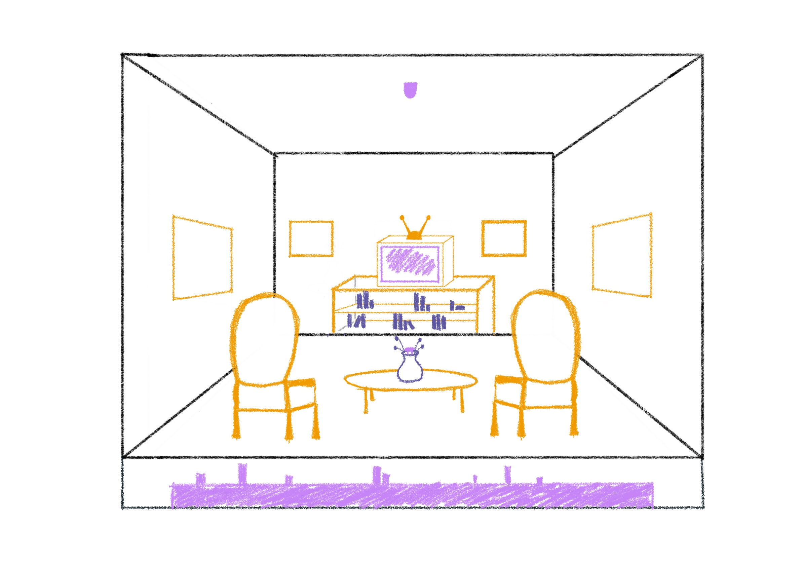

**Realizado por:**  
*Francisca Palma (frannciscapalma)*
&nbsp;&nbsp;&nbsp;&nbsp;&nbsp;&nbsp;&nbsp;&nbsp;&nbsp;&nbsp;&nbsp;&nbsp;&nbsp;&nbsp;&nbsp;&nbsp;
*Nicolas Valdes (nicolasvaldesgreve)*&nbsp;&nbsp;&nbsp;&nbsp;&nbsp;&nbsp;&nbsp;&nbsp;&nbsp;&nbsp;&nbsp;&nbsp;&nbsp;&nbsp;&nbsp;&nbsp;
*Santiago Cifuentes Vélez (santiagocifuvelez)*

 
  
   
    
   
# Esquemático 

El concepto de realizar un living de hogar, fue por la calidez que suele ocupar en la casa,
así mismo como los recuerdos en nuestra mente, que palpitan en el corazón, y sentimos en el estomago.

Nostálgico, de silencio y cuidado.
Donde se atienden a lxs amigues, 
así como el país que le habitamos, nos atiende, y nos sorprende. 

## Bocetos:
El escenario consta de 2 partes: 

*1. El living.*  
*2. El control remoto del tv y la lampara del techo.*  

