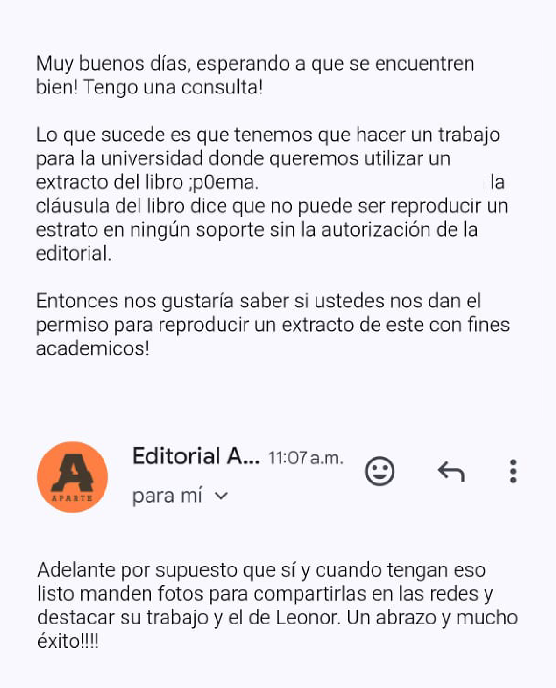

Nuestro grupo eligió ;p0ema de Leonor Olmos. Es el extracto del poema 4, página 9\. 

> Este poema nada puede resolver.  
> Adentro del poema, la muerte se consume.
>
> Ya, dilo de nuevo, el porcentaje de pureza  
> mezclado con un poco de sol.  
> Con un poco de hambre
>
> Todo acaba aquí y de pronto no.  
> Un nuevo servidor, un poema electrónico, un mesías.
>
> Poema bajando desde el cielo  
> Solo los elegidos contemplan su propia destrucción.
>
> No, en serio, este poema nada puede resolver.

Este poema, como lo menciona en su página legal: “ninguna parte de esta publicación puede ser reproducida o transmitida mediante cualquier soporte sin la expresa autorización de la editorial” entonces, para poder utilizar este extracto, nos contactamos con la editorial.

  

Lo primero que desarrollamos como grupo fue proponer cómo representar visualmente el poema en base a referentes y cómo podríamos expresar las líneas con distintos énfasis mediante posibles tipografías, tamaños y contrastes que nos ayudarán a construir los style frames, que posteriormente pasarán a código y serán parte fundamental de la construcción de este, además de buscar personas que ocuparan este tipo de pantallas, usos, etc.

Destacamos que revisamos los ejemplos del año pasado y preguntándonos como por ejemplo, el uso de los potenciómetros, lo cual nos ayudó en el futuro a poder avanzar el poema, en este caso utilizamos el ejemplo que se hizo en clases de un extracto de akriila

https://www.youtube.com/shorts/XyG0R0R_QLA

https://youtube.com/shorts/wRhWjAYHneg?si=3jWqMo152J_n11eG

