Queremos ocupar en la pantalla junto con nuestro arduino, un poema que se aprecie en la pantalla, que se desplaze durante 2 segundos aprox por verso, de derecha a izquierda. 

**OBJETIVO**: Mostrar en pantalla OLED, un poema de Emily Dickinson. 
que se muestre un verso cada 2 segundos en pantalla, de derecha a izq. 

**Poema elegido: 

"Hope is the thing with feathers

That perches in the soul,

And sings the tune without the words

And never stops at all"

Traducción:
"La esperanza es algo con plumas, que se posa en alma, y canta su canción sin palabras, y jamás se calla."**

- COREOGRAFÍA. Se muestra primer verso y se queda por 1 segundo la palabra PLUMAS en pantalla;
  se muestra el segundo verso y "deletrea en pantalla de palabra ALMA;
   se muestra el tercer verso con la palabra CANCIÓN en testdrawstyles con otra tipografía;
  cuarto verso y se muestra la palabra JAMÁS en mayusculas

1. colocar include y definir los parametros de la pantalla, cantidad de letras que caben.

2. necesitamos iniciar de la pantalla 

3. definir la aparición de cada verso con su tiempo en pantalla

 -carcasa de cartón(ROBOT NACHANGO)
 -licencias explícitas del corpus usado (LISTO)
 -proceso constante en bitácoras personales (PERSONAL)
 -3x versiones distintas mínimo dentro de carpeta codigos/
 -revisar como referencia el proyecto-1 del 2025 (PERSONAL) https://github.com/disenoUDP/dis8645-2025-2-procesos/tree/main/00-proyecto-01 (PERSONAL)
 -pagar cuota de materiales de agosto, o enviar correo a todo el equipo docente siguiendo reglas publicadas en canvas  (PERSONAL)

 Bitacora de buzz lightyear

Nos conectamos para poder avanzar con el proyecto 1 pero nos dimos cuenta que una tenía la pantalla, otra tenía las cables, otra tenía otra cosa y nadie podía correr una animación en la pantallita, así que no pudimos avanzar, pero algo se estudió.

2- Licencia legal

Obra: Hope is the thing with feathers

Autor/a: Emily Dickinson

Fuente: Academy of American Poets

Licencia / estado: Dominio público

Evidencia: https://poets.org/poem/hope-thing-feathers-254 

1. Licencias explícitas del corpus
   
 Se verificó el estado de derechos de autor de las obras utilizadas. En el caso del poema Hope is the thing with feathers, de Emily Dickinson, la fuente utilizada, Academy of American Poets (Poets.org), declara explícitamente que la obra se encuentra en el dominio público: “This poem is in the public domain.” Esta indicación aparece directamente en la página de la obra, después del texto del poema.

Por lo tanto, el poema fue incorporado al corpus bajo la condición de dominio público, utilizando como evidencia la declaración explícita de la fuente.

https://www.youtube.com/watch?v=35iDgsv60V0 

https://www.youtube.com/watch?v=yyYjdyGImFM alrededor del minuto 15 buena explicacion

MUY WENA EXPLICACIÓN, me quedé dormido, es mi lugar seguro.. (nachi)

Investigación sobre millis

```cpp
//unsing long pq es el que tiene mayor capacidad de almacenamiento(32bites) y cuenta hasta por aproximadamente hasta por 49 días. 
//tiempo cuenta desde 0
unsigned long tiempo=0; 
//el tiempo 2 también, lo usaremos para comparar en las funciones
unsigned long tiempo2= 0;
int segundos = 0;
//diferencia a la que llega en cada cuenta, 1000 sería 1 segundo, contará cada 1 segundo
int diferencia = 1000; 

void setup() (
   Serial.begin(9600);
)
//el tiempo es la variable millis, sumando constantemente desde el 0.
void loop() (
    tiempo = millis(); 
//si el primer tiempo es mayor o igual a el tiempo sumado 1 segundo u otra cantidad
if (tiempo >= (tiempo2+diferencia))
{ 
//actualizamos el tiempo2, vuelve a 0¿
   tiempo2 = tiempo; 
//dividido en 1000 para que lo muestre en segundos y no milisegundos
   segundos = tiempo/1000; 
// y nos entrega el texto que queramos cada 1 segundo, en este caso seguido de los segundos que han pasado
   Serial.print(“TEXTO”);
   Serial.println(segundos); //AHORA NO SÉ COMO OCUPARLO AKI PERO BUSCARÉ
// Arreglo con IA para poema
//definimos el poema
const char* poema[] = {
  "Primer verso: En un lugar de la Mancha,",
  "Segundo verso: de cuyo nombre no quiero acordarme,",
  "Tercer verso: no ha mucho tiempo que vivia un hidalgo,",
  "Cuarto verso: de los de lanza en astillero."
};

// Obtenemos la cantidad total de versos
const int totalVersos = sizeof(poema) / sizeof(poema[0]);

// Variables para el control del tiempo con millis()
//mismo tiempo1 con otro nombre
unsigned long tiempoAnterior = 0;
//intervalo de tiempo 
const unsigned long intervalo = 2000;

// Índice para saber qué verso toca imprimir
int versoActual = 0;

void setup() {
  Serial.begin(9600);
}

void loop() {
//le colocó esa primera parte a la función¿¿
  unsigned long tiempoActual = millis();

  // Comprobamos si ya transcurrió el tiempo
//lo configuró al revés como una resta en vez de suma
  if (tiempoActual - tiempoAnterior >= intervalo) {
 // Actualizamos la marca de tiempo
    tiempoAnterior = tiempoActual;

    // Verificamos que aún queden versos por mostrar
    //está parte es la necesaria para ocupar el println con los versos
    if (versoActual < totalVersos) {
   //si el verso actual es menor a la cantidad de versos, o sea  no ha terminado el poema
   //entonces se cargará el VersoActual
      Serial.println(poema[versoActual]);
   //++ para que vaya sumando 1 luego de presentar cada verso.
      versoActual++;
    }
  }

  // Aquí el microcontrolador sigue libre para ejecutar otras tareas simultáneas
}
```

Bitacora de buzz lightyear 2

Todo comenzó la noche del último día de agosto…
con mi compañera Maite nos dispusimos a continuar nuestro proyecto 1 en lo que llegaban nuestras demás compañeras que se encontraban en sus respectivos trabajos.

Yo había faltado a clases el día que enseñaron a conectar las pantallitas y las proto al arduino, y mis compañeras no entendieron mucho lo que debíamos hacer.

-en el discord subieron una imagen de cómo tienen que ir conectadas las cosas- dijo maite

-Altiro lo veo- le respondí mientras me dirigía al chat del taller a buscar las imágenes de las que hablaba. saque los cables correspondientes y empecé a conectarlos.

conecte el usb al computador y de inmediato se sintió un leve olor a plástico quemado, rápidamente desconecte el usb de mi computador, toque la pantalla y estaba hirviendo, sentí miedo 

-¿habrá muerto?- pensé

Luego le dije a Maite que la pantalla estaba muy caliente y tenía miedo de habermela echado.

Le preguntamos a chatgpt qué habíamos hecho mal, nos dijo que teníamos mal conectados unos cables, me puse a revisar, y como no tenía la información que entregaron en clases no entendía lo que me estaba diciendo, así que decidí enviarle un mensaje por ig a nuestro compañero nicolas valdes. Me mandó audios diciendo que la imagen que compartieron por el chat de discord estaba mala y que lo lamentaba mucho, pero era probable que la pantalla hubiese muerto…

Decidimos dejar descansar un par de minutos la pantalla como nos recomendó nuestro compañero Nicolás. Arreglé la conexión de los cables y empezamos a probar el código que nos entregó el profesor Aaron para ver si la pantalla funcionaba correctamente o no, pero nada, el código se subía al arduino pero la pantalla no emite imagen alguna…

le pedimos a chat gpt algún código para ver si es que la pantalla funcionaba o no, tampoco pasaba algo. Desesperada, subo una historia a mejores amigos de instagram mencionando mis ganas de abandonar este mundo por la frustración que sentía en ese momento, creíamos que lo habíamos perdido todo y tendríamos que ir a comprar una pantalla nueva para poder seguir con el proyecto. La imagen mostraba el arduino conectado a la proto y a la pantalla.

-Marti, ¿por qué el azul está conectado primero?- preguntó Maite

-Así estaba en la imagen po - respondí

-nooo wn esta conectado primero el amarillo

Procedo a revisar la foto de la conexión nuevamente, y en efecto, lo que me decía Maite era verdad. con un poco de fe en el corazón, cambie de posición los cables, subí el código al arduino otra vez, y aparece… ahí estaba, adafruit nosequemierda y las animaciones del código que nos compartió el profe para probar si la pantalla funcionaba.

Estaba viva, y la esperanza volvió a nuestros cuerpos.

Autoria por Martina Fernández, Pumpkinguurl.

Le compartí el primer código a chatgpt junto con los llamados para poder usar la pantallita para que me ayudara a ver donde tenía que ponerle los display pero me cambió todo lo que le puse para poder agregarle los display maldito no me deja ir a mi ritmo.

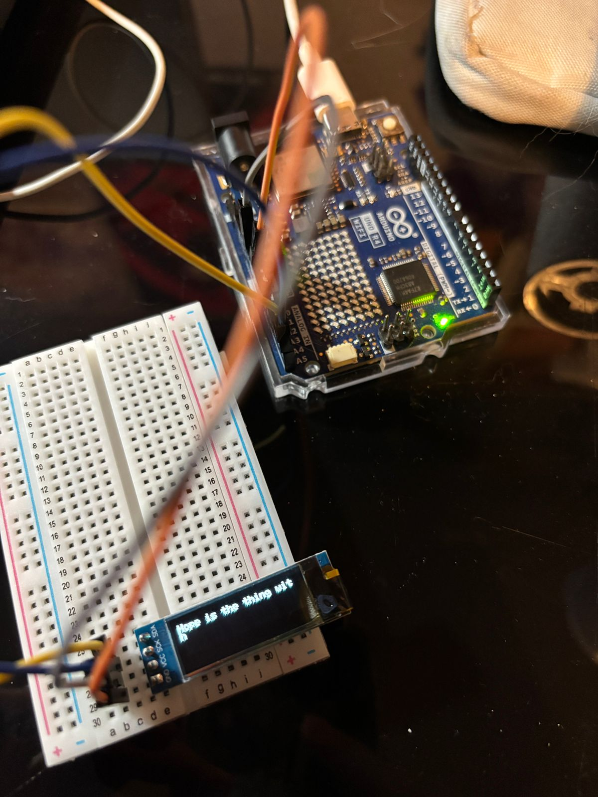

foto de la pantallita corriendo el poema porque se me fue sacarle foto a la animación del código del profe

```cpp
#include <SPI.h>
#include <Wire.h>
#include <Adafruit_GFX.h>
#include <Adafruit_SSD1306.h>


#define SCREEN_WIDTH 128
#define SCREEN_HEIGHT 32


#define OLED_RESET -1
#define SCREEN_ADDRESS 0x3C


Adafruit_SSD1306 display(
  SCREEN_WIDTH,
  SCREEN_HEIGHT,
  &Wire,
  OLED_RESET
);


char *versos[] = {
  "Hope is the thing with",
  "feathers",
  "That perches in the",
  "soul",
  "and sings the tune without the words",
  "and never stops",
  "at all..."
};


void setup() {


  Serial.begin(9600);


  // Iniciar OLED
  display.begin(SSD1306_SWITCHCAPVCC, SCREEN_ADDRESS);


  display.clearDisplay();


  display.setTextSize(1);
  display.setTextColor(SSD1306_WHITE);
}


void loop() {


  for (int i = 0; i < 7; i++) {


    // Borrar lo anterior
    display.clearDisplay();


    // Posicion del texto
    display.setCursor(0, 0);


    // Escribir verso
    display.println(versos[i]);


    // Mostrarlo
    display.display();


    // Esperar 2 segundos
    delay(2000);
  }
}
```

y funcionó la pantallita

Lo que le mandamos a chat gpt:
 
"mira tengo esto

```cpp
#include <SPI.h>

#include <Wire.h>

#include <Adafruit_GFX.h>

#include <Adafruit_SSD1306.h>

#define SCREEN_WIDTH 128 // OLED display width, in pixels

#define SCREEN_HEIGHT 32 // OLED display height, in pixels

#define OLED_RESET     -1 // Reset pin # (or -1 if sharing Arduino reset pin)

#define SCREEN_ADDRESS 0x3C ///< See datasheet for Address; 0x3D for 128x64, 0x3C for 128x32

Adafruit_SSD1306 display(SCREEN_WIDTH, SCREEN_HEIGHT, &Wire, OLED_RESET);

#define NUMFLAKES     10 // Number of snowflakes in the animation example

#define LOGO_HEIGHT   16

#define LOGO_WIDTH    16


char *versos[] = {

   "Hope is the thing with",

   "feathers",

   "That perches in the",

   "soul",

   "and sings the tune without the words",

   "and never stops",

   "at all..."

};

void setup() {

  // put your setup code here, to run once:

Serial.begin(9600);

}

void loop() {

  // put your main code here, to run repeatedly:

Serial.println(versos[0]);

Serial.println(versos[1]);

Serial.println(versos[2]);

Serial.println(versos[3]);

Serial.println(versos[4]);

Serial.println(versos[5]);

Serial.println(versos[6]);

Serial.println(versos[7]);

}
```

debo llamar a la pantalla en otro lado para poder tirarlo y que se vea?"

y lo que nos respondió

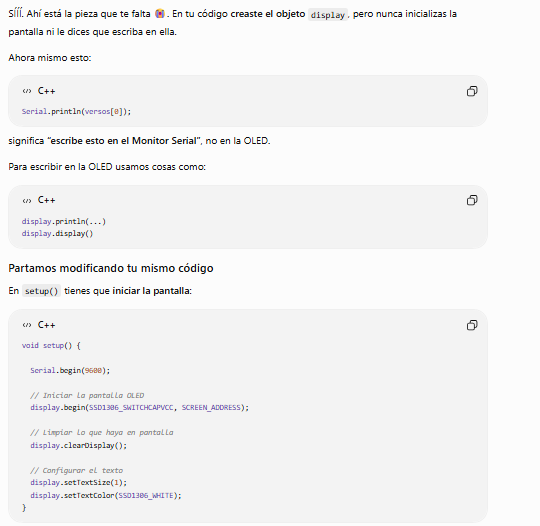

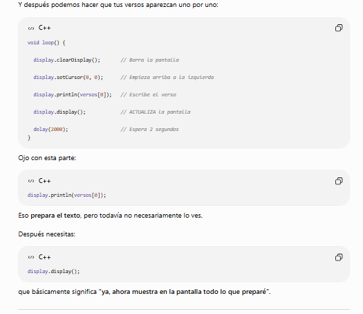

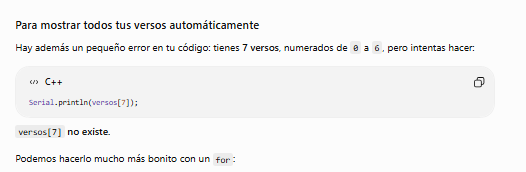

```cpp
#include <SPI.h>
#include <Wire.h>
#include <Adafruit_GFX.h>
#include <Adafruit_SSD1306.h>

#define SCREEN_WIDTH 128
#define SCREEN_HEIGHT 32

#define OLED_RESET -1
#define SCREEN_ADDRESS 0x3C

Adafruit_SSD1306 display(
  SCREEN_WIDTH,
  SCREEN_HEIGHT,
  &Wire,
  OLED_RESET
);

char *versos[] = {
  "Hope is the thing with",
  "feathers",
  "That perches in the",
  "soul",
  "and sings the tune without the words",
  "and never stops",
  "at all..."
};

void setup() {

  Serial.begin(9600);

  // Iniciar OLED
  display.begin(SSD1306_SWITCHCAPVCC, SCREEN_ADDRESS);

  display.clearDisplay();

  display.setTextSize(1);
  display.setTextColor(SSD1306_WHITE);
}

void loop() {

  for (int i = 0; i < 7; i++) {

    // Borrar lo anterior
    display.clearDisplay();

    // Posicion del texto
    display.setCursor(0, 0);

    // Escribir verso
    display.println(versos[i]);

    // Mostrarlo
    display.display();

    // Esperar 2 segundos
    delay(2000);
  }
}
```

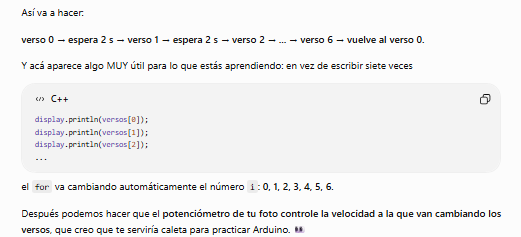

ahora toco ponerse creativos y con ayuda de gemini buscamos una forma para poder tirar imagenes a la pantallita 

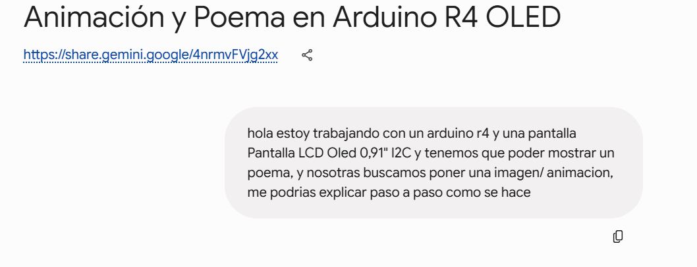

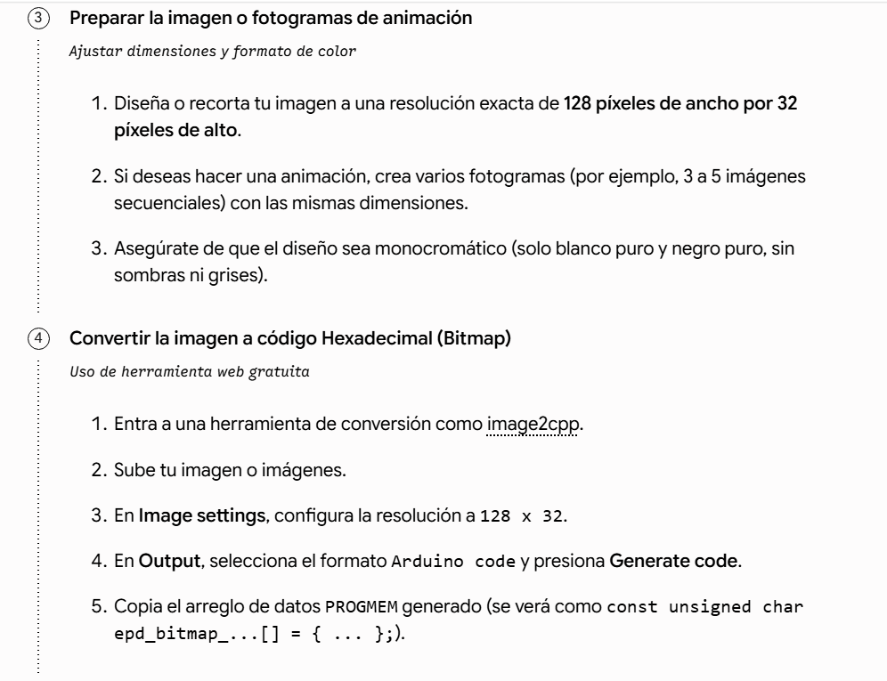

en la página de pixilart (https://www.pixilart.com/draw?ref=home-page) hicimos un dibujo rapidito para poder mandarlo a la pagina image2cpp v2 (https://javl.github.io/image2cpp/#step-2) 

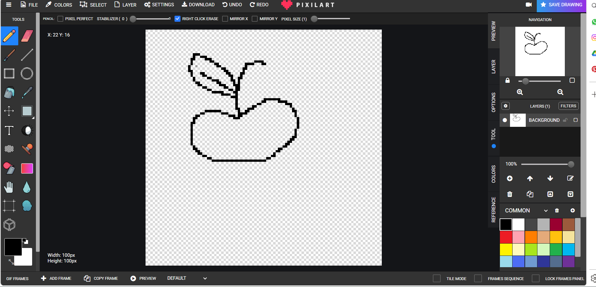

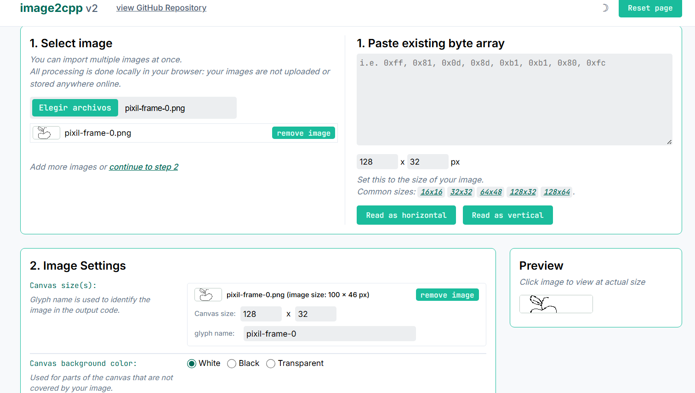

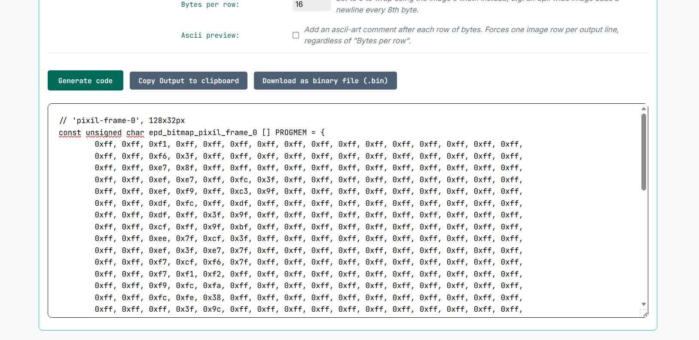
el dibujo no cabia asi que solo pudimos mandar como la mitad de este para visualizarlo en la pantallita y se veía así

```cpp
#include <SPI.h>
#include <Wire.h>
#include <Adafruit_GFX.h>
#include <Adafruit_SSD1306.h>

#define SCREEN_WIDTH 128
#define SCREEN_HEIGHT 32

#define OLED_RESET -1
#define SCREEN_ADDRESS 0x3C

Adafruit_SSD1306 display(SCREEN_WIDTH, SCREEN_HEIGHT, &Wire, OLED_RESET);


// 'Captura de pantalla 2025-11-27 233110', 128x32px
const unsigned char epd_bitmap_Captura_de_pantalla_2025_11_27_233110 [] PROGMEM = {
  0xff, 0xff, 0xf1, 0xff, 0xff, 0xff, 0xff, 0xff, 0xff, 0xff, 0xff, 0xff, 0xff, 0xff, 0xff, 0xff, 
	0xff, 0xff, 0xf6, 0x3f, 0xff, 0xff, 0xff, 0xff, 0xff, 0xff, 0xff, 0xff, 0xff, 0xff, 0xff, 0xff, 
	0xff, 0xff, 0xe7, 0x8f, 0xff, 0xff, 0xff, 0xff, 0xff, 0xff, 0xff, 0xff, 0xff, 0xff, 0xff, 0xff, 
	0xff, 0xff, 0xef, 0xe7, 0xff, 0xfc, 0x3f, 0xff, 0xff, 0xff, 0xff, 0xff, 0xff, 0xff, 0xff, 0xff, 
	0xff, 0xff, 0xef, 0xf9, 0xff, 0xc3, 0x9f, 0xff, 0xff, 0xff, 0xff, 0xff, 0xff, 0xff, 0xff, 0xff, 
	0xff, 0xff, 0xdf, 0xfc, 0xff, 0xdf, 0xff, 0xff, 0xff, 0xff, 0xff, 0xff, 0xff, 0xff, 0xff, 0xff, 
	0xff, 0xff, 0xdf, 0xff, 0x3f, 0x9f, 0xff, 0xff, 0xff, 0xff, 0xff, 0xff, 0xff, 0xff, 0xff, 0xff, 
	0xff, 0xff, 0xcf, 0xff, 0x9f, 0xbf, 0xff, 0xff, 0xff, 0xff, 0xff, 0xff, 0xff, 0xff, 0xff, 0xff, 
	0xff, 0xff, 0xee, 0x7f, 0xcf, 0x3f, 0xff, 0xff, 0xff, 0xff, 0xff, 0xff, 0xff, 0xff, 0xff, 0xff, 
	0xff, 0xff, 0xef, 0x3f, 0xe7, 0x7f, 0xff, 0xff, 0xff, 0xff, 0xff, 0xff, 0xff, 0xff, 0xff, 0xff, 
	0xff, 0xff, 0xf7, 0xcf, 0xf6, 0x7f, 0xff, 0xff, 0xff, 0xff, 0xff, 0xff, 0xff, 0xff, 0xff, 0xff, 
	0xff, 0xff, 0xf7, 0xf1, 0xf2, 0xff, 0xff, 0xff, 0xff, 0xff, 0xff, 0xff, 0xff, 0xff, 0xff, 0xff, 
	0xff, 0xff, 0xf9, 0xfc, 0xfa, 0xff, 0xff, 0xff, 0xff, 0xff, 0xff, 0xff, 0xff, 0xff, 0xff, 0xff, 
	0xff, 0xff, 0xfc, 0xfe, 0x38, 0xff, 0xff, 0xff, 0xff, 0xff, 0xff, 0xff, 0xff, 0xff, 0xff, 0xff, 
	0xff, 0xff, 0xff, 0x3f, 0x9c, 0xff, 0xff, 0xff, 0xff, 0xff, 0xff, 0xff, 0xff, 0xff, 0xff, 0xff, 
	0xff, 0xff, 0xff, 0xcf, 0xe4, 0xff, 0xff, 0xff, 0xff, 0xff, 0xff, 0xff, 0xff, 0xff, 0xff, 0xff, 
	0xff, 0xff, 0xff, 0xf0, 0x79, 0xff, 0xff, 0xff, 0xff, 0xff, 0xff, 0xff, 0xff, 0xff, 0xff, 0xff, 
	0xff, 0xff, 0xff, 0xff, 0x0d, 0xff, 0xff, 0xff, 0xff, 0xff, 0xff, 0xff, 0xff, 0xff, 0xff, 0xff, 
	0xff, 0xff, 0xff, 0xff, 0xf1, 0xff, 0xff, 0xff, 0xff, 0xff, 0xff, 0xff, 0xff, 0xff, 0xff, 0xff, 
	0xff, 0xff, 0xff, 0xff, 0xfd, 0xff, 0xc0, 0x7f, 0xff, 0xff, 0xff, 0xff, 0xff, 0xff, 0xff, 0xff, 
	0xff, 0xff, 0xff, 0xff, 0xfd, 0xff, 0x9f, 0x0f, 0xff, 0xff, 0xff, 0xff, 0xff, 0xff, 0xff, 0xff, 
	0xff, 0xff, 0xff, 0xff, 0xfd, 0xfe, 0x7f, 0xe3, 0xff, 0xff, 0xff, 0xff, 0xff, 0xff, 0xff, 0xff, 
	0xff, 0xff, 0xff, 0xff, 0xfd, 0xf9, 0xff, 0xfb, 0xff, 0xff, 0xff, 0xff, 0xff, 0xff, 0xff, 0xff, 
	0xff, 0xff, 0xff, 0xff, 0xfc, 0xe3, 0xff, 0xfd, 0xff, 0xff, 0xff, 0xff, 0xff, 0xff, 0xff, 0xff, 
	0xff, 0xff, 0xff, 0x80, 0xfe, 0xcf, 0xff, 0xfc, 0xff, 0xff, 0xff, 0xff, 0xff, 0xff, 0xff, 0xff, 
	0xff, 0xff, 0xfe, 0x7f, 0x1e, 0x1f, 0xff, 0xfe, 0xff, 0xff, 0xff, 0xff, 0xff, 0xff, 0xff, 0xff, 
	0xff, 0xff, 0xf9, 0xff, 0xe2, 0x7f, 0xff, 0xfe, 0xff, 0xff, 0xff, 0xff, 0xff, 0xff, 0xff, 0xff, 
	0xff, 0xff, 0xf3, 0xff, 0xf8, 0xff, 0xff, 0xff, 0x7f, 0xff, 0xff, 0xff, 0xff, 0xff, 0xff, 0xff, 
	0xff, 0xff, 0xf7, 0xff, 0xff, 0xff, 0xff, 0xff, 0x7f, 0xff, 0xff, 0xff, 0xff, 0xff, 0xff, 0xff, 
	0xff, 0xff, 0xe7, 0xff, 0xff, 0xff, 0xff, 0xff, 0x7f, 0xff, 0xff, 0xff, 0xff, 0xff, 0xff, 0xff, 
	0xff, 0xff, 0xef, 0xff, 0xff, 0xff, 0xff, 0xff, 0x7f, 0xff, 0xff, 0xff, 0xff, 0xff, 0xff, 0xff, 
	0xff, 0xff, 0xef, 0xff, 0xff, 0xff, 0xff, 0xff, 0x7f, 0xff, 0xff, 0xff, 0xff, 0xff, 0xff, 0xff
};


// Array of all bitmaps for convenience.
const int epd_bitmap_allArray_LEN = 1;

const unsigned char* epd_bitmap_allArray[1] = {
  epd_bitmap_Captura_de_pantalla_2025_11_27_233110
};


void setup() {

  Serial.begin(9600);

  // Inicializar pantalla OLED
  if (!display.begin(SSD1306_SWITCHCAPVCC, SCREEN_ADDRESS)) {
    Serial.println("SSD1306 allocation failed");
    for (;;);
  }

  // Limpiar pantalla
  display.clearDisplay();

  // Dibujar TU bitmap
  display.drawBitmap(
    0,
    0,
    epd_bitmap_Captura_de_pantalla_2025_11_27_233110,
    128,
    32,
    SSD1306_WHITE
  );

  // Mandar el contenido a la OLED
  display.display();
}


void loop() {

}
```

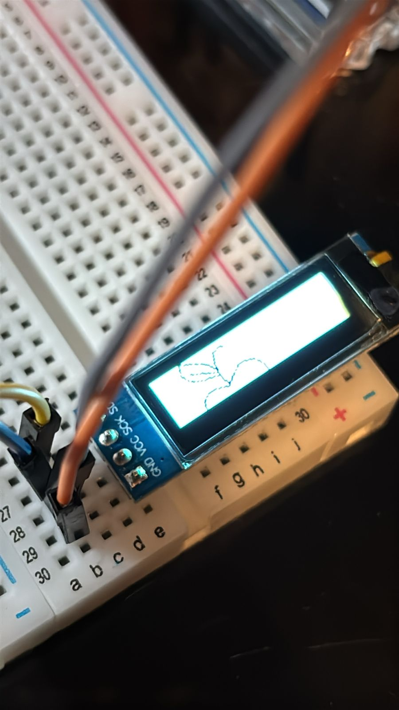


