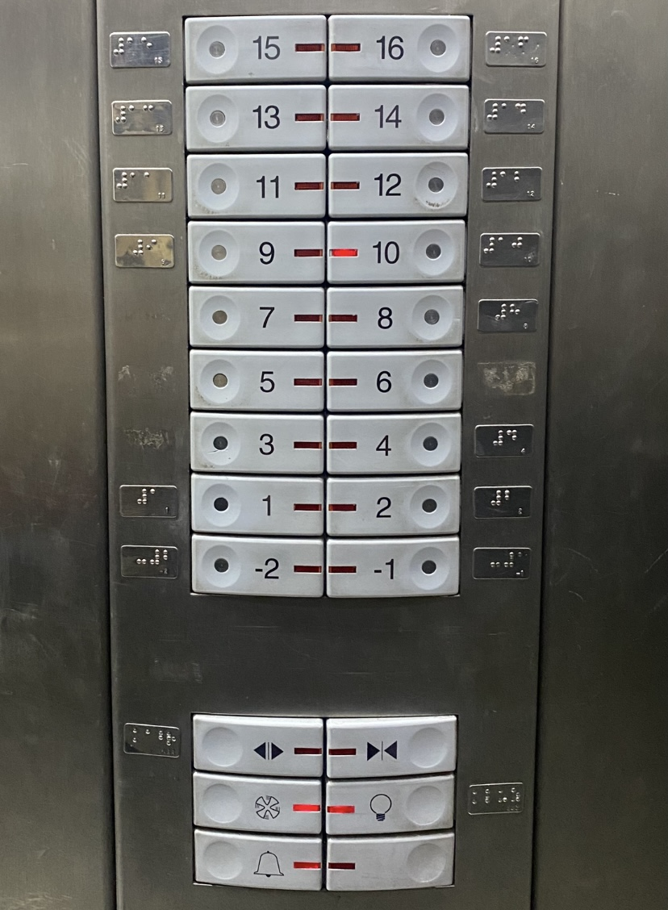
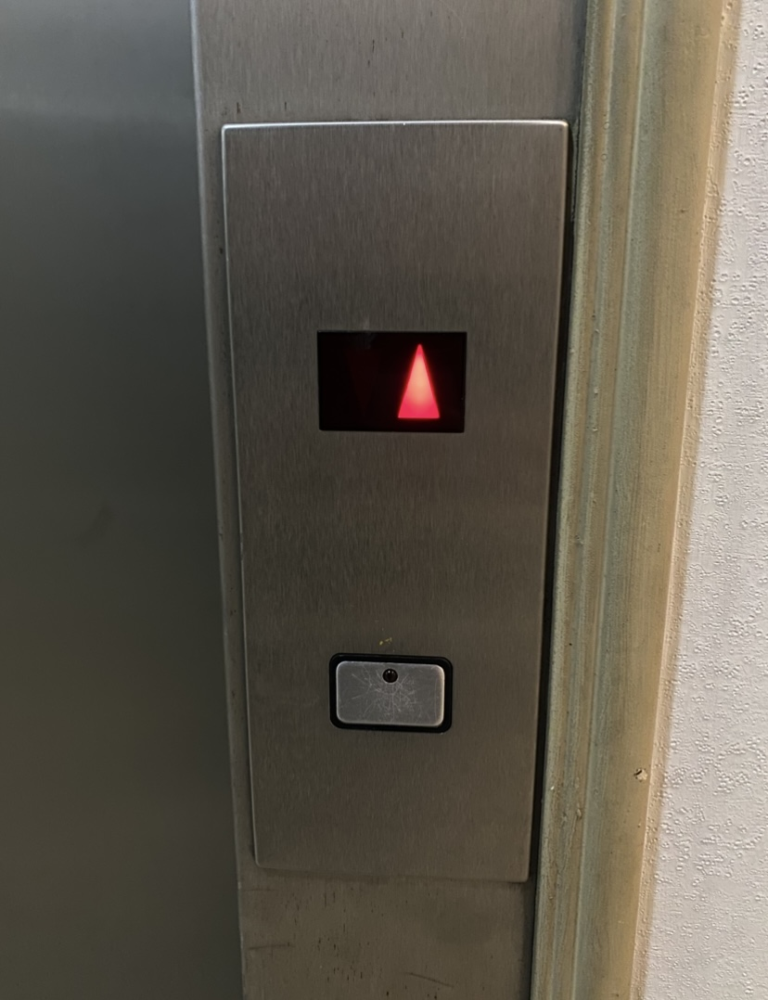
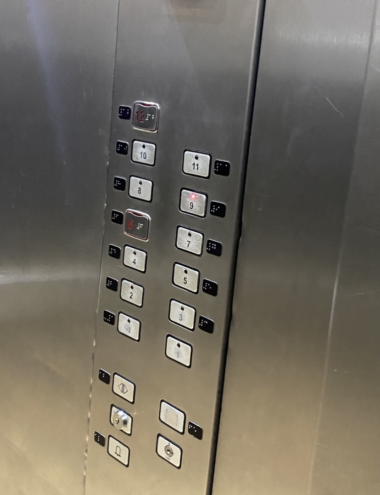

# sesion-00b

Esta primera clase fue principalmente de **introducción al taller**. Pudimos conocer algunos proyectos realizados anteriormente y también presentarnos entre nosotros mediante pequeñas presentaciones personales.

## apuntes sesión

## Charla de Heidi Jalkh

La charla de **Heidi Jalkh** me amplió bastante la idea de lo que significa **observar para crear**.

Muchas veces cuando pienso en diseño, tiendo a partir desde una necesidad humana concreta: un problema, una incomodidad, una acción que podría funcionar mejor o una solución que podría hacer más fácil alguna experiencia. Me gusta pensar el diseño desde esa lógica funcional, casi como una especie de **diseño hipotético**, donde imagino situaciones posibles y trato de construir una respuesta para ellas.
Por eso me llamó la atención que varios de los proyectos de Heidi parecieran partir desde otro lugar. En vez de comenzar necesariamente con la pregunta *“¿qué necesita una persona?”*, primero aparecía la observación de un comportamiento, un material o un fenómeno natural.

En uno de los proyectos, por ejemplo, el movimiento de los pétalos de una flor servía como punto de partida para desarrollar una estructura capaz de deformarse. Lo interesante para mí fue entender que observar no significa solamente mirar la forma de algo, sino preguntarse:

> ¿Qué está haciendo? ¿Por qué se mueve de esa manera? ¿Qué principio de ese comportamiento podría trasladarse a otra cosa?

En vez de pensar siempre:

`problema humano → buscar solución`

también podría aparecer algo como:

`observar un fenómeno → entender cómo funciona → descubrir qué posibilidades abre → imaginar dónde podría tener sentido aplicarlo`

Me interesa mucho esa diferencia porque no elimina mi interés por diseñar soluciones para personas, pero sí abre otras maneras de llegar a ellas, quizás una estructura, un comportamiento o una propiedad encontrada mediante experimentación no tenga inicialmente una aplicación clara. Sin embargo, al entenderla mejor puede aparecer después una situación humana donde esa característica sea útil.

El proyecto con hongos también reforzó esta idea. Al intentar combinar distintos hongos para generar colores, estos no se comportaban como un material completamente controlable: aparecían divisiones entre ellos debido a su comportamiento territorial.

Eso que inicialmente podía entenderse como un problema terminó revelando una propiedad nueva.

Me hizo pensar que observar también significa **dejar espacio para que algo contradiga la idea inicial**.

Normalmente tengo la tendencia a imaginar primero cómo debería funcionar una solución y después tratar de llegar a ese resultado. Trabajar desde la observación parece exigir lo contrario en ciertos momentos: mirar qué está ocurriendo realmente y permitir que esa información modifique el proyecto.

> **No observar solamente para encontrar una respuesta, sino observar también para descubrir preguntas que todavía no había pensado.**

## encargos

fotos tableros de ascensores y su descripción 

### Tablero 01

### Tablero 02

### Tablero 03

## lectura
