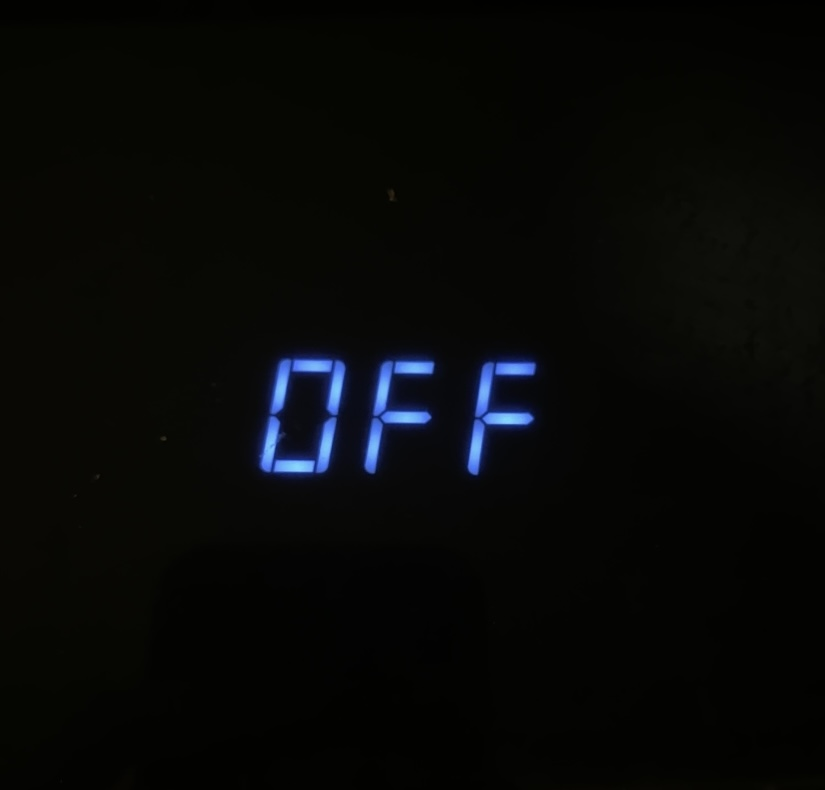
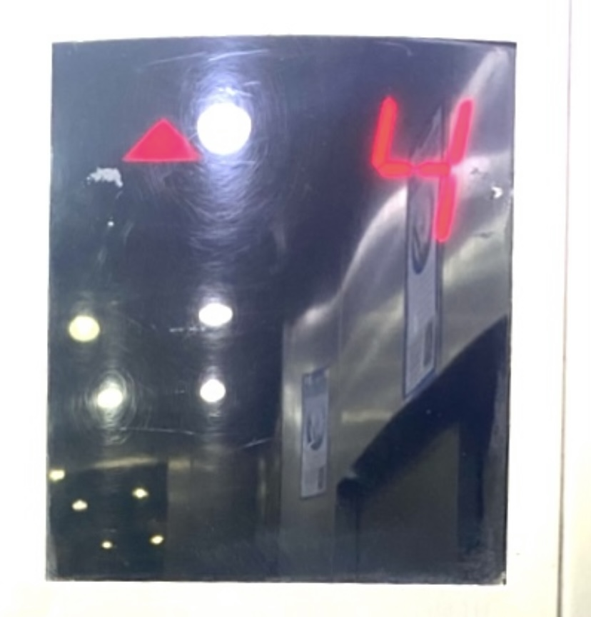
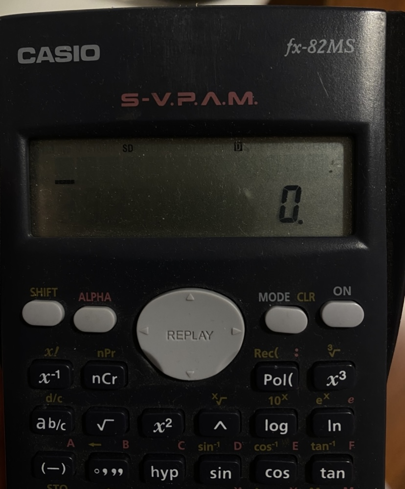

# sesion-01a

2026-08-11

# apuntes sesión

Primero, analizamos en grupo diversas fotografías de tableros de ascensores, tomadas por cada persona entre el viernes de la semana pasada y el martes de esta semana. A partir de estas imágenes, observamos similitudes, diferencias y elementos recurrentes en su funcionamiento y organización.

 

## ASCENSORES 

En conjunto, identificamos y analizamos los principales elementos, variables y características funcionales presentes en un ascensor. Consideramos aspectos como el movimiento en un eje, la dirección, la posición, la electricidad, los números utilizados para identificar los pisos, los botones, sensores, señales, puertas, peso, velocidad, tiempo y límites del sistema. Este análisis nos permitió descomponer el ascensor en unidades más simples y comprender qué información y elementos básicos intervienen en su funcionamiento.


| Elemento básico | En el ascensor |
|---|---|
| Movimiento en un eje | Movimiento vertical |
| Dirección | Arriba / abajo |
| Posición | Piso o altura actual |
| Electricidad | Energía necesaria para funcionar |
| Números enteros positivos | 1, 2, 3, 4… |
| Números arábigos | Forma visual de representar los pisos |
| Botones principales | Selección de piso |
| Botones auxiliares | Abrir, cerrar, alarma |
| Variables | Piso, peso, velocidad, dirección |
| Entradas | Botones y sensores |
| Salidas | Movimiento, luz, sonido, puertas |
| Sensores | Posición, peso, puerta, obstáculos |
| Tiempo | Espera, apertura y desplazamiento |
| Velocidad | Rapidez del movimiento |
| Peso / carga | Peso dentro de la cabina |
| Límites | Peso máximo, piso mínimo y máximo |
| Secuencia | Llamar → llegar → abrir → cerrar → mover |
| Estados | Detenido, subiendo, bajando, puerta abierta/cerrada |
| Señales visuales | Número de piso, luces de botones |
| Señales sonoras | Aviso de llegada, alarma |
| Puertas | Apertura y cierre |
| Cabina | Espacio que contiene personas o carga |
| Pisos | Puntos definidos dentro del recorrido |

La tabla representa una base general del sistema. Estos elementos pueden variar o ampliarse según el contexto; por ejemplo, ante una detención o corte de electricidad aparecen variables asociadas a emergencia, energía auxiliar, alarma o comunicación.

## encargos
- autorretrato de variables
- pantalla de segmentos

## Variables 

Una variable es un espacio que utiliza el computador para **guardar un dato** mientras se ejecuta un programa. A ese espacio se le asigna un nombre para poder identificar la información y utilizarla cuando sea necesario. Por ejemplo, si hacemos un programa que suma dos números, podemos tener una variable numero1 para guardar el primer valor, otra llamada numero2 para guardar el segundo y una variable resultado para guardar la suma de ambos. Así, las variables permiten almacenar, identificar, reutilizar y modificar los datos con los que trabaja un programa.

>numero1 = 5  
>numero2 = 3  
>resultado = numero1 + numero2  

En este caso, numero1 guarda el primer valor, numero2 guarda el segundo y resultado almacena la suma.


## <ins>Las variables pueden guardar distintos tipos de datos, por ejemplo:</ins>

-**Enteros**: números sin decimales, como 25   
-**Decimales**: números con decimales, como 3.14   
-**Texto**: palabras o frases, como "Hola"   
-**Booleanos**: valores true o false   

La forma en que se indica el tipo de dato depende del lenguaje de programación.

### C++

En C++ normalmente debemos declarar explícitamente qué tipo de dato tendrá la variable:
```cpp
int edad = 25;
string nombre = "Magdalena";
bool estudiante = true;
``` 
Aquí nosotros le estamos indicando al programa que edad será un número entero, nombre será texto y estudiante será un valor booleano.

### JavaScript

JavaScript utiliza tipado dinámico, por lo que no necesitamos escribir el tipo de dato al crear la variable:
```cpp
let edad = 25; 
let nombre = "Magdalena"; 
let estudiante = true; 
```
JavaScript reconoce el tipo observando el valor que le asignamos. Si escribimos 25, sabe que es un número; si escribimos "Magdalena", sabe que es texto.

### Python

Python también utiliza tipado dinámico:
```cpp
edad = 25
nombre = "Magdalena"
estudiante = True
```
Python reconoce automáticamente qué tipo de dato contiene cada variable.

Por lo tanto, el concepto de variable es común entre los lenguajes de programación, pero la forma de declararla cambia según el lenguaje. En lenguajes como **C++** indicamos explícitamente el tipo, mientras que en JavaScript y Python el lenguaje lo reconoce a partir del valor que asignamos.

entooncessss....

>C++ → se declara explícitamente el tipo de la variable (int, float, etc.).   
>JavaScript → se reconoce automáticamente el tipo según el valor.   
>Python → también reconoce automáticamente el tipo según el valor.    

## <ins>Declarar variables en c++</ins>

>Estructura:
>tipo nombre = valor;

Ejemplo:

        int edad = 25;
              │
      ┌───────┼───────────┐
      │       │           │
     int     edad         25
      │       │           │
      ▼       ▼           ▼
   Tipo de   Nombre     Valor
    dato    variable   almacenado

<ins>importante en sintaxis:</ins>    
-**camelCase**: la primera palabra va en minúscula y las siguientes comienzan con mayúscula. int porEjemplo: valor;  
-**Texto** va entre ""  
-**Números enteros** entre ''  
-**Al final de cada declaración** ;  


Algunas de las variables más utilizadas son: 

| Tipo de variable | Se declara como | Uso |
|---|---|---|
| Entero | `int` | Guarda números enteros, sin decimales |
| Decimal | `float` | Guarda números con decimales |
| Decimal de mayor precisión | `double` | Guarda números decimales con mayor precisión que `float` |
| Carácter | `char` | Guarda un solo carácter, letra o símbolo |
| Texto | `string` | Guarda palabras, textos o cadenas de caracteres |
| Booleano | `bool` | Guarda valores de verdadero (`true`) o falso (`false`) |
| Entero grande | `long` | Guarda números enteros de mayor rango |
| Entero muy grande | `long long` | Guarda números enteros de un rango aún mayor |
| Entero sin signo | `unsigned int` | Guarda números enteros iguales o mayores que 0 |

## <ins>Guardar más de un valor</ins>

Si quiero guardar varios datos dentro de una misma variable, puedo escribirlos como texto, pero en ese caso el programa los entiende como un solo `string`.
```cpp
string comidasFavoritas = "Sushi", "Pasta";
```
Aunque aparecen dos comidas, C++ interpreta "Sushi, Pasta" como un solo texto.
Si quiero que cada comida se guarde como un dato separado, puedo usar un **array**:
  
```cpp
string comidasFavoritas[2] = {"Sushi", "Pasta"};
```
En este caso, comidasFavoritas guarda dos elementos distintos.
  
Cada elemento tiene una posición, llamada índice, y en C++ se empieza a contar desde 0:
Por ejemplo: 
comidasFavoritas[0] // "Sushi"
comidasFavoritas[1] // "Pasta"

## Funciones (esto todavía me cuesta un poco más que las variables)

Las funciones son bloques de código que realizan una tarea específica dentro de un programa. Muchas veces trabajan con variables, ya que estas contienen los datos que la función necesita para realizar una acción o cálculo. Una función puede recibir variables como entrada, procesarlas y luego devolver un resultado. Por ejemplo, una función que suma dos números puede recibir una variable para cada número y guardar el resultado en otra variable. En resumen, las variables almacenan la información y las funciones utilizan esa información para realizar procesos o acciones.

una función puede:

- Recibir datos.
- Trabajar con esos datos.
- Realizar una acción.
- Reutilizarse varias veces dentro del programa.
- realizar una acción sin devolver ningún dato;
- devolver un resultado;
- mostrar información en pantalla;
- hacer cálculos;
- evaluar condiciones;
- transformar datos.

es importante separar dos cosas:

1. **El tipo de retorno de la función**
2. **Las instrucciones que la función ejecuta dentro**

## 1. Tipo de retorno de una función

El tipo que aparece antes del nombre de una función indica **qué tipo de dato devuelve esa función al terminar**.

| Tipo de retorno | Qué significa |
|---|---|
| `void` | La función no devuelve ningún dato |
| `bool` | Devuelve `true` o `false` |
| `int` | Devuelve un número entero |
| `float` | Devuelve un número decimal |
| `double` | Devuelve un número decimal con mayor precisión |
| `string` | Devuelve texto |
| `char` | Devuelve un solo carácter |

La estructura general es:

```cpp
tipoRetorno nombreFuncion(parametros) {
    // instrucciones
}
```
## 2. Funciones `void`

`void` significa que la función **realiza una acción, pero no devuelve un dato al programa**.

Su estructura puede ser:

```cpp
void nombreFuncion(parametros) {
    // instrucciones
}
```

Una función `void` puede, por ejemplo, mostrar información en pantalla, modificar algo o ejecutar una acción.

No necesita devolver un valor mediante `return`.

## 3. Funciones que devuelven un dato

Cuando una función comienza con `bool`, `int`, `float`, `string`, etc., significa que **debe entregar un resultado compatible con ese tipo de dato**.

Estas funciones normalmente utilizan `return`.

La estructura es:

```cpp
tipoRetorno nombreFuncion(parametros) {
    // instrucciones
    return resultado;
}
```

Según el tipo de retorno:

```text
bool   → devuelve true o false
int    → devuelve un número entero
float  → devuelve un número decimal
string → devuelve texto
char   → devuelve un carácter
```

## 4. `return`

`return` sirve para **entregar el resultado de una función de vuelta al programa**.

No muestra el resultado en pantalla.

Su función es devolver un dato para que pueda ser guardado, utilizado por otra variable o usado en otra parte del programa.

```cpp
return resultado;
```

Por lo tanto:

> `return` entrega un dato al programa.

## 5. `cout`

`cout` sirve para **mostrar información en la consola o pantalla**.

```cpp
cout << informacion;
```

`cout` no devuelve un dato. Simplemente lo muestra.

Por lo tanto:

> `cout` muestra información al usuario.


(Gracias chatgpt por intentar ayudarme a entender, pero todavía necesitaré explicación humana)


Las funciones existen en muchos lenguajes y cumplen el mismo propósito general, pero su forma de declararlas y utilizarlas depende de cada lenguaje de programación. (al igual que las variables) 

c++

tipoRetorno nombreFuncion(parametros) {
    // instrucciones
    return resultado;
}

| Sintaxis | Qué significa | Ejemplo |
|---|---|---|
| `cout` | Se utiliza para mostrar información en la consola | `cout << "Hola";` |
| `<<` | Operador de inserción. Envía información hacia `cout` | `cout << nombre;` |
| `endl` | Termina la línea actual y continúa en una nueva línea | `cout << "Hola" << endl;` |
| `return` | Devuelve un valor desde una función al lugar donde fue llamada | `return resultado;` |
| `()` | Se utilizan en las funciones para indicar o recibir parámetros | `sumar(int a, int b)` |
| `{ }` | Delimitan el bloque de instrucciones de una función | `int main() { ... }` |
| `;` | Indica el final de una instrucción | `int edad = 25;` |
| `=` | Asigna un valor a una variable | `edad = 25;` |
| `//` | Permite escribir un comentario de una sola línea | `// Este es un comentario` |
| `/* */` | Permite escribir comentarios de varias líneas | `/* comentario */` |

Los " " son espacios que se agregan entre los datos para que no queden pegados.


## Autorretrato en variables y funciones 

```cpp

// FUNCIONES

void mostrarNombreCompleto(string nombre, string apellidoPaterno, string apellidoMaterno) {
    cout << nombre << " " << apellidoPaterno << " " << apellidoMaterno << endl;
}

string crearRutCompleto(string rut, char dv) {
    return rut + "-" + dv;
}

void mostrarNetflixFavoritos(string peliculaFavorita, string animeFavorito) {
    cout << peliculaFavorita << " " << animeFavorito << endl;
}

void saludar(string saludo) {
    cout << saludo << endl;
}

int main() {

// VARIABLES

// Datos de nombre
string nombre = "Magdalena";
string apellidoPaterno = "Balart";
string apellidoMaterno = "Tomicic";
char inicialNombre = 'M';

// Datos identificador
string rut = "20675554";
char dv = '8';

// Datos personales
int edad = 24; 
float estatura = 1.64;
string nacionalidad = "Chilena";

// descripción física
bool peloRubio = false;
bool peloCastano = true;
bool ojosCafes = true;

// Datos de estudio
bool estudiante = true;
string carrera = "Diseño";
string universidad = "UDP";
int horasEstudioMin = 2;
int horasEstudioMax = 4;

// Mis favoritos
string peliculaFavorita = "Perfect Days";
string ciudadFavorita = "Antofagasta";
string artistaFavorito = "Mara Faundez";
string animeFavorito = "Frieren";
string obraFavorita = "La Bailarina";
string coloresFavoritos[2] = {"Rojo", "Azul"};
string comidaFavorita[4] = {"Hamburguesas", "Pizza", "Pastas", "Sushi"};
char numeroFavorito = '5';

// lo falso y lo cierto
bool sabeConducir = false;
bool sabeCocinar = true;
bool haceDeporte = false; 
bool leGustaViajar = true;

 // LLAMAR A LAS FUNCIONES

saludar("Holis");

mostrarNombreCompleto(nombre, apellidoPaterno, apellidoMaterno);

string rutCompleto = crearRutCompleto(rut, dv);

mostrarNetflixFavoritos(peliculaFavorita, animeFavorito);
```

## Pantalla segmentos

    
### Airfryer
<ins> **Ubicación**:</ins>  La pantalla está ubicada en la parte frontal superior de la air fryer, integrada directamente en el panel de control. Esto hace que la información aparezca en el mismo lugar donde la persona configura el tiempo, la temperatura o enciende y apaga la maquina.    
<ins> **Alfabeto posible**:</ins>  En este caso, la pantalla no se limita únicamente a números. En la fotografía aparece la palabra OFF, por lo que el sistema también puede construir algunas letras a partir de los segmentos.    
<ins> **Uso:**</ins>  La pantalla comunica principalmente el estado de la air fryer y los parámetros de cocción, como si está encendida o apagada, cuánto tiempo queda o qué temperatura se ha seleccionado. 
  
La pantalla funciona como una forma de confirmación y acompañamiento durante la interacción. Si modifico el tiempo o la temperatura, necesito saber que la máquina recibió correctamente esa acción. Cuando aparece un nuevo valor en la pantalla, el aparato me está respondiendo.  
También encuentro interesante que aparezca OFF. Podría simplemente quedar la pantalla apagada, pero mostrar explícitamente ese estado elimina una pequeña duda: sé que el aparato está apagado porque la propia máquina me lo está confirmando. En un electrodoméstico que trabaja con altas temperaturas, esa información también aporta una sensación de seguridad y control.   
  
   
### Ascensor. 
<ins> **Uso**</ins> : Su función principal es comunicar el piso actual del ascensor y la dirección de desplazamiento.  
<ins> **Ubicación:**</ins>  La pantalla está ubicada sobre el tablero de botones que permite seleccionar el piso, dentro del ascensor. Esta posición hace que la información aparezca justo en el mismo lugar donde la persona toma la decisión de hacia dónde quiere ir. En este edificio hay 16 pisos, por lo que el display debe ser capaz de mostrar números de uno y dos dígitos.  
<ins> **Alfabeto posible**:</ins>  el display necesita representar principalmente los números del 0 al 9, combinándolos cuando es necesario para mostrar pisos de dos cifras, como 10, 11 o 16 (siendo el piso más alto. También debe ser capaz de postrar números negativos siendo el -2 el más bajo.   
 
En el caso del ascensor, la pantalla de segmentos no solo cumple una función informativa, sino que también puede tener un valor más humano relacionado con la percepción de control y seguridad. A mí, por ejemplo, me generan miedo los ascensores, y creo que parte de ese miedo tiene que ver con el desconocimiento de lo que está ocurriendo en un espacio cerrado donde no puedo observar directamente mi desplazamiento. Mientras estoy dentro, no veo físicamente cómo subo o bajo ni tengo referencias claras del exterior, por lo que pierdo parte de la orientación que normalmente utilizo para entender dónde estoy.  
En ese contexto, el número que aparece en la pantalla funciona como una forma de ubicarme dentro de un espacio que no puedo observar directamente. Saber que estoy en el piso 4, que voy subiendo o que me estoy acercando a mi destino transforma un movimiento invisible en información concreta. Esa información no necesariamente elimina el miedo, pero sí disminuye parte de la incertidumbre porque me permite entender qué está haciendo la máquina y en qué punto del recorrido me encuentro. Ver cómo los números cambian de 2 a 3 y luego a 4 me permite onfirma que existe un recorrido, que el ascensor está avanzando y que su comportamiento sigue una secuencia que puedo comprender y anticipar.
Esto se puede relacionar directamente con la Human-Computer Interaction (HCI), ya que la pantalla funciona como un mecanismo de feedback entre la persona y el sistema. El ascensor realiza procesos que el usuario no puede observar directamente, mientras que la interfaz traduce esos procesos internos en señales simples y comprensibles. El número del piso y la flecha de dirección permiten conocer el estado actual del sistema y saber que este está respondiendo a la interacción. 
 
    
### calculadora  
<ins> **Ubicación:** </ins> La pantalla está ubicada en la parte superior de la calculadora, justo sobre el teclado. Esta posición genera una relación muy directa entre la acción y la respuesta: ingreso un número o selecciono una operación con los botones y puedo comprobar en la pantalla qué información recibió la máquina.  
<ins> **Alfabeto posible**:</ins>  En este caso, la pantalla necesita representar principalmente los números del 0 al 9, pero su repertorio es más amplio que el de una pantalla utilizada únicamente para indicar pisos. También debe poder mostrar signos matemáticos, puntos decimales, resultados negativos y distintos indicadores asociados a las funciones de la calculadora.   
<ins> **Uso:**</ins>  Su función principal es comunicar tanto lo que estoy ingresando como el resultado de las operaciones que realiza la calculadora. Para mí, lo interesante es que la pantalla no funciona únicamente como un lugar donde aparece una respuesta final, sino como una forma de comprobar constantemente que existe correspondencia entre lo que quiero hacer y lo que la máquina está entendiendo.
  
Si presiono un número, necesito verlo aparecer para saber que lo ingresé correctamente. Si realizo una operación, necesito comprobar el resultado. De esta manera, la pantalla funciona casi como una memoria externa: me permite dejar parte de la información fuera de mi cabeza y concentrarme en el proceso que estoy realizando.

Al comparar las tres pantallas, empiezo a entenderlas no solo como objetos que muestran números o letras, sino como formas en que las máquinas intentan comunicarse con nosotros. Detrás de cada display hay un sistema realizando procesos que muchas veces no podemos ver: es entonces que laa pantalla aparece como una pequeña ventana entre el mundo interno de la máquina y nuestra necesidad de comprender qué está ocurriendo.
Desde esta mirada, la pantalla de segmentos podría entenderse como una especie de lenguaje mínimo entre lo humano y lo computacional. Con muy pocos trazos, números, símbolos y palabras breves, la máquina intenta decirnos: estoy funcionando, entendí lo que me pediste, estás aquí, falta esto, este es el resultado. No necesitamos conocer todos los procesos electrónicos que existen detrás; necesitamos que la máquina traduzca esa complejidad a algo que podamos reconocer y recordar en base a nuestro propio lenguaje cultursl. 
 
## lectura

me llevé este libro

hacker code

 

