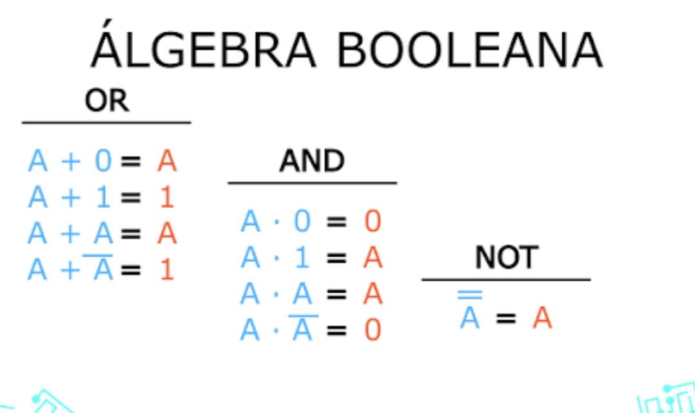
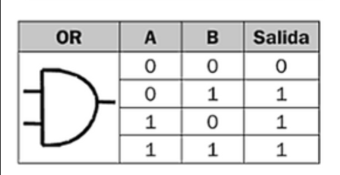
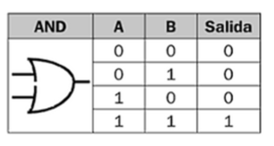
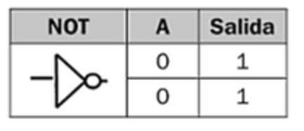
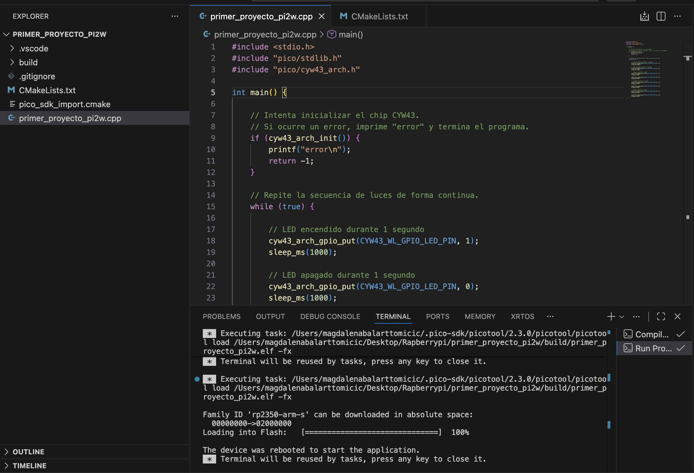
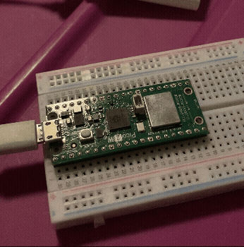

# sesion-01b

## apuntes sesión

# Álgebra booleana

El **álgebra booleana** es una forma de trabajar con lógica utilizando solamente dos valores posibles:

```text
0 = falso
1 = verdadero
```

no es cualquier álgebra ya que no se trabaja principalmente con cantidades, sino con **estados lógicos**.

entonces yo puedo imaginar:

```text
0 = luz apagada
1 = luz encendida
```

O también:

```text
0 = condición falsa
1 = condición verdadera
```

Esto es importante porque un computador constantemente necesita evaluar si algo es **verdadero o falso** para decidir qué acción realizar. (si soi)

Por ejemplo, en C++ puedo tener:

```cpp
int edad = 24;
```

y luego evaluar:

```cpp
edad >= 18
```

El computador se está preguntando:

> ¿24 es mayor o igual a 18?

```text
edad >= 18 → true → 1
```
## Operaciones principales del álgebra booleana

Las tres operaciones principales son:

- **AND** → Y
- **OR** → O
- **NOT** → NO / negación

pueden ser representadas de distintas maneras:

| Operación | Álgebra booleana | C++ | Significado |
|---|---|---|---|
| AND | `A · B` | `A && B` | A **Y** B |
| OR | `A + B` | `A \|\| B` | A **O** B |
| NOT | `Ā` | `!A` | **NO** A |

## Reglas del álgebra booleana



> https://enredados2012.blogspot.com/2012/09/operaciones-numericas-algebra-booleana.html

(de esa web saqué las siguientes imágenes)

La imagen anterior muestra algunas de las reglas principales que cumplen las operaciones `OR`, `AND` y `NOT`.

## OR — `||`

`OR` significa **“O”**.

Sirve cuando quiero que algo ocurra si **al menos una de varias condiciones es verdadera**.

Por ejemplo:

```cpp
if (esSabado || esDomingo) {
    // es fin de semana
}
```

En este caso, no necesito que sea sábado y domingo al mismo tiempo. Basta con que una de las dos condiciones sea verdadera para que el `if` se cumpla.

> **“Tengo distintas alternativas y con que una se cumpla, es suficiente.”**

Me sirve cuando una acción puede ocurrir por **más de una razón o alternativa válida**.



## AND — `&&`

`AND` significa **“Y”**.

Sirve cuando necesito que **todas las condiciones se cumplan al mismo tiempo**.

Por ejemplo:

```cpp
if (tengoEntrada && soyMayorDeEdad) {
    // puedo entrar
}
```

En este caso necesito cumplir dos requisitos:

- Tener entrada.
- Ser mayor de edad.

Si tengo entrada pero no soy mayor de edad, no puedo entrar. Si soy mayor de edad pero no tengo entrada, tampoco puedo entrar.

Por eso puedo pensar `AND` como:

> **“Para que esto ocurra, necesito cumplir todos los requisitos.”**

Me sirve cuando una acción depende de **varias condiciones obligatorias**.



## NOT — `!`

`NOT` significa **“NO”** o **negación**.

Sirve para tomar una condición y preguntar por **lo contrario**.

si tengo:

```cpp
bool encendido = false;
```

puedo escribir:

```cpp
if (!encendido) {
    // el dispositivo está apagado
}
```

`!encendido` significa:

> **“NO está encendido.”**

Entonces `NOT` invierte el valor de una condición:

- Si algo era verdadero, pasa a falso.
- Si algo era falso, pasa a verdadero.

Por eso puedo pensar `NOT` como:

> **“Quiero comprobar que algo NO esté ocurriendo.”**

Me sirvepara revisar si una puerta **no** está abierta, si un botón **no** está presionado o si un dispositivo **no** está encendido.



Entonces puedo resumirlos así:

- `OR` → sirve cuando **una de varias opciones es suficiente**.
- `AND` → sirve cuando **todas las condiciones deben cumplirse**.
- `NOT` → sirve cuando quiero comprobar **lo contrario de una condición**.

Estas operaciones son importantes porque son la base lógica que después utilizamos dentro de los `if` para indicarle al computador **cuándo debe o no debe realizar una acción**.

# `if`: decidir si realizar un bloque de código

`if` es una **estructura condicional**. Sirve para que el computador decida si debe realizar o no una parte del código.

Su estructura básica es:

```cpp
if (condicion) {
    // instrucciones
}
```

osea: SI ES MAYOR DE EDAD ES TRUE, ENTONCES LE DAMOS PERMISO, SI ES FALSE, NO TIENE PERMISO

Por ejemplo:

```cpp
int edad = 24;

if (edad >= 18) {
    Serial.println("Puede entrar");
}
```

El computador evalúa:

```text
24 >= 18
```

Como el resultado es:

```text
true
```

entra al bloque `{ }` y ejecuta:

```cpp
Serial.println("Puede entrar");
```

Una forma que me sirve para entenderlo es:

> **`true` funciona como un permiso para entrar al bloque de código.**

En cambio, si:

```cpp
int edad = 15;
```

entonces:

```text
15 >= 18 → false
```
el computador **no entra al bloque**.

## Comentarios `//`?

El computador **no entiende ni ejecuta** lo que está después de `//`.

Por ejemplo:

```cpp
if (edad >= 18) {
    // puede entrar
}
```

`// puede entrar` es solo una nota para quien está leyendo el código

Si quiero que el computador realmente haga algo, necesito una instrucción:

```cpp
if (edad >= 18) {
    Serial.println("Puede entrar");
}
```

Entonces puedo separar el `if` en dos partes:

```text
CONDICIÓN
edad >= 18
↓
true o false
↓
¿entra al bloque?

ACCIÓN
Serial.println("Puede entrar");
↓
qué hace si logra entrar
```

## `if` y `else`

`else` permite indicar qué hacer si la condición da `false`.

```cpp
if (edad >= 18) {
    Serial.println("Puede entrar");
} else {
    Serial.println("No puede entrar");
}
```

Entonces:

```text
true  → entra al if
false → entra al else
```

En resumen:

> **La condición decide si se entra al bloque y las instrucciones dentro del bloque indican qué debe hacer el computador.**

# Operadores de comparación

Los **operadores de comparación** sirven para comparar dos valores.

Se usan mucho dentro de un `if`.

| Operador | Significa |
|---|---|
| `==` | igual a |
| `!=` | distinto de |
| `>` | mayor que |
| `<` | menor que |
| `>=` | mayor o igual que |
| `<=` | menor o igual que |

# Cómo y por qué cambia el valor de una variable

Una variable puede cambiar mientras el programa está funcionando, pero **no cambia sola** para que cambie, tiene que existir alguna instrucción que le diga al programa **cuándo debe modificarla**.

Por ejemplo, en un juego puedo comenzar con:

```cpp
int vidas = 3;
```

Eso significa que el jugador comienza con 3 vidas

Pero escribir solamente

```cpp
vidas--;
```

no explica **cuándo** debería perder una vida.

Por ese cambio aparece asociado a una condición:

```cpp
if (jugadorMurio == true) {
    vidas--;
}
```

La lógica sería:

```text
¿murió el jugador?
      ↓
    true
      ↓
realizar vidas--
      ↓
3 vidas → 2 vidas
```

Entonces puedo separar estas dos ideas:

- `if` decide **cuándo ocurre el cambio**.
- `vidas--` indica **qué cambio hacer**.

Esto sirve porque el programa puede ir **actualizando información automáticamente según lo que ocurre mientras está funcionando**, sin que yo tenga que editar manualmente el valor cada vez.

Algunas formas comunes de modificar variables son:

```cpp
vidas--;       // resta 1
contador++;    // suma 1
puntaje += 10; // suma 10
dinero -= 500; // resta 500
```
> **el programa puede cambiar el valor de una variable cuando ocurre una condición o evento determinado.**

## Bit

Un **bit** es una sola posición binaria.

Por ejemplo:

```text
1
```
es **1 bit**.

En cambio:

```text
1010
```
son **4 bits**, porque hay cuatro posiciones:

```text
1   0   1   0
↑   ↑   ↑   ↑
1   2   3   4 bits
```

Cuando tenemos **8 bits**, se forma una unidad llamada **byte**:

```text
10101100
```
```text
8 bits = 1 byte
```
Esto es una convención utilizada en computación, parecido a decir

```text
100 centímetros = 1 metro
```
 **cada posición tiene un valor**.

En un número binario de 4 bits, las posiciones valen:

```text
8   4   2   1
```
```text
8   4   2   1
↓   ↓   ↓   ↓
0   1   0   1
```

El `1` significa:

> “Tomo el valor de esta posición”.

El `0` significa:

> “No tomo el valor de esta posición”.

Entonces en:

```text
0101
```
es igual a 

```text
8   4   2   1
0   1   0   1
```

# ¿Por qué las posiciones valen 8, 4, 2 y 1?

el sistema binario funciona en **base 2**, eso significa que cada posición vale **el doble que la posición anterior**.

Partimos desde la derecha con:

```text
1
```

y vamos duplicando hacia la izquierda:

```text
1
2
4
8
16
32
64
128
...
```
La forma matemática de verlo sería:

```text
2³   2²   2¹   2⁰
8    4    2    1
```

> **Parto desde 1 a la derecha y cada posición hacia la izquierda vale el doble.**

# Hexadecimal

El **sistema hexadecimal** es otra forma de representar números. La diferencia es que en vez de usar 10 símbolos como el sistema decimal, se utilizan **16 símbolos**:

```text
0 1 2 3 4 5 6 7 8 9 A B C D E F
```

Las letras aparecen porque después del `9` todavía faltan seis valores para llegar a 15:

```text
A = 10
B = 11
C = 12
D = 13
E = 14
F = 15
```

Después de `F` viene `10`. En hexadecimal, ese `10` representa el número **16 en decimal**.

## ¿Cómo se relaciona con los bits?

Un grupo de **4 bits** puede representar números desde `0` hasta `15`. Por eso se puede convertir directamente en **un símbolo hexadecimal**.

Para saber cuánto vale un grupo de 4 bits uso:

```text
8 4 2 1
```

Por ejemplo:

```text
8 4 2 1
0 0 1 0
```

Solo está activo el `2`, entonces:

```text
0010 = 2
```
Como el resultado es `2`, en hexadecimal **sigue siendo `2`**

Las letras aparecen solamente cuando el resultado es `10`, `11`, `12`, `13`, `14` o `15`

Por ejemplo:

```text
8 4 2 1
1 1 0 0
```

Sumo las posiciones que tienen `1`:

```text
8 + 4 = 12
```

Y como en hexadecimal:

```text
12 = C
```

entonces:

```text
1100 = C
```

## Conversión de 4 bits a hexadecimal

| Binario | Decimal | Hexadecimal |
|---|---:|---|
| `0000` | 0 | `0` |
| `0001` | 1 | `1` |
| `0010` | 2 | `2` |
| `0011` | 3 | `3` |
| `0100` | 4 | `4` |
| `0101` | 5 | `5` |
| `0110` | 6 | `6` |
| `0111` | 7 | `7` |
| `1000` | 8 | `8` |
| `1001` | 9 | `9` |
| `1010` | 10 | `A` |
| `1011` | 11 | `B` |
| `1100` | 12 | `C` |
| `1101` | 13 | `D` |
| `1110` | 14 | `E` |
| `1111` | 15 | `F` |

> **Primero calculo cuánto valen los 4 bits usando 8-4-2-1. Si el resultado es de 0 a 9, mantengo el número. Si el resultado es de 10 a 15, uso las letras A-F.**

## encargos

encargo01b:

1. tratar de correr un código en el microcontrolador asignado a cada dupla, incluir referentes, citas, comentarios, imágenes, descripciones textuales, y en caso de éxito o fracaso incluir aciertos, preguntas, dramas, atados. recordatorio que estos apuntes son personales, cada persona sube su versión.
2. proponer una función con nombre, tipo, argumentos y uso, que modele algún área de su interés, por ejemplo subirCerro(enBicicleta), tomarMetro(conPaseEscolar), etc. escribir en pseudocódigo los pasos que necesita esa función internamente para que literalmente funcione.

# Intento 01 función: 

Nombre: `comidaBuenaOnda` 
Tipo: `void` 
Argumentos: `diaDeLaSemana`, `estoyConEri`, `hayChoritos` 
Uso: decidir si una comida cumple las condiciones para que mi corazón esté contento 

Estoy en un día de comida
        ↓
¿Es domingo Y estoy con Eri?
        ↓
       SÍ
        ↓
¿Hay choritos con mayo y limón?
      ↙       ↘
    SÍ         NO
    ↓           ↓
corazón      buscar otra
contento       comida

```text
FUNCIÓN comidaBuenaOnda(díaDeLaSemana, estoyConEri, hayChoritos)

    SI es domingo Y estoy con Eri
        ENTONCES

        SI hay choritos con mayo y limón
            ENTONCES
            corazón contento

FIN 
```
```cpp
void comidaBuenaOnda(string diaDeLaSemana, bool estoyConEri, bool hayChoritos) {

    if (diaDeLaSemana == "Domingo" && estoyConEri == true) {

        if (hayChoritos == true) {
            corazonContento();
        }
    }
}

comidaBuenaOnda("Domingo", true, true);
```
# Intento 02 función:

**Nombre:** `deberiaSalir`   
**Tipo:** `void`   
**Argumentos:** `diaDeLaSemana`, `tengoPlata`, `tengoGanas`, `eriDisponible`   
**Uso:** decidir si salir o qué hacer dependiendo del día y de las condiciones que tenga. 

Quiero salir
      ↓
¿Es viernes?
      ↓
    SÍ
      ↓
¿Tengo plata Y tengo ganas?
   ↙              ↘
 SÍ                NO
 ↓                  ↓
salir          quedarme en casa


Quiero salir
      ↓
¿Es sábado?
      ↓
    SÍ
      ↓
¿Eri está disponible?
   ↙              ↘
 SÍ                NO
 ↓                  ↓
salir          ver una película


Si no corresponde a ninguna de esas situaciones
              ↓
        quedarme en casa

```text
FUNCIÓN deberiaSalir(diaDeLaSemana, tengoPlata, tengoGanas, eriDisponible)

    SI es viernes
        ENTONCES

        SI tengo plata Y tengo ganas
            ENTONCES
            salir
        SI NO
            quedarme en casa

    SI NO, SI es sábado
        ENTONCES

        SI Eri está disponible
            ENTONCES
            salir
        SI NO
            ver una película

    SI NO
        quedarme en casa

FIN
```

```cpp
void deberiaSalir(string diaDeLaSemana, bool tengoPlata, bool tengoGanas, bool eriDisponible) {

    if (diaDeLaSemana == "Viernes") {

        if (tengoPlata && tengoGanas) {
            salir();
        }
        else {
            quedarmeEnCasa();
        }
    }

    else if (diaDeLaSemana == "Sabado") {

        if (eriDisponible) {
            salir();
        }
        else {
            verUnaPelicula();
        }
    }

    else {
        quedarmeEnCasa();
    }
}
```

# Raspberry Pi Pico 2 W

## Primer intento: hacer parpadear el LED

### ¿Qué quiero lograr?

Intentar realizar un código en la Raspberry Pi Pico 2 W que haga que su LED integrado se encienda y se apague repetidamente.
Elegí este ejercicio porque es una forma simple de comprobar si puedo comunicarme correctamente con el microcontrolador y realizar un programa en él.

# Raspberry Pi Pico 2 W

## ¿Qué es?

La **Raspberry Pi Pico 2 W** es una placa pequeña que se puede programar para controlar cosas físicas, por ejemplo:

- prender y apagar luces;
- leer botones;
- usar sensores;
- controlar motores;
- conectarse a Wi-Fi.

A diferencia de un computador normal, no está pensada para abrir programas, navegar por internet o usar un sistema operativo. Su función principal es recibir un código y realizar esas instrucciones directamente.

La parte principal de la placa es un **microcontrolador** llamado **RP2350**.

Un microcontrolador es como un computador muy pequeño que tiene un procesador, memoria y conexiones para comunicarse con otros componentes electrónicos.

Según la documentación oficial de Raspberry Pi, el Pico 2 W utiliza el microcontrolador RP2350 y además incorpora conexión Wi-Fi y Bluetooth. 

## ¿Qué significa la “W”?

La letra **W** indica que esta versión tiene conexión inalámbrica.

Por eso existen:

- Raspberry Pi Pico 2
- Raspberry Pi Pico 2 W

Ambos utilizan el mismo microcontrolador principal, pero el **Pico 2 W** además puede conectarse mediante Wi-Fi y Bluetooth. [1]

# ¿Cómo se programa el Raspberry Pi Pico 2 W?

En este ejercicio estoy utilizando:

- Visual Studio Code;
- C++;
- la extensión oficial de Raspberry Pi Pico.

Escribo el código en mi computador y después ese código se transforma para que el microcontrolador pueda entenderlo.

De forma muy simplificada:

`escribo código → lo compilo → lo envío al Pico → el Pico lo ejecuta`

## ¿Qué significa compilar?

El Raspberry Pi Pico no entiende directamente algo escrito así:

```cpp
while (true) {
    // hacer algo
}

## Estructura básica del código

En el primer ejercicio apareció esta estructura:

```cpp
int main() {

    while (true) {

    }
}
```

`main()` es la **función principal del programa**. Cuando el Raspberry Pi Pico comienza a realizar mi código, parte desde ahí.

Dentro de `main()` aparece:

```cpp
while (true) {

}
```

`while` significa **"mientras"** y `true` significa **"verdadero"**.

Por lo tanto:

```cpp
while (true)
```

se puede leer como:

> Mientras esto sea verdadero, repite las instrucciones que están dentro.

Como `true` siempre es verdadero, las instrucciones que estén dentro de las llaves `{ }` se repetirán constantemente mientras el Raspberry Pi Pico esté funcionando.

Por ejemplo:

```cpp
int main() {

    while (true) {

        // prender LED

        // esperar

        // apagar LED

        // esperar
    }
}
```

La lógica de este programa sería:

**iniciar programa → prender LED → esperar → apagar LED → esperar → repetir**

Esto tiene sentido en un microcontrolador porque muchas veces necesitamos que esté realizando una acción de manera continua. Por ejemplo, revisar constantemente si alguien presionó un botón, leer la información de un sensor o prender y apagar una luz.

### Relación con Arduino

En Arduino había visto anteriormente una estructura como esta:

```cpp
void setup() {

}

void loop() {

}
```

`setup()` contiene las instrucciones que se ejecutan **una vez cuando comienza el programa**.

`loop()` contiene las instrucciones que se **repiten constantemente**.

En el Raspberry Pi Pico, utilizando C++ con el Pico SDK, encontré una estructura diferente:

```cpp
int main() {

    // instrucciones iniciales

    while (true) {

        // instrucciones que se repiten
    }
}
```

Para comenzar a entenderlo, puedo relacionar ambas estructuras de esta manera:

- `setup()` de Arduino ≈ instrucciones iniciales dentro de `main()`.
- `loop()` de Arduino ≈ instrucciones dentro de `while (true)`.

No son exactamente lo mismo, pero esta comparación me ayuda a relacionar la estructura que ya había visto en Arduino con la forma en que estoy comenzando a programar el Raspberry Pi Pico 2 W.

# Proceso de instalación y primera prueba con Raspberry Pi Pico 2 W

## Preparar Visual Studio Code

Como el curso está trabajando con **C++**, decidí usar Visual Studio Code en vez de Thonny o MicroPython.

Ya tenía instalado VS Code, así que lo primero fue revisar si tenía la extensión oficial para Raspberry Pi Pico.

En VS Code abrí:

`Extensions → buscar "Raspberry Pi Pico"`

La extensión utilizada fue:

**Raspberry Pi Pico — Raspberry Pi**

Esta extensión permite crear proyectos para Pico, trabajar con el Pico SDK, compilar y cargar programas desde VS Code.

Referencia oficial:  
https://www.raspberrypi.com/news/pico-vscode-extension/

También existe una guía oficial para comenzar a trabajar con placas Pico desde VS Code:

https://www.raspberrypi.com/news/get-started-with-raspberry-pi-pico-series-and-vs-code/

## Revisar si el Pico SDK estaba instalado

Después abrí la paleta de comandos de VS Code:

```text
Shift + Command + P
```

y busqué:

```text
Raspberry Pi Pico: Manage Installed Components
```

Ahí pude comprobar que ya tenía instalado el **Pico SDK** y las herramientas necesarias para trabajar con la placa.

El Pico SDK es un conjunto de herramientas y librerías oficiales que permiten programar las placas Raspberry Pi Pico utilizando C y C++.

Referencia oficial:

https://www.raspberrypi.com/documentation/microcontrollers/c_sdk.html

## Crear un nuevo proyecto

Abrí nuevamente la paleta de comandos:

```text
Shift + Command + P
```

y seleccioné:

```text
Raspberry Pi Pico: New Pico Project
```

Configuré el proyecto con estas opciones:

```text
Board type: Pico 2 W
Architecture: ARM
Generate C++ code: activado
```

Elegí **Pico 2 W** porque esa es la placa que estoy utilizando.

También seleccioné `Generate C++ code`, porque el curso está trabajando con C++ y necesitaba que el archivo principal fuera `.cpp`.

La extensión generó automáticamente la estructura del proyecto.

Referencia oficial sobre el uso de Pico con VS Code:

https://www.raspberrypi.com/news/get-started-with-raspberry-pi-pico-series-and-vs-code/

## Archivos que aparecieron en el proyecto

Después de crear el proyecto aparecieron varios archivos.

Los principales fueron:

```text
primer_proyecto_pi2w/
│
├── build/
├── CMakeLists.txt
├── pico_sdk_import.cmake
└── primer_proyecto_pi2w.cpp
```

El archivo que contiene principalmente mi código es:

```text
primer_proyecto_pi2w.cpp
```
Y este archivo: 

```text
CMakeLists.txt
```
no contiene el comportamiento del Raspberry Pi, su función es decirle al sistema **cómo debe construir y compilar el proyecto**, qué archivo debe usar y qué librerías necesita.

## Primer código generado automáticamente

El proyecto creó inicialmente un código similar a este:

```cpp
#include <stdio.h>
#include "pico/stdlib.h"

int main()
{
    stdio_init_all();

    while (true) {
        printf("Hello, world!\n");
        sleep_ms(1000);
    }
}
```

La función:

```cpp
int main()
```

es el punto donde comienza el programa.

Dentro aparece:

```cpp
while (true)
```

que permite repetir continuamente las instrucciones que están dentro de las llaves.

La función:

```cpp
sleep_ms(1000);
```

hace que el programa espere 1000 milisegundos, es decir, 1 segundo.

Referencia oficial del Pico SDK:

https://www.raspberrypi.com/documentation/pico-sdk/index_doxygen.html

## Compilar el código

Antes de enviar el programa al Raspberry Pi, tuve que **compilarlo**.

Compilar significa transformar el código C++ que escribí en instrucciones que el microcontrolador pueda realizar.

Desde VS Code utilicé:

```text
Shift + Command + P
```

y después:

```text
Raspberry Pi Pico: Compile Project
```

Después de compilar, en la terminal apareció algo similar a:

```text
Linking CXX executable primer_proyecto_pi2w.elf
```
y dentro de la carpeta:

```text
build/
```
se generaron nuevos archivos.

Entre ellos aparece normalmente:

```text
primer_proyecto_pi2w.uf2
```

## Problema: el Raspberry Pi encendía, pero el computador no lo reconocía

Al conectar inicialmente el Raspberry Pi Pico 2 W, la placa encendía una luz, pero no aparecía en Finder.

Esto me generó una duda:

> ¿El problema estaba en VS Code, en el Raspberry Pi o en mi computador?

Para comprobar si macOS estaba detectando el dispositivo USB utilicé la Terminal.

Ejecuté:

```bash
system_profiler SPUSBDataType
```

Este comando muestra los dispositivos USB que macOS está detectando.

En un primer momento aparecían los buses USB y el adaptador de Apple, pero no aparecía el Raspberry Pi.

También utilicé:

```bash
ls /Volumes
```

Este comando permite ver los dispositivos o unidades que están montados actualmente en macOS.

El Raspberry Pi tampoco aparecía.

Después de cambiar la conexión/cable USB, el computador finalmente logró reconocer la placa.

Este fue uno de los principales atados del proceso: que un cable entregue energía no significa necesariamente que también esté transmitiendo datos.

## Entrar al modo BOOTSEL

Para cargar un nuevo programa al Pico se puede utilizar el modo **BOOTSEL**.

El procedimiento fue:

```text
1. Desconectar el Pico.
2. Mantener presionado el botón BOOTSEL.
3. Conectar el cable USB sin soltar BOOTSEL.
4. Esperar unos segundos.
5. Soltar BOOTSEL.
```

Cuando funcionó correctamente, el Raspberry Pi apareció en Finder como una unidad llamada:

```text
RP2350
```
# Primera prueba visible: hacer parpadear el LED

Después quise comprobar de una forma visible que mi código realmente estaba ejecutándose.

Para eso decidí hacer parpadear el LED integrado del Raspberry Pi Pico 2 W.

Encontré que el LED integrado de las placas Pico con conectividad inalámbrica no se controla exactamente igual que un LED conectado directamente a un GPIO.

Raspberry Pi utiliza el chip inalámbrico **CYW43** para controlar este LED.

El ejemplo oficial de Raspberry Pi utiliza:

```cpp
#include "pico/cyw43_arch.h"
```

y funciones como:

```cpp
cyw43_arch_init();
```

y:

```cpp
cyw43_arch_gpio_put();
```

CYW43  → chip inalámbrico que controla ese LED
WL     → Wireless LAN
GPIO   → entrada/salida digital
LED    → estamos hablando del LED
PIN    → identifica su conexión

Referencia oficial del código Blink:

https://github.com/raspberrypi/pico-examples/blob/master/blink/blink.c

## Código utilizado

Modifiqué mi archivo:

```text
primer_proyecto_pi2w.cpp
```

y utilicé:

```cpp
#include "pico/stdlib.h"
#include "pico/cyw43_arch.h"

int main() {

    if (cyw43_arch_init()) {
        return -1;
    }

    while (true) {

        cyw43_arch_gpio_put(CYW43_WL_GPIO_LED_PIN, 1);
        sleep_ms(1000);

        cyw43_arch_gpio_put(CYW43_WL_GPIO_LED_PIN, 0);
        sleep_ms(1000);
    }
}
```

Referencia del ejemplo oficial:

https://github.com/raspberrypi/pico-examples/blob/master/blink/blink.c

También existe un ejemplo oficial específico para Pico W que utiliza estas funciones:

https://github.com/raspberrypi/pico-examples/blob/master/pico_w/wifi/blink/picow_blink.c

## ¿Qué hace este código?

Primero se incluyen dos archivos:

```cpp
#include "pico/stdlib.h"
#include "pico/cyw43_arch.h"
```

`pico/stdlib.h` permite utilizar funciones básicas del Pico SDK.

`pico/cyw43_arch.h` permite utilizar funciones relacionadas con el chip CYW43.

Después aparece:

```cpp
if (cyw43_arch_init()) {
    return -1;
}
```

`cyw43_arch_init()` intenta inicializar el chip CYW43.

Si ocurre un error, el programa ejecuta:

```cpp
return -1;
```

y termina.

Si la inicialización funciona, el programa continúa.

Referencia oficial:

https://github.com/raspberrypi/pico-examples/blob/master/blink/blink.c

## Encender el LED

Dentro del ciclo escribí:

```cpp
cyw43_arch_gpio_put(CYW43_WL_GPIO_LED_PIN, 1);
```

El valor:

```text
1
```

representa el estado encendido.

Después:

```cpp
sleep_ms(1000);
```

hace esperar al programa durante un segundo.

Referencia oficial:

https://github.com/raspberrypi/pico-examples/blob/master/blink/blink.c

## Apagar el LED

Luego utilicé:

```cpp
cyw43_arch_gpio_put(CYW43_WL_GPIO_LED_PIN, 0);
```

El valor:

```text
0
```

representa el estado apagado.

Nuevamente:

```cpp
sleep_ms(1000);
```

hace esperar un segundo.

Como todo esto está dentro de:

```cpp
while (true)
```

el proceso vuelve a comenzar.

La lógica completa queda así:

```text
encender LED
↓
esperar 1 segundo
↓
apagar LED
↓
esperar 1 segundo
↓
repetir
```

Referencia oficial:

https://github.com/raspberrypi/pico-examples/blob/master/blink/blink.c

# Modificación del código

Luego de haber escrito los apuntes, copiado el código inicial y tratado de entender qué hacía cada parte, quise probar una modificación propia para empezar a experimentar con sus posibilidades.

Mi idea fue cambiar el parpadeo regular del LED por un **ritmo**, combinando un encendido más largo con varios destellos rápidos.

La secuencia que quería lograr era:

```text
INICIAR CYW43
↓
¿OCURRIÓ UN ERROR?
↓
SÍ → IMPRIMIR "error" → TERMINAR PROGRAMA
↓
NO → CONTINUAR
↓
LED ENCENDIDO
1 segundo
↓
LED APAGADO
1 segundo
↓
LED ENCENDIDO
0,2 segundos
↓
LED APAGADO
0,2 segundos
↓
LED ENCENDIDO
0,2 segundos
↓
LED APAGADO
0,2 segundos
↓
LED ENCENDIDO
0,2 segundos
↓
LED APAGADO
0,2 segundos
↓
REPETIR
```

Primero mantuve la comprobación de inicialización:

```cpp
if (cyw43_arch_init()) {
    printf("error\n");
    return -1;
}
```

Aquí:

- `cyw43_arch_init()` intenta inicializar el chip CYW43.
- `if` comprueba si ocurrió un error durante esa inicialización.
- `printf("error\n");` imprime la palabra `error` si algo falla.
- `return -1;` termina el programa indicando que ocurrió un error.

> Importante: para hacer un salto de línea se utiliza `\n`, no `/n`.

Luego modifiqué el contenido de `while (true)` para crear el ritmo:

```cpp
while (true) {

    // Encendido durante 1 segundo
    cyw43_arch_gpio_put(CYW43_WL_GPIO_LED_PIN, 1);
    sleep_ms(1000);

    // Apagado durante 1 segundo
    cyw43_arch_gpio_put(CYW43_WL_GPIO_LED_PIN, 0);
    sleep_ms(1000);

    // Primer destello rápido
    cyw43_arch_gpio_put(CYW43_WL_GPIO_LED_PIN, 1);
    sleep_ms(200);

    cyw43_arch_gpio_put(CYW43_WL_GPIO_LED_PIN, 0);
    sleep_ms(200);

    // Segundo destello rápido
    cyw43_arch_gpio_put(CYW43_WL_GPIO_LED_PIN, 1);
    sleep_ms(200);

    cyw43_arch_gpio_put(CYW43_WL_GPIO_LED_PIN, 0);
    sleep_ms(200);

    // Tercer destello rápido
    cyw43_arch_gpio_put(CYW43_WL_GPIO_LED_PIN, 1);
    sleep_ms(200);

    cyw43_arch_gpio_put(CYW43_WL_GPIO_LED_PIN, 0);
    sleep_ms(200);
}
```

En este código fui cambiando principalmente dos cosas:

```cpp
cyw43_arch_gpio_put(CYW43_WL_GPIO_LED_PIN, 1);
```
cyw43_arch_gpio_put(CYW43_WL_GPIO_LED_PIN, 1);
                     ↑                       ↑
                  argumento 1            argumento 2
                  qué controlar          qué hacer
significa que el LED queda **encendido**.

```cpp
cyw43_arch_gpio_put(CYW43_WL_GPIO_LED_PIN, 0);
```

significa que el LED queda **apagado**.

También modifiqué los tiempos utilizando:

```cpp
sleep_ms();
```

La unidad utilizada son milisegundos:

```text
1000 ms = 1 segundo
200 ms = 0,2 segundos
```

Por lo tanto, el comportamiento del LED queda así:

```text
LED ENCENDIDO
1 segundo
↓
LED APAGADO
1 segundo
↓
LED ENCENDIDO
0,2 segundos
↓
LED APAGADO
0,2 segundos
↓
LED ENCENDIDO
0,2 segundos
↓
LED APAGADO
0,2 segundos
↓
LED ENCENDIDO
0,2 segundos
↓
LED APAGADO
0,2 segundos
↓
VUELVE AL INICIO
```

Como toda la secuencia está dentro de:

```cpp
while (true)
```

cuando llega al final vuelve automáticamente al principio y comienza nuevamente.

Con este cambio entendí que puedo generar diferentes comportamientos del LED modificando principalmente dos elementos:

- su estado: `1` o `0`;
- el tiempo que permanece en ese estado mediante `sleep_ms()`.

Esto me permitió pasar de copiar el ejemplo inicial a empezar a modificarlo según una intención propia y entender mejor cómo una secuencia de instrucciones puede producir un comportamiento visible en el microcontrolador.

## Cómo realizar un código nuevo en el Raspberry Pi Pico 2 W

Cada vez que modifique el código y quiera probarlo nuevamente en el Raspberry Pi Pico 2 W, debo seguir este proceso:

### paso 01 Guardar el código

En Visual Studio Code:

```text
Command + S
```

Esto guarda los cambios realizados en el archivo `.cpp`.

### paso 02 Compilar el proyecto

Abrir la paleta de comandos de VS Code:

```text
Shift + Command + P
```

Buscar:

```text
Raspberry Pi Pico: Compile Project
```

y realizarlo.

Compilar significa transformar el código C++ que escribí en un programa que el microcontrolador pueda realizar.

Si no aparecen errores, puedo continuar.

### paso0 3 Poner el Pico en modo BOOTSEL

Para cargar el programa nuevo:

```text
desconectar el Pico
↓
mantener presionado BOOTSEL
↓
conectar el cable USB sin soltar BOOTSEL
↓
esperar unos segundos
↓
soltar BOOTSEL
```

Si funcionó correctamente, en Finder debería aparecer una unidad llamada:

```text
RP2350
```

Esto significa que el Pico está listo para recibir un programa nuevo.


### paso 04 Cargar el programa al Pico

Volver a VS Code y abrir nuevamente:

```text
Shift + Command + P
```

Buscar:

```text
Raspberry Pi Pico: Run Pico Project (USB)
```

y realizarlo.

VS Code cargará el programa compilado al Raspberry Pi Pico 2 W.

### paso 05 Esperar el reinicio

Después de cargar el programa:

```text
RP2350
```

debería desaparecer automáticamente de Finder.

Esto es normal.

Significa que el Pico salió del modo BOOTSEL, se reinició y comenzó a realizar el nuevo código.

### Flujo resumido

```text
MODIFICAR CÓDIGO
↓
Command + S
↓
Compile Project
↓
¿HAY ERRORES?
↓
NO
↓
desconectar Pico
↓
mantener BOOTSEL
↓
conectar USB
↓
soltar BOOTSEL
↓
aparece RP2350
↓
Run Pico Project (USB)
↓
RP2350 desaparece
↓
EL PICO EJECUTA EL NUEVO CÓDIGO
```

> Si la compilación muestra errores, primero debo corregirlos antes de intentar cargar el programa nuevamente al Pico.






## lectura

