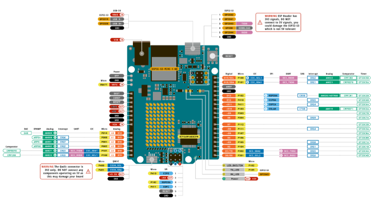

# sesion-02a

## apuntes sesión

Potenciómetro y botones

Potenciómetro: Regula la potencia
Potencia = energía/tiempo

La electricidad = voltaje x corriente. Dentro del voltaje hay energía y dentro de corriente hay tiempo, es por eso que voltaje x corriente también es potencia.

Nosotros no veremos mucho sobre el tiempo, nos preocupamos más de la energía.

5v ————————wwwwwww——————— 0v
Cable      Resistor      Cable.                          

El resistor se llama así porque resiste electrones, o algo así

El potenciómetro le pone resistencia a los electrones durante el flujo.
El potenciómetro es una interfaz que encapsula 2 resistores.

El profe habló de logaritmos, mi peor enemigo.
Al parecer los potenciadores de tipo A trabajaban con logaritmos y los de tipo B son lineales.

Botones: Pushbuttons si, Toggles no
Es decir, pulsadores.

Los interruptores de luz son toggles, así que no me interesan ahora mismo. No sirven para guardar algo en la memoria.

Un circuito N.O (Normally open) Le da una pausa y el electrón no puede pasar.

Al final del circuito no podemos poner tierra (0V), pues generaría un corto circuito.

Un circuito N.C (Normally connected) Está siempre conectado. (Casi no veremos este)

Vcc = Voltaje de corriente continua.

El cable permite que el voltaje se propague.

Azul para tierra (-)
Rojo para los 5V (+)




No usar VIN

En analog se puede leer, no escribir. Este leerá el potenciómetro.

El digital hace más cosas, pero tenemos el analog.

POTENCIÓMETRO

1 Vcc

2 Lectura

3 Tierra gnd


```cpp
const int patitaLectura = A0;


int valorLectura = -1;


void setup() {


  Serial.begin(9600);


}


void loop() {
  Serial.println(":3")
  valorLectura = analogRead (patitaLectura);
}


void loop() {
  valorLectura = analogRead (patitaLectura);
  Serial.println(valorLectura);
}
```

La entrada (IN) tiene un valor de 10  bits, es decir 2^10 o 1024 valores posibles (0 al 1023)


## encargos

encargo02a:

en tu fork, ir a actions, y aceptar que corran github worfklows. subir pantallazo con demostración de que han corrido actions exitosas en tu repo. esto es crucial, si no lo haces, no agregaremos tus apuntes al repo, y las tareas se tomarán como no entregadas. si en tu fork las actions no son exitosas, no serán tampoco agregadas al repo común ni evaluadas.

conformar grupos de 3 a 4 personas para la realización del proyecto-1. compartir 2 placas de desarrollo por grupo, documentar estudio conjunto de C++, microcontroladores, botones, potenciómetros.

Nuestro grupito: Belén Castillo, Martina Fernández, Maite Villarroel, María Ignacia Zamudio.

Mientras yo estaba trabajando, mis compañeros estaban probando códigos. Tuve mi break de colación y aproveché de ir a ver que hacían. Ahí me enteré de que a la Marti casi se le explota el potenciador, o el Arduino, o el pc o quizá todo. Potente...

## lectura
