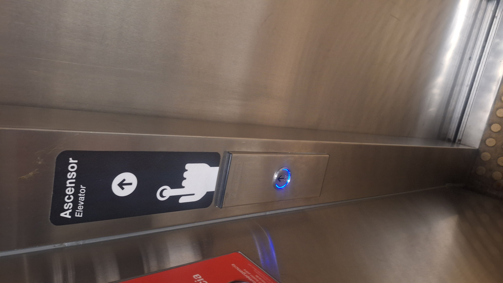
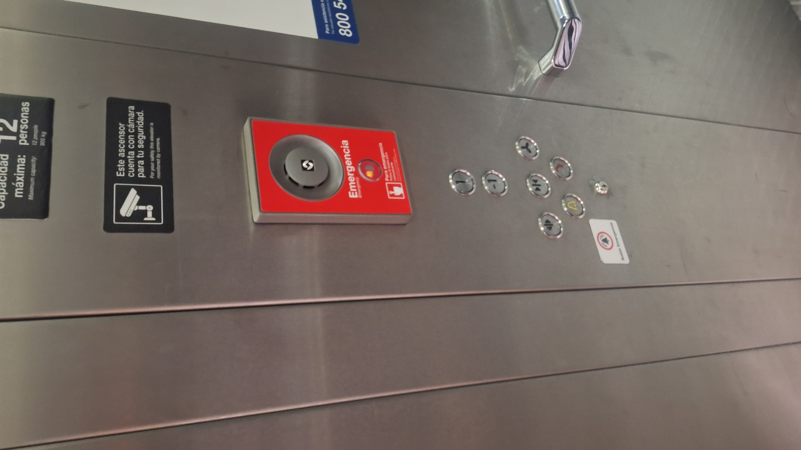
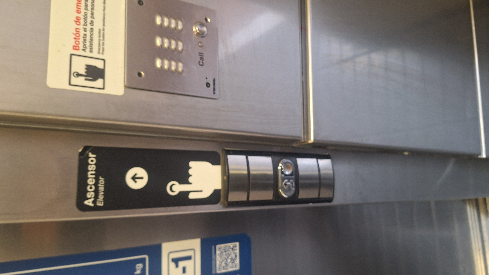
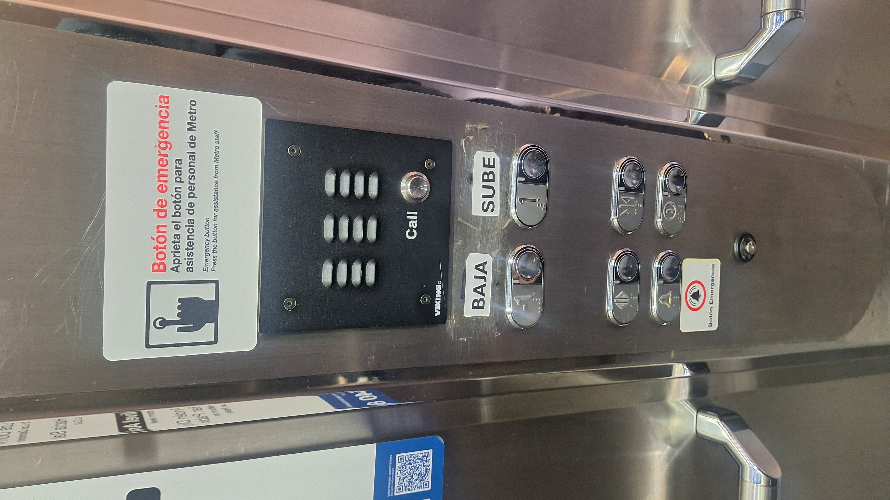
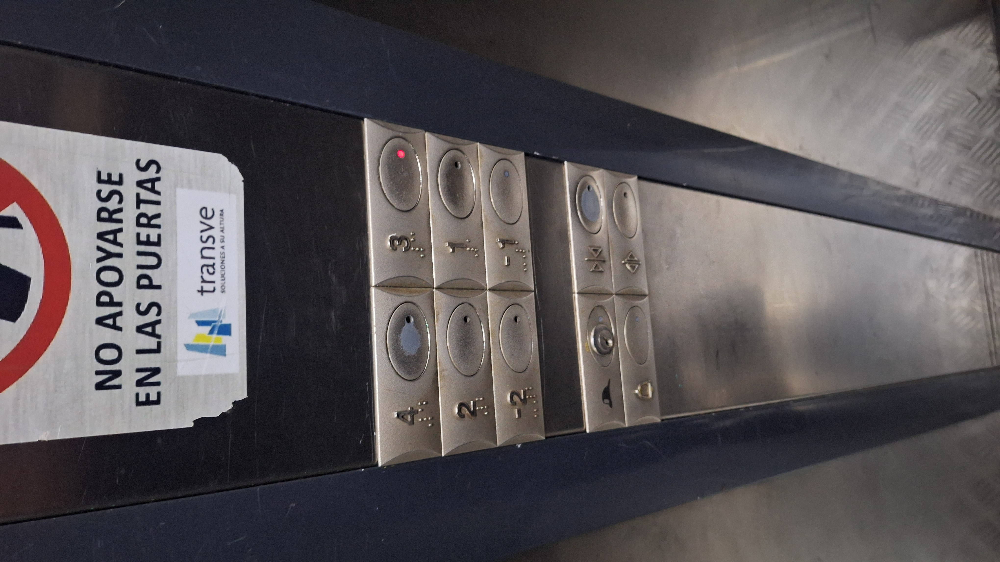

# sesion-00b

## apuntes sesión

## encargos

# Análisis de Usabilidad e Iconografía de Ascensores

## Ascensor metro Plaza de Quilicura

| Panel Exterior | Panel Interior |
| :---: | :---: |
|  |  |

Acompañado de una iconografía que indica que hay que presionar algo, la iconografía concuerda con el botón de abajo para pedir el ascensor; el botón tiene una flecha hacia arriba, lo que indica que solo sirve para subir y nada más, no da a más interpretaciones.

El panel del ascensor, pese a tener una iconografía que explica lo que dice, no tiene nada explícito, a excepción del botón de emergencia, el cual es acompañado de una pegatina que indica qué significa; aunque la botonera de los pisos de abrir y cerrar la puerta es fácil de deducir, los otros dos no. Insinúo que, al ser un botón rojo, tendrá que ver con alguna emergencia, tomando en cuenta que se usa ese color para el botón de emergencia de arriba. El último botón no sé bien qué significa.

Todos los botones están en braille.

---

## Ascensor metro Neptuno

| Panel Exterior | Panel Interior |
| :---: | :---: |
|  |  |

Acompañado de una iconografía que indica que hay que presionar algo, la iconografía concuerda con el botón de abajo para pedir el ascensor; el botón tiene una flecha hacia arriba, lo que indica que solo sirve para subir y nada más. Lo que podría confundir un poco sería el uso de la misma iconografía de la mano para el botón de emergencia y que estén tan cerca el uno del otro.

El panel del ascensor cuenta con 3 etiquetas para los botones, lo cual ayuda demasiado para saber qué insinúa y para qué sirve. El botón de emergencia cuenta con una etiqueta que explica que es un botón de emergencia. Los otros dos botones con flechas son para abrir y cerrar la puerta, y el otro botón es para realizar una llamada, ya que cuenta con una iconografía de teléfono. ¿Hacia qué? Se podría insinuar en caso de emergencia, ya que se encuentra al lado del botón de emergencia.

Todos los botones están en braille.

---

## Ascensor Faad

La botonera de fuera cuenta con dos botones, los cuales tienen una flecha hacia arriba y otro hacia abajo; se infiere que el usuario que quiera subir tendrá que presionar el botón hacia arriba y, en caso contrario, si se quiere bajar.

El panel del ascensor, pese a tener una iconografía que explica lo que dice, no tiene nada explícito, a excepción del botón de emergencia, el cual es acompañado de una pegatina que indica qué significa; aunque la botonera de los pisos de abrir y cerrar la puerta es fácil de deducir, hay una etiqueta en el botón de emergencia, lo que ayuda a saber para qué es el botón. Existe un botón/cerrojo en el cual se introduce una llave. ¿Para qué? No dice, pero al estar al lado del botón de emergencia y lo extraño del botón, se infiere que es para el técnico o en caso de emergencias.

Todos los botones están en braille.

## lectura
