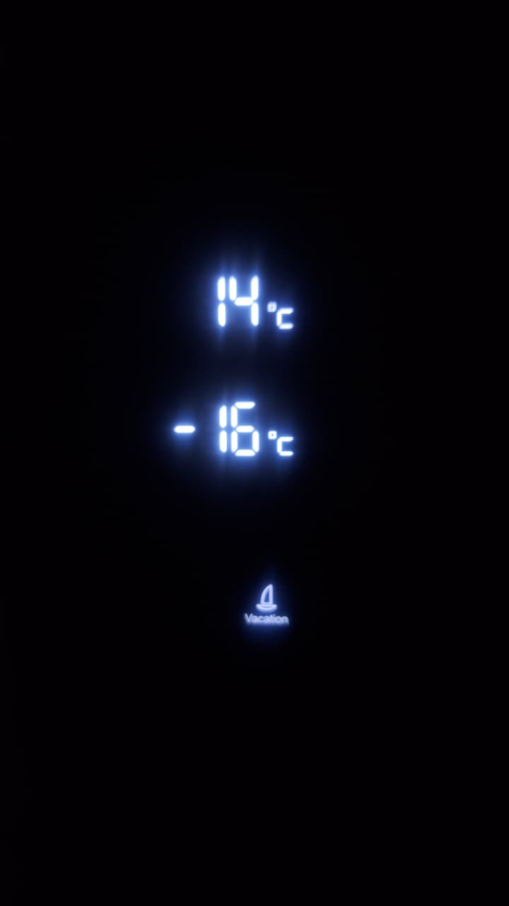
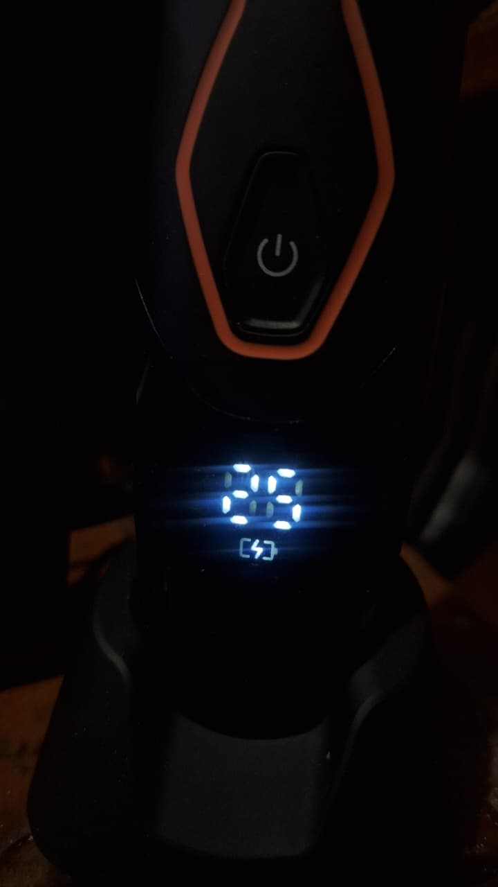
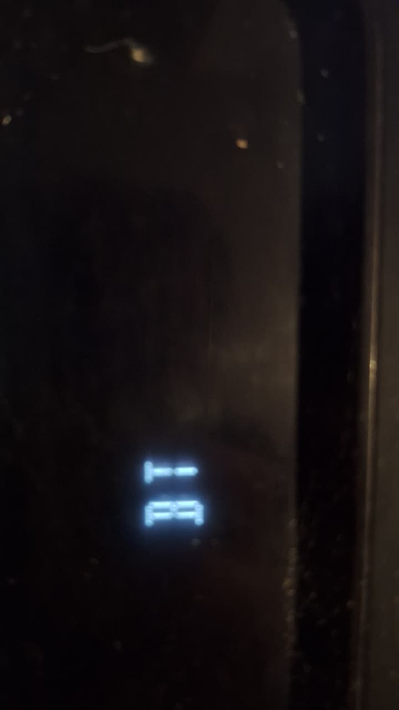
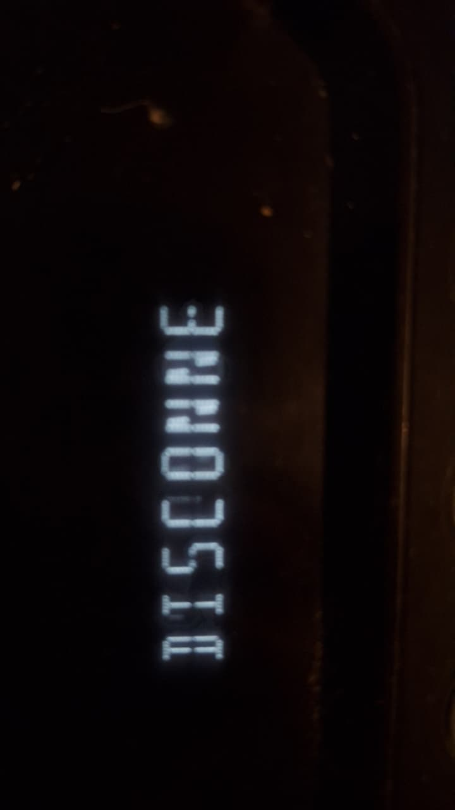

# sesion-01a

## apuntes sesión
**me lleve este libro:**


* Cuando un ascensor es diferente, o le falta o agrega algo más de lo que un ascensor convencional ya tiene, se podría decir que es un no-ascensor.
* Para que un ascensor sea un ascensor debe tener:
  - Puerta
  - Paredes con cuarta dimensión
  - Botones o cualquier cosa para poder presionar a qué piso va o pedirlo
* Un ascensor cuenta con variables de altura, en la cual se puede seleccionar su altura mediante los botones, los cuales están configurados para subir/bajar y posicionar el ascensor en cada planta del edificio. A su vez, tiene un mecanismo el cual permite jalar el ascensor o dejarlo caer para que este se pueda mover en Z en un cierto tiempo.
* Los paneles de botones del exterior normalmente traen 2 botones; cuando es el último o el inicio, es solo un botón.
* Los paneles de botones del interior contienen enumeración para cada piso; también tienen botones en caso de emergencia, botón para cerrar y abrir puertas (para vivir en una sociedad mejor, lo ideal sería eliminar el botón para cerrar las puertas).

## Encargos

### 1. Autorretrato: describir variables y funciones de ustedes

```javascript
let edad = 22;
let orejas = "grandes";
let dientes = "chuecos";
let cabello = "caspa";
const ojos = "ojeras, irritado";
const boca = "partida";
const colorOjos = "#432918";
const nariz = "larga";
const nombre = "Tomás Catrileo";
const amarAMiGata = true;
const amarAMiNovia = true;
const amarAMisSeresQueridos = true;
const amarLoQueHago = true;
const amarLosVideojuegos = true;
let amorPropio;
let nivelEstabilidad = null;
let descansar = false;

const persona = {
  estres: function() {
    if (estres === 100) {
      console.log("No cumplo con mis expectativas que tengo sobre mí mismo o que la gente carga en mí");
    } else if (estres === 200) {
      console.log("Estoy jugando LoL");
    } else {
      console.log("Estoy durmiendo o jugando algo que me gusta mucho o estando con amigos o con mi gata");
    }
  },

  descansar: function() {
    this.practicaytaller = 0;
    this.descansar = true;
    console.log("Mi mente por fin se calla luego de estar procrastinando tanto las cosas");
  },

  cabello: function() {
    if (estres === 100) {
      this.cabello = "caspa";
    } else {
      this.cabello = "normal";
    }
  },

  cumplirAnos: function() {
    edad = edad + 1;
    console.log("Feliz cumpleaños");
  },

  miCara: function() {
    this.nivelEstabilidad = Math.floor(Math.random() * 100);
    let valorCalculado = (this.nombre.length * 37) % 100;
    if (valorCalculado < 50) {
      return "Cara cambia sus proporciones";
    }
  }
};
```

### 2. Investigar pantallas de segmentos, tomar fotos, documentar contexto, lugar, ubicación, alfabetos posibles, usos, comparar entre resultados encontrados, al menos 3 ejemplos distintos.
En mis palabras, las pantallas de segmentos son dispositivos electroópticos que logran cortar el espacio de visualización en trazos independientes a los cuales se les llama segmentos. Estos segmentos están etiquetados por letras; la combinación de ciertos segmentos permite representar números o letras dependiendo del dispositivo. Los dos principales serían los displays de 7 segmentos, los cuales son para números y muy pocas letras, y el display de 14/16 segmentos, el cual agrega segmentos diagonales y verticales, permitiendo que así los segmentos puedan abarcar más caracteres y ser más legibles de paso.

Casos de estudio
**Ejemplo 1: Pantalla del refrigerador**



Ubicación: Cocina (Electrodoméstico).

Contexto de uso: Ajustar y monitorear la temperatura interna del congelador y conservador, o mostrar alertas de puerta abierta.

Tipo de pantalla: 7 segmentos (generalmente 2 a 4 dígitos) + íconos indicadores (copo de nieve, candado, etc.).

Alfabeto posible:
* Números: Rango numérico de temperaturas (ej. -18 °C para congelador, 04 °C para refrigerador). Cuenta con un rango numérico pequeño para representar los grados Celsius.
* Mensajes de estado: Si la puerta se queda abierta, comienzan a parpadear los segmentos y emite un sonido.

Tecnología del panel: LED detrás del panel plástico.


**Ejemplo 2: Pantalla de la rasuradora**



Lugar: Baño (Dispositivo portátil).

Contexto de uso: Mostrar el porcentaje restante de batería y el tiempo de uso.

Tipo de pantalla: 7 segmentos de 2 a 3 dígitos + íconos dedicados (batería parpadeando cuando le queda poca).

Alfabeto posible:
* Números: Porcentaje de carga de 0 a 100%.

Tecnología del panel: Pantalla en el frente.


**Ejemplo 3: Parlante**





Lugar: Sala de estar.

Contexto de uso: Notificar la fuente de entrada de audio activa (BT por Bluetooth, AUX, USB), el nivel de volumen y el estado de conectividad en tiempo real.

Tipo de display: Pantalla de matriz de puntos LED / Display alfanumérico.

Alfabeto y capacidades:
* Alfanumérico completo (A-Z, 0-9 y caracteres especiales): Gracias a su cuadrícula de micro-LEDs independientes, puede construir caracteres con trazos diagonales y curvas complejas como D, S, N, K y R.

Tecnología del panel: Cuenta con soporte para desplazamiento horizontal de texto (scrolling text), eliminando el límite físico de caracteres fijos por pantalla.

Como observación, tengo cosas muy viejas y nuevas y puedo decir que el de 7 segmentos es lo mejor en cuanto a costos y claridad si se trata de números y de entregar información básica. Pero ya para cosas más complejas y mucho más específicas se requeriría de muchos más segmentos. No puedo evitar comparar esto con los píxeles de una pantalla; siento que es casi lo mismo pero en miniatura.


## lectura
