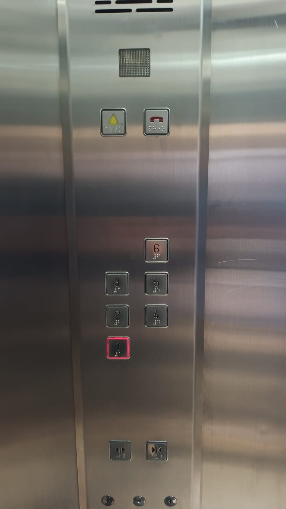
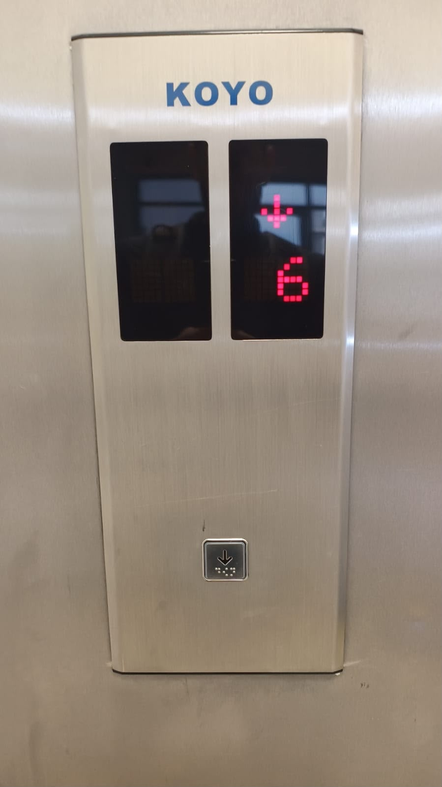
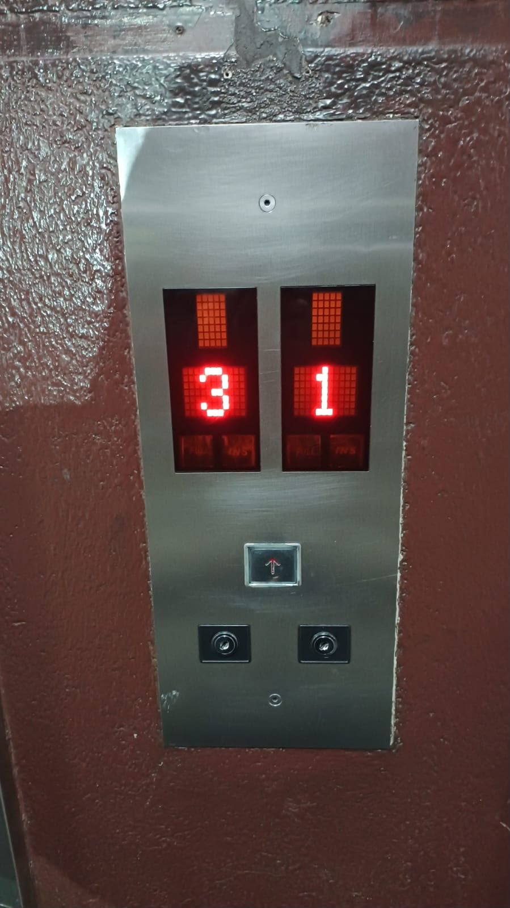
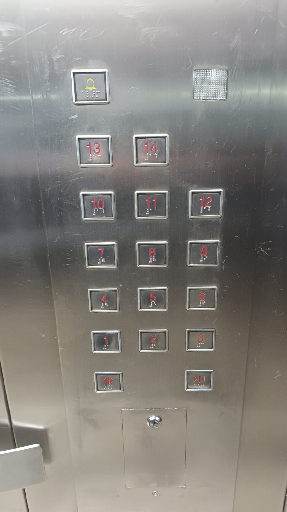

# sesion-00b
Hola profe Aaron, Emi, Misa, Sebas y Santi, para mi es un gusto poder saludarles nuevamente en este nuevo semestre, en el cual tengo la oportunidad de estudiar de la mano de ustedes.

El día de hoy, esta bitácora se dividirá en 2 partes:
1. Reunión de bienvenida al nuevo taller dirigido por Heidi Jalikh, y a nuestro inicio de clases.
2. Descripción y análisis de 2 sistemas diferentes de botones de dos ascensores/elevadores.

## apuntes sesión
### 1. Reunión de bienvenida al nuevo taller dirigido por Heidi Jalikh, y a nuestro inicio de clases.
“Heidi Jalkh es diseñadora experimental, investigadora y educadora nacida en Medellín y radicada en Buenos Aires. Con formación en diseño industrial y una maestría en investigación interdisciplinaria, recibió en 2022 el Premio Humboldt a la Innovación.

Su práctica explora la creación de materiales bioinspirados y procesos artesanales, conectando diseño, biología e ingeniería. Desde 2018 dirige el grupo de investigación Sistemas Materiales, donde desarrolla proyectos que integran forma, comportamiento y materialidad”. 
[cumulo.com](https://cumulo.com.ar/portfolio/heidi-jalkh/)

Con esta maravillosa introducción de Heidi, (a parte de que es maravillosamente Colombianee), la charla que ella tuvo en la Universidad Diego Portales, fue la presentación de sus últimos proyectos realizados, tales como su investigación con la planta de hielo nativa de australia, en la cual se inspiró para poder realizar así mismo su proyecto de magister en berlín. Y la razón de esta presentación, fue porque en la Universidad Diego Portales, ese era el evento principal de la semana cultural para que nostrxs lxs estudiantes le conociéramos a la misma vez que su trabajo, pues ella estará dictando durante este semestre un taller el cual impulsa la investigación y exploración de los biomateriales desde la dinámica de ella misma.

Ella trabaja mucho con hongos, y “desechos marinos”, como las ostras, conchas, entre otros. Sus resultados son prueba y error, no es un camino lineal.

## encargos  
### Descripción y análisis de 2 sistemas diferentes de botones de dos ascensores/elevadores.

#### Ascensor 1:
La primera parte con la que el usuario interactúa (imagen del lado izquierdo) antes de entrar al elevador para bajar del piso 6, es el botón de llamada para solo bajar (ya que es el último piso en este edificio), el llama al elevador para que te baje a tu destino. En este también podemos observar una pantalla digital, la cual nos indica la ubicación del ascensor para poder tener precisión de dónde está, y la dirección en la que se dirige.

En este elevador tenemos dos pantallas porque hay 2 elevadores, pero un solo botón que los llama.

Por dentro del elevador, cuenta con 10 botones con los que el usuario puede interactuar:   
En la parte inferior del panel de botones del elevador tenemos:

- Botón izquierdo de la imagen: Para abrir la puerta del elevador <>
- Botón derecho de la imagen: Para cerrar la puerta del elevador ><
  
Luego, están los números que indican los niveles a los cuales las personas pueden ir en/desde el elevador, y están estructurados de la siguiente manera; 3 en la izquierda *(1,2 y 3),* y 3 en la derecha los cuales comienzan paralelo desde el número 2 del lado izquierdo *(4,5 y 6).*

Y por último, están 2 botones demasiado importantes en caso de alguna emergencia:  
- Botón izquierdo de la imagen: Alarma, que al presionarlo, emite un sonido acústico fuerte en el edificio para alertar a las personas que estén dentro y fuera del recinto o lugar donde está el elevador.  
- Botón derecho de la imagen: Es el botón de ayuda telefónica, al mantenerlo presionado por unos segundos, activa una línea de comunicación directa con el personal de conserjería o personal del edificio.
  
También he de resaltar que sobre la superficie de estos botones tenemos un sistema táctil de lectura y escritura para personas con discapacidad visual, llamado **Braille.**

### Ascensor 2: 
La primera parte con la que el usuario interactúa (imagen del lado izquierdo) antes de entrar al elevador para subir desde el piso 1 a su destino (cualquiera en un rango de 1 a 13), es el botón de llamada para solo subir, pues no hay nivel 0 para bajar y que en su panel este este indicativo (Botón hacia arriba y botón hacia abajo), él llama al elevador para que te suba a tu destino. En este también podemos observar una pantalla digital, la cual nos indica la ubicación del ascensor para poder tener precisión de dónde está, y la dirección en la que se dirige.

En este elevador tenemos dos pantallas porque hay 2 elevadores, pero un solo botón que los llama.

Este cuenta con 17 botones y un cuadro LED a la derecha que la verdad no se que función cumple por ahora.

En la parte inferior del panel de botones del elevador tenemos:  
- Botón izquierdo de la imagen: Para abrir la puerta del elevador <>
- Botón derecho de la imagen: Para cerrar la puerta del elevador ><
  
Luego, están los números que indican los niveles a los cuales las personas pueden ir en/desde el elevador, y están estructurados en zigzag desde el 1 hasta el 14, y en el panel donde se encuentran estos botones, están organizados de grupos de 3: 

*1-2-3*  
*4-5-6*  
*7-8-9*  
*10-11-12*  
*13 y 14*  

Y por último, a diferencia del elevador anterior, solo tenemos un botón de Alarma, que al presionarlo, emite un sonido acústico fuerte en el edificio para alertar a las personas que estén dentro y fuera del recinto o lugar donde está el elevador. Este no cuenta con botón de llamada como el anterior.

## lectura
