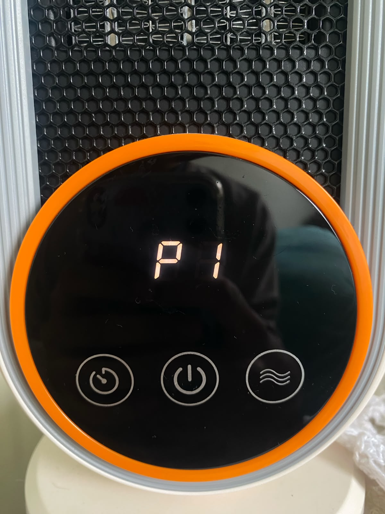
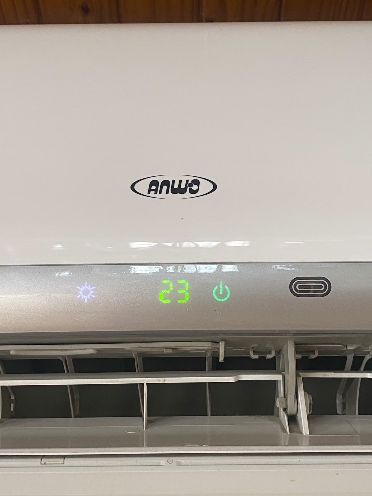

# sesion-01a
Hola profe Aarón, Emii, Santi, Misa y Sebas. Espero que se encuentren muy bien en el día que estén leyendo estos textos.
Comencemos:

1. Contenido de la clase:  
2. ¿Qué son las variables y las funciones?  
3. Encargo.  
4. Lectura.  

## apuntes sesión

### 1. Contenido de la clase:  
La clase del día de hoy se dividió en 2 partes:  
1. Como utilizar github y subir nuestros apuntes: Como hacer fork, cómo escribir en el README, como subir imagenes, entre otras funciones, y luego se nos fue asignada una carpeta a cada unx.
   
2. Ejercicio en correlación a nuestra observación en cuanto a los ascensores: hicimos grupos de 4-5 personas, y buscamos las semejanzas y diferencias de los ascensores que cada unx había investigado por su cuenta del encargo anterior.
   
3. Explicación express de Variables y Funciones: Los pisos de un edificio son variables, y el ascensor es la función: Nos lleva hasta ese punto o lugar que queremos.

### 2. ¿Qué son las variables y las funciones?
> Una variable es un contenedor que guarda datos en la memoria del computador, como un número o un texto. Una función es un bloque de código reutilizable que realiza una tarea o cálculo específico usando esos datos (los de la variable).

Entonces, en otras palabras; Una variable es un dato (número, nombre, decimal, frases) y este dato puede cambiar según la necesidad de lo que se esté realizando. Y una función, es la encargada de hacer o dar vida a esos datos realizando una “función” con ellos: Ya sea una suma, una resta, un saludo, etc.

Se podría decir que las variables son el “Qué” (el estado de las cosas), y las funciones el “Cómo” (combina, suma, resta, transforma esos datos).

Sin las variables, las funciones no tendrían datos sobre los cuales trabajar; y sin las funciones, las variables se quedarían ahí estáticas sin hacer nada útil.

Antes de continuar, he de mencionar que las variables y las funciones, se escriben dependiendo con qué lenguaje se utilice; C++, o, Phyton. Son lo mismo, pero la sintaxis es diferente. En el taller, vamos a utilizar C++, o, C más más,ó, C plus plus. 

### 3. C++ Variables
“In C++, there are different types of variables (defined with different keywords), for example:
- `int` - stores integers (whole numbers), without decimals, such as 123 or -123
- `double` - stores floating point numbers, with decimals, such as 19.99 or -19.99
- `char` - stores single characters, such as 'a' or 'B'. Char values are surrounded by single quotes
- `string` - stores text, such as "Hello World". String values are surrounded by double quotes
- `bool` - stores values with two states: true or false”

[w3school](https://www.w3schools.com/cpp/cpp_variables.asp)

### 4. Sintaxis y manera de escritura:
Con lo anteriormente visto, siempre que escribamos una variable, debemos declarar, así; El tipo de variable según su necesidad (escribir números enteros, decimales, etc) y debemos asignarle un nombre a esa variable para identificarle:

#### Estructura: 
`int` (type of variable) + `nombre de la variable` + `dato;` (el punto y coma son vitales, sin ellos, un hada muere)

**Ejemplo:**
- string myName = santiago;
- Int myAge = 20;

## encargos
1. autorretrato: describir variables y funciones de ustedes.
2. investigar pantallas de segmentos, tomar fotos, documentar contexto, lugar, ubicación, alfabetos posibles, usos, comparar entre resultados encontrados, al menos 3 ejemplos distintos. https://en.wikipedia.org/wiki/Segment_display

### 1. autorretrato: describir variables y funciones de ustedes.
Variables:
- string myName = santiago;
- Int myAge = 20;
- bool imgay = true;
- double iEspentds = 20.00;

Funciones:
### 2. Pantallas de segmentos

## lectura
- Libro: Code as Creative Medium - A Handbook for Computational Art and Design.
- Autor: Golan Levin and Tega Brain.
- Importante: El libro hace esta transición del STEM (Ciencia, Tecnología, Ingeniería y Matemáticas), a STEAM (suma el Arte a esas mismas áreas).

Personas muy importantes:
- Golan Levin.
- John Maeda´s.
- Muriel Cooper.
- Leah Buechley.

ACG (Aesthetics and Computation Group)  sinónimo: el LID

### Prefacio.
En este apartado de la lectura, que considero yo que es crucial para entender un poco el recorrido de los autores de un libro, descubrí que escogí el libro indicado y perfecto para este punto-momento de mi vida, pues actualmente me encuentro realizando mi tesis de pregrado, junto al profesor Gustavo (Colombia) y el profesor Aarón (Chile), y estoy en búsqueda de referentes que puedan alimentar mi conocimiento, mi curiosidad, y el autor de este libro, es un acompañante más en esta aventura tan emocionante. Además, el libro es sobre interacciones digitales, y por lo que mi corazón me dice…, es lo que me apasiona. 

El contenido del prefacio narra la manera en la que Golan descubrió en su proceso educacional que lo que él tenía en mente y en su corazón, lo podía hacer real por medio del lenguaje del código. 

Junto a Tega, crearon este maravilloso libro en su paso por el MIT, específicamente en el grupo de ACG (Aesthethics + Computation Group), en el MIT Media Lab en 1999.
Que de hecho, el profesor Aarón, estuvo allí.

Este libro nació de la falta de recursos que tuvo Golan para aprender a programar con un enfoque en artes visuales, pues anteriormente en su clase, solo le ponían ejercicios de matemáticas y texto muy cuadriculado; por ejemplo, una calculadora de sumas y restas, pero para él poder lograr su objetivo de diseñar con la programación, debía desarrollar nuevas habilidades para llegar a ello.

Fuera de clases, el solía investigar y practicar para poder hacer visuales por medio del código. Luego, Golan se unió a John Maeda´s Aesthetics + Computation Group en el MIT Media Lab, el cual era un pequeño grupo de investigadores el cual integraba; Artistas, Diseñadores, y Programadores, para explorar un nuevo tipo de síntesis entre esas áreas de dominio.  Luego a lo largo de su paso por el ACG, descubrió maneras de enseñanza para que los estudiantes aprendieran código y lo pudieran implementar a sus áreas de interés. 

Luego, a lo largo de su vida junto a Tega participaron en foros educacionales para compartir y a su vez aprender nuevas herramientas de código creativo, y como hacer esta información más digerible para la persona que quisiera aprender. También, resaltan la importancia de registrar los procesos, pues ellos mencionan algo muy clave, y es que: "Los buenos trabajos, siempre serán recordados. Pero no el esfuerzo o el proceso humilde de un artista".

Entonces, este libro recopila 30 años de experiencia, para los lectores que tengan la oportunidad de leerlo, puedan aprender de primera mano y a su vez, de una manera muy amistosa.

### Introducción.
- Creative coders  
- German word: Gestaltern (creators of form).  

