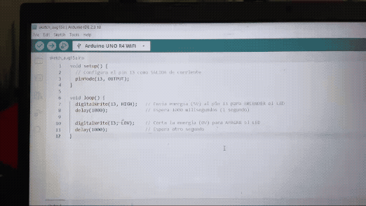
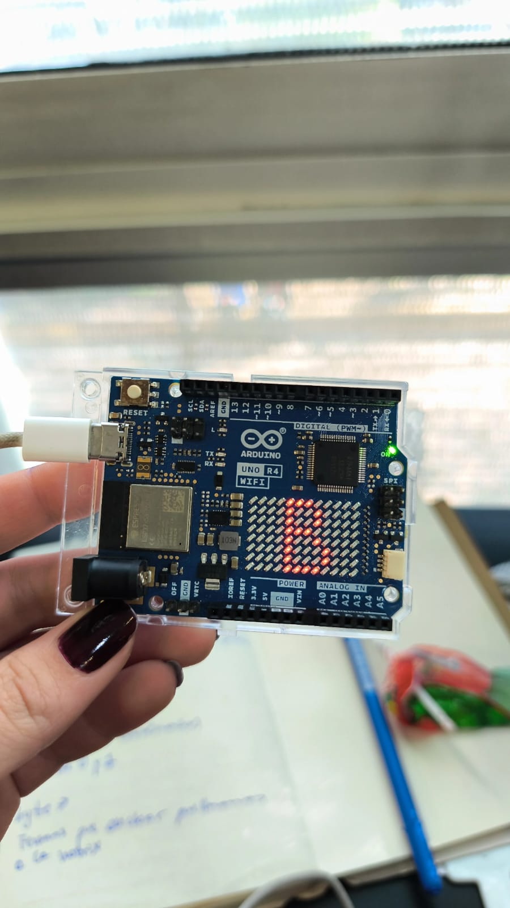
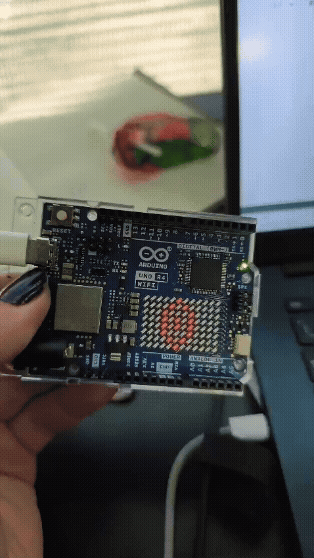
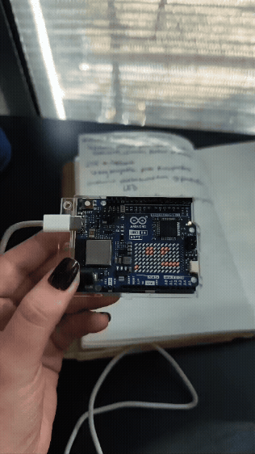

# sesion-01b
*"No se cobra por hora, se cobra por obra".*

Hola profe Aarón, Emi, y Sebas. Espero que se encuentren bien en el momento que estén leyendo estos textos.

El día de hoy en clase: 

1. La historia del dicho: se me “Bugueo” el compu.
2. Introducción a Arduino / Instalación del software / Placa de Arduino R4 wifi
3. The untold History of Arduino.
4. Ejemplos de construcción de variables y funciones en C++ arduino.
5. Markdown para agregar código en Github. 

## apuntes sesión

## 1. La historia del dicho: se me “Bugueo” el compu.
9 de septiembre de 1947 – El Primer "Bug" de la Historia

**- Incidente:** Falla en la computadora Harvard Mark II (Relé 70, Panel F).  
**- Causa:** Una polilla real se metió en los componentes mecánicos y atascó el sistema.  
**- Solución:** El equipo de la científica Grace Hopper removió el insecto y lo pegó en la bitácora oficial.  
**- Registro histórico:** Escribieron junto a la polilla: "First actual case of bug being found" (Primer caso real de un bicho encontrado), popularizando el término "bug" y "debugging" en la informática.


  
## 2. Introducción a Arduino / Instalación del software / Placa de Arduino R4 wifi
**`Vamos a usar: Arduino uno R4 wifi`**

1.  Arduino. vamos a instalar Arduino IDE.

   

2. Una vez instalado, vamos a buscar: `uno r4` e instalamos este “pluggin”.

   

3. Con un cable tipo C, lo conectamos al compu
   
   

4. Y luego, hacemos este cambio para que el código pueda afectar el arduino. 
  

## 3. The untold History of Arduino.
`Hernando Barragán`

As a way of summary, it was stolen by som else.
[Aquí puedes encontrar la historia completa](https://arduinohistory.github.io/)

## 4. Ejemplos de construcción de variables y funciones en C++ arduino.
1. Arduino tiene una estructurara que viene por predeterminado, y es la que hace que las cosas funcionen dentro del código, y se divide en 2 partes:
   
- void setup() — La Configuración Inicial
Es la etapa de preparación. Todo lo que se escriba dentro de las llaves { } de setup() se ejecuta una sola vez, justo al encender o reiniciar la placa del Arduino.

```cpp
   void setup() {
  // aqui va setup(), ocurre una vez, al principio

}
```

- void loop() - Una vez que setup() termina, Arduino pasa a loop() y empieza a ejecutar las instrucciones en orden, de arriba a abajo. Wow, se hace un loop :)

```cpp
void loop() {
  // aqui va loop()
  // ocurre despues de setup()
  // se repite hasta que no se pueda
}
```
**Ejemplo:**
```cpp
void setup() {
  // Configura el pin 13 como SALIDA de corriente
  pinMode(13, OUTPUT);
}

void loop() {
  digitalWrite(13, HIGH);   // Envía energía (5V) al pin 13 para ENCENDER el LED
  delay(1000);              // Espera 1000 milisegundos (1 segundo)

  digitalWrite(13, LOW);    // Corta la energía (0V) para APAGAR el LED
  delay(1000);              // Espera otro segundo
}
```
En el primer punto, el de `setup`, se le indica a la placa que se va a enviar voltaje y el pin 13 va a ser la salida. Y luego tenemos el funcionamiento del `loop`, que hará que la luz se encienda por un tiempo, y luego se apagué. Así, en un loop.



## 5. Markdown para agregar código en Github. 

**Backticks:** ( `` ) se usan cuando se quiere poner código en github, se deben poner 3 backticks así:  
"```cpp"   (el cpp) es para poner color a los textos y se puedan diferenciar mejor. Y al cerrar el texto, se vuelven a poner 3 backticks.   
Esto, para que no afecte el resto de texto que quieras escribir que no sea código. 

## encargos

encargo01b:

Me reúno con kriss el lunes.

1. tratar de correr un código en el microcontrolador asignado a cada dupla, incluir referentes, citas, comentarios, imágenes, descripciones textuales, y en caso de éxito o fracaso incluir aciertos, preguntas, dramas, atados. recordatorio que estos apuntes son personales, cada persona sube su versión.

Como contamos con el Arduino uno R4 Wifi, tenemos "la ventaja" de poder jugar y visualizar en la matriz de LED´S que conforman una mini pantallita en la misma placa. Entonces, los ejercicios que hicimos se centran en visualizar algo en esta pantallita. 

- 1. Desciframos que hay dos maneras de hacer visualizar algo en la matriz led de la placa: Por medio de configuración 1 y 0, donde; "1" es encendido, y "0", es apagado. Y el otro método, es por medio de números hexadecimales. (personalmente se me hizo más fácil con la matriz de "1" y "0".







**Referentes**
- [referente1](https://www.youtube.com/watch?v=nL34zDTPkcs&t=496s)
- [referente 2](https://youtu.be/vro4zqYeLWc?si=MkBbxIaZSaIDjVPZ)
- [referente 3](https://docs.arduino.cc/built-in-examples/basics/Blink/)
  
2. proponer una función con nombre, tipo, argumentos y uso, que modele algún área de su interés, por ejemplo subirCerro(enBicicleta), tomarMetro(conPaseEscolar), etc. escribir en pseudocódigo los pasos que necesita esa función internamente para que literalmente funcione.

## lectura
Para poder leer y entender de manera correcta, ya agregue p5.js a mi Visual Studio Code, y comenzaré a estudiar haciendo los ejercicios del libro.

### Cap 1. Iterative Pattern; Generating a texture or textile design. 

#### Brief
Debo crear un patrón textil teniendo en cuenta los siguientes estándares: Simetría, ritmo, color, detalle a múltiples escalas, control preciso de la silueta, y balance entre formas orgánicas y geométricas. 

Debo hacer un sketch primero.

#### Learning Objectives


#### Variations 
#### Making It Meaningful
#### results
