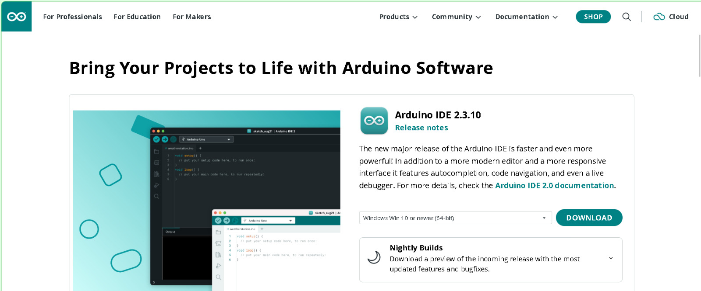
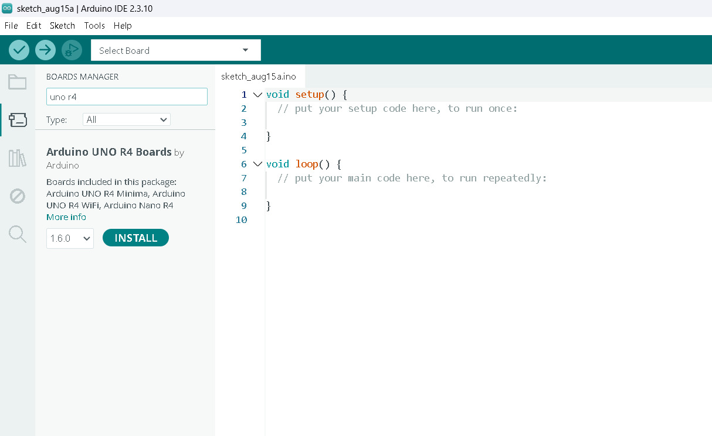
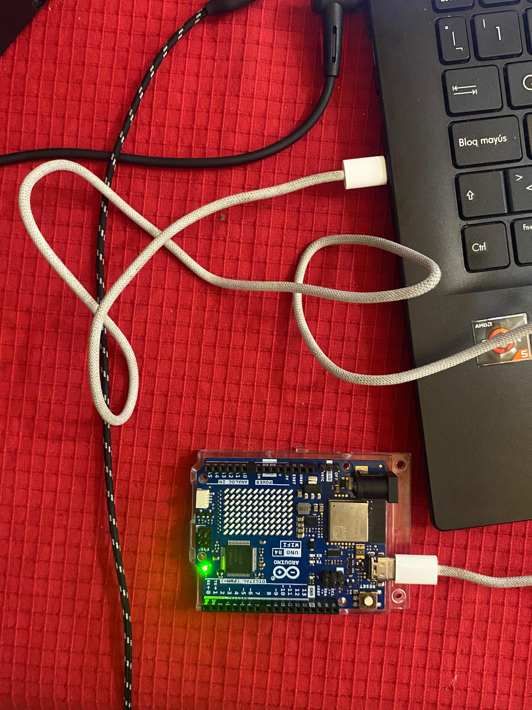
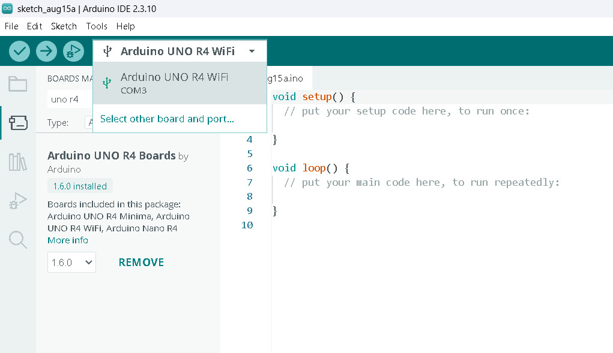

# sesion-01b
*"No se cobra por hora, se cobra por obra".*

Hola profe Aarón, Emi, y Sebas. Espero que se encuentren bien en el momento que estén leyendo estos textos.

El día de hoy en clase: 

1. La historia del dicho: se me “Bugueo” el compu.
2. Introducción a Arduino / Instalación del software / Placa de Arduino R4 wifi
3. The untold History of Arduino.
4. Ejemplos de construcción de variables y funciones en C++ arduino.
5. Markdown para agregar código en Github. 

## apuntes sesión

## 1. La historia del dicho: se me “Bugueo” el compu.
9 de septiembre de 1947 – El Primer "Bug" de la Historia

**- Incidente:** Falla en la computadora Harvard Mark II (Relé 70, Panel F).  
**- Causa:** Una polilla real se metió en los componentes mecánicos y atascó el sistema.  
**- Solución:** El equipo de la científica Grace Hopper removió el insecto y lo pegó en la bitácora oficial.  
**- Registro histórico:** Escribieron junto a la polilla: "First actual case of bug being found" (Primer caso real de un bicho encontrado), popularizando el término "bug" y "debugging" en la informática.


  
## 2. Introducción a Arduino / Instalación del software / Placa de Arduino R4 wifi
**`Vamos a usar: Arduino uno R4 wifi`**

1.  Arduino. vamos a instalar Arduino IDE.

   

2. Una vez instalado, vamos a buscar: `uno r4` e instalamos este “pluggin”.

   

3. Con un cable tipo C, lo conectamos al compu
   
   

4. Y luego, hacemos este cambio para que el código pueda afectar el arduino. 
  

## 3. The untold History of Arduino.
`Hernando Barragán`

As a way of summary, it was stolen by som else.
[Aquí puedes encontrar la historia completa](https://arduinohistory.github.io/)

## 4. Ejemplos de construcción de variables y funciones en C++ arduino.
1. Arduino tiene una estructurara que viene por predeterminado, y es la que hace que las cosas funcionen dentro del código, y se divide en 2 partes:

```cpp
   void setup() {
  // aqui va setup(), ocurre una vez, al principio

}

void loop() {
  // aqui va loop()
  // ocurre despues de setup()
  // se repite hasta que no se pueda
}
```
## 5. Markdown para agregar código en Github. 

**Backticks:** ( `` ) se usan cuando se quiere poner código en github, se deben poner 3 backticks así:  
"```cpp"   (el cpp) es para poner color a los textos y se puedan diferenciar mejor. Y al cerrar el texto, se vuelven a poner "```", los 3 backticks.   
Esto, para que no afecte el resto de texto que quieras escribir que no sea código. 

## encargos

encargo01b:

1. tratar de correr un código en el microcontrolador asignado a cada dupla, incluir referentes, citas, comentarios, imágenes, descripciones textuales, y en caso de éxito o fracaso incluir aciertos, preguntas, dramas, atados. recordatorio que estos apuntes son personales, cada persona sube su versión.
2. proponer una función con nombre, tipo, argumentos y uso, que modele algún área de su interés, por ejemplo subirCerro(enBicicleta), tomarMetro(conPaseEscolar), etc. escribir en pseudocódigo los pasos que necesita esa función internamente para que literalmente funcione.

## lectura
