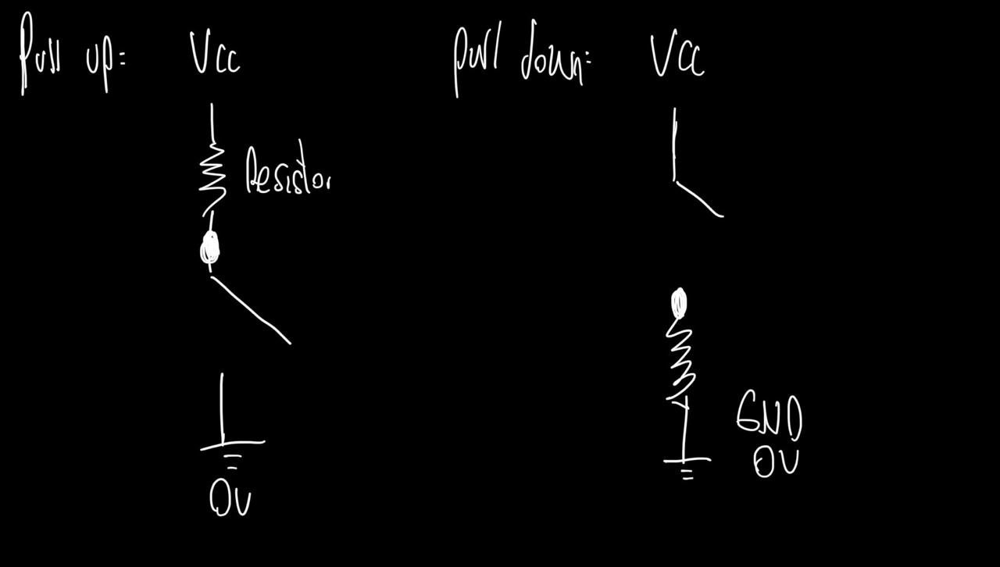
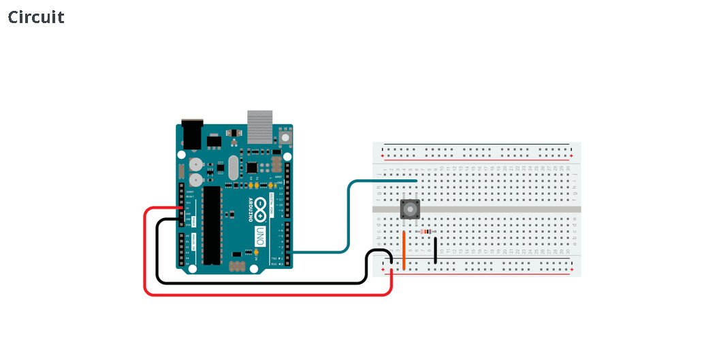
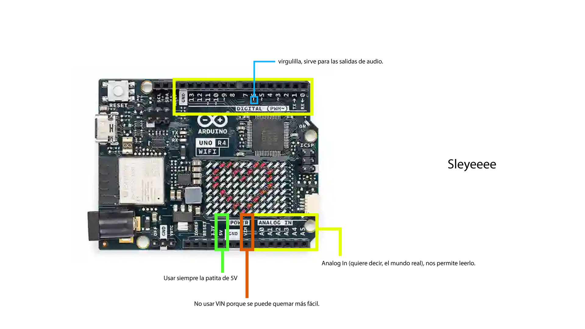
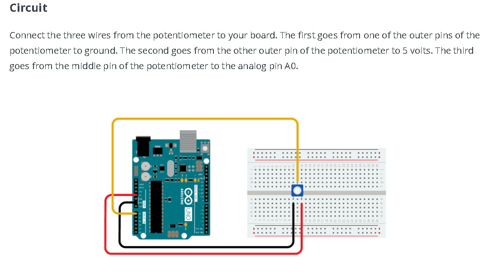
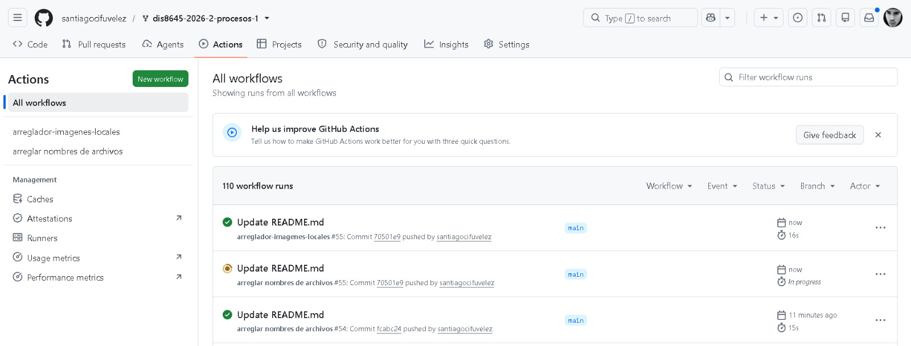

# sesion-02a
*No existe un potenciómetro perfecto, pero si existimos nosotros.*

Hola profe Aarón, Profe Mati, Emi y Sebas!, espero que se encuentren bien cuando lean esto c: 

1. Apuntes de clase: Potenciómetros, encoders, Pull up y Pull down, referentes como Luis Llamas, explicación de conexión de aurdino con breadboard, Baudios.
2. Encargo
3. Lectura

# apuntes sesión
## 1. Apuntes de clase: Potenciómetros, encoders, Pull up y Pull down, referentes como Luis Llamas, explicación de conexión de aurdino con breadboard, Baudios.
La clase de hoy fue bastante extensa, pero muy fructífera.

## Potenciómetros: 
Los potenciómetros nos permiten variar la potencia. Como si este fuera un grifo de agua; si le abres mucho, sale mucha agua (la potencia mucho), si le abres poco, sale poca agua (la potencia poco).  

Así se ven:

## Resistencias: 
Las resistencias actúan como protectores y atajadores de la corriente que entra al circuito. Sin estas, el circuito no resiste y se puede quemar. Hay muchos colores, sabores, tamaños, etc..., `como los lgbtiq+ [Divesos y resistentes].`

Así se ven

## Encoders 
Un encoder es un  sensor que genera señales digitales en respuesta al movimiento.
La clasificación de un encoder depende de tres ejes distintos:

**1. Según el tipo de movimiento**
   **- Rotatorio:** Mide ángulos y giros.
    **- Lineal:** Mide desplazamiento en línea recta.

**2. Según el tipo de movimiento**

    - Óptico: Usa luz y un disco/regla graduada.
    - Magnético: Usa sensores de efecto Hall o magnetoresistivos.
    - Capacitivo: Mide cambios en la capacitancia.
    - Inductivo: Mide variaciones en campos magnéticos/inductivos.

**3. Según la forma de indicar la posición (Modo de lectura / Salida)**

    - Incremental: Genera pulsos conforme se mueve. No sabe su posición real al encenderse hasta pasar por un punto de referencia.  
    - Absoluto: Asigna un código único (bits) a cada posición. Sabe exactamente dónde está, incluso tras apagarse y encenderse.  

Esto permite la automatización de datos que se quieran recolectar.
[referencia](https://www.servomotorsadjust.com/encoders/)
[referencia](https://blog.structuralia.com/que-es-encoder-tipos/)

## Pull up y Pull down
Son configuraciones del circuito (usando una resistencia) para asegurar que un pin digital del microcontrolador lea un 1 lógico (HIGH) o un 0 lógico (LOW) claro cuando el botón no está presionado, evitando que el pin quede "flotando".

**Activado (On / Presionado):** El botón cumple su función, está encendido o la acción está seleccionada.  
**Desactivado (Off / No presionado):** El botón está apagado, en reposo o la función no está en uso.  

En el siguiente esquemático vamos a ver las diferencias del pull up y el pull down:    

|Configuración|Sin presionar botón|Al presionar botón|¿Cómo se conecta?|
--------------|-------------------|------------------|------------------
|**Pull-up**|Pin recibe HIGH (VCC)|Pin recibe LOW (GND)|Resistencia arriba (a VCC), Botón abajo (a GND).|
|**Pull-down**|Pin recibe LOW (GND)|Pin recibe HIGH (VCC)|Botón arriba (a VCC), Resistencia abajo (a GND).|

**Pull Up:** La resistencia se encuentra desde el lado de VCC
**Pull Down:** La resistencia se encuentra desde el lado del GND

## Luis Llamas
`Referente súper importante en este rubro:` [Luis Llamas](https://www.luisllamas.es/)

## Explicación de conexión de aurdino con breadboard

Ej1: [Enlace al ejercicio](https://docs.arduino.cc/built-in-examples/digital/Button/)

**- El cable rojo:** Positivo.  
**- El cable Negro:** Negativo.  
**- El cable verde/azul:** Es el puente entre la breadboard y el Arduino.   

Para el siguiente ejercicio que realizamos en clase, debemos entender esto primeramente: 

Con lo anteriormente comentado, vamos a realizar un ejercicio con un potenciometro y una placa de Arduino Uno R4 Wifi, para hacer un Analog Read Serial.

[Enlace ejercicio](https://docs.arduino.cc/built-in-examples/basics/AnalogReadSerial/)

Pasos:
- Cable dupont a GND  
- Cable dupont a 5V  
- Cable a “A0”  

Luego se conecta el cable “A0” **a la patita central del potenciómetro.**
Patita 1: 5V al comienzo patita 2: A0   Patita 3:GND

## encargos.
1. en tu fork, ir a actions, y aceptar que corran github worfklows. subir pantallazo con demostración de que han corrido actions exitosas en tu repo. esto es crucial, si no lo haces, no agregaremos tus apuntes al repo, y las tareas se tomarán como no entregadas. si en tu fork las actions no son exitosas, no serán tampoco agregadas al repo común ni evaluadas.

   
2. conformar grupos de 3 a 4 personas para la realización del proyecto-1. compartir 2 placas de desarrollo por grupo, documentar estudio conjunto de C++, microcontroladores, botones, potenciómetros.

## lectura
