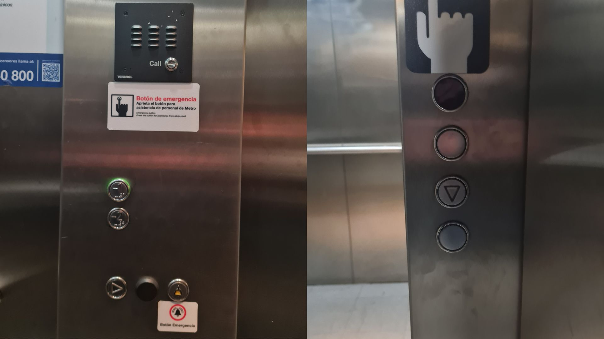
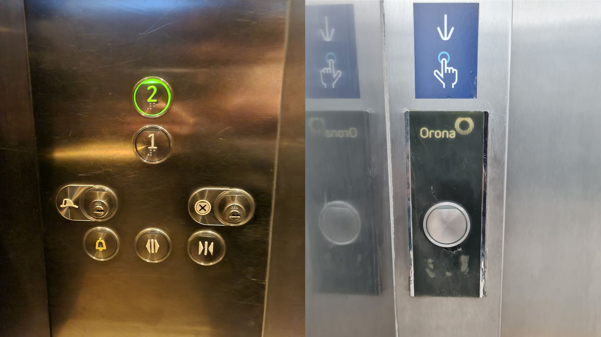
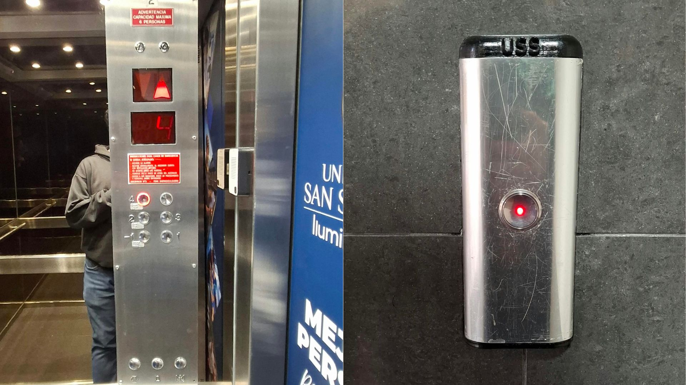

# sesion-00b

## apuntes sesión

Muy buena charla, me encantó

## Información sobre ascensores

Existen distintos tipos de input, desde botones hasta tarjetas. Vimos ascensores que sólo tienen un botón para subir y bajar, otros que poseen los dos y que colapsan al presionar “bajar” y seleccionar una planta superior. También existen tarjetas que sólo dan acceso a un piso base inicial y uno de destino, sin elección ni paso a equivocarse. 

Dentro de los datos internos que maneja el ascensor, tenemos: la cantidad de pisos, pisos que pueden estar prohibidos/deshabilitados, para qué sirve cada botón y qué debe hacer en caso de que cada uno de ellos sea presionado.

 - **Datos:** Botones (numéricos positivos y/o negativos, además de botones auxiliares ya sean de emergencia, abrir y/o cerrar puertas), puertas (1 o 2), poleas, motores,  contrapesos, carril, eje.

 - **Funciones:** Subir, bajar, mantenerse; saber a qué lugar va; abre la puerta, cierra la puerta; sonar una alarma

## encargos

**Encargo 00:** Tomar fotos de botoneras de ascensores y analizarlos (como mínimo 3).

 - Botonera 1: **Estación metro República con dirección San Pablo**

Podemos notar que para pedirlo existen 4 botones, de los cuales sólo uno tiene una flecha y funciona. Ya dentro del ascensor podemos ver 4 botones en total, 2 de planta (-1 y -2), además de 2 auxiliares, siendo 1 de ellos de emergencia, y el otro no lo sé, debido a que a que es sólo una flecha que apunta hacia la derecha, y no especifica si es para abrir o cerrar la puerta, o sí tiene alguna otra función. 

Otra acotación es que tiene citófono, algo que no vi en los otros ejemplos, y además no tiene una pantalla que especifique en qué piso se encuentra. 

- Botonera 2: **Estación metrotren Nos con dirección Alameda**

En este ejemplo podemos ver sólo un botón único para pedir el ascensor, esto en ambos pisos (1 y 2). Mientras que en el interior podemos ver 7 botones: 2 de planta y 5 de asistencia, de los cuales 2 están bloqueados y sólo pueden ser presionados tras usar una llave en caso de emergencia o mantenimiento, mientras que los otros 3 son de asistencia para los usuarios, ya sea para poder abrir o cerrar las puertas, así como también uno de emergencia, por si acaso sucede algún tipo de emergencia en el ascensor.

Tiene una pantalla que sirve para saber en qué piso está, aunque no se vea en la foto.

- Botonera 3: **Universidad San Sebastián sede Huechuraba**

Aquí vemos otra botonera que sólo tiene un botón para llamar el ascensor de cualquier planta. Y a diferencia de los demás este ascensor tiene 9 botones: 3 auxiliares que son para abrir y cerrar puertas y 1 de emergencia. Ya los otros 6 parecen ser de planta, el ploble es que sólo hay 5 de ellos identificados con un número, el 6 no tiene nada y si se presiona, no lleva a ninguna parte.

Algo que me pareció curioso de este es que tiene dos pantallas ara indicar la planta, una que señala el número de piso y otra que marca la dirección en la que va el ascensor, además de que los botones auxiliares están demasiado alejados de los de planta.

## lectura
