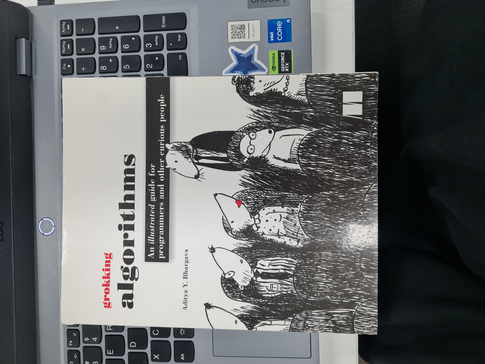

# sesion-01a

2026-08-11

## Introducción a GitHub

**¿Cómo subir fotos a GitHub?**

 1.  En la carpeta de la sesión (ej: sesion-01a)
 2.  Add File
 3.  Upload File
 4.  Arrastrar o seleccionar imagen
 5.  Comentario descriptivo del commit
 6.  **Commit**

**IMPORTANTE:** Los archivos NO deben tener espacios, mayúsculas, ni tildes.

**¿Cómo los agrego a mis apuntes?**

La manera correcta es:

```text

```

En donde:

 - alt text = audio descriptivo
 - ./ = aquí mismo (número de sesión)
 - imagenes = carpeta que aloja todas las imágenes dentro de la sesión
 - nombre.jpg = nombre textual de la imagen a colocar

**IMPORTANTE:** Sí alguno de estos puntos está mal, no va a funcionar.

## Programación

Tipos de paréntesis:

 - () = Paréntesis
 - [] = Corchete
 - {} = Murciélago 

También considerar: (bajo el ejemplo de los ascensores)

 - **Variables:** En qué piso estoy, si la puerta está abierta, cerrada, etc.
 - **Funciones:** Responde a las variables.
 - **Puntos de vista:**

## encargos

**Encargo 01:** Describir nuestras propias variables y funciones (autorretrato).

**Encargo 02:** Investigar pantallas de segmentos, tomar fotos, documentar contexto, lugar, ubicación, alfabetos posibles, usos, comparar entre resultados encontrados, al menos 3 ejemplos distintos.

## lectura

La lectura que yo escogí es "**Grokking Algorithms**" de Aditya Y. Bhargava.


