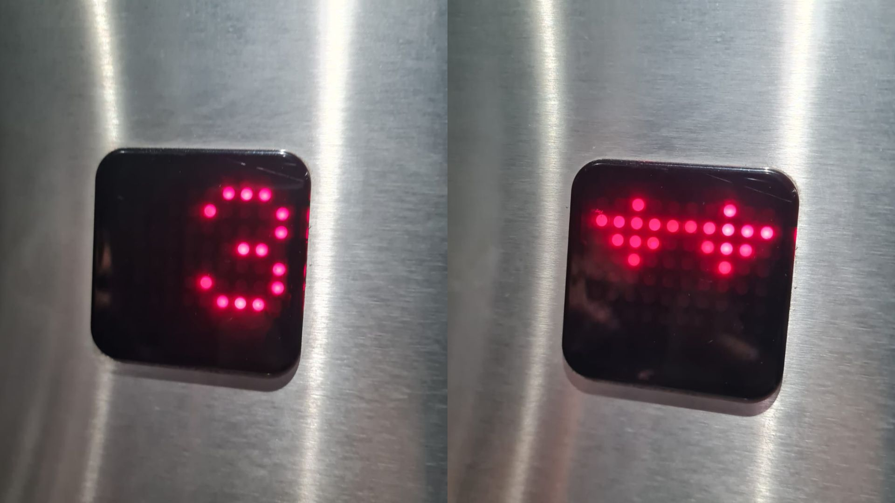
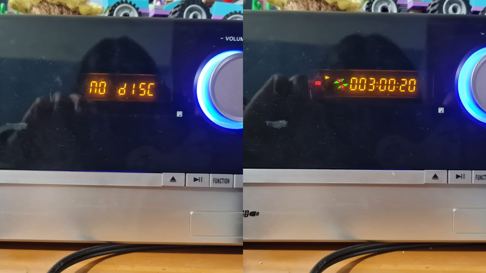
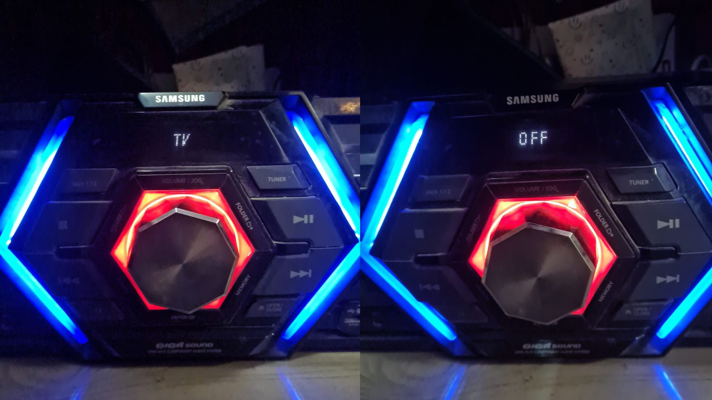

# sesion-01a

2026-08-11

## Introducción a GitHub

**¿Cómo subir fotos a GitHub?**

 1.  En la carpeta de la sesión (ej: sesion-01a)
 2.  Add File
 3.  Upload File
 4.  Arrastrar o seleccionar imagen
 5.  Comentario descriptivo del commit
 6.  **Commit**

**IMPORTANTE:** Los archivos NO deben tener espacios, mayúsculas, ni tildes.

**¿Cómo los agrego a mis apuntes?**

La manera correcta es:

```text

```

En donde:

 - alt text = audio descriptivo
 - ./ = aquí mismo (número de sesión)
 - imagenes = carpeta que aloja todas las imágenes dentro de la sesión
 - nombre.jpg = nombre textual de la imagen a colocar

**IMPORTANTE:** Sí alguno de estos puntos está mal, no va a funcionar.

## Programación

Tipos de paréntesis:

 - () = Paréntesis
 - [] = Corchete
 - {} = Murciélago 

También considerar: (bajo el ejemplo de los ascensores)

 - **Variables:** En qué piso estoy, si la puerta está abierta, cerrada, etc.
 - **Funciones:** Responde a las variables.
 - **Puntos de vista:**

## encargos

**Encargo 01:** Describir nuestras propias variables y funciones (autorretrato).

**Variables:**

Físicas:

 - Altura: 150cm
 - Dientes: 30
 - Tatuajes: 1
 - Perforaciones: 2
 - Color de pelo: Café oscuro

Internas: 

 - En la mañana: mucho sueño. En la noche: mucha energía.
 - Si estoy de buen humor: siento que puedo comerme el mundo. Sí estoy de mal humor: siento que voy a fracasar en todo.
 - Si hace frío (máximo 20°): me encanta salir. Si hace calor (desde 21°): ojalá no salir de mi casa.
 - Si un lugar está lleno de gente: ansiedad, me quiero ir. Si hay poca gente: no tengo problema alguno.

**Funciones:**

 - Ir a la universidad a taller los martes y viernes.
 - Comer como mínimo 3 veces al día.
 - Hacer mis encargos en todos mis ramos.
 - Subir mis apuntes a GitHub después de cada clase.
 - Darle comida a mis perros.

**Encargo 02:** Investigar pantallas de segmentos, tomar fotos, documentar contexto, lugar, ubicación, alfabetos posibles, usos, comparar entre resultados encontrados, al menos 3 ejemplos distintos.

**Pantallas de segmentos:**

Según [Wikipedia](https://en.wikipedia.org/wiki/Segment_display) una pantalla de siete segmentos es un dispositivo de visualización para dígitos y algunas letras . Se usa frecuentemente en dispositivos para mostrar números , por ejemplo, en relojes digitales o calculadoras . En menor medida, pero aún común, se usa para mostrar información alfanumérica. Dado que una pantalla de siete segmentos suele ser menos costosa que una pantalla que puede representar mejor cualquier carácter e incluso una imagen gráfica, como una pantalla de matriz de puntos , la elección de diseño de usar una pantalla de siete segmentos implica una compensación entre minimizar el costo y proporcionar una funcionalidad más completa.

 1. **Pantalla ascensor FAAD, Universidad Diego Portales:**

Me gusta este ejemplo porque no es el típico, como veremos en más adelante, y es interesante que sea de puntos porque se pueden generar distintos patrones, como los que se ven en las imágenes a continuación, en las cuales se puede ver un número (3) y flechas que nos indican hacia donde se dirige.



 2. **Pantalla de mi reproductor de música, mi pieza:**

Este es mi reproductor de música, y tiene una pantalla de segmentos más común con respecto a las que estamos acostumbrados, que nos puede mostrar tanto letras como números, y algunos signos.

 

 3. **Pantalla del equipo de música de mi casa, living:**

Es un sistema similar al del primer ejemplo, pero la cantidad de puntos se ve más alta. En esta pantalla podemos ver letras y números pero no se componen de la misma forma que los otros, lo podemos ver, por ejemplo; en la letra "V".



## lectura

La lectura que yo escogí es "**Grokking Algorithms**" de Aditya Y. Bhargava.


