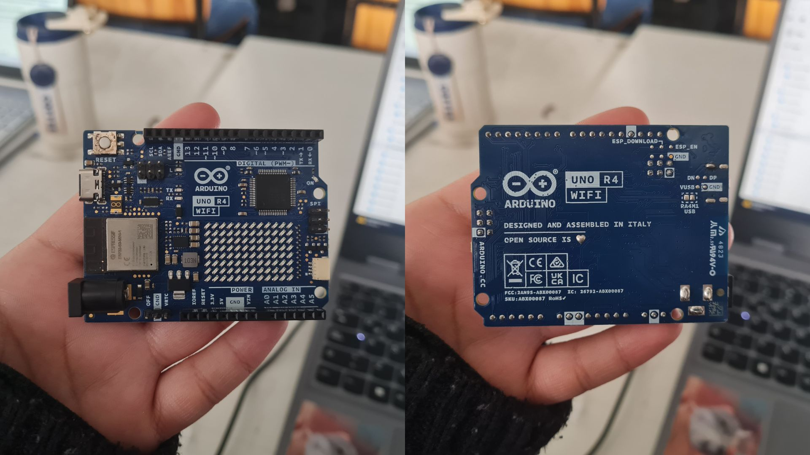
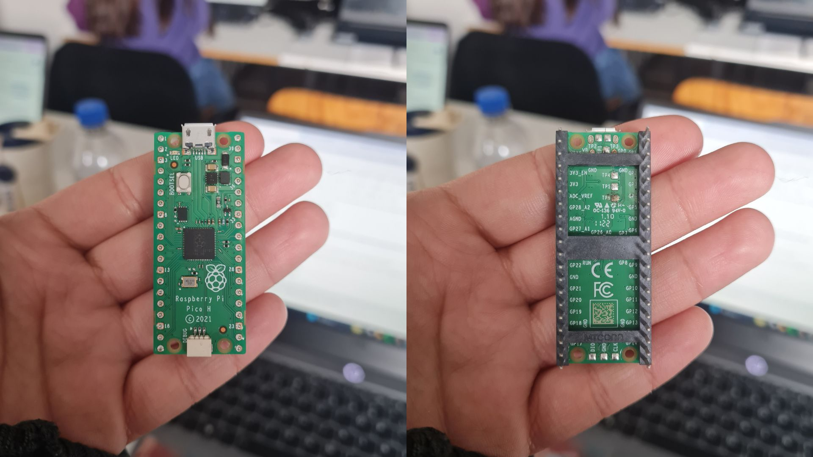

# sesion-01b

2026-08-14

## Computación

**Álgebra Booleana:** Es un sistema matemático que funciona a través de variables que sólo tiene 2 valores (0 = falso y 1 = verdadero), además usa operaciones básicas como la suma (+), la multiplicación (*) y la negación (x̄) que sirven para diseñar y simplificar circuitos digitales y códigos.

 - "+" = OR
 - "*" = AND
 - "x̄" = NOT

La computación se trata de que las cosas puedan variar, aunque también hay constantes. 

Los datos no caben en un computador, por lo que tienden a ser aproximaciones (ejemplo: cuando vemos el clima es el resultado de un promedio de diferentes temperaturas en distintos lugares).

If = Condicional

## Variables en C++

Está prohibido escribir una línea de código sin decir qué va a hacer (comentario).

**bool** = Almacena valores con dos estados: true / false.

**string** = Almacena texto, entre comillas. (Ejemplo: "Hola Mundo").

**double** = Incluye números con decimales. (Ejemplo: 10.99 / -10.99).

**int** = Números enteros, sin decimales. (Ejemplo: 120 / -120).

**char** = Contiene caracteres individuales, cada uno entre comillas simples. (Ejemplo: 'A' / 'B').

**void** = vacío, no expulsa como respuesta un valor. Sólo necesita ocurrir.

**setup** = configuración

**loop** = estructura de control que repite un bloque de código varias veces hasta que una condición deja de cumplirse.

## Programas a descargar

1. **ARDUINO IDE 2.3.10**:

Arduino UNO R4

Raspberry Pi Pico H

## encargos

encargo01b:

1. tratar de correr un código en el microcontrolador asignado a cada dupla, incluir referentes, citas, comentarios, imágenes, descripciones textuales, y en caso de éxito o fracaso incluir aciertos, preguntas, dramas, atados. recordatorio que estos apuntes son personales, cada persona sube su versión.
2. proponer una función con nombre, tipo, argumentos y uso, que modele algún área de su interés, por ejemplo subirCerro(enBicicleta), tomarMetro(conPaseEscolar), etc. escribir en pseudocódigo los pasos que necesita esa función internamente para que literalmente funcione.

## lectura
