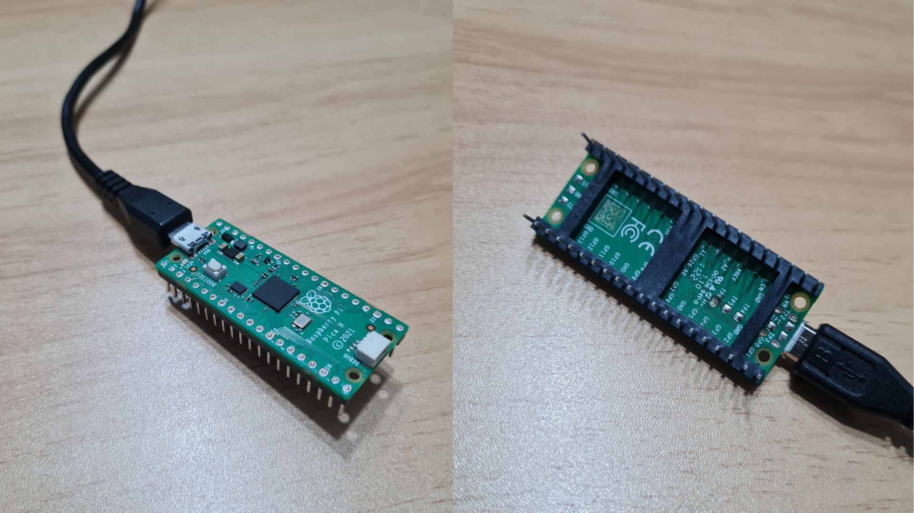
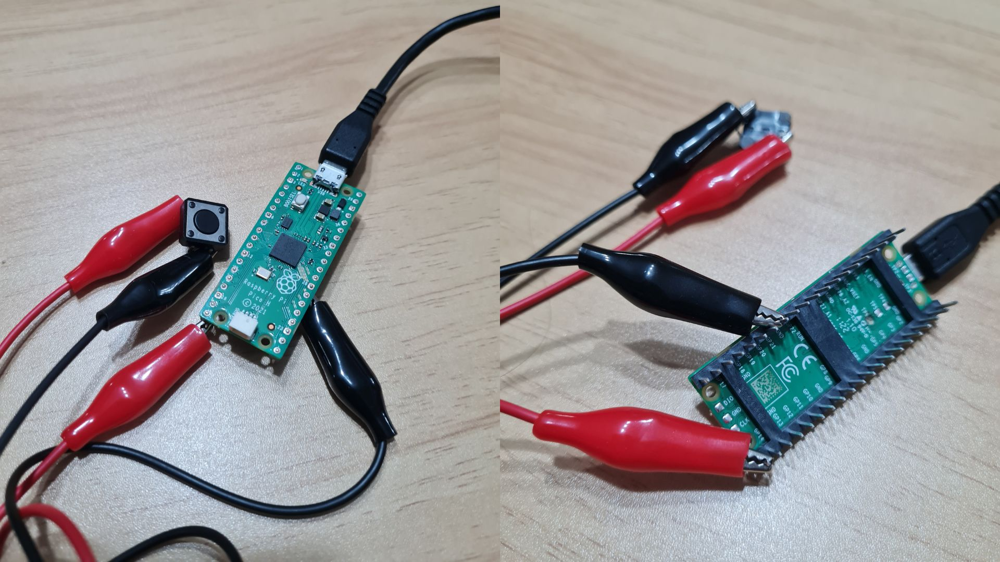

# sesion-01b

2026-08-14

## Computación

**Álgebra Booleana:** Es un sistema matemático que funciona a través de variables que sólo tiene 2 valores (0 = falso y 1 = verdadero), además usa operaciones básicas como la suma (+), la multiplicación (*) y la negación (x̄) que sirven para diseñar y simplificar circuitos digitales y códigos.

 - "+" = OR
 - "*" = AND
 - "x̄" = NOT

La computación se trata de que las cosas puedan variar, aunque también hay constantes. 

Los datos no caben en un computador, por lo que tienden a ser aproximaciones (ejemplo: cuando vemos el clima es el resultado de un promedio de diferentes temperaturas en distintos lugares).

If = Condicional

## Variables en C++

Está prohibido escribir una línea de código sin decir qué va a hacer (comentario).

**bool** = Almacena valores con dos estados: true / false.

**string** = Almacena texto, entre comillas. (Ejemplo: "Hola Mundo").

**double** = Incluye números con decimales. (Ejemplo: 10.99 / -10.99).

**int** = Números enteros, sin decimales. (Ejemplo: 120 / -120).

**char** = Contiene caracteres individuales, cada uno entre comillas simples. (Ejemplo: 'A' / 'B').

**void** = vacío, no expulsa como respuesta un valor. Sólo necesita ocurrir.

**setup** = configuración

**loop** = estructura de control que repite un bloque de código varias veces hasta que una condición deja de cumplirse.

## Placas a revisar

Arduino UNO R4


Raspberry Pi Pico H


## encargo01b - 1

Tratar de correr un código en el microcontrolador asignado a cada dupla, incluir referentes, citas, comentarios, imágenes, descripciones textuales, y en caso de éxito o fracaso incluir aciertos, preguntas, dramas, atados. recordatorio que estos apuntes son personales, cada persona sube su versión.

**Intento 1: ¿Cómo prender, de manera intermitente, el LED que tiene incluido la Raspberry Pi Pico H?**

Para este primer acercamiento quisimos irnos a lo más básico sin saber nada de programación, y al no encontrar mucho que nos ayudara en google (no es que no haya contenido, es que aún nos cuesta encontrar lo que estamos buscando) decidimos acudir a chatGPT, en el que el prompt fue el siguiente:

```
"holaaa, sabes qué puedo hacer con una placa raspberry pi pico h?"
```

A lo que nos respondió diversas opciones, como que la raspi puede controlar cosas como: 

 - **Luces LED:** hacer secuencias, iluminación ambiental.
  
 - **Botones y sensores:** que algo reaccione cuando alguien lo toca, acerca, mueve.

 - **Perillas y potenciómetros:** controlar intensidad, velocidad, volumen, posición.
   
 - **Sensores:** temperatura, luz, movimiento, distancia, humedad.
   
 - **Servomotores:** mover piezas, abrir/cerrar mecanismos, hacer pequeñas animaciones.
   
 - **Sonido:** generar tonos o controlar un pequeño buzzer.
   
 - **Pantallas pequeñas:** mostrar números, texto, gráficos simples.

Ya con esa información base preguntamos otra cosa:

```
y cómo la puedo programar con arduino?
```

SUBIR!!!



En base a esto nos explicó cómo instalar el core de [Arduino-Pico - GitHub](https://github.com/earlephilhower/arduino-pico/releases) de Earle Philhower (desarrollador de sofware estadounidens), el cual es el core de Arduino para los microcontroladores RP2040/RP2350, que son los chips que utilizan las Pico.

 - **Microcontroladores RP2040/RP2350:** Son microcontroladores de alto rendimiento creados por Raspberry Pi.

Gracias a esto es que podemos utilizar código como los que veremos en el ejemplo de más adelante:

```C++
pinMode(); = función que configura un pin.
digitalWrite(); = función que escribe o cambia lo que hace un pin.
delay(); = función que mantiene el LED apagado o encendido por cierto período de tiempo.
```

Y ya con esto avanzado, pudimos partir con lo que sería el primer intento.

Además considerar información sacada del [DataSheet - Raspberry Pi Pico H](https://pip-assets.raspberrypi.com/categories/610-raspberry-pi-pico/documents/RP-008307-DS-2-pico-datasheet.pdf) , en donde pudimos ver cómo funciona el componente y descubrimos que para hacer cualquier cambio en el código debemos reiniciar la placa, que es a través del botón **BOOTSEL**, y que sin este paso nos daba un error al intentar poner en marcha lo que habíamos cambiado.

``` C++

  // primera prueba con comando de inteligencia artificial
  // chatgpt para ser precisas

void setup() {

  // sobre como prender de manera intermitente el LED incorporado en la placa
  // LED_BUILTIN se refiere al LED incorporado en la placa
  // llamado GP25 en el datasheet
  // si tuviera mas de un LED deberia ser llamado LED 25
  // o sea
  // (LED_25, OUTPUT)

  // output es para saber que la señal
  // debe salir por ese LED


  // pinMode = configurar el modo de un pin
  // en este caso el LED GP25


pinMode(LED_BUILTIN, OUTPUT);

}

void loop() {

  // digitalWrite = poner el pin es un estado determinado
  // en este caso lo que queremos es que el LED este encendido
  // y luego apagado por cierta cantidad de tiempo


  // por ende
  // HIGH = encendido
  // LOW = apagado
  // y delay = determinada cantidad de tiempo en milisegundos


  // entonces elegimos 1000 milisegundos = 1 segundo
  // esto significa que se mantendra encendido por un segundo
  // y se apagara un segundo


digitalWrite(LED_BUILTIN, HIGH);
  delay(3000);

digitalWrite(LED_BUILTIN, LOW);
  delay(1000);

  //por que esta operacion se mantiene sucediendo
  // porque lo agrgamos en ´void loop´
  // lo que que la operacion se mantiene sucediendo
  // mientras el microcontroldor se encuentre funcionando

}

```

SUBIR!!


**Aprendizajes:**

- Antes de poner "upload" luego de cualquier cambio, debemos reiniciar la placa. Esto se logra desconectando la placa del computador (en nuestro caso), y luego debemos mantener presionado el botón "**BOOTSEL**" mientras la volvemos a conectar. Ya con eso podemos iniciar otra vez.

- Otra cosa importante es que antes de cambiar cualquier cosa debemos revisar el DataSheet de lo que vayamos a usar, porque esto nos permite tener cierta consideración y compresión de distintas cosas que se pueden o no hacer con la placa. También saber los nombres correctos para poder programarlas.

- Algo que pensamos que no se podía era poner números menor que 1000 en "delay();", en cuanto a eso, comprobamos que si se podía y que producía distintos ritmos en la velocidad en que se prendía el LED.

**Intento 2: ¿Cómo prender, a través de un botón, el LED que tiene incluido la Raspberry Pi Pico H?**

Para este segundo intento también recurrimos a la ayuda de chatGPT, más que nada para poder entender de mejor manera lo que estamos haciendo.

En este intento le preguntamos:

```
ya que pude prender el led, qué más puedo hacer?
```

Y fue aquí que nos dio diversas opciones como:

 1. Dominar el LED, o sea, cambiar los tiempos (que ya lo hicimos y fue muy bacán).

 2. Hacer un patrón, o sea, lograr distintos ritmos con respecto a qué tan rápido o lento se apagan y se vuelve a encender el LED.

 3. Agregar un botón, y que nos permita prender y apagar el LED por el tiempo que queramos (el caso de ahora).

 4. Agregar un potenciómetro para regular la intensidad del LED.

 5. Agregar un LDR para lograr que reaccione a la luz que haya alrededor.

En nuestro caso elegimos el 3 porque teníamos un botón y cables caimán para poder probarlo en casa.

SUBIR!!!



En este intento descubrimos otras funciones, variables y condicionales:

```C++
digitalRead(); = función para leer un pin de manera digital
estadoBoton = variable que guarda el estado del botón
if = condicional que indica: sí esto hace esto, haz esto otro.
else = condicional que indica: sino, haz esto.
```

Ya con esto pudimos utilizarlo en arduino y funcionó, no a la primera, pero funcionó. También en el proceso revisamos el DataSheet para identificar que los pin que íbamos a usar estaban bien para lo que estábamos haciendo.

Por esto elegimos el GP15, aunque también podríamos haber utilizado: GP0, GP1, GP2, GP3, GP4, GP5, GP6, GP7, GP8, GP9, GP10, GP11, GP12, GP13, GP14, GP15, GP16, GP17, GP18, GP19, GP20, GP21, GP22, GP26, GP27 y GP28. Pero elegimos el 15. más que nada, porque está en  una esquina y es más fácil de identificar.

En cuanto a GND, podemos usar el GP3, GP8, GP13, GP18, GP23, GP33 y GP38. Para este caso utilizamos el GP28.
 
```C++
 // segunda prueba con codigo de inteligencia artificial
 // chatgpt para ser mas precisas

 // en esta ocasion intentaremos que el LED se encienda gracias a un boton
 // y que al mantener el boton presionado el LED se mantenga encendido
 // y que cuando lo soltemos se apague

void setup() {

  // primero debemos selccionar que LED vamos a utilizar
  // en este caso es el mismo que el del ejemplo anterior (LED_BUILTIN)
  // ademas debemos definir que hace la señal con ese LED 
  // en este caso sale 
  // por eso es (OUTPUT)

  pinMode(LED_BUILTIN, OUTPUT);

  // luego debemos seleccionar que pin utilizaremos para que entre la señal (INPUT)
  // desde un boton
  // en este caso utilizaremos el GP15
  // y (PULLUP) es para generar que el boton 
  // al ser presionado
  // deje pasar esta señal y como resultado se prenda el LED

  pinMode(15, INPUT_PULLUP);

}

void loop() {

  // añadimos un int = numeros enteros, sin decimales
  // que se utiliza con (digitalRead = lee que es lo que le esta pasando al pin)

  int estadoBoton = digitalRead(15);

  // si el boton (estadoBoton) esta presionado (LOW)
  // si el boton no esta presionado es (HIGH)

  if (estadoBoton == LOW) {

    // vamos a encender el LED
    // que es lo mismo que utilizamos en el ejemplo anterior
    
    digitalWrite(LED_BUILTIN, HIGH);

  } 
  else {

    // si el boton no está presionado
    // se apaga el LED

    digitalWrite(LED_BUILTIN, LOW);

  }

}
```


**Aprendizajes:**

 - En este no tuvimos tantos errores, más que nada por el intento previo.

 - Que al usar el botón, cuando está presionado = LOW y que cuando no = HIGH. Aunque nosotras pensamos que era al revés.

 - Que existen condicionales que pueden cambiar toda una operación.

## encargo01b - 2

Proponer una función con nombre, tipo, argumentos y uso, que modele algún área de su interés, por ejemplo subirCerro(enBicicleta), tomarMetro(conPaseEscolar), etc. escribir en pseudocódigo los pasos que necesita esa función internamente para que literalmente funcione.

**Funcion: comprarTomarCafeTibio(conJunaeb)**

``` C++
 // primero ponemos los bool = almacena valores
 // con dos estados: true / false
 // luego int = numeros enteros sin decimales

 // en este caso 
 // lo que queremos es comprar cafe
 //  pero para hacerlo tenemos que tener en consideracion lo siguiente

 bool quedaJunaeb = true;
 bool tengoTiempo = true;
 bool tomeDesayuno = false;
 bool hayCapuccinoVainilla = true;
 bool cafeCaliente = true;
 int cuantosSomos = 2;

void setup() {

}

void loop() {

  // para comenzar tenemos que tener en consideracion lo primero
  // si es que tenemos como pagarlo, si tenemos tiempo para pasar por un y si tomamos desayuno
  // entonces si las 2 primeras son true y la otra es false
  // tenemos la condicion perfecta para poder pasar por un cafe
  // de lo contrario
  // si alguna de estas variables cambia 
  // no compramos cafe

 if (quedaJunaeb == true && tengoTiempo == true && tomeDesayuno == false) { 
  
comprarCafe();

  } else {

noComprarCafe();
 }

  // lo segundo y que a veces no consideramos es
  // si vamos solos o con alguien mas
  // en este caso consideramos la idea de ser las dos
  // si es asi tendriamos que comprar dos cafes
  // sino seria solo uno

 if  (cuantosSomos == 2){

  comprarDosCafes();

 } else {

  comprarSoloUno();
 }

  // otra cosa que consideramos importante es el sabor del cafe
  // y tener un backup si no esta nuestra primera opcion
  // por ende si no hay capuccino vainilla 
  // queremos mocaccino

 if (hayCapuccinoVainilla == true) {

  comprarCapuccinoVainilla();

 } else {

  comprarMocaccino();
 }

  // ya despues pasamos a algo que puede parecer basico
  // pero es importante para no quemarnos la lengua
  // y es que si el cafe esta caliente
  // hay que soplarlo o dejarlo estar un rato
  // sino rip papilas gustativas

  // ya si el cafe no esta caliente
  // nivel voy a morir
  // podemos tomarlo con calma

 if (cafeCaliente == true) {

  soplar();

 } else {

  tomarConCalma();
 }

  // en resumen

 if (quedaJunaeb == true && tengoTiempo == true && tomeDesayuno == false && hayCapuccinoVainilla = true && cafeTibio == true){
   caritaFeliz();
   }
```

## lectura
