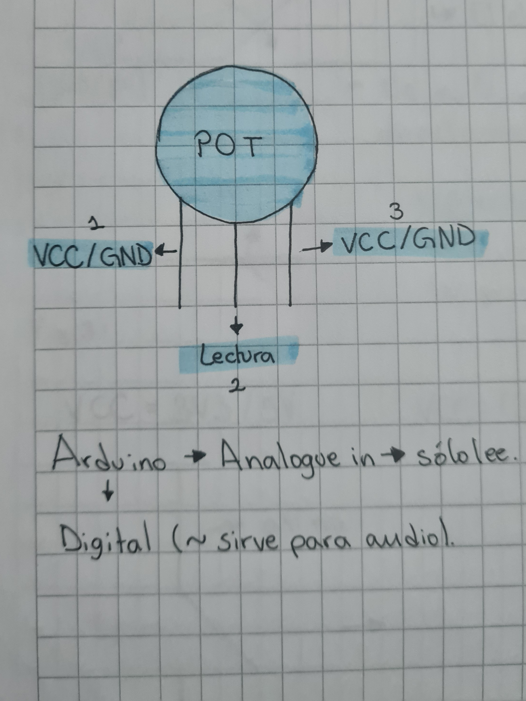
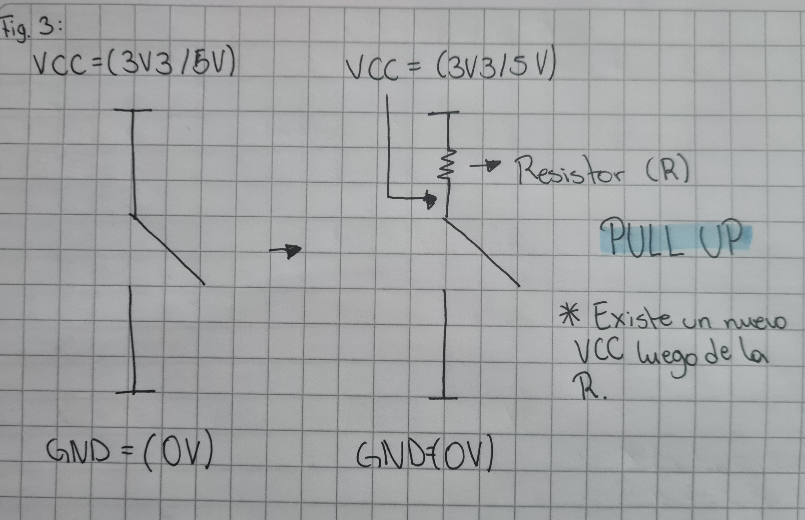
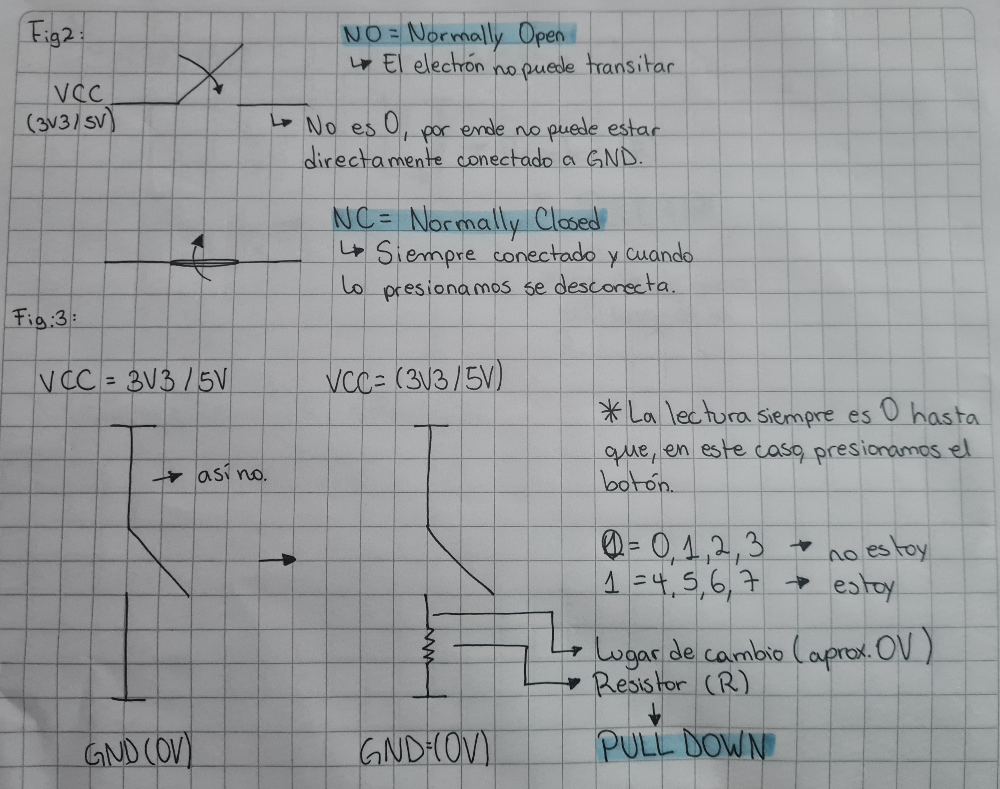
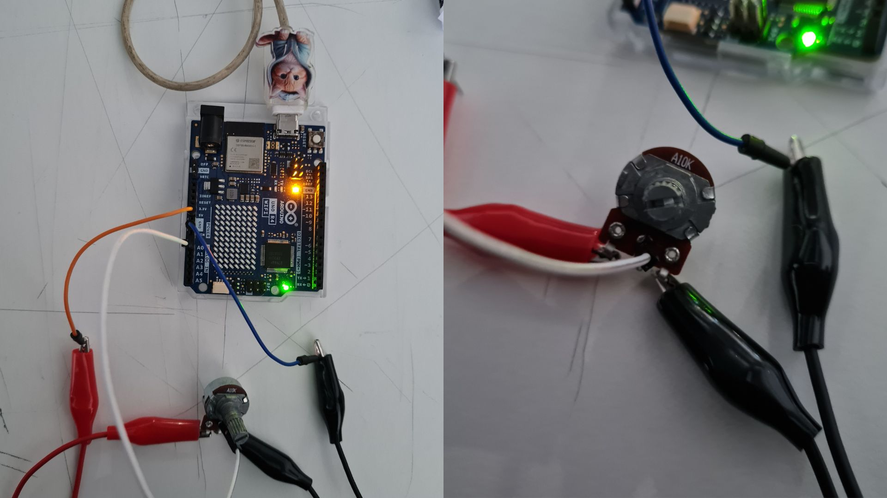
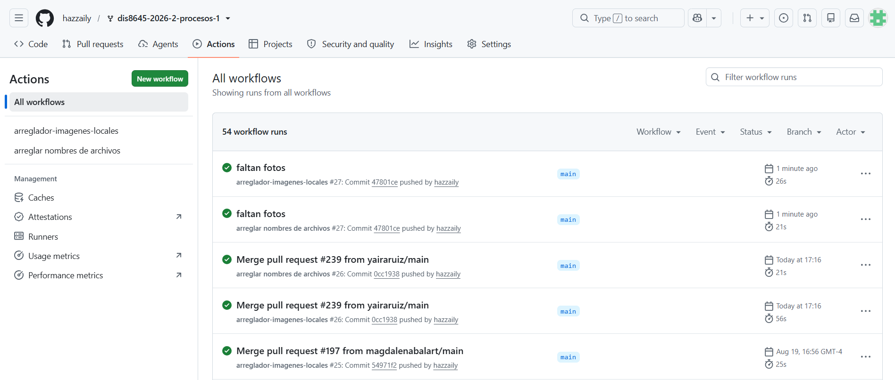

# sesion-02a

2026-08-18

## Potenciómetros

**Potenciómetro:** (POT, perillas, o resistencia variable). Regula potencias, o sea, que puede variar una propiedad eléctrica (resistencia) que controla el flujo de electrones (e.). Es una forma de encapsular 2 resistencias. Giran en torno a un rango (lineal)

Foto de mi croquera de diagrama de cómo funciona un potenciómetro.



Tipos de potenciómetro:

 - **A** = Audio
 - **B** = Lineal

Para que algo suene el doble de fuerte, debe sonar igual 10 veces (o sea, un aumento aproximado de 10 decibelios).

**Potencia** = energía/tiempo

En electricidad:

Potencia = Voltaje * corriente

Existen los encoders (codificadores, perillas de giro infinito), que **NO** son potenciómetros.

## Botones

**Botones:** (Pulsadores = Push Buttons, **NO** toggles) Pueden activar acciones, detenerlas; conectar piezas; enviar órdenes. Además, no guardan información.

Entonces, los botones los podemos configurar de distintas maneras, aquí veremos 2, con las cuales nos podemos asegurar de que el pin tenga siempre un estado definido cuando el botón no está siendo presionado.

 1. **PULL UP:** Sirve para mantener el pin en HIGH por defecto.

 - Botón sin presionar: HIGH
 - Botón presionado: LOW

Cuando presionamos el botón conectamos el pin a GND.

Foto de mi croquera del esquemático PULL UP.



 2. **PULL DOWN:** Sirve para mantener el pin en LOW por defecto.

 - Botón sin presionar: LOW
 - Botón presionado: HIGH

Cuando presionamos el botón conectamos el pin a voltaje positivo.

Foto de mi croquera del esquemático PULL DOWN.



Toggles = interruptor. ***NO** son botones.

## Intento 1: Arduino UNO r4 minima

Va desde el 0 al 1023.

```c++
  // se agrega const para bloquear la variable
  // y no la puedan cambiar

const int pinLectura = A0;

  // es un entero y hay que declararlo
  // le damos un valor para partir
  // este valor va a ser reemplazado constantemente
  // por la perila del potenciometro

int valorLectura = -1; 

void setup() {

  // puede estar vacio
  // serial es un objeto
  // por eso esta en mayuscula
  // y es uno a la vez en orden
  // no en paralelo

  // 9600 baud (simbolos) es un numero moderado
  // y no puede ser cualquiera
  // debe ser el resultado de un 2 elevado a algo

  Serial.begin(9600);

}

void loop() {

  // pinLectura es paramétrico
  // y en este caso es A0
  // aunque no siempre sera el caso

  valorLectura = analogRead(pinLectura);
Serial.println(valorLectura);

  // ahora podemos conectar el potenciometro
  // y ver como reacciona al mover la perilla
}
```

Importante presionar **Serial Monitor** para ver los cambios en los números que vemos en la pantalla.

Dependiendo de la velocidad en que movamos la perilla del potenciómetro, es qué tan rápido va a cambiar el número que vemos en la pantalla

Fotos Arduino uno r4 wifi conectado a potenciómetro con cables caimán.



Vídeo de los números cambiando según la perilla del potenciómetro.

https://github.com/user-attachments/assets/98588523-dcb8-4bb4-b6cd-a1bee3821ffd

(El vídeo se encuentra en la carpeta "imagenes" igualmente)

## Arduino

! = lo contrario de

printlm = imprime y luego sáltate una línea

while = mientras que

## encargos

 1. Hacer grupos de 3-4 personas.

  - Emilia Contreras [hazzaily](https://github.com/hazzaily)
  - Monserrat Paredes [Monserrat-Paredes](https://github.com/Monserrat-Paredes)
  - Katalina Riquelme [riyakatalinaa](https://github.com/riyakatalinaa)

 2. Ir a mi fork, en el apartado de "actions" y aceptar que corra "GitHub workflows" y subir pantallazo.

Foto del apartado "actions" de mi fork.



## lectura

Mi libro es: **grokking algorithms** de Aditya Y. Bhargava.

Actualmente voy en la página 9.

**Citas:**

 1. "Whatever number I´m thinking of you can guess in a maximum of seven guesses—because you eliminate so many numbers with every guess!" (pag. 6)

Elegí esta por qué la verdad nunca había comprendido muy bien qué era todo este tema de la **búsqueda binaria**, pero ahora puedo comprenderlo un poco mejor, y la verdad es que jamás se me ocurriría buscar así un número. Y si lo tuviera que explicar ahora con mis palabras, preobablemente diría algo como: es un algoritmo que permite buscar y encontrar elemento de forma mucho más rápida y eficiente.

 2. ""How many 10s do we multiply together to get 100?" The answer is 2: 10 x 10. So log10 = 2. Logs are the flip of exponentials" (pag. 7).

Quizás la razón de por qué elegí esta, para alguien, pueda ser muy absurda, pero para mí fue comprender los logaritmos, porque, de hecho, en el colegio nunca lo logré, por más que lo estudié y analicé no era lo mío. Pero ahora fue casi revelador que mi profesor nunca supo explicarlo de manera en que lo lograra entender, aún con todas las veces que se lo pregunté.

**Opiniones generales:**

Me encantó, porque de verdad que explica con peras y manzanas, además las ilustraciones me hacen feliz. Son lindas y además me explican lo que estoy intentando comprender, simplemente un 2x1.

Le tenía un poco de miedo al libro al principio, pero creo q ya me solté un poco, además es muy rápido de leer, aunque esté en inglés.

PD. Es mi primer libro en inglés.
