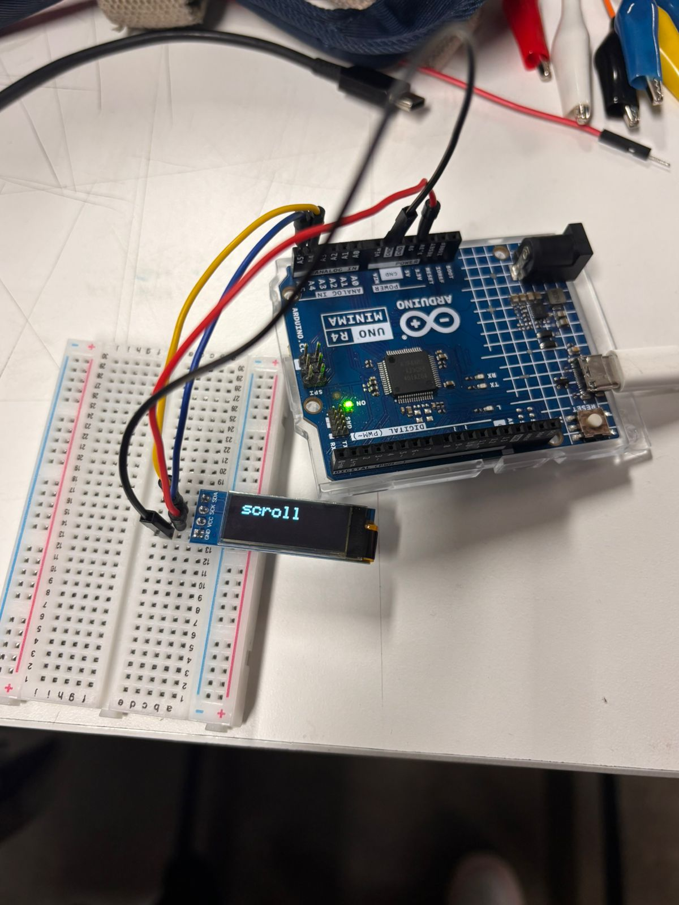

# sesion-03a

2026-08-25

## Componentes entregados

Protoboard.

Botones.

Lector de micro SD card.

Pantalla LCD Oled 0.91".

Controlador SSD1306.

**SCK/SCL** = Serial Clock.  Es el cable o pin que marca el ritmo y la sincronización. Envía pulsos constantes para que todos los dispositivos sepan exactamente en qué momento deben leer o escribir los datos.

**SDA** = Serial Data.  Es el cable o pin por donde viaja la información real (los ceros y unos) entre los dispositivos. Es bidireccional, lo que significa que los datos pueden ir y venir.

Cable Dupont - caimán.

## Arduino

Cuando el # está antes de una línea de código 

**#include** = toma este archivo y colócalo aquí

**#else** = insttrucción al preprocesador. **NO** es igual a "else".

Biblioteca a utilizar [Adafruit SSD1306](https://github.com/adafruit/adafruit_ssd1306) .

**Ejemplo "ssd1306_128x32_i2c":**

```cpp
/**************************************************************************
 This is an example for our Monochrome OLEDs based on SSD1306 drivers

 Pick one up today in the adafruit shop!
 ------> http://www.adafruit.com/category/63_98

 This example is for a 128x32 pixel display using I2C to communicate
 3 pins are required to interface (two I2C and one reset).

 Adafruit invests time and resources providing this open
 source code, please support Adafruit and open-source
 hardware by purchasing products from Adafruit!

 Written by Limor Fried/Ladyada for Adafruit Industries,
 with contributions from the open source community.
 BSD license, check license.txt for more information
 All text above, and the splash screen below must be
 included in any redistribution.
 **************************************************************************/

#include <SPI.h>
#include <Wire.h>
#include <Adafruit_GFX.h>
#include <Adafruit_SSD1306.h>

#define SCREEN_WIDTH 128 // OLED display width, in pixels
#define SCREEN_HEIGHT 32 // OLED display height, in pixels

// Declaration for an SSD1306 display connected to I2C (SDA, SCL pins)
// The pins for I2C are defined by the Wire-library. 
// On an arduino UNO:       A4(SDA), A5(SCL)
// On an arduino MEGA 2560: 20(SDA), 21(SCL)
// On an arduino LEONARDO:   2(SDA),  3(SCL), ...
#define OLED_RESET     -1 // Reset pin # (or -1 if sharing Arduino reset pin)
#define SCREEN_ADDRESS 0x3C ///< See datasheet for Address; 0x3D for 128x64, 0x3C for 128x32
Adafruit_SSD1306 display(SCREEN_WIDTH, SCREEN_HEIGHT, &Wire, OLED_RESET);

#define NUMFLAKES     10 // Number of snowflakes in the animation example

#define LOGO_HEIGHT   16
#define LOGO_WIDTH    16
static const unsigned char PROGMEM logo_bmp[] =
{ 0b00000000, 0b11000000,
  0b00000001, 0b11000000,
  0b00000001, 0b11000000,
  0b00000011, 0b11100000,
  0b11110011, 0b11100000,
  0b11111110, 0b11111000,
  0b01111110, 0b11111111,
  0b00110011, 0b10011111,
  0b00011111, 0b11111100,
  0b00001101, 0b01110000,
  0b00011011, 0b10100000,
  0b00111111, 0b11100000,
  0b00111111, 0b11110000,
  0b01111100, 0b11110000,
  0b01110000, 0b01110000,
  0b00000000, 0b00110000 };

void setup() {
  Serial.begin(9600);

  // Wait for display
  delay(500);

  // SSD1306_SWITCHCAPVCC = generate display voltage from 3.3V internally
  if(!display.begin(SSD1306_SWITCHCAPVCC, SCREEN_ADDRESS)) {
    Serial.println(F("SSD1306 allocation failed"));
    for(;;); // Don't proceed, loop forever
  }

  // Show initial display buffer contents on the screen --
  // the library initializes this with an Adafruit splash screen.
  display.display();
  delay(2000); // Pause for 2 seconds

  // Clear the buffer
  display.clearDisplay();

  // Draw a single pixel in white
  display.drawPixel(10, 10, SSD1306_WHITE);

  // Show the display buffer on the screen. You MUST call display() after
  // drawing commands to make them visible on screen!
  display.display();
  delay(2000);
  // display.display() is NOT necessary after every single drawing command,
  // unless that's what you want...rather, you can batch up a bunch of
  // drawing operations and then update the screen all at once by calling
  // display.display(). These examples demonstrate both approaches...

  testdrawline();      // Draw many lines

  testdrawrect();      // Draw rectangles (outlines)

  testfillrect();      // Draw rectangles (filled)

  testdrawcircle();    // Draw circles (outlines)

  testfillcircle();    // Draw circles (filled)

  testdrawroundrect(); // Draw rounded rectangles (outlines)

  testfillroundrect(); // Draw rounded rectangles (filled)

  testdrawtriangle();  // Draw triangles (outlines)

  testfilltriangle();  // Draw triangles (filled)

  testdrawchar();      // Draw characters of the default font

  testdrawstyles();    // Draw 'stylized' characters

  testscrolltext();    // Draw scrolling text

  testdrawbitmap();    // Draw a small bitmap image

  // Invert and restore display, pausing in-between
  display.invertDisplay(true);
  delay(1000);
  display.invertDisplay(false);
  delay(1000);

  testanimate(logo_bmp, LOGO_WIDTH, LOGO_HEIGHT); // Animate bitmaps
}

void loop() {
}

void testdrawline() {
  int16_t i;

  display.clearDisplay(); // Clear display buffer

  for(i=0; i<display.width(); i+=4) {
    display.drawLine(0, 0, i, display.height()-1, SSD1306_WHITE);
    display.display(); // Update screen with each newly-drawn line
    delay(1);
  }
  for(i=0; i<display.height(); i+=4) {
    display.drawLine(0, 0, display.width()-1, i, SSD1306_WHITE);
    display.display();
    delay(1);
  }
  delay(250);

  display.clearDisplay();

  for(i=0; i<display.width(); i+=4) {
    display.drawLine(0, display.height()-1, i, 0, SSD1306_WHITE);
    display.display();
    delay(1);
  }
  for(i=display.height()-1; i>=0; i-=4) {
    display.drawLine(0, display.height()-1, display.width()-1, i, SSD1306_WHITE);
    display.display();
    delay(1);
  }
  delay(250);

  display.clearDisplay();

  for(i=display.width()-1; i>=0; i-=4) {
    display.drawLine(display.width()-1, display.height()-1, i, 0, SSD1306_WHITE);
    display.display();
    delay(1);
  }
  for(i=display.height()-1; i>=0; i-=4) {
    display.drawLine(display.width()-1, display.height()-1, 0, i, SSD1306_WHITE);
    display.display();
    delay(1);
  }
  delay(250);

  display.clearDisplay();

  for(i=0; i<display.height(); i+=4) {
    display.drawLine(display.width()-1, 0, 0, i, SSD1306_WHITE);
    display.display();
    delay(1);
  }
  for(i=0; i<display.width(); i+=4) {
    display.drawLine(display.width()-1, 0, i, display.height()-1, SSD1306_WHITE);
    display.display();
    delay(1);
  }

  delay(2000); // Pause for 2 seconds
}

void testdrawrect(void) {
  display.clearDisplay();

  for(int16_t i=0; i<display.height()/2; i+=2) {
    display.drawRect(i, i, display.width()-2*i, display.height()-2*i, SSD1306_WHITE);
    display.display(); // Update screen with each newly-drawn rectangle
    delay(1);
  }

  delay(2000);
}

void testfillrect(void) {
  display.clearDisplay();

  for(int16_t i=0; i<display.height()/2; i+=3) {
    // The INVERSE color is used so rectangles alternate white/black
    display.fillRect(i, i, display.width()-i*2, display.height()-i*2, SSD1306_INVERSE);
    display.display(); // Update screen with each newly-drawn rectangle
    delay(1);
  }

  delay(2000);
}

void testdrawcircle(void) {
  display.clearDisplay();

  for(int16_t i=0; i<max(display.width(),display.height())/2; i+=2) {
    display.drawCircle(display.width()/2, display.height()/2, i, SSD1306_WHITE);
    display.display();
    delay(1);
  }

  delay(2000);
}

void testfillcircle(void) {
  display.clearDisplay();

  for(int16_t i=max(display.width(),display.height())/2; i>0; i-=3) {
    // The INVERSE color is used so circles alternate white/black
    display.fillCircle(display.width() / 2, display.height() / 2, i, SSD1306_INVERSE);
    display.display(); // Update screen with each newly-drawn circle
    delay(1);
  }

  delay(2000);
}

void testdrawroundrect(void) {
  display.clearDisplay();

  for(int16_t i=0; i<display.height()/2-2; i+=2) {
    display.drawRoundRect(i, i, display.width()-2*i, display.height()-2*i,
      display.height()/4, SSD1306_WHITE);
    display.display();
    delay(1);
  }

  delay(2000);
}

void testfillroundrect(void) {
  display.clearDisplay();

  for(int16_t i=0; i<display.height()/2-2; i+=2) {
    // The INVERSE color is used so round-rects alternate white/black
    display.fillRoundRect(i, i, display.width()-2*i, display.height()-2*i,
      display.height()/4, SSD1306_INVERSE);
    display.display();
    delay(1);
  }

  delay(2000);
}

void testdrawtriangle(void) {
  display.clearDisplay();

  for(int16_t i=0; i<max(display.width(),display.height())/2; i+=5) {
    display.drawTriangle(
      display.width()/2  , display.height()/2-i,
      display.width()/2-i, display.height()/2+i,
      display.width()/2+i, display.height()/2+i, SSD1306_WHITE);
    display.display();
    delay(1);
  }

  delay(2000);
}

void testfilltriangle(void) {
  display.clearDisplay();

  for(int16_t i=max(display.width(),display.height())/2; i>0; i-=5) {
    // The INVERSE color is used so triangles alternate white/black
    display.fillTriangle(
      display.width()/2  , display.height()/2-i,
      display.width()/2-i, display.height()/2+i,
      display.width()/2+i, display.height()/2+i, SSD1306_INVERSE);
    display.display();
    delay(1);
  }

  delay(2000);
}

void testdrawchar(void) {
  display.clearDisplay();

  display.setTextSize(1);      // Normal 1:1 pixel scale
  display.setTextColor(SSD1306_WHITE); // Draw white text
  display.setCursor(0, 0);     // Start at top-left corner
  display.cp437(true);         // Use full 256 char 'Code Page 437' font

  // Not all the characters will fit on the display. This is normal.
  // Library will draw what it can and the rest will be clipped.
  for(int16_t i=0; i<256; i++) {
    if(i == '\n') display.write(' ');
    else          display.write(i);
  }

  display.display();
  delay(2000);
}

void testdrawstyles(void) {
  display.clearDisplay();

  display.setTextSize(1);             // Normal 1:1 pixel scale
  display.setTextColor(SSD1306_WHITE);        // Draw white text
  display.setCursor(0,0);             // Start at top-left corner
  display.println(F("Hello, world!"));

  display.setTextColor(SSD1306_BLACK, SSD1306_WHITE); // Draw 'inverse' text
  display.println(3.141592);

  display.setTextSize(2);             // Draw 2X-scale text
  display.setTextColor(SSD1306_WHITE);
  display.print(F("0x")); display.println(0xDEADBEEF, HEX);

  display.display();
  delay(2000);
}

void testscrolltext(void) {
  display.clearDisplay();

  display.setTextSize(2); // Draw 2X-scale text
  display.setTextColor(SSD1306_WHITE);
  display.setCursor(10, 0);
  display.println(F("scroll"));
  display.display();      // Show initial text
  delay(100);

  // Scroll in various directions, pausing in-between:
  display.startscrollright(0x00, 0x0F);
  delay(2000);
  display.stopscroll();
  delay(1000);
  display.startscrollleft(0x00, 0x0F);
  delay(2000);
  display.stopscroll();
  delay(1000);
  display.startscrolldiagright(0x00, 0x07);
  delay(2000);
  display.startscrolldiagleft(0x00, 0x07);
  delay(2000);
  display.stopscroll();
  delay(1000);
}

void testdrawbitmap(void) {
  display.clearDisplay();

  display.drawBitmap(
    (display.width()  - LOGO_WIDTH ) / 2,
    (display.height() - LOGO_HEIGHT) / 2,
    logo_bmp, LOGO_WIDTH, LOGO_HEIGHT, 1);
  display.display();
  delay(1000);
}

#define XPOS   0 // Indexes into the 'icons' array in function below
#define YPOS   1
#define DELTAY 2

void testanimate(const uint8_t *bitmap, uint8_t w, uint8_t h) {
  int8_t f, icons[NUMFLAKES][3];

  // Initialize 'snowflake' positions
  for(f=0; f< NUMFLAKES; f++) {
    icons[f][XPOS]   = random(1 - LOGO_WIDTH, display.width());
    icons[f][YPOS]   = -LOGO_HEIGHT;
    icons[f][DELTAY] = random(1, 6);
    Serial.print(F("x: "));
    Serial.print(icons[f][XPOS], DEC);
    Serial.print(F(" y: "));
    Serial.print(icons[f][YPOS], DEC);
    Serial.print(F(" dy: "));
    Serial.println(icons[f][DELTAY], DEC);
  }

  for(;;) { // Loop forever...
    display.clearDisplay(); // Clear the display buffer

    // Draw each snowflake:
    for(f=0; f< NUMFLAKES; f++) {
      display.drawBitmap(icons[f][XPOS], icons[f][YPOS], bitmap, w, h, SSD1306_WHITE);
    }

    display.display(); // Show the display buffer on the screen
    delay(200);        // Pause for 1/10 second

    // Then update coordinates of each flake...
    for(f=0; f< NUMFLAKES; f++) {
      icons[f][YPOS] += icons[f][DELTAY];
      // If snowflake is off the bottom of the screen...
      if (icons[f][YPOS] >= display.height()) {
        // Reinitialize to a random position, just off the top
        icons[f][XPOS]   = random(1 - LOGO_WIDTH, display.width());
        icons[f][YPOS]   = -LOGO_HEIGHT;
        icons[f][DELTAY] = random(1, 6);
      }
    }
  }
}
```

**Ejemplo modificado en clases:**

```cpp

#include <SPI.h>
#include <Wire.h>
#include <Adafruit_GFX.h>
#include <Adafruit_SSD1306.h>

#define SCREEN_WIDTH 128 // OLED display width, in pixels
#define SCREEN_HEIGHT 32 // OLED display height, in pixels

#define OLED_RESET     -1 // Reset pin # (or -1 if sharing Arduino reset pin)
#define SCREEN_ADDRESS 0x3C ///< See datasheet for Address; 0x3D for 128x64, 0x3C for 128x32
Adafruit_SSD1306 display(SCREEN_WIDTH, SCREEN_HEIGHT, &Wire, OLED_RESET);

#define NUMFLAKES     10 // Number of snowflakes in the animation example

#define LOGO_HEIGHT   16
#define LOGO_WIDTH    16

void setup() {
  Serial.begin(9600);

  // Wait for display
  delay(500);

  // SSD1306_SWITCHCAPVCC = generate display voltage from 3.3V internally
  if(!display.begin(SSD1306_SWITCHCAPVCC, SCREEN_ADDRESS)) {
    Serial.println(F("SSD1306 allocation failed"));
    for(;;); // Don't proceed, loop forever
  }

  // Show initial display buffer contents on the screen --
  // the library initializes this with an Adafruit splash screen.
  display.display();
  delay(2000); // Pause for 2 seconds

  // Clear the buffer
  display.clearDisplay();

  // Draw a single pixel in white
  display.drawPixel(10, 10, SSD1306_WHITE);

  // Show the display buffer on the screen. You MUST call display() after
  // drawing commands to make them visible on screen!
  display.display();
  delay(2000);
  // display.display() is NOT necessary after every single drawing command,
  // unless that's what you want...rather, you can batch up a bunch of
  // drawing operations and then update the screen all at once by calling
  // display.display(). These examples demonstrate both approaches...

  testdrawchar();      // Draw characters of the default font

  testdrawstyles();    // Draw 'stylized' characters

  testscrolltext();    // Draw scrolling text
  // Invert and restore display, pausing in-between
  display.invertDisplay(true);
  delay(1000);
  display.invertDisplay(false);
  delay(1000);

  
}

void loop() {
}

void testdrawchar(void) {
  display.clearDisplay();

  display.setTextSize(1);      // Normal 1:1 pixel scale
  display.setTextColor(SSD1306_WHITE); // Draw white text
  display.setCursor(0, 0);     // Start at top-left corner
  display.cp437(true);         // Use full 256 char 'Code Page 437' font

  // Not all the characters will fit on the display. This is normal.
  // Library will draw what it can and the rest will be clipped.
  for(int16_t i=0; i<256; i++) {
    if(i == '\n') display.write(' ');
    else          display.write(i);
  }

  display.display();
  delay(2000);
}

void testdrawstyles(void) {
  display.clearDisplay();

  display.setTextSize(1);             // Normal 1:1 pixel scale
  display.setTextColor(SSD1306_WHITE);        // Draw white text
  display.setCursor(0,0);             // Start at top-left corner
  display.println(F("Hello, world!"));

  display.setTextColor(SSD1306_BLACK, SSD1306_WHITE); // Draw 'inverse' text
  display.println(3.141592);

  display.setTextSize(2);             // Draw 2X-scale text
  display.setTextColor(SSD1306_WHITE);
  display.print(F("0x")); display.println(0xDEADBEEF, HEX);

  display.display();
  delay(2000);
}

void testscrolltext(void) {
  display.clearDisplay();

  display.setTextSize(2); // Draw 2X-scale text
  display.setTextColor(SSD1306_WHITE);
  display.setCursor(10, 0);
  display.println(F("scroll"));
  display.display();      // Show initial text
  delay(100);

  // Scroll in various directions, pausing in-between:
  display.startscrollright(0x00, 0x0F);
  delay(2000);
  display.stopscroll();
  delay(1000);
  display.startscrollleft(0x00, 0x0F);
  delay(2000);
  display.stopscroll();
  delay(1000);
  display.startscrolldiagright(0x00, 0x07);
  delay(2000);
  display.startscrolldiagleft(0x00, 0x07);
  delay(2000);
  display.stopscroll();
  delay(1000);
}

#define XPOS   0 // Indexes into the 'icons' array in function below
#define YPOS   1
#define DELTAY 2

void testanimate(const uint8_t *bitmap, uint8_t w, uint8_t h) {
  int8_t f, icons[NUMFLAKES][3];

  // Initialize 'snowflake' positions
  for(f=0; f< NUMFLAKES; f++) {
    icons[f][XPOS]   = random(1 - LOGO_WIDTH, display.width());
    icons[f][YPOS]   = -LOGO_HEIGHT;
    icons[f][DELTAY] = random(1, 6);
    Serial.print(F("x: "));
    Serial.print(icons[f][XPOS], DEC);
    Serial.print(F(" y: "));
    Serial.print(icons[f][YPOS], DEC);
    Serial.print(F(" dy: "));
    Serial.println(icons[f][DELTAY], DEC);
  }

  for(;;) { // Loop forever...
    display.clearDisplay(); // Clear the display buffer

    // Draw each snowflake:
    for(f=0; f< NUMFLAKES; f++) {
      display.drawBitmap(icons[f][XPOS], icons[f][YPOS], bitmap, w, h, SSD1306_WHITE);
    }

    display.display(); // Show the display buffer on the screen
    delay(200);        // Pause for 1/10 second

    // Then update coordinates of each flake...
    for(f=0; f< NUMFLAKES; f++) {
      icons[f][YPOS] += icons[f][DELTAY];
      // If snowflake is off the bottom of the screen...
      if (icons[f][YPOS] >= display.height()) {
        // Reinitialize to a random position, just off the top
        icons[f][XPOS]   = random(1 - LOGO_WIDTH, display.width());
        icons[f][YPOS]   = -LOGO_HEIGHT;
        icons[f][DELTAY] = random(1, 6);
      }
    }
  }
}
```

Foto conexión pantalla a arduino y protoboard.



Vídeo de la pantalla reproduciendo el logo de Adafruit.

https://github.com/user-attachments/assets/bdade637-9b13-41d3-a694-330f560cbcaa

(El vídeo también se encuentra cargado en la carpeta "imagenes").

## encargos

 1. Elegir un/a poeta.

En nuestro caso elegimos a [Alfonsina Storni](https://es.wikipedia.org/wiki/Alfonsina_Storni), quien fue una poetisa y escritora argentina vinculada al [modernismo](https://es.wikipedia.org/wiki/Modernismo_(literatura_en_espa%C3%B1ol)), el cual fue un movimiento literario que nació en Hispanoamérica a finales del siglo XIX (entre 1880 y 1920) y se caracterizó por una ambigua rebeldía creativa, un refinamiento narcisista y aristocrático, el culturalismo literario y una profunda renovación estética del lenguaje y la métrica.

 2. Elegir dos poemas que nos parecieran interesantes.

Poema 1: **¿Qué diría?** (1919)

¿Qué diría la gente, recortada y vacía,
Si en un día fortuito, por ultrafantasía,
Me tiñera el cabello de plateado y violeta,
Usara peplo griego, cambiara la peineta
Por cintillo de flores: miosotis o jazmines,
Cantara por las calles al compás de violines,
O dijera mis versos recorriendo las plazas,
Libertado mi gusto de vulgares mordazas?
¿Irían a mirarme cubriendo las aceras?
¿Me quemarían como quemaron hechiceras?
¿Campanas tocarían para llamar a misa?
En verdad que pensarlo me da un poco de risa.

Interpretación personal:

Bajo mi percepción nos habla de una mujer que cuestiona los estándares de la sociedad, una sociedad en dónde las mujeres eran criticadas por hacer cosas que estaban fuera de lo normado, llamando estos comportamientos como: "vulgares", "grotescos" y volviendo a quienes los cometían como el blanco de miramientos y comentarios despectivos. 

Es por eso que me parece tan interesante, es un poema de 1919. Y su visión sobre todo lo que le gustaría hacer, o que podría sin el yugo constante de la sociedad que la rodeaba.

Poema 2: **Queja** (1918)

Señor, mi queja es ésta,
Tú me comprenderás;
De amor me estoy muriendo,
Pero no puedo amar.

Persigo lo perfecto
En mí y en los demás,
Persigo lo perfecto
Para poder amar.

Me consumo en mi fuego,
¡Señor, piedad, piedad!
De amor me estoy muriendo,
¡Pero no puedo amar!

Interpretación personal:

Me parece muy interesante pensar en cómo la escritora nos abre su corazón con este poema, y nos deja ver lo mucho que le duele y le afecta el hecho de estar en una relación, al parecer, poco y casi nada recíproca. En donde no le dan lo mismo devuelta y cómo eso le quema por dentro. Llegando al punto de pedir misericordia por su corazón.

Y es una situación que a muchos nos habrá pasado en alguna ocasión, entonces más que nada puedo comprender ese sentimiento y entender el porqué de sus palabras.

Poemas rescatados de [cultura.gob.ar](https://www.cultura.gob.ar/9-poemas-imprescindibles-de-alfonsina-storni-8463/)

 3. Describir qué queremos que pase:

 - cambio de dirección 2: de derecha a izquierdaLo que queremos es que lo que se proyecte en la pantalla represente el poema, por ende, puede ser que solo se proyecten ciertas palabras y no todo el texto.

 - Que la velocidad del texto cambie según la perilla del potenciómetro.
 
 - A través de un botón, tener la posibilidad de detenerlo y/o cambiar la dirección del poema.
  
 - Que a ciertas palabras del poema se les pueda bajar o subir la opacidad con el potenciómetro.
  
 - perfeccionismo = control = pausar/reanudar (botón)

cambio = velocidad de reproducción (potenciómetro)
cambio = dirección del texto (botón)

dirección inicial del texto: arriba hacia abajo
cambio de dirección 1: de izquierda a derecha


## lectura

Citas:

 1. "Big O notation is special notation that tells you how fast an algorithm is". (pág. 10).

Elegí esta porque no sabía  que era la "Big O notation", y ahora, además de entenderlo en base al libro, lo busqué para poder comprenderlo de mejor manera. Según [Wikipedia](https://en.wikipedia.org/wiki/Big_O_notation) es: " una notación matemática que describe el tamaño aproximado de una función en un dominio".

También lo podemos entender como una forma de medir cómo funciona el trabajo que necesita un programa cuando aumenta la cantidad de datos, por ejemplo pasar de 128 números a 256.

 2. "You have a salesperson". (pág. 17).

El motivo de este es netamente porque me encanto el personaje. Adjunto foto abajo.

Foto del personaje "salesperson" en cuestión.


Actualmente voy en la página 19.

PD: El libro sigue en inglés.
