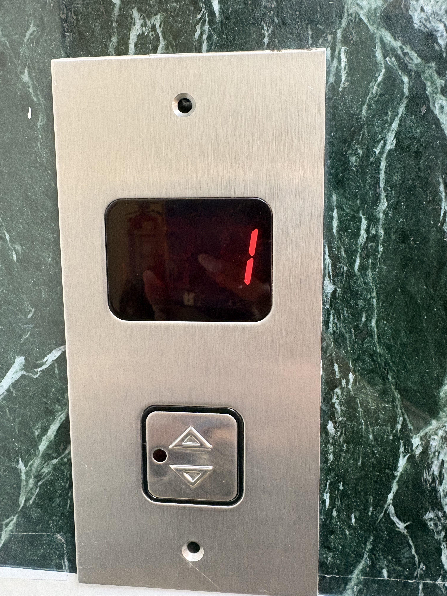
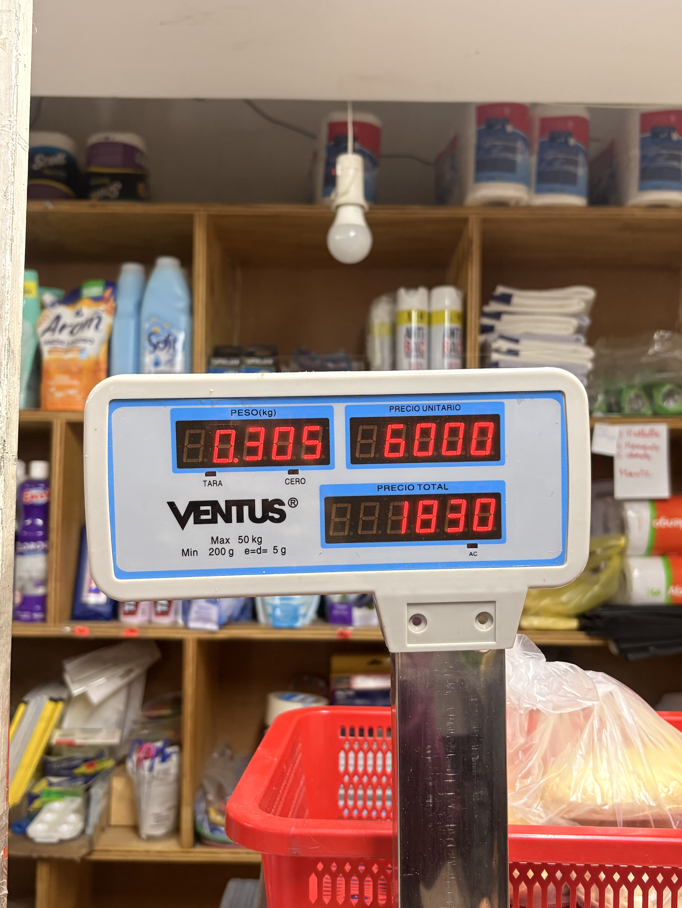

# sesion-01a

## apuntes sesión
Para subir un imagen en el archivo es: 

. significa aquí

Sin texto: 

Git: 

A. Martes
B. Viernes

Apuntes a subir:

Para subir un imagen en el archivo es: 
. significa aquí

Subir imagen: 

Siempre trabajar en mi usuario de gitHub 

Primero comprender los datos generales (en este caso ascensor)
Definir que hace a un ascensor lo que es, que cosas no le puedo eliminar o dejaría de ser un ascensor.

DATOS
* puertas (1 panel, 1 par de paneles o dos par de paneles)
* botones 
    * números enteros positivos y negativos
    * abrir puertas
    * cerrar puertas
    * emergencia
* eje (z) 
* contrapeso
* carril
* espejos (opcional)
* pantallas
* cantidad de pisos
* electricidad
  
#Variables

Establecemos datos que se manejan en variables para las computadoras.

Ejemplo:

Existen datos como la edad-estatura (estos son datos), luego tenemos las variables que serían 22-1.57 (estas son las variables).

Variables se denominan así por que tal como se dicen pueden cambiar “variar” ya que si ahora tengo 21 luego tendré 22.

Entonces el nombre de la variable sigue siendo edad, pero el valor cambió.

¿Cómo entender el código?

string nombre = "Isidora";

Estoy indicando que guarde el nombre Isidora en una variable llamada nombre.

¿Por qué aparecen las variables?

Es para indicar a la computadora qué clase de información se está guardando.

Ya que son diferentes tipos de datos, el lenguaje C++ les coloca “etiquetas”.

int: Número entero

string: texto

bool: Verdadero / falso

void = la función hace algo, pero no devuelve un valor.

Entonces este lenguaje nos permite definir al computador las variables y guardar los datos.

Función

Una función se cataloga como una instrucción para hacer algo.

Ejemplo:

Yo tengo datos (edad-estatura), pero también realizamos acciones (leer-dormir).

Entonces, ¿en qué se diferencian?

Sencillo:

variable = dato

función = acción

void dormir() {}

Esto representa la acción de dormir.

Las funciones nos ayudan a usar o modificar una acción.

Ejemplo:

Tengo 21 años, void cumpleaños, entonces ahora tengo 22 años.

O sea:

Antes: edad = 21

Acción: cumpleaños()

Después: edad = 22

Eso es programación. Tienes un estado → ocurre una acción → cambia el estado.

Pero lo importante, ¿qué es C++?

C++ es una manera de escribir esas ideas para que el computador las entienda.

Ejemplo:

Mi edad es 21.

C++ lo escribe:

int edad = 21; - Es exactamente la misma idea, solo cambia el idioma.

Entonces:

- un sistema tiene un ESTADO
  
- ese estado se describe con DATOS
  
- los datos se guardan en VARIABLES
  
- el sistema puede realizar ACCIONES
  
- las acciones se escriben como FUNCIONES
  
- las FUNCIONES pueden cambiar las VARIABLES
  
- el sistema cambia de estado

## encargos

Autoretrato 

// Variables

string nombre = "Isidora";

string apellido = "Diaz";

int edad = 22;

float altura = 1.57;

string rut = "21472104-K";

string nacionalidad = "Chilena";

string apodo = "Isi";

string colorFavorito = "Rosa";

string serieFavorita = "Friends";

string comidaFavorita = "Comida china";

char inicial = 'I';

string universidad = "UDP";

string carrera = "Diseño";

string musicaFavorita = "Pop";

string estacionFavorita = "Verano";

string hobbyFavorito = "Leer";

string animalFavorito = "Perrito";

bool peloCastano = true;

bool ojosCafe = true;

bool trabaja = true;

bool fanDisney = true;

bool leGustaViajar = true;

bool leGustaLeer = true;

bool haceEjercicio = false;

bool usaLentes = true;

// Funciones

void trabajar() {
}

void verSeries() {
}

void dormir() {
}

void leer() {
}

void estudiar() {
}

void escucharMusica() {
}

void cocinar() {
}

void disenar() {
}

Ascensor

Contexto: Pantalla ubicada en el panel exterior de un ascensor, junto a los botones para llamar la cabina.

Lugar: Edificio 25, calle Nueva York.

Ubicación: La pantalla se encuentra sobre los botones de llamada del ascensor, integrada en el panel metálico exterior.

Uso: Indica el piso en el que se encuentra el ascensor, permitiendo saber su posición antes de que llegue.

Alfabeto posible: Principalmente números del 0 al 9. 

En la foto: Se muestra el número 1 mediante segmentos iluminados en rojo.

Micro

Contexto: Pantalla ubicada en la parte frontal de una micro del sistema RED, visible desde el exterior.

Lugar: Maipú (vía pública), Santiago.

Ubicación: La pantalla está en la parte superior frontal de la micro.

Uso: Sirve para mostrar el recorrido y el destino de la micro, para que las personas puedan identificar rápidamente si les sirve.

Alfabeto posible: Puede mostrar números, letras y algunas abreviaciones, por lo que tiene un alfabeto mucho más amplio que el del ascensor.

En la foto: Se alcanza a leer el recorrido I08 junto con el destino SAN ALBERTO HURTADO.

Pesa digital 

Contexto: Pantalla ubicada en una pesa digital utilizada para pesar productos y calcular su precio.

Lugar: Maipú/almacén.

Ubicación: La pantalla está en la parte frontal de la pesa, a la altura de la vista.

Uso: Muestra el peso del producto, el precio por kilo y el precio total.

Alfabeto posible: Principalmente números del 0 al 9 y punto decimal. No necesita un alfabeto amplio porque trabaja casi solamente con datos numéricos.

En la foto: Se muestran tres datos distintos al mismo tiempo: peso 0.305 kg, precio unitario $6000 y precio total $1830.

## lectura

