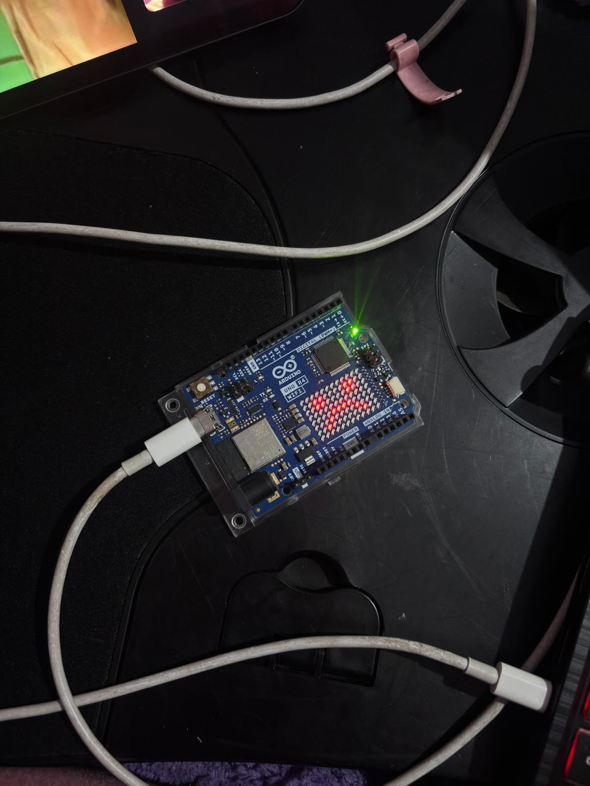

# sesion-01b

## apuntes sesión

Álgebra booleana

Algebra booleana: sistema matemático creado por George Boole en 1847. Usa variables que solo tienen dos valores: 0 (falso) y 1 (verdadero).

Sus tres operaciones básicas son AND (producto), OR (suma) y NOT (negación), y es la base de la informática y los circuitos digitales.

Bool

Bool: hablamos de algo que es sí o no.

Bool: variables extremistas verdadero / falso.

O sea, un bool solo puede tener dos posibilidades:

true = verdadero
false = falso

Diferencia AND - OR
AND: añadir - círculo
OR: múltiples - triángulo círculo

&&: se ocupa para trabajar con más de una condición al mismo tiempo.

AND significa que se tienen que cumplir las dos condiciones.

OR significa que puede cumplirse una condición o la otra.

Variables

Variables = cambia.

Las variables guardan datos que pueden cambiar.

string = cadena.

Se ocupa para guardar texto.

Ejemplo:

string nombre = "Isidora";

Letra = 'A';

Inicial = "C";

= para asignar valores.

Ejemplo:

edad = 22;

Estoy asignando el valor 22 a edad.

== para comparar.

Ejemplo:

edad == 22

Estoy comparando si edad es igual a 22.

Primero surge la derecha y después se inyecta al valor de la izquierda.

Por ejemplo:

edad = edad + 1;

Primero se hace edad + 1 y después ese resultado se guarda nuevamente en edad.

Notación camello

Notación camello: cuando empieza una nueva palabra lleva mayúsculas.

Ejemplo:

cumplirAnhos

Nunca empezar en mayúsculas.

También podría ser:

colorFavorito

comidaFavorita

Función

Función: es una secuencia de instrucciones para que ocurran cosas.

(): única indicación de que es una función.

Ejemplo:

dormir()

Los paréntesis nos indican que dormir es una función.

Void

void = vacío.

Void: vacío - responde con nada, solo ocurre.

Void se usa para acompañar la función, una función que no necesita responder con algo.

Ejemplo:

```cpp
void dormir() {
}
```

La función dormir() ocurre, pero no necesita entregar ningún resultado.

Llaves

{}: murciélago - ayuda a declarar la función - hace que las cosas partan y cierren.

{ indica dónde parte lo que hace la función.

} indica dónde termina.

Scope

Scope: lugar o contexto.

Es el lugar donde una variable o una instrucción existe y puede ser ocupada.

Por ejemplo, algo que está dentro de {} pertenece a ese contexto.

Condicional

if: condicional para expresar una condición.

Se puede entender como un “si”.

```cpp
if (edad == 22) {
}
```

Se puede leer como:

“Si edad es igual a 22, entonces ocurre algo”.

Bits y bytes

Bit: puede tener un valor 0 o 1.

1 byte tiene 8 bits.

Ejemplo:

01010101

1 byte tiene 2 nibbles.

Entonces:

1 nibble = 4 bits
1 byte = 8 bits
1 byte = 2 nibbles

Comentarios

Comentario: definimos algo que es para nosotros - qué vamos a hacer.

Está prohibido escribir una línea de código sin saber lo que se va a hacer, TODO DEBE TENER UN COMENTARIO.

Iniciamos con comentarios.

Ejemplo:

```cpp
// guardar la edad
int edad = 22;
```

El comentario sirve para nosotros, el computador no lo ejecuta.

Setup

Setup: configuración - levantarse - inicio de las cosas.

En Arduino:

```cpp
void setup() {
}
```

Es donde colocamos las cosas que tienen que ocurrir al inicio.

setup() ocurre una vez cuando parte el programa.

Arduino IDE

ARDUINO IDE = es capaz de conversar con algunos Arduino UNO R4 Mínima.

Hay que instalarlo en el 2 icono.

Carpeta completa - indica cuál es el archivo principal.

Primera entrega: entrega de carpeta ARDUINO, sin espacio y sin mayúscula.

Para seleccionar todo en Arduino es Command + A.

Apretar 2 veces el botón de reset para resetear la placa Arduino.

Apretar flechita para subir el código en la Arduino - importante seleccionar la placa en la app.

Código en apuntes:

Se tiene que ocupar el backtick, tilde al revés, y después Cpp.

## encargos

encargo01b:

1. tratar de correr un código en el microcontrolador asignado a cada dupla, incluir referentes, citas, comentarios, imágenes, descripciones textuales, y en caso de éxito o fracaso incluir aciertos, preguntas, dramas, atados. recordatorio que estos apuntes son personales, cada persona sube su versión.
2. proponer una función con nombre, tipo, argumentos y uso, que modele algún área de su interés, por ejemplo subirCerro(enBicicleta), tomarMetro(conPaseEscolar), etc. escribir en pseudocódigo los pasos que necesita esa función internamente para que literalmente funcione.

   Dupla: Isi Díaz y Nati Gutiérrez
   
Arduino UNO R4 WiFi

A nuestra dupla le tocó la placa Arduino UNO R4 WiFi.

Antes de empezar con el código buscamos un poco de información para cachar mejor qué tenía la placa y qué podíamos ocupar. Encontramos que tiene un microcontrolador principal Renesas RA4M1 de 32 bits y además un módulo ESP32-S3, que sirve para Wi-Fi y Bluetooth.

También vimos que tiene una matriz LED de 12 × 8, y eso fue de las cosas que más nos interesó porque podíamos hacer algo visual directamente en la placa. Al principio pensamos en figuras o incluso animaciones, aunque igual era un poco ambicioso para lo que sabemos hasta ahora.

Referencia:
https://docs.arduino.cc/hardware/uno-r4-wifi/

Como Nati y yo tenemos el mismo horario, pensamos que podíamos ocupar eso para hacer el ejercicio.

La idea era calcular cuántos minutos de clases tenemos a la semana, usando la hora de inicio y término de cada día.

Nuestro horario es:

Martes: 08:30 a 12:50

Miércoles: 08:30 a 11:30

Viernes: 08:30 a 12:50

Antes de hacer el código, pensamos primero cómo hacer el cálculo nosotras.

Por ejemplo, para el martes:

08:30 = 8 × 60 + 30 = 510 minutos

12:50 = 12 × 60 + 50 = 770 minutos

770 - 510 = 260 minutos

Entonces el martes tenemos 260 minutos de clases.

Después había que hacer lo mismo con miércoles y viernes y sumar todo al final.

Función

Pensamos en una función llamada:

calcularMinutosClase()

La función es de tipo int, porque al final queremos que nos entregue un número entero con la cantidad de minutos.

Los argumentos que usamos son:

horaInicio

minutoInicio

horaFin

minutoFin

Por ejemplo:
calcularMinutosClase(8, 30, 12, 50);

Esta parte igual me costó entender al principio.

Lo que entendí es que la función recibe los números, pero no sabe sola qué significa cada uno. Somos nosotras las que le ponemos el nombre a cada argumento y definimos qué representa.

Entonces en:

calcularMinutosClase(8, 30, 12, 50);

el 8 corresponde a horaInicio, el 30 a minutoInicio, el 12 a horaFin y el 50 a minutoFin.

Pseudocódigo

Antes de correr el código, pensamos qué pasos tenía que hacer la función por dentro:

- recibir la hora de inicio
   
- recibir los minutos de inicio
  
- recibir la hora de término

- recibir los minutos de término

- convertir la hora de inicio a minutos
  
- sumar los minutos de inicio
  
- convertir la hora de término a minutos
  
- sumar los minutos de término
  
- restar el inicio al término
  
- guardar el resultado
  
- devolver la duración de la clase en minutos
  
La idea era transformar todo a minutos primero para después poder hacer la resta.

Primer código
El primer código fue este:

```cpp
// queremos calcular cuantos minutos de clases tenemos en una semana

void setup() {
  // aqui va setup()
  // ocurre una vez al principio

  // calcular cuantos minutos de clases tenemos el martes
  int minutosMartes = calcularMinutosClase(8, 30, 12, 50);

  // calcular cuantos minutos de clases tenemos el miercoles
  int minutosMiercoles = calcularMinutosClase(8, 30, 11, 30);

  // calcular cuantos minutos de clases tenemos el viernes
  int minutosViernes = calcularMinutosClase(8, 30, 12, 50);

  // variable para guardar el total semanal
  int minutosSemana = 0;

  // sumar los minutos de los tres dias
  minutosSemana = minutosMartes + minutosMiercoles + minutosViernes;
}

void loop() {
  // no necesitamos repetir ninguna accion
}

int calcularMinutosClase(
  int horaInicio,
  int minutoInicio,
  int horaFin,
  int minutoFin
) {

  int inicioEnMinutos = 0;

  inicioEnMinutos = horaInicio * 60 + minutoInicio;

  int finEnMinutos = 0;

  finEnMinutos = horaFin * 60 + minutoFin;

  int duracionClase = 0;

  duracionClase = finEnMinutos - inicioEnMinutos;

  return duracionClase;
}
```

La primera vez que intentamos subirlo nos faltó cerrar bien el setup() y Arduino IDE nos tiraba error.

Fue una locura porque nos costó entender qué era ya que veíamos el código entero y no nos dábamos cuenta de que faltaba un murciélago.

Después de arreglar eso logramos subirlo.

El problema era que no pasaba nada visible en la placa.

El código podía estar funcionando, pero no teníamos ninguna forma de verlo.

Variables

Otra cosa que me costó fueron las variables.

Por ejemplo:

int minutosMartes

o
int duracionClase

Al principio las entendía como valores que después se reemplazaban, pero ahora lo entiendo más como un lugar donde se guarda información para usarla después.

Por ejemplo:

int minutosMartes = calcularMinutosClase(8, 30, 12, 50);

guarda el resultado de esa función en minutosMartes.

Después podemos ocupar ese valor en otra parte sin tener que hacer de nuevo el cálculo.

Eso pasa cuando hacemos:

minutosSemana = minutosMartes + minutosMiercoles + minutosViernes;

porque ahí estamos sumando los resultados que ya habíamos guardado.

Segundo intento: usar la matriz LED

Como con el primer código no veíamos ningún resultado físico, quisimos ocupar la matriz LED que viene en la placa.

Encontramos esta página de Arduino donde explican cómo usarla:

https://docs.arduino.cc/tutorials/uno-r4-wifi/led-matrix/

Primero agregamos:

#include "Arduino_LED_Matrix.h"

y después:

ArduinoLEDMatrix matrix;

Dentro de setup() agregamos:

matrix.begin();

para iniciar la matriz.

La matriz tiene 8 filas y 12 columnas, entonces en total son:

8 × 12 = 96 LED

Cada posición se puede representar con 0 o 1:

0 = apagado

1 = encendido

El ejemplo que aparece en la página de Arduino es este:

byte frame[8][12] = {
  { 0, 0, 1, 1, 0, 0, 0, 1, 1, 0, 0, 0 },
  { 0, 1, 0, 0, 1, 0, 1, 0, 0, 1, 0, 0 },
  { 0, 1, 0, 0, 0, 1, 0, 0, 0, 1, 0, 0 },
  { 0, 0, 1, 0, 0, 0, 0, 0, 1, 0, 0, 0 },
  { 0, 0, 0, 1, 0, 0, 0, 1, 0, 0, 0, 0 },
  { 0, 0, 0, 0, 1, 0, 1, 0, 0, 0, 0, 0 },
  { 0, 0, 0, 0, 0, 1, 0, 0, 0, 0, 0, 0 },
  { 0, 0, 0, 0, 0, 0, 0, 0, 0, 0, 0, 0 }
};

A partir de eso hicimos nuestras propias caritas.

Carita feliz

uint8_t caritaFeliz[8][12] = {
  {0,0,0,0,0,0,0,0,0,0,0,0},
  {0,0,1,1,0,0,0,0,1,1,0,0},
  {0,0,1,1,0,0,0,0,1,1,0,0},
  {0,0,0,0,0,0,0,0,0,0,0,0},
  {0,0,1,0,0,0,0,0,0,1,0,0},
  {0,0,0,1,0,0,0,0,1,0,0,0},
  {0,0,0,0,1,1,1,1,0,0,0,0},
  {0,0,0,0,0,0,0,0,0,0,0,0}
};

Carita triste

uint8_t caritaTriste[8][12] = {
  {0,0,0,0,0,0,0,0,0,0,0,0},
  {0,0,1,1,0,0,0,0,1,1,0,0},
  {0,0,1,1,0,0,0,0,1,1,0,0},
  {0,0,0,0,0,0,0,0,0,0,0,0},
  {0,0,0,0,1,1,1,1,0,0,0,0},
  {0,0,0,1,0,0,0,0,1,0,0,0},
  {0,0,1,0,0,0,0,0,0,1,0,0},
  {0,0,0,0,0,0,0,0,0,0,0,0}
};

Esta parte me pareció más fácil de entender porque se puede ver directamente cómo los 1 van formando el dibujo.

Condición

Después dejamos una condición para decidir qué carita mostrar.

Los resultados eran:

Martes = 260 minutos

Miércoles = 180 minutos

Viernes = 260 minutos

Entonces:

260 + 180 + 260 = 700 minutos

Decidimos que si teníamos más de 600 minutos apareciera la carita triste y si eran 600 o menos apareciera la feliz.

El código quedó así:

```cpp
matrix.begin();

if (minutosSemana > 600) {

  matrix.renderBitmap(caritaTriste, 8, 12);

} else {

  matrix.renderBitmap(caritaFeliz, 8, 12);
}
```

Acá usamos if y else.

En este caso, básicamente le estamos diciendo al código que revise si minutosSemana es mayor a 600.

Si lo es, muestra la carita triste.

Si no, muestra la feliz.

Como ya sabíamos que el total era 700 minutos, esperábamos que apareciera la carita triste y resultó.



Resultado en la matriz LED de la Arduino UNO R4 WiFi mostrando la carita triste.

Código completo

```cpp
#include "Arduino_LED_Matrix.h"
//para crear la matrix

ArduinoLEDMatrix matrix;

// dibujar una carita feliz en la matriz
uint8_t caritaFeliz[8][12] = {
  {0,0,0,0,0,0,0,0,0,0,0,0},
  {0,0,1,1,0,0,0,0,1,1,0,0},
  {0,0,1,1,0,0,0,0,1,1,0,0},
  {0,0,0,0,0,0,0,0,0,0,0,0},
  {0,0,1,0,0,0,0,0,0,1,0,0},
  {0,0,0,1,0,0,0,0,1,0,0,0},
  {0,0,0,0,1,1,1,1,0,0,0,0},
  {0,0,0,0,0,0,0,0,0,0,0,0}
};

// dibujar una carita triste en la matriz
uint8_t caritaTriste[8][12] = {
  {0,0,0,0,0,0,0,0,0,0,0,0},
  {0,0,1,1,0,0,0,0,1,1,0,0},
  {0,0,1,1,0,0,0,0,1,1,0,0},
  {0,0,0,0,0,0,0,0,0,0,0,0},
  {0,0,0,0,1,1,1,1,0,0,0,0},
  {0,0,0,1,0,0,0,0,1,0,0,0},
  {0,0,1,0,0,0,0,0,0,1,0,0},
  {0,0,0,0,0,0,0,0,0,0,0,0}
};

void setup() {

  int minutosMartes = calcularMinutosClase(8, 30, 12, 50);

  int minutosMiercoles = calcularMinutosClase(8, 30, 11, 30);

  int minutosViernes = calcularMinutosClase(8, 30, 12, 50);

  int minutosSemana = 0;

  minutosSemana = minutosMartes + minutosMiercoles + minutosViernes;

  matrix.begin();

  if (minutosSemana > 600) {

    matrix.renderBitmap(caritaTriste, 8, 12);

  } else {

    matrix.renderBitmap(caritaFeliz, 8, 12);
  }
}

void loop() {
  // no necesitamos repetir ninguna accion
}

int calcularMinutosClase(
  int horaInicio,
  int minutoInicio,
  int horaFin,
  int minutoFin
) {

  int inicioEnMinutos = 0;

  inicioEnMinutos = horaInicio * 60 + minutoInicio;

  int finEnMinutos = 0;

  finEnMinutos = horaFin * 60 + minutoFin;

  int duracionClase = 0;

  duracionClase = finEnMinutos - inicioEnMinutos;

  return duracionClase;
}
```

Aciertos, dramas y dudas

Creo que nos sirvió harto hacer primero el cálculo a mano antes de escribir el código, porque así sabíamos qué resultado tenía que dar.

También fue buena idea usar la matriz LED, porque con el primer código no teníamos ninguna forma de saber visualmente si estaba funcionando.

Uno de los dramas fue que al principio no habíamos cerrado bien el setup() y no entendíamos por qué no compilaba.

Después, aunque logramos subir el código, tampoco pasaba nada visible, así que ahí cachamos que necesitábamos alguna salida.

Las partes que más me costaron fueron los argumentos y las variables.

Con los argumentos, ahora entiendo que son los datos que la función necesita recibir para poder trabajar.

Con las variables todavía me cuesta un poco, pero entiendo que sirven para guardar un valor y ocuparlo después.

También me queda la duda de si existe una forma más corta de hacer este cálculo, porque por ahora usamos varias variables intermedias.

Y otra cosa que me gustaría probar más adelante es hacer algo más con la matriz, por ejemplo una animación en vez de dejar solo una imagen fija.

Resultado:

Al final logramos que el código:

-calcule la duración de cada bloque de clases

-sume los minutos de la semana

-compare el resultado con 600

-muestre una carita en la matriz LED

El total fue de 700 minutos semanales, así que apareció la carita triste. :(

## lectura
