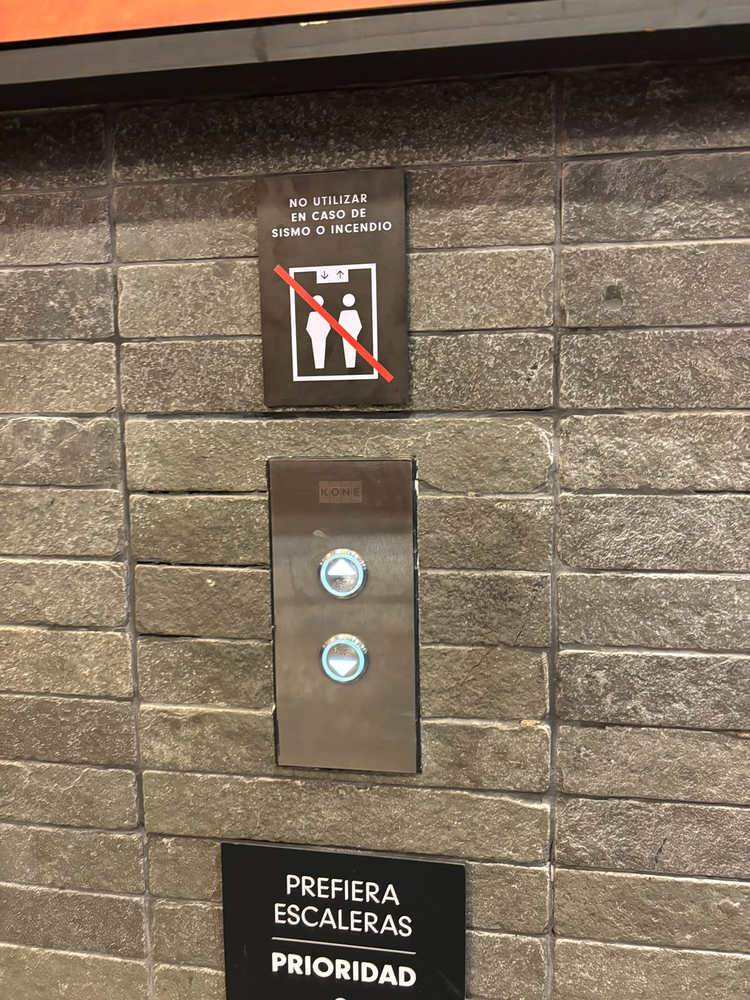
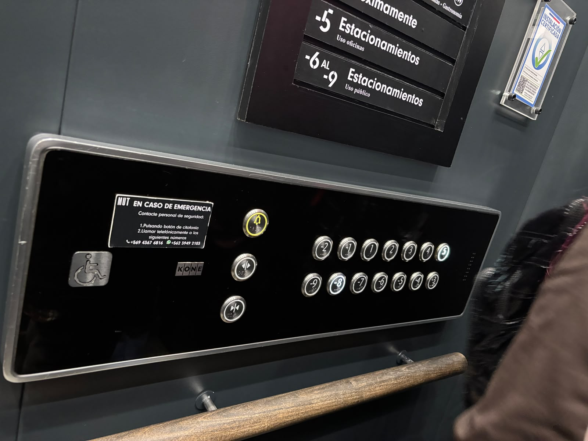
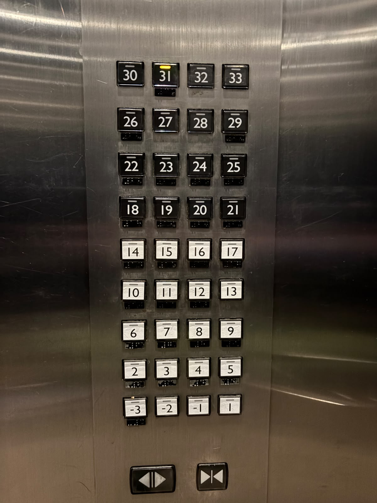
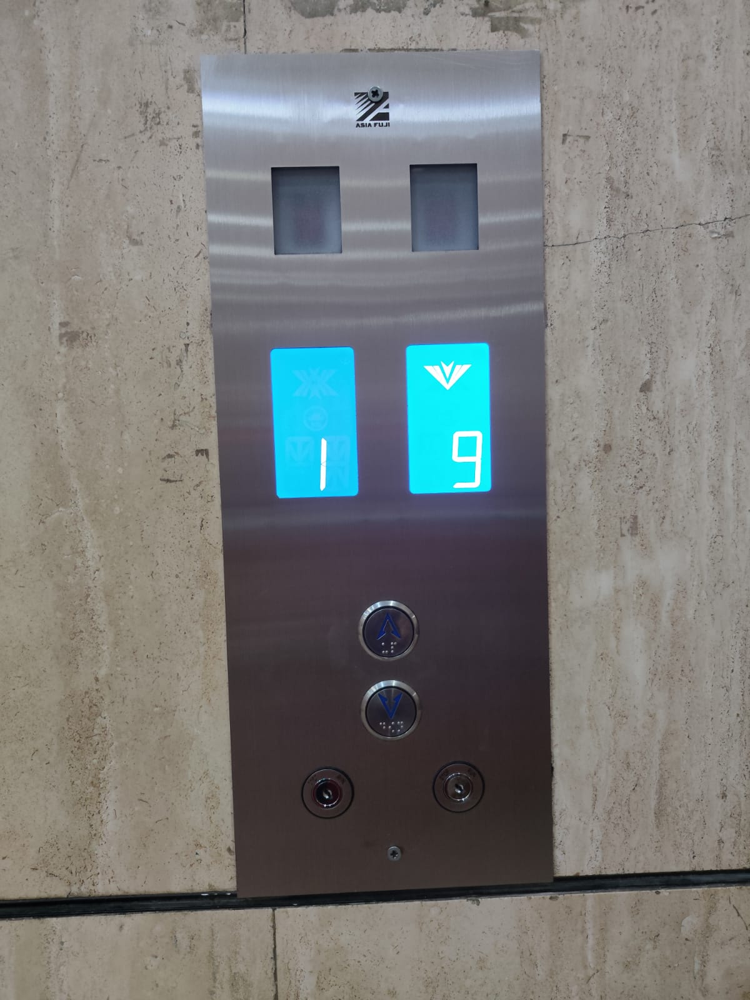
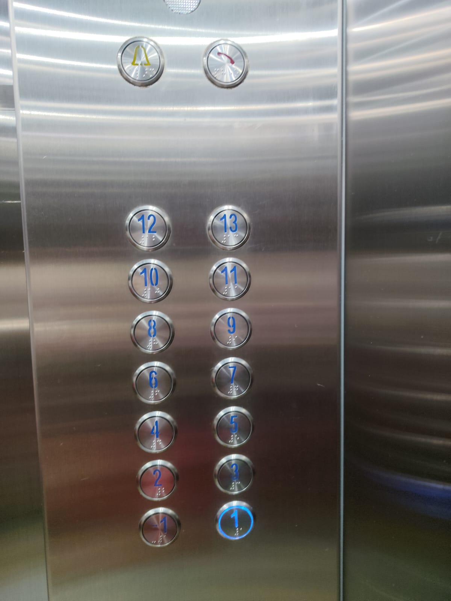

# sesion-00b

## apuntes sesión

## encargos

ascensor n1

el ascensor cuenta con dos botones para llamarlo, si quieres subir o bajar. en la parte interior cuenta con 10 botones, 7 son para dirigirse a los distintos pisos del edificio y 3 adicionales, uno para abrir las puertas, otro para cerrarlas y uno para emergencias. tiene un aviso que indica los pasos a seguir en caso de emergencias; la marca del ascensor y una placa con un símbolo de una persona en silla de ruedas que no sé si era un botón o solo una placa que informa que en el ascensor se pueden subir sillas de ruedas. los botones en su interior cuentan con sistema braille para personas con discapacidad visual y además se ilumina el número y una circunferencia a su alrededor.

ascensor n2

el ascensor cuenta con 39 botones, 36 son para dirigirse a los distintos pisos del edificio y están ordenados en filas de a 4 de izquierda a derecha, de abajo hacia arriba. tiene una franja que se ilumina para indicar el piso seleccionado y debajo de cada botón cuentan con una plaquita con sistema braille. tiene los botones para abrir y cerrar las puertas y botón color amarillo para emergencias.

ascensor n3

en el exterior el ascensor cuenta con dos botones para llamarlo si sube o si baja, además, tiene dos pantallas que indican el piso donde se encuentra el ascensor y si va subiendo o bajando. en su interior cuenta con 16 botones, 14 son para dirigirse a los distintos pisos del edificio y tiene dos para emergencias yo creo, la campanita y uno para llamar al hall supongo. todos los botones cuentan con sistema braille y se iluminan tanto el número como una circunferencia a su alrededor.

## lectura
