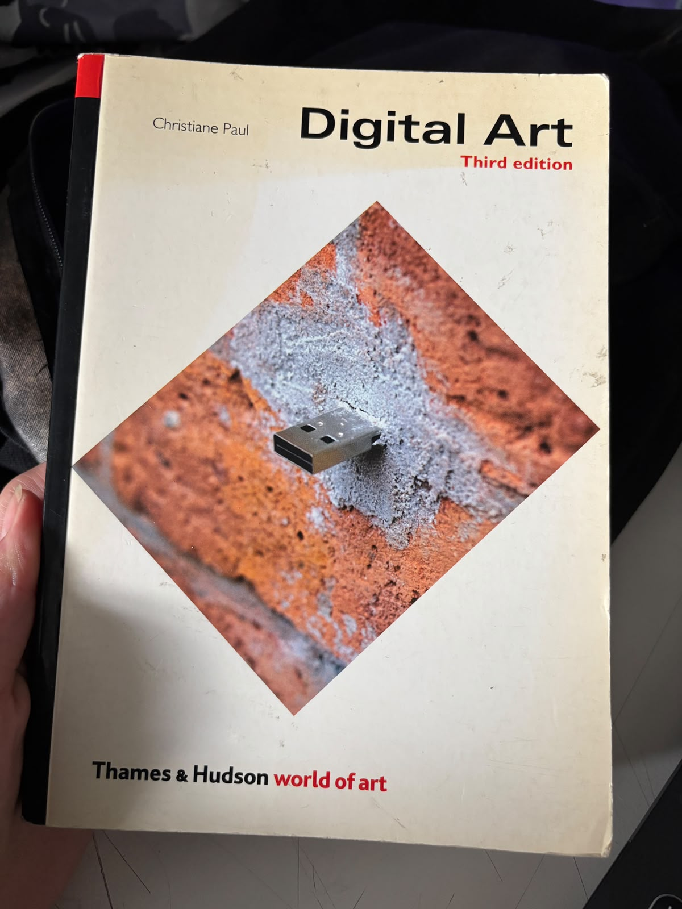

 # sesion-01b

## apuntes sesión

- Aritmética booleana 
- Bug: bicho/polilla que arruino el cálculo de una computadora viejísima.

- Arduino - products - software - arduino ide
- En el programa
     - Botón check verificar
     - install UNO R4
  setup - configuración / wake up
- las funciones tienen ( )
- void / vacío / tipo de función / solo ocurre
- murciélago { desde aquí
- hasta aqui}
- prohibido escribir una línea de código sin poner comentarios / descripción / pseudocódigo
  
1 void setuo () { 
2 //aquí va setup () ocurre una vez al principio
3
4 }
5 
6 void loop () { 
7 // aquí va loop
8 //ocurre después de setup
9 //se repite hasta que no se pueda más
10 }

- para llevar el código a GitHub
  ctrl c - ctrl a - en la línea anterior `cpp - en la línea posterior para cerrar ` (`son 3 de esos cosos juntos pero si los coloco no se ven asi que se describe)

- bool: variable extremista 1 0
- int: números enteros
-  // para agregar comentarios
-   = asignación de valores
-    == comparar
-    scope va dentro de {} es contexto
-    && para concatenar
-    declarar palabras o conceptos en el setup
-    para cerrar las líneas de códigos hay que colocar ; o tira error
-    al conectar el arduino al computador aparecerá una ventanita, seleccionar para empezar a subir el archivo
-    para resetear la placa de arduino apretar dos veces el boton dde reset
-    siemore abrir con { y cerrar con }
-    los errores se marcan en la línea posterior al error, no entendí si es siempre o solo en algunos casos, no pregunte, para la próxima pregunta no te quedes con la duda

## encargos

## lectura

Recién escogí libro 

