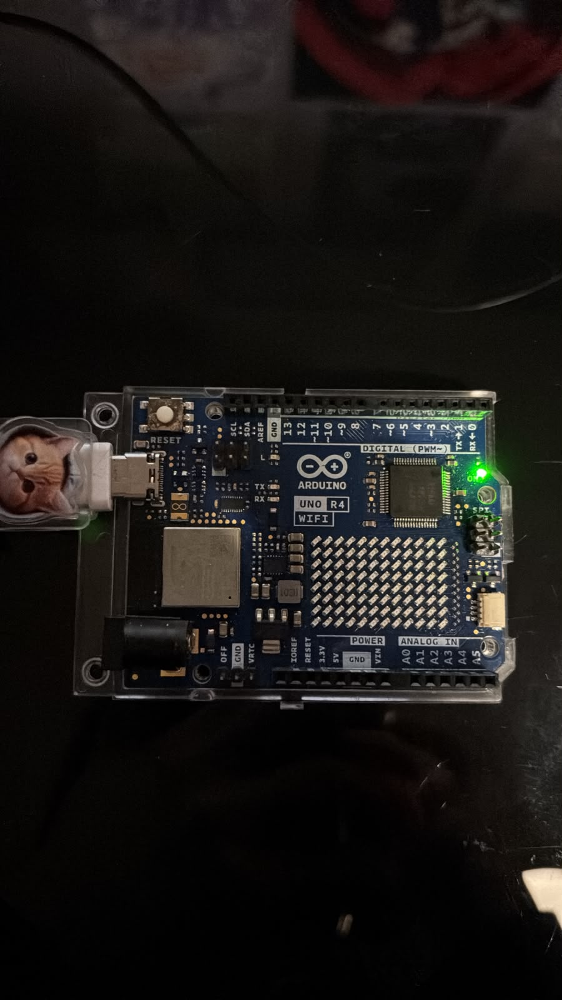
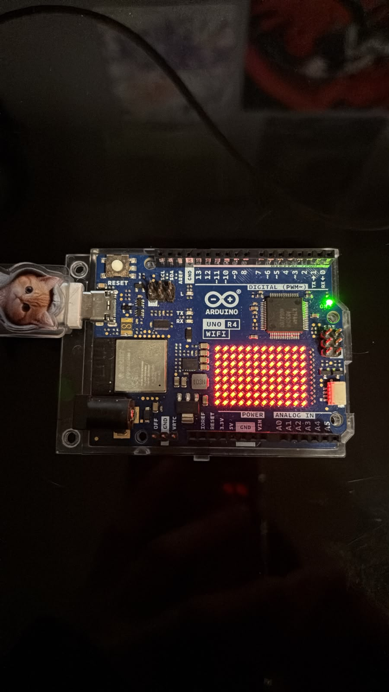
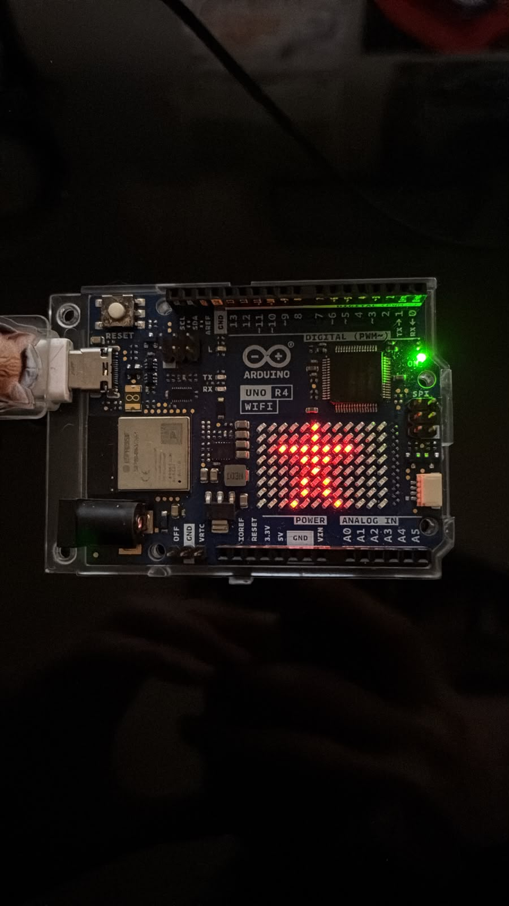

 # sesion-01b

## apuntes sesión

- Aritmética booleana 
- Bug: bicho/polilla que arruino el cálculo de una computadora viejísima.

- Arduino - products - software - arduino ide
- En el programa
     - Botón check verificar
     - install UNO R4
  setup - configuración / wake up
- las funciones tienen ( )
- void / vacío / tipo de función / solo ocurre
- murciélago { desde aquí
- hasta aqui}
- prohibido escribir una línea de código sin poner comentarios / descripción / pseudocódigo

```
1 void setup () { 

2 //aquí va setup () ocurre una vez al principio

3

4 }

5 

6 void loop () { 

7 // aquí va loop

8 //ocurre después de setup

9 //se repite hasta que no se pueda más

10 }
```
- para llevar el código a GitHub
  ctrl c - ctrl a - en la línea anterior `cpp - en la línea posterior para cerrar ` (`son 3 de esos cosos juntos pero si los coloco no se ven asi que se describe)

- bool: variable extremista 1 0
- int: números enteros
-  // para agregar comentarios
-   = asignación de valores
-    == comparar
-    scope va dentro de {} es contexto
-    && para concatenar
-    declarar palabras o conceptos en el setup
-    para cerrar las líneas de códigos hay que colocar ; o tira error
-    al conectar el arduino al computador aparecerá una ventanita, seleccionar para empezar a subir el archivo
-    para resetear la placa de arduino apretar dos veces el boton dde reset
-    siemore abrir con { y cerrar con }
-    los errores se marcan en la línea posterior al error, no entendí si es siempre o solo en algunos casos, no pregunte, para la próxima pregunta no te quedes con la duda


## encargos

encargo01b:

1. tratar de correr un código en el microcontrolador asignado a cada dupla, incluir referentes, citas, comentarios, imágenes, descripciones textuales, y en caso de éxito o fracaso incluir aciertos, preguntas, dramas, atados. recordatorio que estos apuntes son personales, cada persona sube su versión.

Primero lo primero, conectar la placa al computador



Funciona. Ahora qué hago con esto.

Según la web https://www.profetolocka.com.ar/2024/07/22/tutorial-usando-la-matriz-led-del-arduino-uno-r4-parte-1/#Librerias

Primero hay como que llamar a la matriz para que funcione, para eso se utiliza 

```cpp
#include "Arduino_Led_Matrix.h"
```

Luego hay como que nombrarla 

```cpp
ArduinoLedMatrix pantalla
```

Y ahora en el setup hay que decirle oye prendete

```cpp
void setup() {
pantalla.begin();
}

Y .begin es lo que se coloca para llamarlo a prenderse

Ahora para empezar con la magia hay que ponerle algo que se llama bitmap, el cual a través de 0 y 1 enciende o apaga los leds de la matriz. La matriz de la placa cuenta con 8 filas y 12 columnas. Si todas tuviesen el valor de 1, toda la matriz estaría encendida, si todos fueran 0, estaría apagada.

se escribe así ej: {0,0,0,0,1,1,1,0,0,0,0,1},



Entonces,

```cpp
#include "Arduino_LED_Matrix.h"

ArduinoLEDMatrix Pantalla;  //Instancia objeto

byte corazon [8][12] = {
    {0,0,0,0,0,1,0,0,0,0,0,0},
    {0,0,0,0,0,1,0,0,0,0,0,0},
    {0,0,1,1,1,1,1,1,1,0,0,0},
    {0,0,0,0,1,1,1,0,0,0,0,0},
    {0,0,0,0,0,1,0,0,0,0,0,0},
    {0,0,0,0,1,0,1,0,0,0,0,0},
    {0,0,0,0,1,0,1,0,0,0,0,0},
    {0,0,0,1,0,0,0,1,0,0,0,0},
};

void setup() {

  Pantalla.begin();  //Inicializa

  Pantalla.renderBitmap (corazon, 8,12);  //Muestra bitmap

}

void loop() {

}
```



Entiendo la idea pero no entiendo como aplicarla. 


2. proponer una función con nombre, tipo, argumentos y uso, que modele algún área de su interés, por ejemplo subirCerro(enBicicleta), tomarMetro(conPaseEscolar), etc. escribir en pseudocódigo los pasos que necesita esa función internamente para que literalmente funcione.

## lectura

Recién escogí libro 


Que difícil leer en inglés
