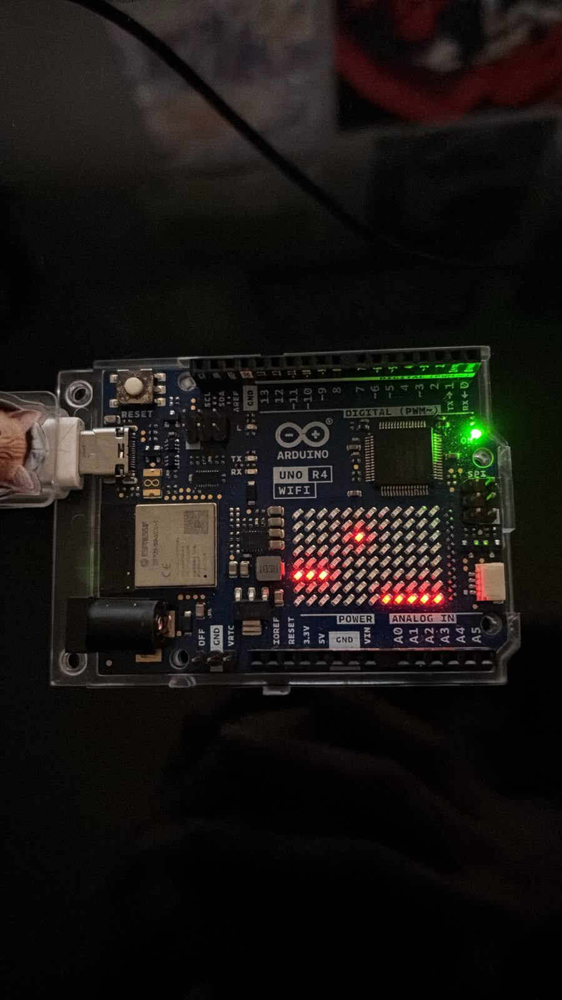
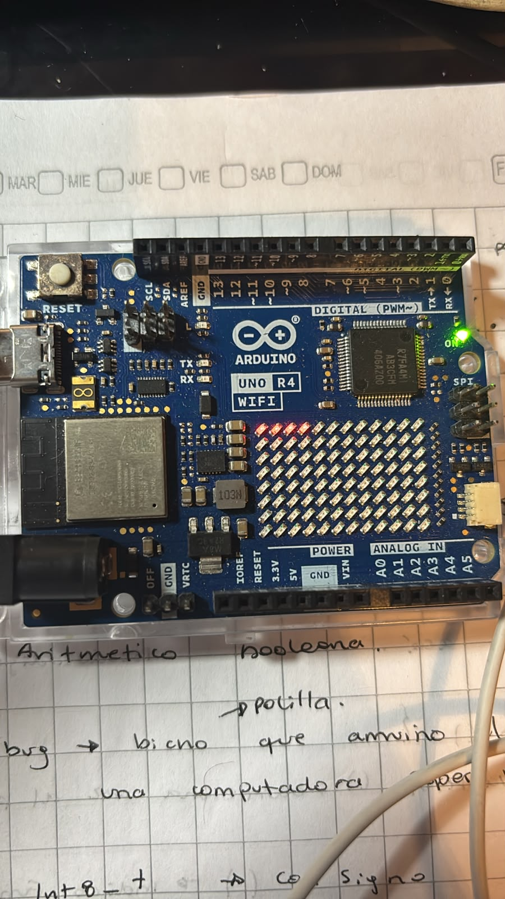

 # sesion-01b

## apuntes sesión

- Aritmética booleana 
- Bug: bicho/polilla que arruino el cálculo de una computadora viejísima.

- Arduino - products - software - arduino ide
- En el programa
     - Botón check verificar
     - install UNO R4
  setup - configuración / wake up
- las funciones tienen ( )
- void / vacío / tipo de función / solo ocurre
- murciélago { desde aquí
- hasta aqui}
- prohibido escribir una línea de código sin poner comentarios / descripción / pseudocódigo

```
1 void setup () { 

2 //aquí va setup () ocurre una vez al principio

3

4 }

5 

6 void loop () { 

7 // aquí va loop

8 //ocurre después de setup

9 //se repite hasta que no se pueda más

10 }
```
- para llevar el código a GitHub
  ctrl c - ctrl a - en la línea anterior `cpp - en la línea posterior para cerrar ` (`son 3 de esos cosos juntos pero si los coloco no se ven asi que se describe)

- bool: variable extremista 1 0
- int: números enteros
-  // para agregar comentarios
-   = asignación de valores
-    == comparar
-    scope va dentro de {} es contexto
-    && para concatenar
-    declarar palabras o conceptos en el setup
-    para cerrar las líneas de códigos hay que colocar ; o tira error
-    al conectar el arduino al computador aparecerá una ventanita, seleccionar para empezar a subir el archivo
-    para resetear la placa de arduino apretar dos veces el boton dde reset
-    siemore abrir con { y cerrar con }
-    los errores se marcan en la línea posterior al error, no entendí si es siempre o solo en algunos casos, no pregunte, para la próxima pregunta no te quedes con la duda


## encargos

encargo01b:

1. tratar de correr un código en el microcontrolador asignado a cada dupla, incluir referentes, citas, comentarios, imágenes, descripciones textuales, y en caso de éxito o fracaso incluir aciertos, preguntas, dramas, atados. recordatorio que estos apuntes son personales, cada persona sube su versión.

Primero lo primero, conectar la placa al computador


Funciona. Ahora qué hago con esto.

Según la web https://www.profetolocka.com.ar/2024/07/22/tutorial-usando-la-matriz-led-del-arduino-uno-r4-parte-1/#Librerias

Primero hay como que llamar a la matriz para que funcione, para eso se utiliza 

```cpp
#include "Arduino_Led_Matrix.h"
```

Luego hay como que nombrarla 

```cpp
ArduinoLedMatrix pantalla
```

Y ahora en el setup hay que decirle oye prendete

```cpp
void setup() {
pantalla.begin();
}

Y .begin es lo que se coloca para llamarlo a prenderse

Ahora para empezar con la magia hay que ponerle algo que se llama bitmap, el cual a través de 0 y 1 enciende o apaga los leds de la matriz. La matriz de la placa cuenta con 8 filas y 12 columnas. Si todas tuviesen el valor de 1, toda la matriz estaría encendida, si todos fueran 0, estaría apagada.

se escribe así ej: {0,0,0,0,1,1,1,0,0,0,0,1},


Entonces,

```cpp
#include "Arduino_LED_Matrix.h"

ArduinoLEDMatrix Pantalla;  //Instancia objeto

byte corazon [8][12] = {
    {0,0,0,0,0,1,0,0,0,0,0,0},
    {0,0,0,0,0,1,0,0,0,0,0,0},
    {0,0,1,1,1,1,1,1,1,0,0,0},
    {0,0,0,0,1,1,1,0,0,0,0,0},
    {0,0,0,0,0,1,0,0,0,0,0,0},
    {0,0,0,0,1,0,1,0,0,0,0,0},
    {0,0,0,0,1,0,1,0,0,0,0,0},
    {0,0,0,1,0,0,0,1,0,0,0,0},
};

void setup() {

  Pantalla.begin();  //Inicializa

  Pantalla.renderBitmap (corazon, 8,12);  //Muestra bitmap

}

void loop() {

}
```


Entiendo la idea pero no entiendo como aplicarla. 

Mi compañera intento hacer otra forma de hacer una estrella

```cpp
/* 
 Dibujar una estrella en la matriz de LEDs del Arduino UNO R4 WIFI
 */


 // Incluir la libreria oficial
 #include "Arduino_LED_Matrix.h"
 
// Crear el objeto de la matrix
ArduinoLEDMatrix matrix;

// Definir el mapa de bits en forma de estrella
// Esto en un arreglo de 12 filas (para las 12 columnas) y 8 bits (para las 8 filas de alto) 
// El prefijo 0b indica que el número que sigue es binario.
const uint32_t estrella_bits[] = {
  0b00000100, // Columna 0 (fila 0-7)
    0b00001110, // Columna 1
    0b00011111, // Columna 2
    0b01111110, // Columna 3
    0b11111110, // Columna 4 (cuerpo central)
    0b00001111, // Columna 5
    0b11111110, // Columna 6 (cuerpo central)
    0b01111110, // Columna 7
    0b00011111, // Columna 8
    0b00001110, // Columna 9
    0b00000100, // Columna 10
    0b00000000  // Columna 11 (vacía)
};

void setup() {
  // inicializar la matriz de leds
  matrix.begin();

}

void loop() {
  // cargar y mostrar la figura de estrella
  matrix.loadFrame(estrella_bits);
  delay(1000) // mantenerla encendida por un segundo
}
```

Pero no funcionó



Ahora el caballero habla de algo de los 32 bytes, entiendo pero a la vez no. Entiendo que con este formato la matriz se divide en 3 grupos con la misma cantidad de leds.

El caballero te coloca una web que te permite activar y desactivar cuadraditos simulando la matriz led de la arduino https://www.manualdomaker.com/matrix/ y según esta página, la matriz completa encendida seria 

```cpp
0xFFFFFFFF
0xFFFFFFFF
0xFFFFFFFF
```

entonces yo pienso, F es encendido, ¿0 es apagado? probemo

coloco este 

```cpp
#include "Arduino_LED_Matrix.h"

ArduinoLEDMatrix matrix;

uint32_t frame[] = {
   0xF0000000,
   0x00000000,
   0x00000000,
};

void setup() {
  matrix.begin();
  matrix.loadFrame(frame);
}

void loop() {
}
```



Al parecer F significa "prendo 4 leds"

Ahora en el lugar donde estaba la F puse una A y se prendieron los leds 1 y 3 de la primera fila. ¿Cada carácter significa algo? demás que sí, pero no lo entiendo. Igual demás que es imposible aprenderse todas esas combinaciones.


2. proponer una función con nombre, tipo, argumentos y uso, que modele algún área de su interés, por ejemplo subirCerro(enBicicleta), tomarMetro(conPaseEscolar), etc. escribir en pseudocódigo los pasos que necesita esa función internamente para que literalmente funcione.

Profe no le voy a mentir, en esta parte me ayudé un poco de la IA, pero onda le fui escribiendo lo que escribía y ahí me decía si iba bien o si estaba poniendo puras cabezas de pesado.

la idea una clienta quiere comprar una torta de chocolate y empezamos así

```cpp
//escoger una torta de chocolate 
//la torta no debe tener frutos secos 
//la torta no debe tener mermeladas 
//puede tener manjar 
//debe ser con azucar 
//las opciones que hay para escoger son 
//chocolate manjar, chocolate sin azúcar, chocolate y mermelada de frambuesa 
//chocolate nuez, cheesecake

//clienta quiere comprar una torta de chocolate 
bool ConMermelada = false; 
bool ConManjar = true; 
bool SinAzucar = true; 
bool ConFrutosSecos = false; 
bool Cheesecake = false;
```

Y aquí me corrigió que había algunas cosas que podían causar confusión, como el decir en la función que acepta ciertas cosas, pero al colocarlo en los bool los puse como condiciones que si o si deben existir y me recomendó que en vez de usar el "con(ingrediente)" utilizara el "acepta(ingrediente)"

Entonces las preferencias de la clienta quedarían como 

```cpp
bool AceptaMermelada = false;
bool AceptaManjar = true;
bool AceptaSinAzucar = false;
bool AceptaFrutosSecos = false;
bool AceptaCheesecake = false;
```

Y luego de definir las preferencias de ingredientes de la clienta debemos ver las opciones de pasteles de chocolate que se ofrecen e identificar si sirven o no para la clienta. Hasta el momento iría así

```cpp
//clienta quiere comprar una torta de chocolate
bool AceptaMermelada = false
bool AceptaManjar = true
bool AceptaSinAzucar = false
bool AceptaFrutosSecos = false
bool AceptaCheesecake = false
//los sabores disponibles son
//Torta chocolate manjar
bool TieneMermelada = false
bool TieneManjar = true bool
TieneSinAzucar = false bool
TieneFrutosSecos = false bool
TieneCheesecake = false
//Torta chocolate mermelada
bool TieneMermelada = true
bool TieneManjar = false bool
TieneSinAzucar = false bool
TieneFrutosSecos = false bool
TieneCheesecake = false
//Torta chocolate y frutos secos
bool TieneMermelada = false
bool TieneManjar = false
bool TieneSinAzucar = false
bool TieneFrutosSecos = true
bool TieneCheesecake = false
//Torta de chocolate sin azucar
bool TieneMermelada = false
bool TieneManjar = false bool
TieneSinAzucar = true bool
TieneFrutosSecos = false bool
TieneCheesecake = false
//y Cheesecake de chocolate
bool TieneMermelada = false
bool TieneManjar = true
bool TieneSinAzucar = false
bool TieneFrutosSecos = false
bool TieneCheesecake = true
```


## lectura

Recién escogí libro 


Que difícil leer en inglés
