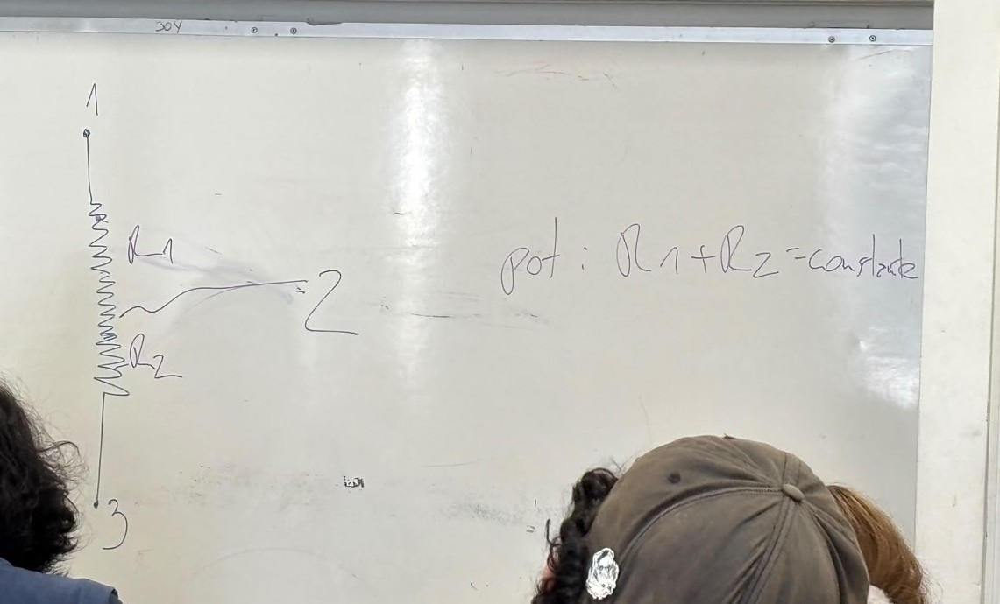
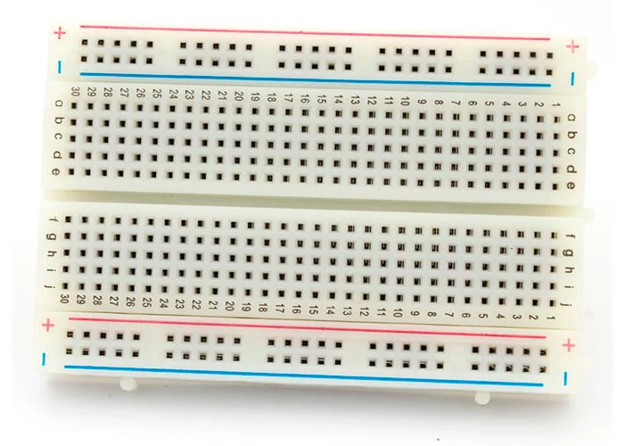
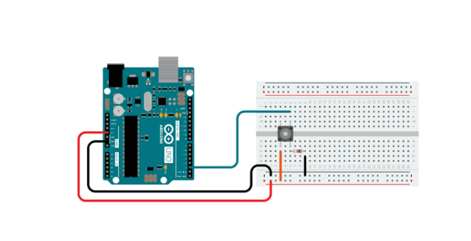
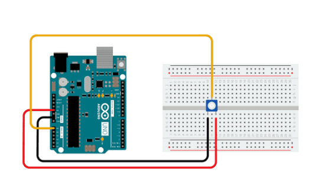
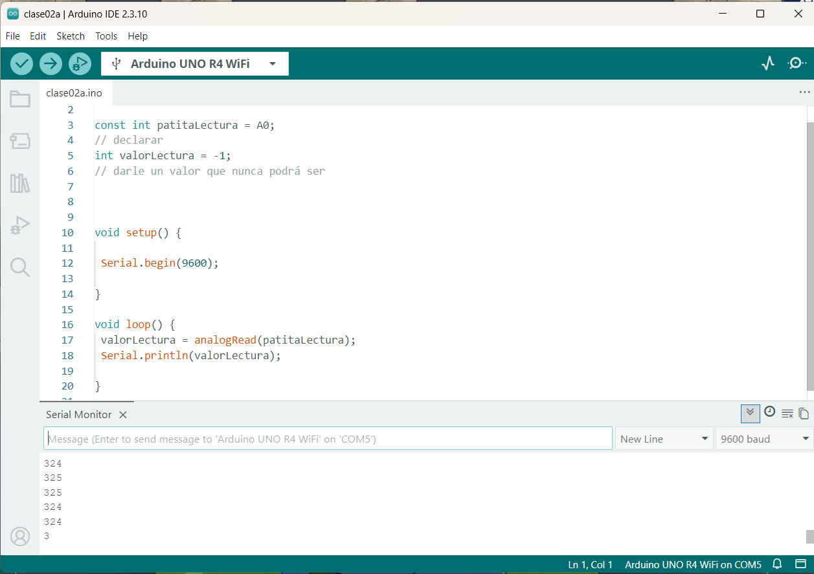
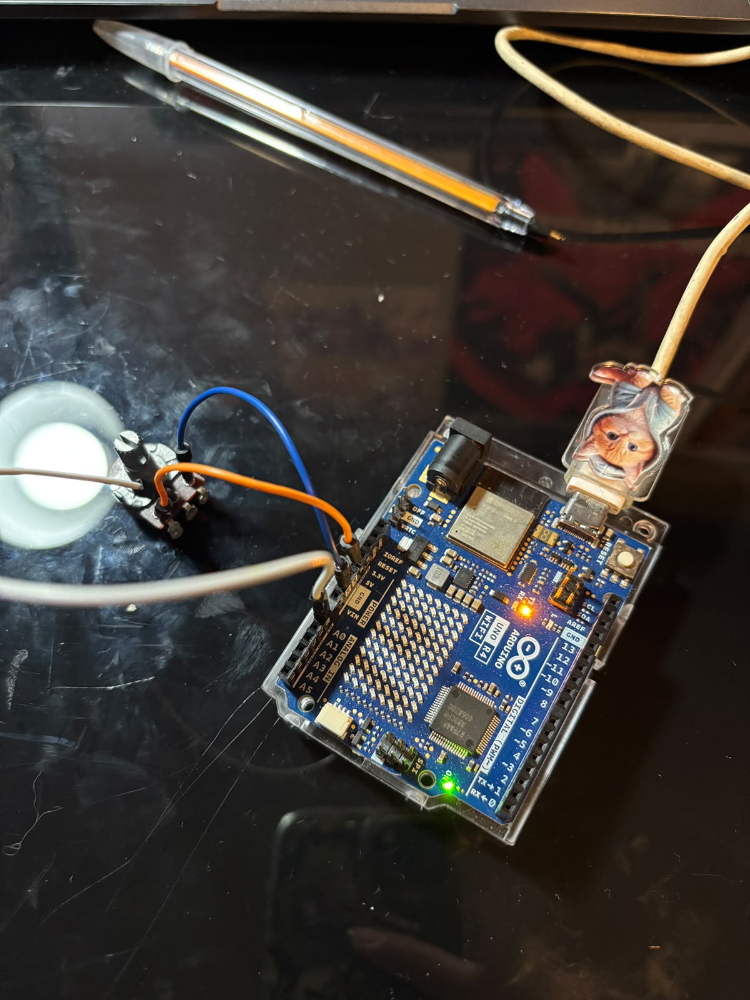
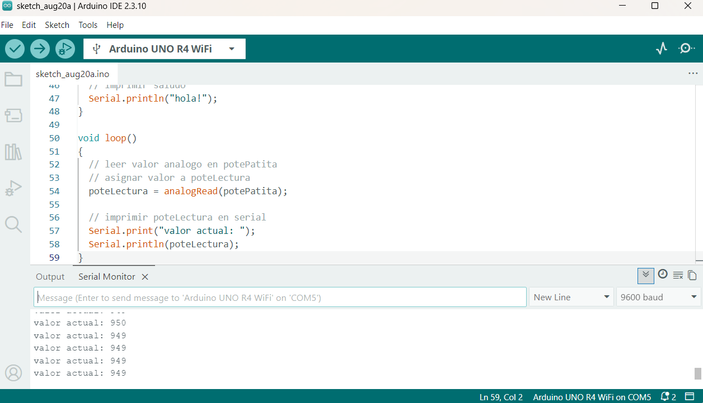
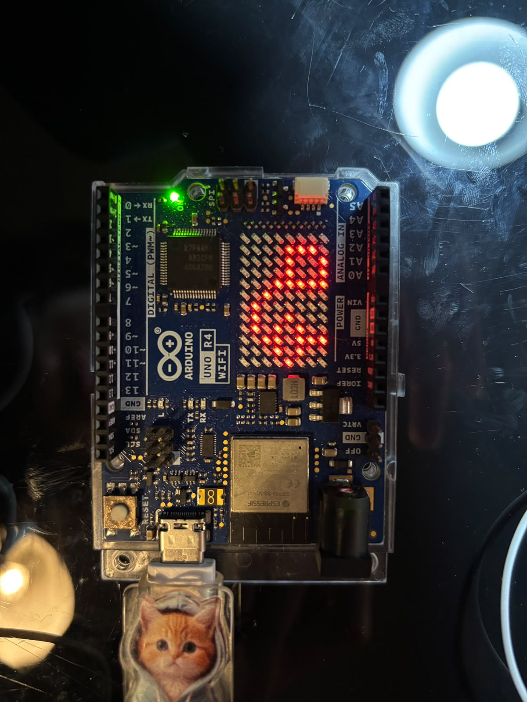

# sesion-02a

## apuntes sesión
potenciómetros y botones

Potenciometro/resistor variable: regular potencia

Cuanta energía hacen en cierto intervalo de tiempo

Para que la potencia sube, subimos la energía o bajando el tiempo

-En elec

Potencia=volt*corriente

Voltaje-energía

Corriente-tiempo

Resistor resiste el paso del electrón 

Corriente - flujo de electrones/número de electrones

El potenciómetro es una interfaz. una forma de encapsular dos resistencias/resistores

El electrón pasa por el cable y cuando pasa por los resistores la suma de ambos es siempre constante, como que se apoyan, besties.



Potenciometros- letras

A de audio - curvas exponenciales

B de lineal - curva lineal (usaremos de estos)

Al profe le gustan los botones


Hay botones (pulsadores)
- pushbutton
- toggles (cuando se apretan se mantienen en ese estado hasta que uno lo cambie)

_/ _ N.O normally open/normalmente abierto, si no hay nadie presionándolo se mantiene abierto.

5v_/ _ qué voltaje hay al otro lado? nodo mal comportado. si vale 0/tierra es corto circuito, no lo haga

muere puerto usb = muerte en la vida real

N.C normalmente conectado - siempre esta conectado y puedes desconectarlo.

Vcc voltaje de corriente continua 

Vcc - 3v3 - 5v_/ ^v^v^_ para conectarlo hay que colocar un resistor

cuando esta abierto, la punto superior del resistor es aproximadamente 0, cuando se cierra/se aprieta el botón, pasa a valer el voltaje de inicio

resistor/pulldown - es como el colchón gigante que ponen cuando alguien esta en la punta del edificio y cae por razones desconocidas.

0 no toy

1 toy


pullup - este sería como cuando la gente se tira amarrada a un elástico? salto en Benji se llamaba

Vcc _^v^v^_/ _ 0/tierra si medimos entre el resistor y botón 

- si esta abierto vale Vcc
- si se cierra vale 0
  
1 no toy

0 toy

breadboard en ingles / protoboard en español

 

buscar la tierra y conectarlo, se contamina todo el cable, peste bubónica.

positivo 5v

negativo a tierra

botón 

izq un hemisferio

der otro hemisferio

uno esta conectado al voltaje (cable rojo) y el otro lado esta conectado a un resistor y dsp a tierra. (cable negro)

el cable azul mide el voltaje, 0 cuando no esta presionado el botón. y cuando se presiona toma el valor del voltaje agregado.



Potenciometro

botón - 3 patitas - se conecta todo junto? 

las patitas de los costados van conectados a vcc y a gnd (tierra)
y la de al medio será de lectura



ARDUINO

La patita de la lectura

int patitalectura = A0;
const - constante   

una palabra seguida de un () es una función

existe un lugar de lectura al cual debo colocarle un nombre y no utilizar el nombre donde lo conecte 

Serial se escribe con mayúscula porque es un objeto, significa u n m e n s a j e . Uno a la vez en orden, muy rápido. 
Su contrario es en paralelo, todo al mismo tiempo. 

puerto Serial funciona a velocidad, funciona en múltiplos de 2, todos los ejemplos parten de 9600, moderado.

el profe generalmente trabaja a 12 veces esa velocidad. Se nota, habla rápido.

puedo subir el código sin verificar pq cuando lo subes se verifica solo antes de subirse.

El Arduino es como una muralla, si lo grafiteas y te vas el grafiti queda ahí hasta que llegues y hagas otro. Si le subes un código, desconectas la placa, lo pasas a otro computador, el código estará ahí y correrá en el otro computador.

```cpp


const int patitaLectura = A0;
// declarar 
int valorLectura = -1;
// darle un valor que nunca podrá ser 


void setup() {

 Serial.begin(9600);

}

void loop() {
 valorLectura = analogRead(patitaLectura);
 Serial.println(valorLectura);

}
```
conectar el Arduino al potenciómetro,

Patita 1 (oreja) a 5v

Patita 2 (nariz) a A0/Lectura

Patita 3 (oreja) a GND/tierra

Conectar el Arduino al PC, meterle el código, 

para ver la lectura apretar la lupita que esta en la esquina superior derecha.

va a mostrar un número constantemente

con el potenciómetro se puede cambiar el valor que se muestra.

La entrada tiene una resolución de 3 bits 

2^10 valores posibles

[0,1023] 

para decir nada 0, para decir todo 1023

ejemplos 02a

while - mientras que

! - lo contrario de 

mientras el puerto serial no se abra, no hagas nada

el seba le lanza potenciómetros al profe mientras este se quita la chaqueta, una vez que se quita la chaqueta, empieza a recibir los potenciómetros, todos los que le tiro antes de sacarse la chaqueta se perdieron

el while hace que el seba espere hasta que el profe se saque la chaqueta y esté listo para recibir potenciómetros 

potefiltradopordivision

parte los [0,1023] en 4 y quedan [0,255] - agrupa resultados

revisar actions o el correo para ver si cometiste errores

en errores malos, hacer click en el reporte y revisar donde esta el problema.

**Prueba de código en clases**

```cpp

const int patitaLectura = A0;
// declarar 
int valorLectura = -1;
// darle un valor que nunca podrá ser 


void setup() {

 Serial.begin(9600);

}

void loop() {
 valorLectura = analogRead(patitaLectura);
 Serial.println(valorLectura);

}
```






## encargos

encargo02a:

en tu fork, ir a actions, y aceptar que corran github worfklows. subir pantallazo con demostración de que han corrido actions exitosas en tu repo. esto es crucial, si no lo haces, no agregaremos tus apuntes al repo, y las tareas se tomarán como no entregadas. si en tu fork las actions no son exitosas, no serán tampoco agregadas al repo común ni evaluadas.


conformar grupos de 3 a 4 personas para la realización del proyecto-1. compartir 2 placas de desarrollo por grupo, documentar estudio conjunto de C++, microcontroladores, botones, potenciómetros.

Conformamos grupo: Belén Castillo, Martina Fernández, Maite Villarroel, Ignacia Zamudio.

Profe creo que me mande una cagaita, conecte todo según tengo escrito en mis apuntes, y corría el código que hizo de ejemplo en clases, después pegué primer código de ejemplo **ej_arduino_pote.ino** y corría así



no estoy segura de si eso era lo que debía correr o si había que ponerle otra cosa, como que me perdí en esa parte, pero bueno. Lo que pasó es que después de como 2sg con el código corriendo y el arduino conectado sentí un olor extraño, miré y el potenciómetro tiraba humo KJDSFHK yo pienso que fue la forma ordinaria en la que tenía conectada los cables, pero así fue como dijeron que los conectáramos si no habían caimanes...... lo desconecté altiro por miedo a mandarme otra cagaita. 

También pienso que puede ser porque el cable de mi mouse empezó a tirar error de que no lo reconocía, cuando lo desconecté, no reconocía la conexión del arduino, lo desconecté y volví a conectar y ahí funcionó. Revisé si es que no me había piteado los conectores usb del compu, y no, siguen funcionando, ya veía era la primera en el semestre en quemarlos pipipipi y el arduino sigue vivo




## lectura
