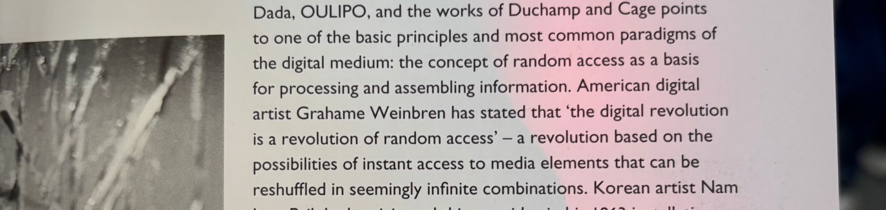

# sesion-04a

## apuntes sesión

## encargos

## lectura
valgo caca profe no tengo habitos de lectura y quizas muera en el proceso de haber escogido un libro en inglés, la elección de un ramo en el que me manejo 0 y además de un texto en inglés creo que me va a quemar el cerebro waksjalksj 

y la verdad entiendo en el momento pero no ya no me acuerdo de nada muy especificamente

muchos artistas y como han trabajado en torno al arte digital, poemas, sonidos, visuales locas y el problema de que el arte digital es un problema social

