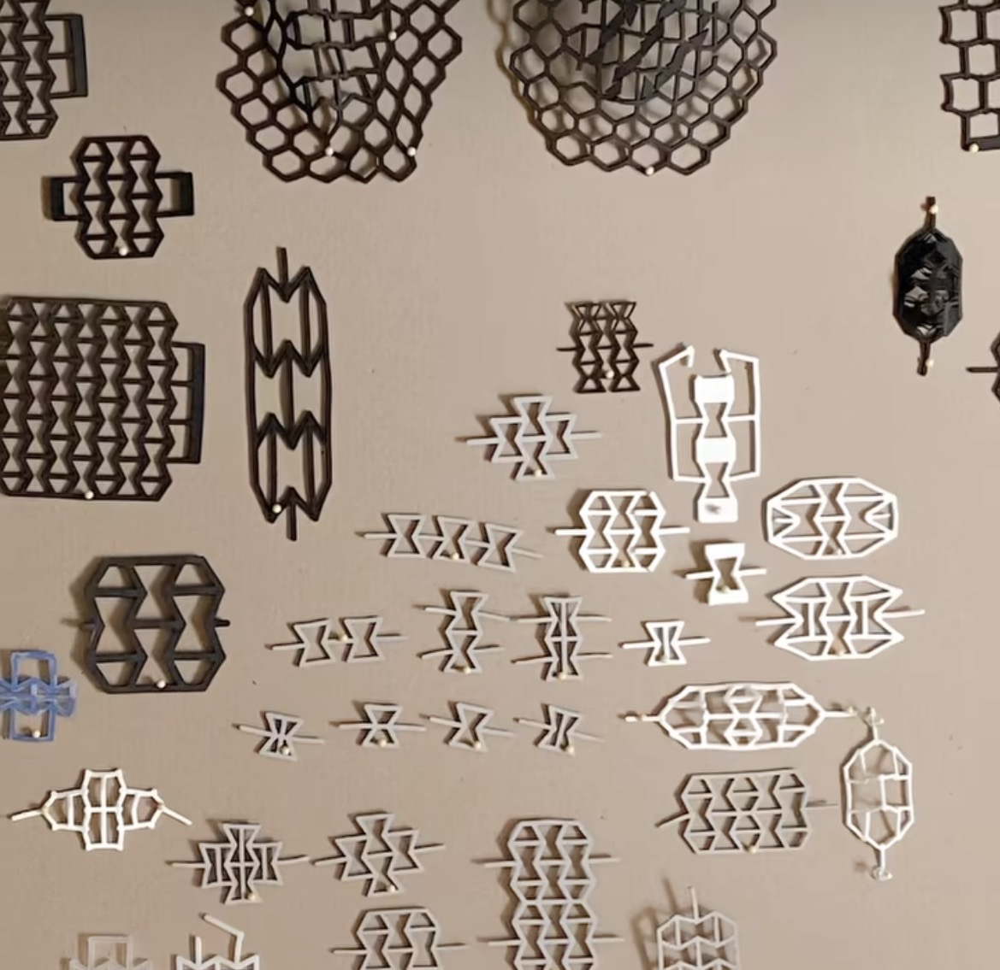
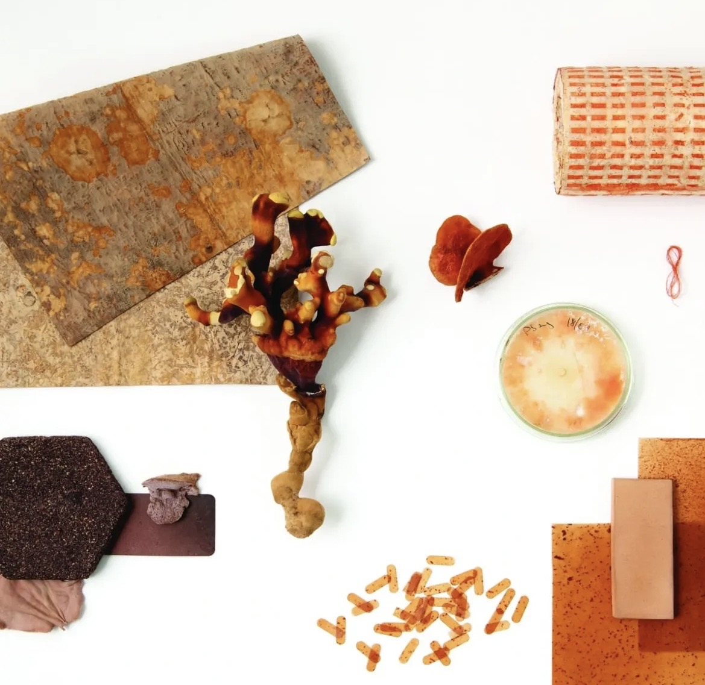
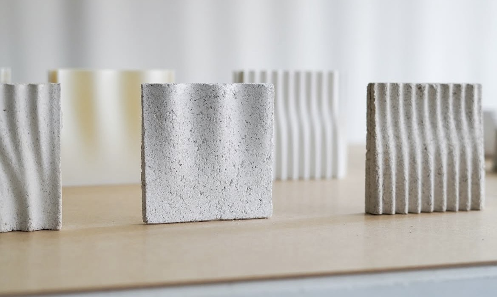
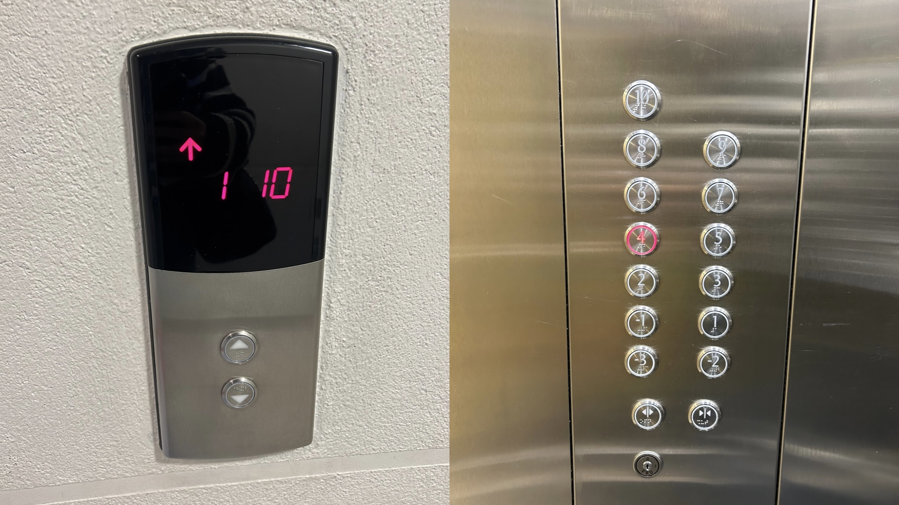
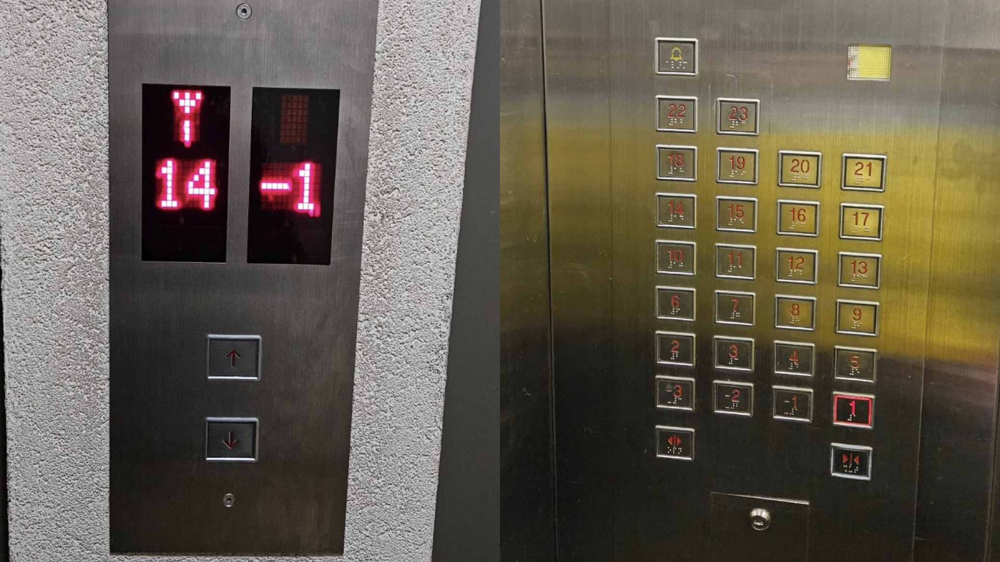
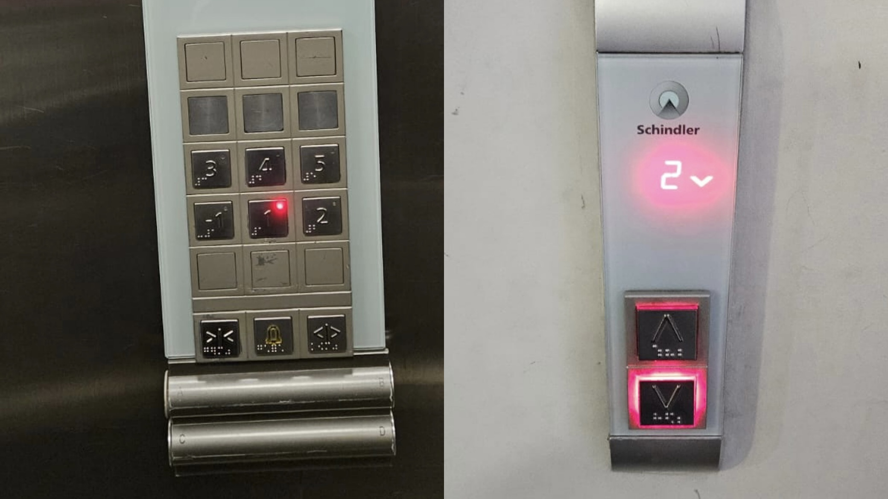

# sesion-00b

## apuntes charla

### heidi Jalkh: una práctica centrada en los materiales 

taller Materia Situada 

lidera un grupo que se llama Sistema Materiales, junto con biólogos y otras personas del rubro del diseño. Piensan en el material de manera distinta, ya no viéndolo aplicado a la forma, sino que se preguntan más allá sobre por qué usar tal material. 

presenta 3 proyectos: 

+ bio plantas inspirado. 
+ bio fungí fabricado. 
+ bio conchas basado. 

el primero, Bio Inspiración: material, forma y comportamiento. Estudió la planta de hielo de Australia, que absorbe agua y cambia su forma, generando una apertura. 

se intenta acercar a su evolución integrada de la planta, cómo se expande. 

habla sobre metamateriales: su funcionalidad la derivan de su composición geométrica y no de su composición química. 

+ el convencional se achica a la fuerza aplicada (goma eva). 
+ los auxéticos se expanden a la fuerza aplicada. 

el material es el mecanismo, son lo mismo. 

 

(habla súper rápido ella). 

su segundo proyecto, Bio Fabricado: estudió el micelio como variable para el color. 

los hongos son territoriales y no se mezclan entre sí. 

proyecto Creciendo Color. 

generaron una trama, como esténcil. 

variabilidad del diseño junto al organismo, no todo se controla. 

 

y su tercer proyecto, Bio Basado: una biocerámica a partir de conchas. Experimentó formas y resistencia del material. 

 

## presentación curso

introducción, usamos GitHub. 

retroalimentación del curso anterior, las PCB. 

conocernos, por qué elegimos el curso. Yo, en lo personal, con ganas de aprender a hacer cosas nuevas, como programar y darle vida a algún objeto.

## encargos

### sacar fotos de botoneras de ascensor y textos que los describan. 

### ascensor 1: mi edificio

lo veo todos los días y ya prácticamente me sé los botones de memoria. En la parte exterior del ascensor cuenta con una pantalla que indica dónde se encuentra el ascensor en ese momento, con números rojos. Abajo se encuentran 2 botones circulares con triángulos indicando hacia arriba y hacia abajo, y también un grabado en braille para personas con discapacidad visual. Al interior del ascensor se encuentran los botones indicando los pisos del edificio, también en forma circular, con números en color blanco y grabado en braille. El orden para leer los pisos es en zigzag, de abajo hacia arriba, que va en dos columnas. También cuenta con dos botones que tienen un diseño con triángulos indicando cerrar o abrir puertas. 

 

### ascensor 2: edificio de mi tía

Este edificio cuenta con muchos más pisos, por lo que hay más botones. En el exterior se encuentran dos pantallas indicando dónde se encuentra cada ascensor, con números en rojo. Abajo se encuentran dos botones en forma de cuadrado, con símbolos de flechas rojas apuntando hacia arriba y hacia abajo. Al interior del ascensor encontramos 4 columnas indicando los pisos del edificio en cuadrados, con números rojos y grabado en braille. El orden para leer los pisos es de derecha a izquierda y de abajo hacia arriba, primero completando una fila y luego subiendo nuevamente a la derecha y repitiendo. También cuenta con dos botones indicando si abrir o cerrar puertas y uno con una campana, en caso de emergencia. 

### ascensor 3: USM

En este ascensor, al exterior se encuentra una pantalla indicando dónde se encuentra el ascensor, con números en rojo, y abajo dos botones cuadrados con un símbolo triangular indicando hacia arriba o hacia abajo, además de grabado braille. Al interior del ascensor se encuentran tres columnas que indican los pisos del edificio, de forma cuadrada y de color metalizado. También contienen grabado braille. Se leen de izquierda a derecha y de abajo hacia arriba. En este, solo dos de las 5 filas contienen números y, en la parte inferior de estas, se encuentran tres botones más: 2 a los extremos, que indican si las puertas se abren o se cierran, y al centro un botón con una campana indicando alguna emergencia. 

 

en general, los tres ascensores cuentan con una puerta que se desplaza hacia el costado para permitir el acceso al ascensor. Son de acero y hierro. Cuentan con botones que indican todos los pisos del edificio, sensores, mecanismos internos para su funcionamiento, etc. Esto fue analizado con mayor profundidad en la sesión 01a.

