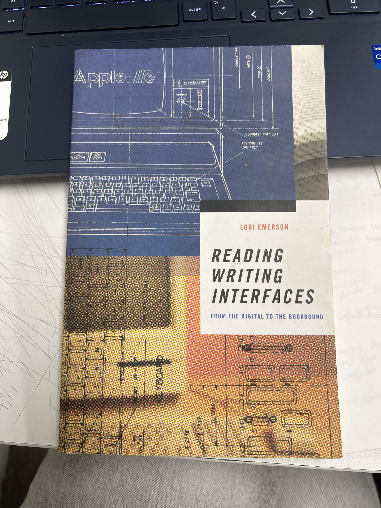
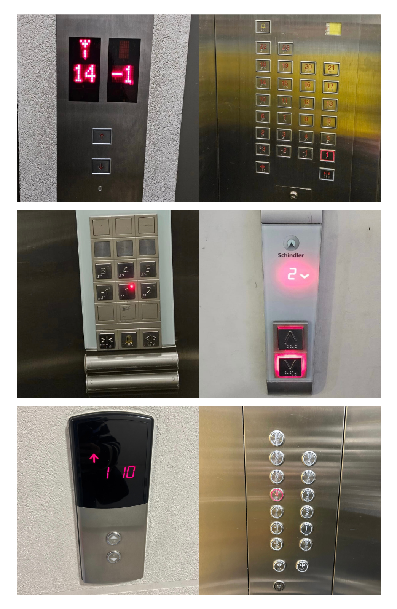
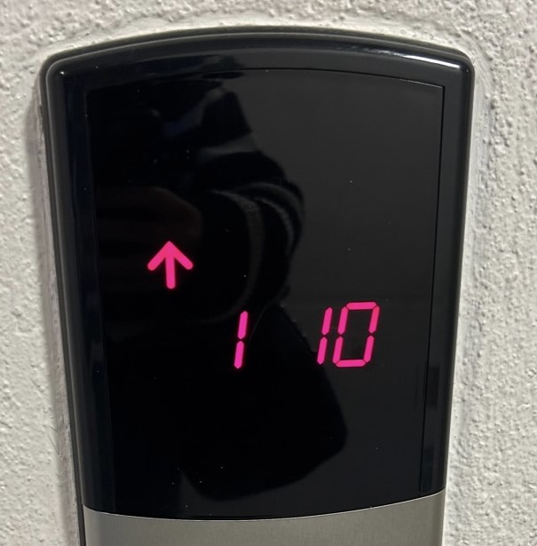
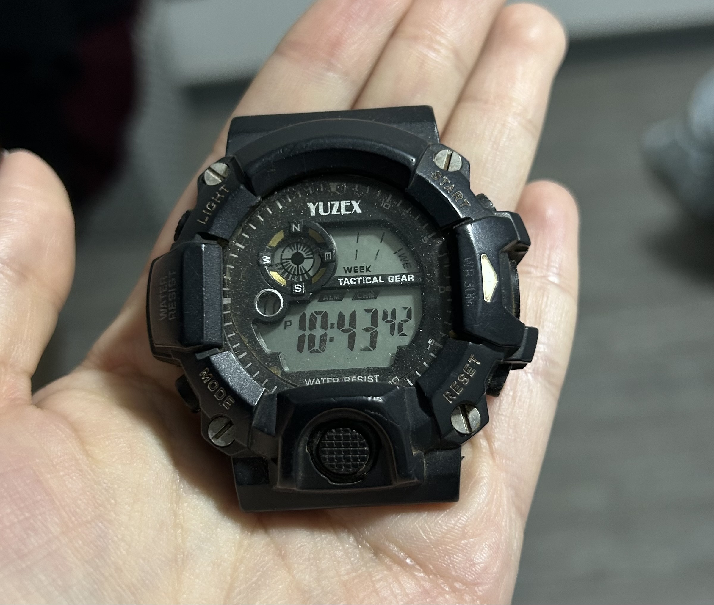
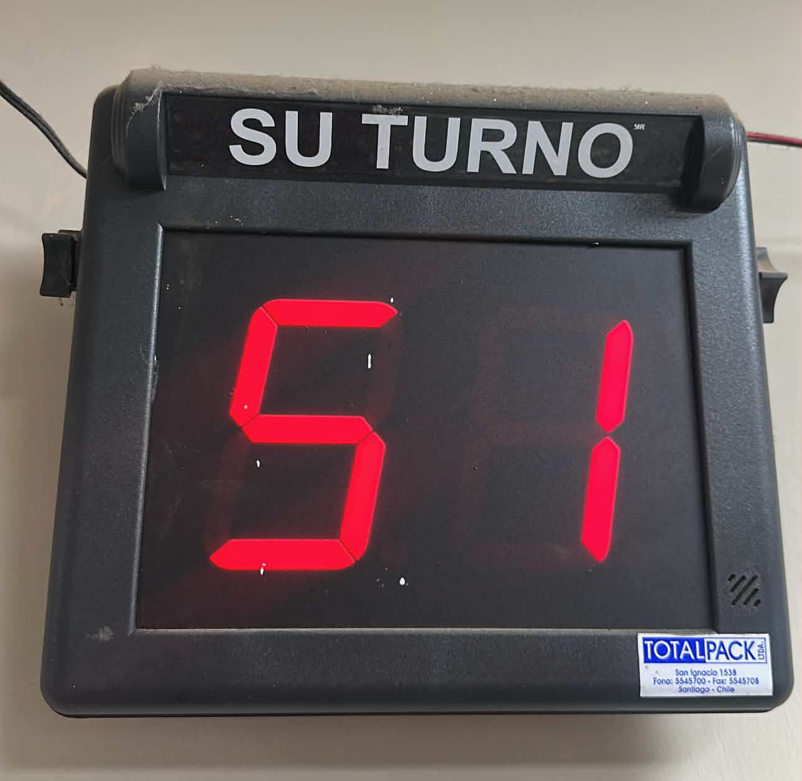

# sesion-01a

## apuntes sesión

elegimos cada uno un libro de la colección de aarón; el que yo elegí fue este :)

comenzamos con una introducción a github.

datos: seleccionar con doble clic para tener menos posibilidades de errores y nunca usar mayúsculas, a menos que sea un caso importante.

github contiene el software git → hecho para ver el historial.

debemos crear nuestro fork del repositorio para trabajar, ya que es importante trabajar en mi versión.

los nombres de archivo de imagen deben ser en minúscula y sin espacios, con guion es mejor.

dato: el . significa = aquí hay un dato.

encargo en clase: analizar las fotos de los ascensores que sacamos y generar un texto descriptivo.

los que analizamos nosotras.

nuestro texto con Antonia Loch e isidora pérez:

el ascensor cuenta con una puerta, en donde se llama a este al presionar el botón del exterior. generalmente, cuentan con similitudes de materialidad (los más actuales), como acero inoxidable y hierro. los botones indican el número de pisos, y cuentan con una luz que se obtiene al presionar el botón e indica el piso al que se dirige. algunos de estos incluyen el uso del sistema braille en los botones para personas con discapacidad visual.

según nuestros ascensores analizados, encontramos ciertas similitudes, tales como: peso límite, es decir, que todos indican un peso máximo, pero varía según el tamaño del ascensor; mecanismo de cierre y apertura de puertas, el cual incluye un sensor que detecta movimiento. en su mayoría, cuentan con una pantalla digital en la cual se indica el número de piso actual.

datos que fuimos recolectando en conjunto en clase para completar:

+ el ascensor para en los pisos que está programado para parar.
+ eje de coordenadas: eje z.
+ sistema: poleas, motores, cables.
+ uso del contrapeso.
+ electricidad (actualidad).
+ bien público: acceso a la electricidad (hace 100 años).
+ precio del ascensor.
+ trabajar en datos duros.
+ uso de los números (japón: no hay 4 :0).
+ subsuelos, estacionamientos, nivel manzana.
+ botones auxiliares: emergencia, bomberos, prender/apagar luz-aire.
+ sticker de mantención.
+ tiempo de puerta abierta.
+ subir y bajar.
+ mantenerse en el piso.
+ si no hay paréntesis, es un dato.
+ if (estoy en un piso), abrir puerta(); sonar alarma();
+ variables/funciones: entender sus funciones y cómo se hacen (absolutos y relativos).
puntos de vista.

un dato importante: los nombres que le asignemos a las cosas nos deben hacer las cosas más fáciles.

## encargos

autorretrato: describir mis variables y funciones.

¿qué son las variables? una variable es un nombre que representa un valor que puede cambiar.

### mis variables:

+ edad = 23
+ altura = 1,68 m
+ color_pelo = castaño oscuro
+ lugar_residencia = santiago
+ personalidad = tranquila y reservada
+ sociabilidad = media
+ intereses = diseño
+ comida_favorita = papas fritas
+ estado_animo = desanimada

### mis funciones:

en cuanto a mis funciones, corresponden a las acciones que realizo todos los días o la mayoría de ellos, como vestirme, comer, ir a estudiar, prestar atención, aprender, trabajar, socializar con amigos, descansar y dormir. estas serían mis funciones más generales, pero dentro de ellas también existen funciones más pequeñas, como lavarme los dientes, bañarme, peinarme, entre otras.

### Investigar pantallas de segmentos 

**1. números del ascensor**

+ contexto: pantalla ubicada al exterior del ascensor .
+ lugar/ubicación: edificio donde vivo.
+ uso: indicar el piso en el que se encuentra el ascensor.
+ alfabeto posible: números del -3 al 10 y el símbolo “-” para los pisos subterráneos.
+ los segmentos se encienden y apagan para formar los diferentes números.

2. reloj de muñeca

+ contexto: uso cotidiano/personal.
+ lugar/ubicación: en mi departamento, es el reloj de mi pareja.
+ uso: mostrar la hora.
+ alfabeto posible: números del 0 al 9.
+ los segmentos forman los diferentes números de la hora.

3. pantalla de números de atención

+ contexto: lugar donde las personas sacan un número para esperar su turno.
+ lugar/ubicación: hospital de yungay.
+ uso: indicar qué número debe pasar a ser atendido.
+ alfabeto posible: números del 0 al 9.
+ los segmentos forman los números y cómo se actualizan cuando cambia el turno.

en general, los tres indican números para entregar una información. hay variaciones principalmente en el tamaño y el color, pero todos funcionan de la misma manera.

## lectura

### reading writing interfaces: from the digital to the bookbound

**por Lori Emerson**

citas del texto 

“La interfaz es, entonces, un umbral, pero en un sentido más complejo que simplemente lo que se abre de un espacio distinto a otro espacio distinto.”(Emerson, 2014, p. x).

“¡La operatividad genera inoperabilidad! Lo anterior es, curiosamente, tanto una exageración retórica como una descripción precisa, mientras pueda seguir escribiendo noventa palabras por minuto u organizar sin esfuerzo mis documentos de procesamiento de textos, en sí mismo un logro de hábito hecho posible por el diseño de la interfaz…” (Emerson, 2014, p. xii).

leí solo las páginas relacionadas con la introducción, específicamente las páginas 10, 11 y 12. las leí dos veces cada una porque no entendía muy bien al principio, para poder agarrarle un poco de sentido a lo que estaba leyendo.

la autora habla sobre qué es una interfaz, que normalmente se relaciona con los computadores, la pantalla, el teclado y así, pero ella lo plantea de una forma más amplia, como una conexión. se habla de la interfaz como un umbral, pero más complejo que eso, ya que no solo se pasa de un lugar a otro, sino que también hay cosas ocultas que no vemos. por lo mismo, cuestiona lo positivo de que una interfaz sea fácil de usar, ya que no conocemos cómo ocurren las cosas detrás, como en el ejemplo de guardar documentos en el computador. la operatividad genera inoperabilidad, porque sabemos utilizar algo, pero no sabemos cómo funciona realmente.

me pareció interesante, porque en realidad son cuestionamientos que nunca me he hecho. nunca he visto más allá de cómo funciona mi computador.

