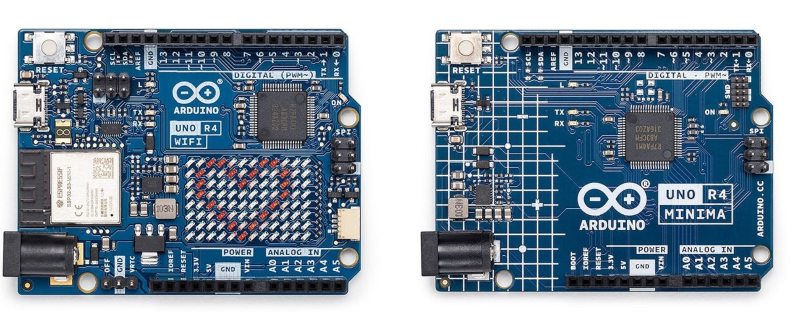

# sesion-01b

## apuntes sesión

George Boole

álgebra booleana

el operador OR, en álgebra booleana, se escribe con un +. busca siempre que el resultado sea 0, a menos que una de las entradas sea 1.

el operador AND se escribe con una multiplicación. Siempre da como resultado 0, a menos que ambas entradas sean 1.

bug de la polilla, 1947.

variables que existen.

las variables son contenedores para almacenar valores de datos, los cuales pueden cambiar durante la ejecución del programa.

+ int: almacena enteros (números enteros), sin decimales, como 123 o -123.
+ double: almacena números de coma flotante, con decimales, como 19,99 o -19,99.
+ char: almacena caracteres individuales, como 'a' o 'B'. Los valores de tipo char están rodeados de comillas simples.
+ string: almacena texto, como "Hola Mundo". Los valores de las cadenas están rodeados de comillas dobles.
+ bool: almacena valores con dos estados: verdadero o falso.

la u indica sin signo (ej: uint8_t).

software con el que trabajaremos y que nos acompañará:

**arduino ide 2.3.10**(descargar). buscar la versión que más me convenga.

+ el tic sirve para verificar. en el caso de que no tenga una placa conectada, hay que decidir para qué placa se verificará, ya que existen muchas y son distintas.
+ buscar en boards manager: uno r4 (instalar).
+ uno r4 wifi (tiene pantalla) y uno r4 mínima.
+ verificar si el código es válido para subirlo a esa placa.
+ los archivos se suben con carpeta. importante.
+ setup: configuración para que empiece (función: secuencia de instrucciones).
+ void: tipo.
+ (): indica que tiene una función.
+ { }: tiene que abrir y cerrar; estas llaves declaran la función.
+ está prohibido escribir una línea de código sin describir lo que tiene que pasar.
+ loop: se repite hasta que no se pueda. va después de setup.



Hernando Barragán, wiring: su tesis de magíster. wiring es un marco de programación de código abierto para microcontroladores.

lo que se puede escribir en español se hace, y si no, en inglés.

backtick: tilde al revés. se deben poner 3 arriba y 3 abajo  ( ```cpp)

ejemplo de esqueleto 

```cpp
void setup() {
  // aqui va setup(), ocurre una vez, al principio

}

void loop() {
  // aqui va loop()
  // ocurre despues de setup()
  // se repite hasta que no se pueda
}
```

```cpp
ejemplo Kristel

// kristel es estudiante udp
// bools
bool kristelEstudianteUDP = true;
bool kristelChilena = true;
bool kristelCoreana = false;
bool kristelDientes = true;

// integers
int kristelEdad = 22;
// cristo es 0, el tiempo fluye hacia delante
// eso es paralelo a cristo lo mas grande
int kristelNacimientoAnho = 2003;
// enero es 1, diciembre es 12
int kristelNacimientoMes = 11;
// dias desde 1 hasta lo que dure el mes
int kristelNacimientoDia = 5;

// azul
string kristelColorFavorito = "0000ff";

void setup() {
  // aqui va setup(), ocurre una vez, al principio
}

void loop() {
  // aqui va loop()
  // ocurre despues de setup()
  // se repite hasta que no se pueda

  // si estoy en el mes de nacimiento
  // de kristel
  // y ademas
  // estoy en el dia de nacimiento
  // de kristel
  // le deseo feliz cumpleanhos

  // scope esta dentro de {}
  // scope es un contexto

  // if (mesActual == kristelNacimientoMes) {
  // estoy en el mes de interes

  // if (diaActual == kristelNacimientoDia) {

  // decirle feliz cumple
  // que se tome el dia libre
  // traer cositas pa picar
  cumplirAnhosKristel();
  //}

  // otra opcion
  // if (mesActual == kristelNacimientoMes &&
  //    diaActual == kristelNacimientoDia)


  // }
}

// la vamos a correr cuando
// sea el cumple de Kristel
void cumplirAnhosKristel() {
  // actualizar la edad de Kristel
  // edad es la que es mas uno
  kristelEdad = kristelEdad + 1;
  // manera abreviada
  // kristelEdad += 1;
  // kristelEdad++;
}
```

no se parte en mayúscula.

primero se resuelve a la derecha y después se inyecta en la izquierda.
ej: kristelEdad = kristelEdad + 1;

+ las void ocurren sin emitir un resultado.
+ int nos da un resultado, para declarar.
+ declarar solo lo puedo hacer una vez.

setup: partes importantes, valores numerales, letras, palabras, imágenes, declarar datos.

loop: algo que va a estar ocurriendo constantemente, lo que queremos que pase, lo que va a estar cambiando.

página oficial de arduino, ejemplos integrados.

apuntes sobre colores y sistema decimal, binario y hexadecimal 

```cpp
// 10 millones de colores
// 24 bits tengo mas de 10 millones de valores posibles
// 3 receptores rojizo, verdoso, azuloso
// demosle 8 bits a cada canal de color
// entonces R de rojo tiene 8 bits
// G de verde tb, B de azul tb
// entonces 0 es apagado, 255 es prendido
// 8 bits se llaman 1 byte
// disco duro 2 MB, pero de 2Mb y esos son 2 mega bit

// 1 byte tiene 2 nibbles, 2 pedacitos

// 0010 1100 0101 0101 1011 1010

// en 1 nibble, o 4  bits tengo 2^4 valores posibles
// del 0 al 15


// dec    hex
// 00     0
// 01     1
// 02     2
// 03     3
// 04     4
// 05     5
// 06     6
// 07     7
// 08     8
// 09     9
// 10     A
// 11     B
// 12     C
// 13     D
// 14     E
// 15     F
```

ejemplo de declaración de funciones 
```cpp
int valorPancito = 2000;
int valorCafecito = 3000;

void setup() {
  // put your setup code here, to run once:

}

void loop() {
  // put your main code here, to run repeatedly:

  int valorDesayuno = sumarEnteros(valorPancito, valorCafecito);

  if (valorDesayuno < 5000) {
    // oh no 
  } else {

    // oh si
  }

}

// sumar numeros enteros
// es tipo int porque nos va a dar un resultado
// las void ocurren sin emitir un resultado
int sumarEnteros(int x, int y) {
  // declarar un resultado
  int resultado = 0;
  // es una abreviacion de dos pasos
  // declarar       int resultado;
  // asignar valor  resultado = 0;

  // hacer la suma de x e y
  // y reemplazar valor resultado
  // por ese valor
  resultado = x + y;

  // emitir resultado al exterior de la funcion
  return resultado;

  // declarar solo lo puedo hacer una vez
}
```


## encargos

encargo01b:

1. tratar de correr un código en el microcontrolador asignado a cada dupla, incluir referentes, citas, comentarios, imágenes, descripciones textuales, y en caso de éxito o fracaso incluir aciertos, preguntas, dramas, atados. recordatorio que estos apuntes son personales, cada persona sube su versión.

**Parpadear / blink**

Con mi pareja, Francisca Palma, utilizamos un ejemplo que encontramos en Arduino Docs. El ejemplo específico es Blink, que explica cómo funciona el código para hacer que un LED parpadee y especifica las conexiones necesarias para que funcione correctamente. Por lo que copiamos el mismo código que presentaban y armamos nuestro circuito en la protoboard. El resultado funcionó sin mayores dificultades, ya que seguir paso a paso lo que indicaba el ejemplo nos permitió comprobar que el microcontrolador funcionaba correctamente. Además, fuimos aprendiendo en el proceso qué significaban algunos elementos del código, como HIGH y LOW, que permiten controlar el estado del LED, y delay(), que determina el tiempo que permanece encendido y apagado.

Esta experiencia nos sirvió para entender un poco más cómo funciona la escritura de un código y cómo este se relaciona con lo que ocurre físicamente en el Arduino. Fue emocionante ver cómo lo que habíamos escrito funcionaba y cómo la luz del LED comenzaba a parpadear. Fue increíble, sobre todo porque es nuestro primer acercamiento a este tipo de software.

```cpp
// parpadear
// ejemplo de docs.arduino


void setup() {
  pinMode(LED_BUILTIN, OUTPUT);
}


void loop() {
  digitalWrite(LED_BUILTIN, HIGH);
  delay(1000);
```

**Pantalla LED Matrix**

También hicimos dos pruebas más. Una de ellas fue con una pantalla LED Matrix, utilizando nuevamente un ejemplo que encontramos en Arduino Docs. En este caso, nos proporcionaban el código necesario para proyectar diferentes formas en la matriz LED, como un corazón y una carita feliz.

También fue muy emocionante ver cómo el código funcionaba correctamente en nuestro Arduino y cómo la pantalla se iluminaba mostrando las diferentes formas. Fue muy loco y me encantó, porque nuevamente pudimos ver cómo algo que estaba escrito en el código se transformaba en algo visible y funcionaba físicamente en nuestro circuito.

```cpp
#include "Arduino_LED_Matrix.h"


ArduinoLEDMatrix matrix;


void setup() {
  Serial.begin(115200);
  matrix.begin();
}


const uint32_t happy[] = {
    0x19819,
    0x80000001,
    0x81f8000
};
const uint32_t heart[] = {
    0x3184a444,
    0x44042081,
    0x100a0040
};


void loop(){
  matrix.loadFrame(happy);
  delay(500);


  matrix.loadFrame(heart);
  delay(500);
}
```

**Serial / Monitor Serial**

Por último, también experimentamos con otro ejercicio de Serial, que encontramos en Arduino Docs. El ejemplo daba el código completo para mostrar mensajes, pero nosotros no utilizamos todo, ya que solo queríamos mostrar uno de ellos.

Al cargar el código para comprobar si estaba correcto, no aparecía ningún error, pero el mensaje tampoco se veía en el Monitor Serial. Intentamos buscar por nuestra cuenta cuál podía ser el problema, pero no lo encontramos, así que recurrimos a la inteligencia artificial. Nos explicó que el código estaba funcionando, pero que debíamos agregarle un tiempo para que el mensaje se mostrara constantemente y así poder visualizarlo. Lo modificamos y finalmente funcionó correctamente.
Este fue uno de los dramas que tuvimos, pero también nos sirvió para entender que un código puede estar correcto y aun así necesitar pequeños ajustes para que el resultado pueda visualizarse como esperamos.

```cpp
// serial.begin()
// ejemplo encontrado en docs.arduino


void setup() {
  Serial.begin(9600);


}
void loop() {
  Serial.println("hola");
  delay(1000);
}
```


2. proponer una función con nombre, tipo, argumentos y uso, que modele algún área de su interés, por ejemplo subirCerro(enBicicleta), tomarMetro(conPaseEscolar), etc. escribir en pseudocódigo los pasos que necesita esa función internamente para que literalmente funcione.

FUNCIÓN irAlSupermercado(listaDeCompras)
    tomar bolsa
    tomar listaDeCompras
    salir de casa
    caminar hasta el supermercado
    entrar al supermercado
    para cada producto en listaDeCompras
        buscar producto
        poner producto en el carro
    fin para
    ir a la caja
    pagar
    guardar productos en la bolsa
    salir del supermercado
    caminar hasta la casa
FIN FUNCIÓN

Utilicé esta referencia para guiarme en cómo realizar mi pseudocódigo.


## lectura
