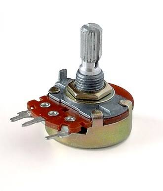
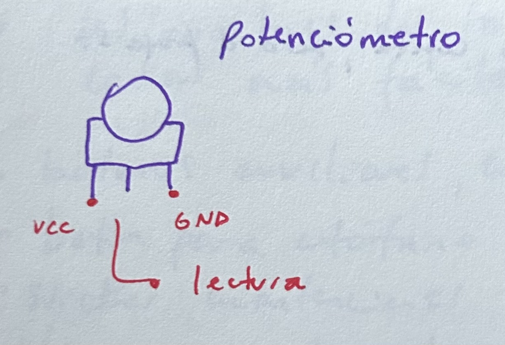
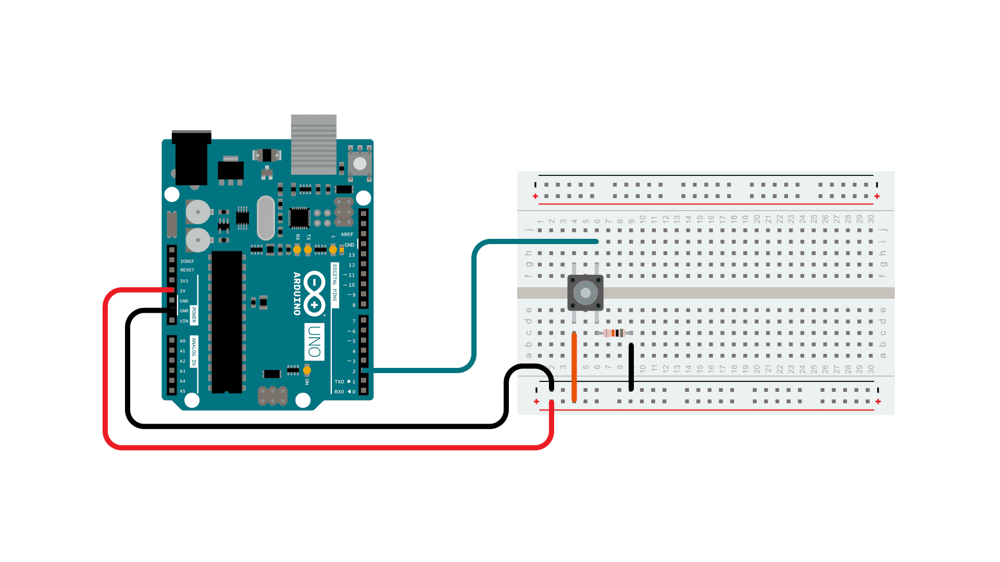
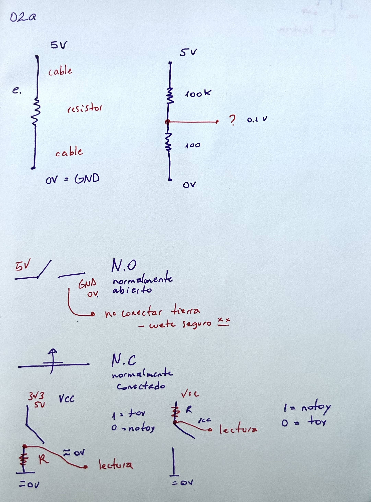
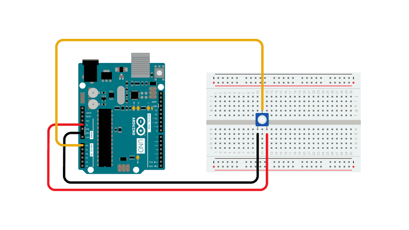
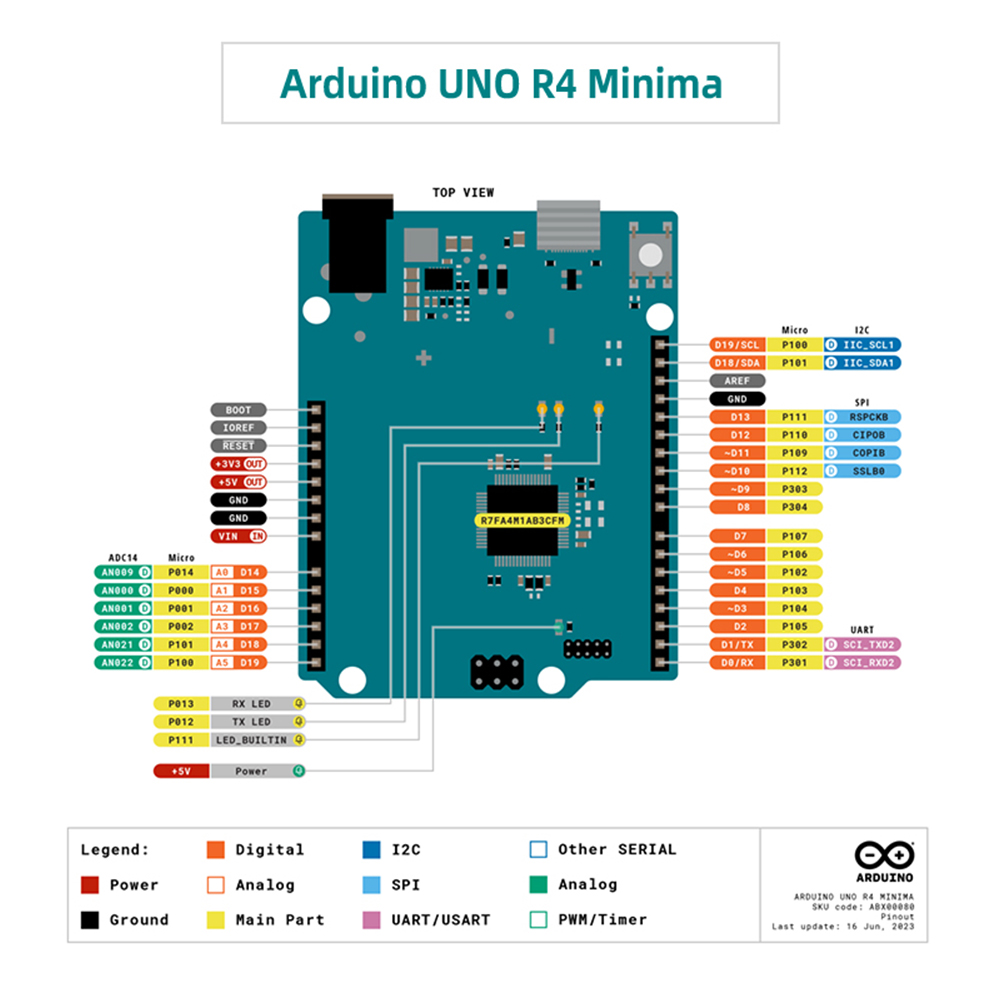

# sesion-02a

## apuntes sesión

### clase de: botones / potenciómetros / pushbuttons / toggles

## ¿qué es un potenciómetro?



un potenciómetro es una resistencia eléctrica cuyo valor se puede cambiar a mano usando una perilla o un botón deslizante. sirve para controlar la cantidad de corriente o de voltaje que pasa por un circuito.
+ regular la potencia, varía una propiedad eléctrica llamada resistencia.
+ es una interfaz, una forma de encapsular dos resistores.
+ pot = r1 + r2 = constante.
+ en la patita 2 regulamos el voltaje.
+ tiene 3 patitas: dos orejas y nariz.



### tipos de potenciómetros

hay lineales y exponenciales
+ tipo a (audio), exponenciales: el cambio sigue una curva para adaptarse a los sentidos humanos.
+ tipo b son potenciómetros lineales: el cambio es constante y directo.

> 💡 **dato:** los potenciómetros tipo a se utilizan principalmente en audio porque la percepción humana del volumen no es lineal.

### potencia / eléctrica / voltaje

**potencia**
+ potencia = energía dividido por tiempo.
+ subiendo la energía o bajando el tiempo, la potencia sube.

**potencia eléctrica**
+ potencia eléctrica = voltaje multiplicado por corriente.
+ es una forma de calcular la potencia.
+ tiene que tener energía y tiempo de igual forma.

**voltaje**
+ voltaje = energía / tiempo = corriente.
+ lo que se emite es el voltaje.

> 💡 el voltaje se puede entender como una diferencia de energía eléctrica entre dos puntos.

### resistor y electrón
+ el resistor resiste a que el electrón pase.
+ la corriente es un flujo de electrones, número de electrones.
+ el electrón se cansa al pasar por la resistencia.

> 💡 **dato:** al pasar corriente por una resistencia, parte de la energía eléctrica se transforma en calor.

## botones
+ son pulsadores (pushbutton).
+ elementos temporales, que con el paso del tiempo pasan cosas.
+ vcc = voltaje de corriente continua.
+ utilizar resistor para no conectar a tierra directamente.

> ⭐ resistor pulldown = permite que la lectura sea siempre 0 aunque el botón no esté presionado.

### no y nc
+ no = normalmente abierto. aquí el electrón no puede transitar cuando el botón no está presionado.
+ nc = normalmente conectado.

### pull-down y pull-up




+ pull-down: llegar a tierra con calma.
+ pull-up: llegar a vcc con calma.

> 💡 el resistor pull-down mantiene la entrada en 0 cuando el botón no está presionado, mientras que el pull-up mantiene la entrada en 1.

> 📌 **recordar**
> + cables rojos para alimentación (vcc).
> + cables negros para tierra (gnd)(colores lechugescos).
> + mantener los colores de los cables de forma ordenada ayuda a reconocer las conexiones.




### ejercicio potenciómetro

```cpp
const int patitaLectura = A0;

int valorLectura = -1;

void setup() {
  Serial.begin(9600);
}

void loop() {
  valorLectura = analogRead(patitaLectura);
  Serial.println(valorLectura);
}
```
**valores de lectura**
+ valor mínimo: 0.
+ valor máximo: 1023.
+ resolución: 10 bits.

> ⭐ **importante**
> + a0 = patita de lectura, es la variable.
> + colocar int al principio, ya que incluye número entero.
> + agregar const para que sea una constante.
> + int valorLectura se irá reemplazando con el valor del voltaje que diga la patita 2 del potenciómetro.

**void setup**
+ puede quedar vacío, ya que el lado análogo del arduino son todas entradas.
+ agregar Serial.begin.
+ serial es uno a la vez, muy rápido.
+ 9600 es moderado.

> 💡 **dato:** Serial.begin(9600) permite iniciar la comunicación serial entre el arduino y el computador.

**void loop**
+ println: imprime esto en una línea, imprime y salta a la otra línea.
+ en 10 bits (resolución 10 bits, 2^10): para decir nada digo 0 y para decir todo digo 1023.

**otros conceptos**
+ while: mientras que.
+ !: lo contrario de.

## ubicación exacta de los pines


ubicación exacta de los pines del microcontrolador y los puertos de conexión.

**lado análogo**
+ aquí se conecta el potenciómetro.
+ lado a, son todas entradas.

**lado digital**
+ lado donde están los pines digitales.
+ estos pueden utilizarse como entradas o salidas.

## encargos


## lectura

### reading writing interfaces: from the digital to the bookbound

**por Lori Emerson**

**citas del texto** 

cita 1: “En general, la arqueología mediática no busca revelar el presente como una consecuencia inevitable del pasado, sino que busca describirlo como una posibilidad generada a partir de un pasado heterogéneo.” (Emerson, 2014, p. xiii).

cita 2: “El MAL es, entonces, un tipo de dispositivo de pensamiento que nos permite jugar y rastrear la escritura como retoque en las primeras obras de literatura digital; proporcionar acceso a la especificidad material totalmente única de estas computadoras, sus interfaces, sus plataformas y su software también hace posible desfamiliarizar o hacer visibles interfaces y plataformas contemporáneas invisibles para la crítica.” (Emerson, 2014, p. xvi).

> 💭 **reflexión sobre la lectura**

> al principio me costó entender la lectura, porque cuando hablaba de los medios los relacionaba principalmente con la comunicación. sin embargo, a medida que fui leyendo, entendí que el texto también habla de las tecnologías que utilizamos para leer, escribir e interactuar con la información, como las máquinas de escribir, los computadores, sus interfaces, los programas y las distintas formas que existen para interactuar con ellos.

> me llamó especialmente la atención la comparación entre el apple ii y el apple lisa, por lo que también investigué un poco sobre cuál era cuál. esto me permitió entender mejor una parte del texto, ya que muestra algo que actualmente para nosotros es normal, pero que antes no existía de la misma manera: las interfaces gráficas. hoy estamos acostumbrados a ver íconos, ventanas y diferentes elementos gráficos en una pantalla, pero antes era necesario utilizar instrucciones y escribir comandos para poder interactuar con el computador. esto me hizo pensar que muchas veces utilizamos las interfaces sin cuestionarlas, simplemente porque estamos acostumbrados a ellas.

> esto lo relacioné con la cita 1 que escogí. lo que entendí de esta idea es que el presente no necesariamente tenía que ser como es ahora. durante el desarrollo de las tecnologías pudieron existir muchas posibilidades y caminos diferentes.

> la cita 2 también me llamó la atención porque entendí que el mal, que corresponde al media archaeology lab, permite al autor estudiar estas tecnologías de una manera más práctica. no solamente busca conocerlas leyendo sobre ellas, sino que también busca experimentar directamente con computadores, interfaces, programas y tecnologías antiguas para entender cómo funcionaban y cómo influían en la forma de escribir y leer.

**páginas leídas:** xii, xiii, xiv, xv y xvi.

> 🔎 dato investigado: el apple ii se utilizaba principalmente mediante comandos de texto, mientras que el apple lisa incorporó una interfaz gráfica de usuario.

**palabras que no entendí y que investigué**

+ teleología: es una forma de entender algo pensando que todo tiene un propósito o que el desarrollo de algo necesariamente conduce hacia un resultado final.
+ indexa: “Indexar” significa, de manera sencilla, registrar, identificar u organizar información para poder encontrarla o relacionarla.


