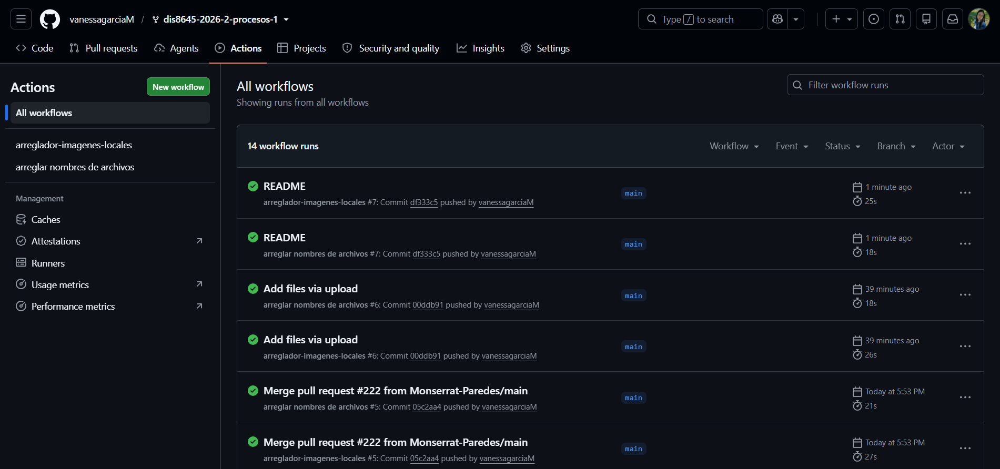
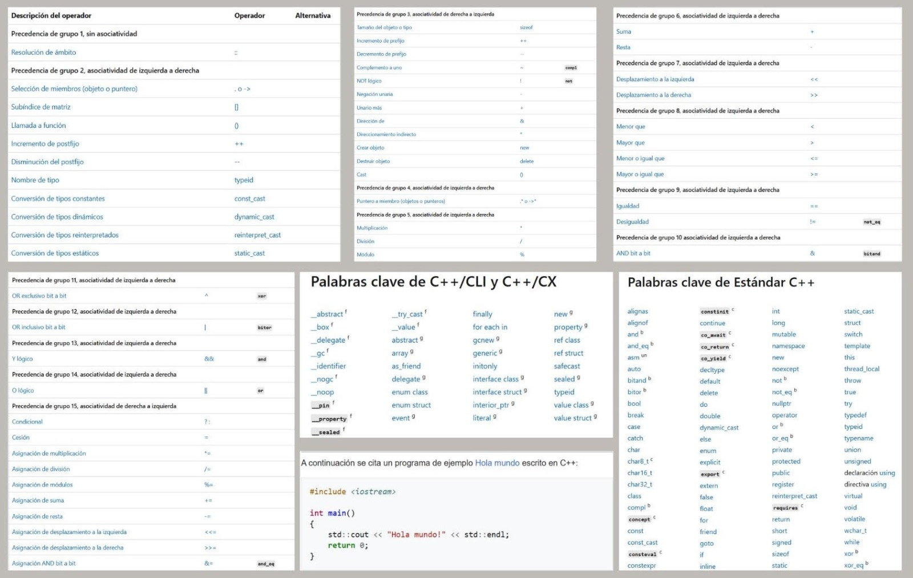
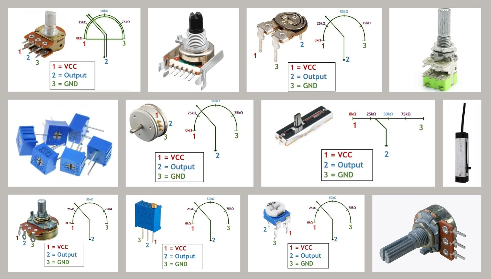
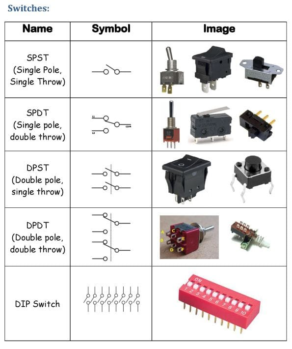

# sesion-02a

## apuntes sesión

### clase de: botones / potenciómetros / pushbuttons / toggles

## ¿qué es un potenciómetro?


un potenciómetro es una resistencia eléctrica cuyo valor se puede cambiar a mano usando una perilla o un botón deslizante. sirve para controlar la cantidad de corriente o de voltaje que pasa por un circuito.
+ regular la potencia, varía una propiedad eléctrica llamada resistencia.
+ es una interfaz, una forma de encapsular dos resistores.
+ pot = r1 + r2 = constante.
+ en la patita 2 regulamos el voltaje.
+ tiene 3 patitas: dos orejas y nariz.


### tipos de potenciómetros

hay lineales y exponenciales
+ tipo a (audio), exponenciales: el cambio sigue una curva para adaptarse a los sentidos humanos.
+ tipo b son potenciómetros lineales: el cambio es constante y directo.

> 💡 **dato:** los potenciómetros tipo a se utilizan principalmente en audio porque la percepción humana del volumen no es lineal.

### potencia / eléctrica / voltaje

**potencia**
+ potencia = energía dividido por tiempo.
+ subiendo la energía o bajando el tiempo, la potencia sube.

**potencia eléctrica**
+ potencia eléctrica = voltaje multiplicado por corriente.
+ es una forma de calcular la potencia.
+ tiene que tener energía y tiempo de igual forma.

**voltaje**
+ voltaje = energía / tiempo = corriente.
+ lo que se emite es el voltaje.

> 💡 el voltaje se puede entender como una diferencia de energía eléctrica entre dos puntos.

### resistor y electrón
+ el resistor resiste a que el electrón pase.
+ la corriente es un flujo de electrones, número de electrones.
+ el electrón se cansa al pasar por la resistencia.

> 💡 **dato:** al pasar corriente por una resistencia, parte de la energía eléctrica se transforma en calor.

## botones
+ son pulsadores (pushbutton).
+ elementos temporales, que con el paso del tiempo pasan cosas.
+ vcc = voltaje de corriente continua.
+ utilizar resistor para no conectar a tierra directamente.

> ⭐ resistor pulldown = permite que la lectura sea siempre 0 aunque el botón no esté presionado.

### no y nc
+ no = normalmente abierto. aquí el electrón no puede transitar cuando el botón no está presionado.
+ nc = normalmente conectado.

### pull-down y pull-up


+ pull-down: llegar a tierra con calma.
+ pull-up: llegar a vcc con calma.

> 💡 el resistor pull-down mantiene la entrada en 0 cuando el botón no está presionado, mientras que el pull-up mantiene la entrada en 1.

> 📌 **recordar**
> + cables rojos para alimentación (vcc).
> + cables negros para tierra (gnd)(colores lechugescos).
> + mantener los colores de los cables de forma ordenada ayuda a reconocer las conexiones.


### ejercicio potenciómetro

```cpp
const int patitaLectura = A0;

int valorLectura = -1;

void setup() {
  Serial.begin(9600);
}

void loop() {
  valorLectura = analogRead(patitaLectura);
  Serial.println(valorLectura);
}
```
**valores de lectura**
+ valor mínimo: 0.
+ valor máximo: 1023.
+ resolución: 10 bits.

> ⭐ **importante**
> + a0 = patita de lectura, es la variable.
> + colocar int al principio, ya que incluye número entero.
> + agregar const para que sea una constante.
> + int valorLectura se irá reemplazando con el valor del voltaje que diga la patita 2 del potenciómetro.

**void setup**
+ puede quedar vacío, ya que el lado análogo del arduino son todas entradas.
+ agregar Serial.begin.
+ serial es uno a la vez, muy rápido.
+ 9600 es moderado.

> 💡 **dato:** Serial.begin(9600) permite iniciar la comunicación serial entre el arduino y el computador.

**void loop**
+ println: imprime esto en una línea, imprime y salta a la otra línea.
+ en 10 bits (resolución 10 bits, 2^10): para decir nada digo 0 y para decir todo digo 1023.

**otros conceptos**
+ while: mientras que.
+ !: lo contrario de.

## ubicación exacta de los pines


ubicación exacta de los pines del microcontrolador y los puertos de conexión.

**lado análogo**
+ aquí se conecta el potenciómetro.
+ lado a, son todas entradas.

**lado digital**
+ lado donde están los pines digitales.
+ estos pueden utilizarse como entradas o salidas.

## encargos

encargo02a:

en tu fork, ir a actions, y aceptar que corran github worfklows. subir pantallazo con demostración de que han corrido actions exitosas en tu repo. esto es crucial, si no lo haces, no agregaremos tus apuntes al repo, y las tareas se tomarán como no entregadas. si en tu fork las actions no son exitosas, no serán tampoco agregadas al repo común ni evaluadas.



conformar grupos de 3 a 4 personas para la realización del proyecto-1. compartir 2 placas de desarrollo por grupo, documentar estudio conjunto de C++, microcontroladores, botones, potenciómetros.

## c++ 

### ¿qué es c++?

lenguaje programación más influyente y esencial en el desarrollo de software, creado en 1979 por Bjarne Stroustrup como una extensión del lenguaje C (lenguaje de programación de propósito general). 

se destaca por su control sobre los recursos, velocidad y eficiencia, utilizado en sistemas operativos complejos, convirtiéndose así en la opción para los desarrolladores que buscan máximo rendimiento.

### su evolución

este nace como una extensión de C, manteniendo eficiencia y control sobre el hardware, 
extendiendo la capacidad de este agregando nuevas características como la programación orientada a objetos y permitir estructurar el código de manera más modular y reutilizable. 

de igual manera este ha seguido evolucionando introduciendo nuevas versiones como lo son:
- C++11
- C++14
- C++17
- C++20

estas versiones han añadido características modernas que optimizan el rendimiento y simplifican el desarrollo, como las expresiones lambda, la gestión automática de memoria y las plantillas genéricas. 

### tipos de programación

en lo que se destaca C++ es que es un lenguaje versátil para diferentes tipos de proyectos, permitiendo diferentes tipos de programación, tales como:
- programación orientada a objetos: permite estructurar el código en objetos, facilitando la reutilización y el mantenimiento.
- programación procedimental: programación estructurada, organizándose en funciones y procedimientos.
- programación genérica: crear código que es capaz de funcionar con diferentes tipos de datos, destacando la reutilización y flexibilidad.

### características
- alto rendimiento: al ser un lenguaje compilado, permite que el código sea traducido de manera directa a instrucciones de máquina, reduciendo el tiempo de ejecución de los programas, además este otorga un control preciso en el uso de recursos del sistema como la memoria y el procesador.
- flexibilidad: permite diferentes paradigmas de programación, destacando su adaptabilidad y versatilidad dirigida a distintos proyectos.
- compatibilidad: a pesar de ser una extensión de C, este también es capaz de integrar los códigos escritos en C, sin necesidad de reescribir los códigos.

### sus diferentes usos

estos son algunos de los diferentes usos en los cuales se puede aplicar C++:
- desarrollo software de sistemas: capacidad de gestionar de manera directa recursos del hardware y su alto rendimiento, es especialmente escogido para software de bajo nivel en donde se requiere un control preciso en el ámbito de memoria y procesamiento.
- videojuegos/ motores gráficos: lenguaje popular en el ámbito del desarrollo de motores gráficos,juegos que requieren alto rendimiento y simulaciones 3D.
- aplicaciones financieras/ telecomunicaciones: se utiliza para almacenar grandes volúmenes de datos en tiempo real y que requieren alta eficiencia.
- programación dispositivos embebidos: desarrollo de software embebido para dispositivos electrónicos con recursos limitados. (microcontroladores, electrodomésticos inteligentes, control industrial)

> sistema embebido: sistema informático diseñado para hacer una tarea muy específica dentro de un aparato más grande.

### lenguaje 

el lenguaje C++ es un lenguaje amplio, el cual acá veremos un ejemplo básico y algunas de las palabras claves.

las palabras clave son identificadores reservados predefinidos que tienen un significado especial para el compilador, no se pueden usar como identificadores en el programa.

```
- setup: configuración para que empiece (función: secuencia de instrucciones) partes importantes, valores numerales, letras, palabras, imágenes, declarar datos). no responder, solo ocurrir.
- void: vacío, "esta función ocurre...", no expulsa valor, tipo.
- (): indica que tiene una función.
- ; aquí termina. como punto final.
- // comentario, describe todo lo que va a pasar, toda línea de código tiene que estar comentada.
- pseudocódigo
- { }: tiene que abrir y cerrar; estas llaves declaran la función.
- == comparar
- ctrl d formatear
está prohibido escribir una línea de código sin describir lo que tiene que pasar.
- loop: se repite hasta que no se pueda. va después de setup.
- backtick: carácter para renderizar códigos + indicar lenguaje cpp. ```
- bool: almacena dos valores (verdadero/falso).
- string: manejar cadenas de texto.
- while: mientras que...
- ! lo contrario de
- print = muestra algo en el Monitor Serial y deja el cursor en la misma línea.
- println = muestra algo y después salta a la siguiente línea.
```
> palabras claves que vimos en clases de taller.



> en esta imagen tenemos algunos de las palabras claves, las cuales hay una diversidad amplia

## potenciómetros

### ¿qué es un potenciómetro?

un potenciómetro es una resistencia variable de tres terminales. funciona como un elemento ajustable dentro de un circuito y tiene aplicaciones como el control de volumen en amplificadores, el ajuste de brillo en sistemas de iluminación y el control de diferentes parámetros eléctricos.
su funcionamiento se basa principalmente en el divisor de tensión cuando se utilizan los tres terminales. al ajustar la posición del rascador sobre el elemento resistivo, cambia la resistencia entre el rascador y cada uno de los extremos y, como consecuencia, cambia el voltaje de salida.
los potenciómetros son componentes pasivos, es decir, no necesitan una fuente de alimentación propia para realizar su función.
### estructura y funcionamiento
los potenciómetros generalmente tienen:
dos terminales extremos conectados a los extremos del elemento resistivo.
un terminal central llamado rascador, limpiaparabrisas o wiper.
un elemento resistivo.
un mecanismo que permite mover el rascador.
al mover el rascador a lo largo del elemento resistivo, se modifica la resistencia entre el rascador y cada uno de los terminales extremos. de esta manera, cuando se utilizan los tres terminales, es posible controlar el voltaje de salida.
si se utilizan solamente dos terminales, el potenciómetro puede funcionar como una resistencia variable.
### tipos de potenciómetros
existen potenciómetros analógicos y digitales.
**potenciómetros analógicos**
los potenciómetros analógicos utilizan un mecanismo físico para modificar la posición del rascador. según la forma en que se mueve, pueden clasificarse en:
giratorios: utilizan una perilla y un eje. al girarlos, el rascador se desplaza sobre el elemento resistivo.
lineales: utilizan un mecanismo de deslizamiento que permite mover el rascador en línea recta.
trimmers o potenciómetros de ajuste: están diseñados para realizar ajustes que normalmente no necesitan modificarse con frecuencia. pueden ajustarse utilizando una herramienta externa, como un destornillador.
**potenciómetros digitales**
los potenciómetros digitales no utilizan un rascador mecánico. en su lugar, emplean una red de resistencias y dispositivos electrónicos que permiten modificar digitalmente el valor de resistencia mediante señales de control.
los potenciómetros pueden utilizarse para:
controlar el volumen de un amplificador.
ajustar el brillo de los sistemas de iluminación.
controlar diferentes parámetros dentro de un circuito.
modificar una señal de voltaje.
realizar ajustes de calibración en equipos electrónicos.

| tipo de potenciómetro | características | uso / aplicación |
|---|---|---|
| **rotativo** | tiene una perilla y un eje que se giran para modificar la resistencia. | control de volumen, brillo y otros ajustes. |
| **lineal o de deslizamiento (fader)** | el rascador se mueve de forma recta mediante un control deslizante. | consolas de mezcla y equipos de audio. |
| **trimmer o de ajuste** | es pequeño y se ajusta normalmente con un destornillador. | calibración y ajuste de circuitos electrónicos. |
| **trimmer de múltiples vueltas** | puede girar varias veces, permitiendo realizar ajustes más precisos. | ajustes finos de resistencia. |
| **trimmer sin carcasa** | no tiene carcasa externa y puede montarse directamente en una pcb. | ajustes y calibración en placas de circuito. |
| **doble vía / dual o estéreo** | contiene dos potenciómetros independientes controlados mediante un mismo eje. | control simultáneo de dos canales, especialmente en audio estéreo. |
| **servo potenciómetro** | está diseñado para trabajar con servomotores y ajusta el voltaje según el movimiento o posición del motor. | control relacionado con servomotores. |
| **digital** | utiliza señales digitales para controlar la resistencia y no requiere movimiento mecánico. | control de parámetros dentro de circuitos mediante señales digitales. |

### pines

los potenciómetros generalmente tienen tres terminales:
- primer terminal: un extremo del elemento resistivo.
- segundo terminal: el rascador o wiper.
- tercer terminal: el otro extremo del elemento resistivo.
  
la disposición física de los terminales puede variar dependiendo del modelo, por lo que no siempre se debe asumir que una determinada posición física corresponde a un terminal específico. lo importante es identificar correctamente los dos extremos del elemento resistivo y el terminal del rascador.

### parámetros principales de un potenciómetro
- resistencia nominal: es el valor máximo de resistencia entre los dos terminales extremos. se expresa en Ω, kΩ o MΩ. por ejemplo, un potenciómetro de 10 kΩ tiene una resistencia total de 10 kΩ entre sus dos extremos.
- potencia nominal: indica la potencia máxima que el potenciómetro puede soportar sin sobrecalentarse o dañarse. se expresa en vatios (w).
- tolerancia: indica cuánto puede variar la resistencia real respecto al valor nominal indicado por el fabricante. por ejemplo, un potenciómetro de 10 kΩ con una tolerancia de ±10 % puede tener una resistencia real entre 9 kΩ y 11 kΩ.
- coeficiente de temperatura: indica cuánto puede variar la resistencia cuando cambia la temperatura. generalmente se expresa en ppm/°c. un coeficiente menor permite obtener una mayor estabilidad frente a cambios de temperatura.
- vida mecánica: indica aproximadamente cuántos movimientos o ciclos de ajuste puede soportar el potenciómetro antes de que su funcionamiento pueda deteriorarse.
- ley o característica de variación: describe cómo cambia la resistencia en función de la posición del rascador. las más comunes son la lineal y la logarítmica. la elección depende de la aplicación.
resolución: es especialmente importante en los potenciómetros digitales y representa la cantidad de niveles diferentes de resistencia que pueden seleccionarse.

### valores de resistencia

los potenciómetros se fabrican con diferentes valores de resistencia nominal, que indican la resistencia máxima entre sus dos terminales extremos. estos valores se expresan normalmente en ohmios (ω), kiloohmios (kω) o megaohmios (mω).



## microcontroladores

### ¿qué es un microcontrolador?

un microcontrolador es un circuito integrado compacto diseñado para gobernar un sistema o realizar una tarea específica dentro de un aparato más grande, como parte de un sistema embebido. en su interior integra una unidad central de procesamiento (cpu), memoria y líneas de entrada/salida (e/s) programables, además de diferentes periféricos que permiten interactuar con otros componentes electrónicos.

### componentes internos
- cpu (unidad central de procesamiento): es el componente encargado de ejecutar las instrucciones del programa, realizar cálculos y controlar el funcionamiento general del microcontrolador.
- memoria flash: es una memoria no volátil utilizada habitualmente para almacenar el programa que ejecutará el microcontrolador. al ser no volátil, conserva la información incluso cuando el dispositivo deja de recibir energía. en los microcontroladores avr, la memoria flash se utiliza como memoria de programa y puede ser reprogramada.
- memoria ram (sram): es una memoria volátil utilizada para almacenar temporalmente datos, variables y otra información necesaria mientras el programa está en ejecución. su contenido se pierde cuando se interrumpe la alimentación eléctrica.
- puertos de e/s (entrada/salida): son pines físicos que permiten conectar el microcontrolador con componentes externos, como sensores, botones, potenciómetros y actuadores, por ejemplo motores o luces.
- periféricos internos: los microcontroladores pueden incorporar diferentes periféricos, como temporizadores (timers), convertidores analógico-digitales (adc) y módulos de comunicación como uart, i²c y spi. estos permiten realizar tareas de medición, control y comunicación con otros dispositivos.
  
### tipos de arquitecturas de memoria
- arquitectura von neumann: utiliza un espacio de memoria común para almacenar tanto las instrucciones del programa como los datos. por lo tanto, las instrucciones y los datos utilizan la misma estructura de memoria y vías de acceso.
- arquitectura harvard: utiliza espacios de memoria separados para las instrucciones del programa y los datos, generalmente con buses independientes. esta separación permite acceder a las instrucciones y a los datos de manera independiente y puede mejorar el rendimiento del procesamiento. la arquitectura avr, por ejemplo, utiliza una arquitectura harvard.
  
### familias populares
- avr: familia de microcontroladores de 8 bits desarrollada por microchip. un ejemplo conocido es el atmega328p, utilizado en placas como arduino uno. los microcontroladores avr utilizan arquitectura harvard y cuentan con memoria flash para almacenar el programa y sram para los datos.
- arm cortex-m: familia de núcleos de microcontroladores orientada a aplicaciones que requieren diferentes niveles de capacidad de procesamiento y eficiencia energética. se encuentra en numerosos microcontroladores utilizados en sistemas embebidos y aplicaciones industriales y de consumo.
  
### aplicaciones de los microcontroladores

los microcontroladores se utilizan en una gran variedad de sistemas embebidos y dispositivos electrónicos. algunas de sus aplicaciones incluyen:
automatización y control industrial: control de motores, sensores, sistemas de control y diferentes procesos automatizados.
dispositivos médicos y wearables: monitoreo y procesamiento de información proveniente de sensores y dispositivos portátiles.
electrodomésticos inteligentes: control de diferentes funciones en lavadoras, microondas, sistemas de climatización y otros dispositivos.
instrumentos musicales electrónicos y sintetizadores: control de interfaces, botones, secuencias y diferentes procesos relacionados con señales electrónicas.

## botones

### ¿qué es un botón?

un botón o pulsador es un componente electromecánico que permite controlar manualmente la conexión eléctrica de un circuito. en los pulsadores momentáneos, el contacto cambia de estado mientras se ejerce presión sobre el botón y vuelve a su estado inicial cuando se libera. los interruptores pueden clasificarse según el tipo de contacto y su funcionamiento.}

### estructura y funcionamiento
- terminales y contactos: los botones poseen contactos eléctricos internos que se conectan o desconectan mecánicamente cuando se acciona el botón. en un pulsador táctil, por ejemplo, un elemento metálico móvil permite establecer el contacto eléctrico al presionar el actuador.
- estado normal abierto (no): los contactos permanecen abiertos cuando el botón no está accionado. al presionarlo, los contactos se cierran y permiten el paso de corriente.
- estado normal cerrado (nc): los contactos permanecen cerrados cuando el botón no está accionado. al presionarlo, los contactos se abren e interrumpen la conexión eléctrica.
- componentes pasivos: un botón no genera energía eléctrica por sí mismo, sino que modifica la conexión eléctrica del circuito y permite enviar una señal de entrada al microcontrolador.
  
### tipos de botones
- SPST (Single Pole, Single Throw): Es el interruptor más básico. Cuenta con un solo polo y un solo tiro, por lo que simplemente abre o cierra un único circuito, funcionando como un clásico interruptor de encendido y apagado (ON/OFF). Los encuentras en formatos de palanca, balancín o deslizantes.
​- SPDT (Single Pole, Double Throw): Tiene un polo y dos tiros. Permite desviar una señal de entrada hacia dos salidas diferentes o actuar como un conmutador para alternar entre dos fuentes distintas hacia una misma salida.
- DPST (Double Pole, Single Throw): Posee dos polos y un tiro. Controla dos circuitos independientes de manera simultánea con un solo accionamiento físico (por ejemplo, útil para cortar al mismo tiempo la fase y el neutro de la corriente alterna por seguridad).
- DPDT (Double Pole, Double Throw): Combina ambas características con dos polos y dos tiros, permitiendo manejar dos circuitos separados donde cada uno puede conmutar entre dos rutas. Es muy empleado en electrónica para invertir polaridad en motores o rutear señales complejas.
- DIP Switch: Consiste en un bloque compacto que agrupa múltiples interruptores individuales (generalmente tipo SPST) en una sola pieza. Se utiliza principalmente en placas de circuito impreso (PCB) para configuraciones estáticas de hardware o modos de operación.



### relación entre los componentes dentro del sistema

existe una correlación directa entre todos estos elementos dentro de un mismo sistema electrónico:
el microcontrolador actúa como el cerebro del sistema, encargado de procesar y ejecutar el código programado en c++. recibe información de los distintos componentes de entrada, procesa esos datos y genera las respuestas correspondientes.
los potenciómetros entregan señales analógicas variables que el microcontrolador puede leer mediante sus entradas analógicas. al girar el potenciómetro, cambia el valor de la señal eléctrica, permitiendo controlar diferentes parámetros dentro del sistema.
los botones entregan señales digitales, generalmente asociadas a estados de encendido/apagado ("high"/"low"). estas señales se conectan a los pines de entrada del microcontrolador, permitiéndole detectar cuándo un botón ha sido presionado y tomar decisiones lógicas en función de esa información.

### referencias 

https://www.digikey.es/es/articles/the-complete-guide-to-potentiometers 

https://www.ariat-tech.es/blog/the-structure,function,and-common-types-of-potentiometers.html 

https://openwebinars.net/blog/que-es-cpp/ 

https://learn.microsoft.com/es-es/cpp/cpp/welcome-back-to-cpp-modern-cpp?view=msvc-170 

https://www.esic.edu/rethink/tecnologia/que-es-cpp-importancia-ejemplos-c 

https://www2.eii.uva.es/fund_inf/cpp/temas/1_introduccion/introduccion.html 

https://es.wikipedia.org/wiki/C%2B%2B 

https://www.microchip.com/en-us/search?q=microcontrollers 

https://onlinedocs.microchip.com/oxy/GUID-78362176-487F-41B9-95C7-B478A9A186EB-en-US-2/GUID-58665E03-55DB-4291-ADAA-2E3A8C9CB261.html

https://components.omron.com/us-en/products/basic-knowledge/switches/basics 

https://components.omron.com/us-en/products/switches/tactile-switches/tactile-switch_features 

---


## lectura

### reading writing interfaces: from the digital to the bookbound

**por Lori Emerson**

**citas del texto** 

cita 1: “En general, la arqueología mediática no busca revelar el presente como una consecuencia inevitable del pasado, sino que busca describirlo como una posibilidad generada a partir de un pasado heterogéneo.” (Emerson, 2014, p. xiii).

cita 2: “El MAL es, entonces, un tipo de dispositivo de pensamiento que nos permite jugar y rastrear la escritura como retoque en las primeras obras de literatura digital; proporcionar acceso a la especificidad material totalmente única de estas computadoras, sus interfaces, sus plataformas y su software también hace posible desfamiliarizar o hacer visibles interfaces y plataformas contemporáneas invisibles para la crítica.” (Emerson, 2014, p. xvi).

> 💭 **reflexión sobre la lectura**

> al principio me costó entender la lectura, porque cuando hablaba de los medios los relacionaba principalmente con la comunicación. sin embargo, a medida que fui leyendo, entendí que el texto también habla de las tecnologías que utilizamos para leer, escribir e interactuar con la información, como las máquinas de escribir, los computadores, sus interfaces, los programas y las distintas formas que existen para interactuar con ellos.

> me llamó especialmente la atención la comparación entre el apple ii y el apple lisa, por lo que también investigué un poco sobre cuál era cuál. esto me permitió entender mejor una parte del texto, ya que muestra algo que actualmente para nosotros es normal, pero que antes no existía de la misma manera: las interfaces gráficas. hoy estamos acostumbrados a ver íconos, ventanas y diferentes elementos gráficos en una pantalla, pero antes era necesario utilizar instrucciones y escribir comandos para poder interactuar con el computador. esto me hizo pensar que muchas veces utilizamos las interfaces sin cuestionarlas, simplemente porque estamos acostumbrados a ellas.

> esto lo relacioné con la cita 1 que escogí. lo que entendí de esta idea es que el presente no necesariamente tenía que ser como es ahora. durante el desarrollo de las tecnologías pudieron existir muchas posibilidades y caminos diferentes.

> la cita 2 también me llamó la atención porque entendí que el mal, que corresponde al media archaeology lab, permite al autor estudiar estas tecnologías de una manera más práctica. no solamente busca conocerlas leyendo sobre ellas, sino que también busca experimentar directamente con computadores, interfaces, programas y tecnologías antiguas para entender cómo funcionaban y cómo influían en la forma de escribir y leer.

**páginas leídas:** xii, xiii, xiv, xv y xvi.

> 🔎 dato investigado: el apple ii se utilizaba principalmente mediante comandos de texto, mientras que el apple lisa incorporó una interfaz gráfica de usuario.

**palabras que no entendí y que investigué**

+ teleología: es una forma de entender algo pensando que todo tiene un propósito o que el desarrollo de algo necesariamente conduce hacia un resultado final.
+ indexa: “Indexar” significa, de manera sencilla, registrar, identificar u organizar información para poder encontrarla o relacionarla.


