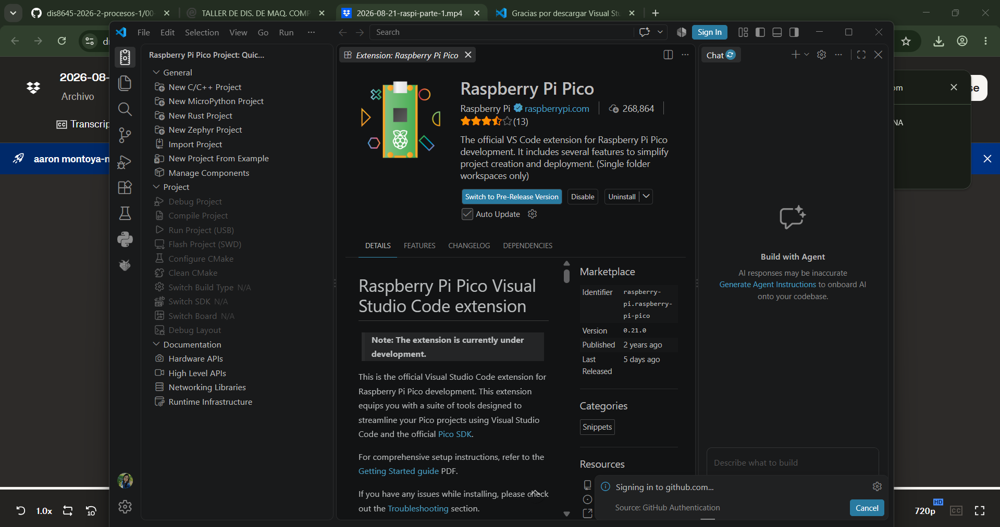

# sesion-02b

clase cancelada por cierre de udp

## apuntes sesión

## encargos

encargo02b:

subimos videos en canvas de hoy, son 3 videos.

1: instalar visual studio code, cami está regrabando el video parte 1 porque tuvimos un problema ténico, les avisará por discord cuando esté listo
2: ver los videos parte 2 y parte 3, aunque no tengan una placa raspberry pi, anotar dudas, tratar de subir código a sus placas si es que las piden.

 

tener ojo con las versiones, porque son beta y pueden tener errores. Si algo no nos funciona, indicar la versión.

raspberry pi es la empresa.

qué bello que funciona en windows sin mayor drama :)

si vamos a trabajar con claude, especificar versiones, si es windows y así. son detalles importantes.

saber qué versión de micropython estamos usando.

import project: se pueden ver proyectos.

cómo crear un proyecto

**buenos modales:**
+ nombre al archivo.
+ board type: revisar en la placa.
+ sin RISC-V.
+ darle un lugar.
+ usar la versión más nueva siempre.
+ usar Console over USB.
+ generar C++ code (solo activar ese).

darle permiso cuando salga el modo restrictivo.

.vscode: jamás vamos a tocar esas cosas.

build: resultados del código; tampoco los vamos a usar.

el código es: main.cpp.

las líneas 1 y 2 las genera el proyecto.

