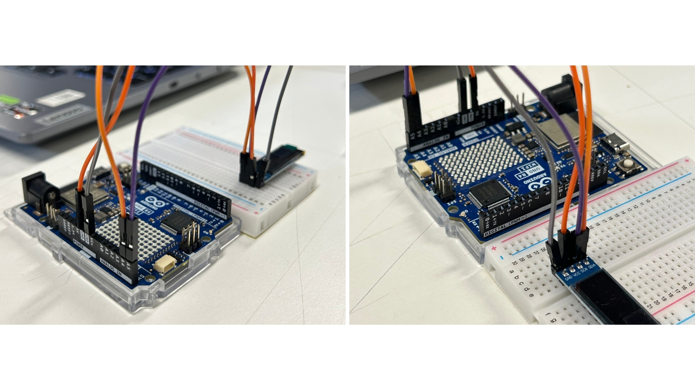
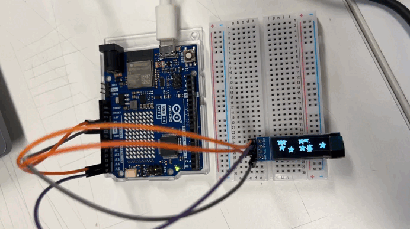

# sesion-03a

## apuntes sesión

### pantalla lcd oled 0.91"

+ monocromática, o sea, tiene un solo color.
+ controlador ssd1306.
+ tiene 4 patitas que se van a conectar a la protoboard.
+ no alimentar las conexiones hasta estar seguros de que todo está bien.
+ primero conectar vcc y gnd.
+ luego conectar:
  + sck: señal de clock.
  + sda: señal de datos.



> 💡 **dato:** es "biblioteca", no "librería".

en la biblioteca hay minicódigos que vamos a utilizar.

> 💡 **dato:** adafruit: revisar sus códigos.

archivos `.h`: son archivos de encabezado que contienen declaraciones y definiciones que podemos utilizar en el código.

> ⭐ **importante:**
> + no olvidar el punto y coma al cerrar las instrucciones.
> + `#include`: permite incluir el contenido de una biblioteca en nuestro código.
> + si aparece `spi`, no la vamos a usar.

**arduino r4 wifi**

+ a4 → sda (amarillo).
+ a5 → scl (azul).

> ⚠️ **cuidado**
> borrar es delicado. cuidado con dejar un "murciélago", porque se puede destruir todo.

**ejemplo**

ejemplo de adafruit:

`ssd1306_128x32_i2c`

**ejemplo reducido**



```cpp
#define LOGO_HEIGHT   16
#define LOGO_WIDTH    16

void setup() {
  Serial.begin(9600);

  // Wait for display
  delay(500);

  // SSD1306_SWITCHCAPVCC = generate display voltage from 3.3V internally
  if(!display.begin(SSD1306_SWITCHCAPVCC, SCREEN_ADDRESS)) {
    Serial.println(F("SSD1306 allocation failed"));
    for(;;); // Don't proceed, loop forever
  }

  // Show initial display buffer contents on the screen --
  // the library initializes this with an Adafruit splash screen.
  display.display();
  delay(2000); // Pause for 2 seconds

  // Clear the buffer
  display.clearDisplay();

  // Draw a single pixel in white
  display.drawPixel(10, 10, SSD1306_WHITE);

  // Show the display buffer on the screen. You MUST call display() after
  // drawing commands to make them visible on screen!
  display.display();
  delay(2000);
  // display.display() is NOT necessary after every single drawing command,
  // unless that's what you want...rather, you can batch up a bunch of
  // drawing operations and then update the screen all at once by calling
  // display.display(). These examples demonstrate both approaches...

  testdrawchar();      // Draw characters of the default font

  testdrawstyles();    // Draw 'stylized' characters

  testscrolltext();    // Draw scrolling text
  // Invert and restore display, pausing in-between
  display.invertDisplay(true);
  delay(1000);
  display.invertDisplay(false);
  delay(1000);

  
}

void loop() {
}

void testdrawchar(void) {
  display.clearDisplay();

  display.setTextSize(1);      // Normal 1:1 pixel scale
  display.setTextColor(SSD1306_WHITE); // Draw white text
  display.setCursor(0, 0);     // Start at top-left corner
  display.cp437(true);         // Use full 256 char 'Code Page 437' font

  // Not all the characters will fit on the display. This is normal.
  // Library will draw what it can and the rest will be clipped.
  for(int16_t i=0; i<256; i++) {
    if(i == '\n') display.write(' ');
    else          display.write(i);
  }

  display.display();
  delay(2000);
}

void testdrawstyles(void) {
  display.clearDisplay();

  display.setTextSize(1);             // Normal 1:1 pixel scale
  display.setTextColor(SSD1306_WHITE);        // Draw white text
  display.setCursor(0,0);             // Start at top-left corner
  display.println(F("Hello, world!"));

  display.setTextColor(SSD1306_BLACK, SSD1306_WHITE); // Draw 'inverse' text
  display.println(3.141592);

  display.setTextSize(2);             // Draw 2X-scale text
  display.setTextColor(SSD1306_WHITE);
  display.print(F("0x")); display.println(0xDEADBEEF, HEX);
... (Quedan 77 líneas) 
```

### definir qué hacer - proyecto-01

definimos a nuestro poeta, que será federico garcía lorca. investigamos cuáles son sus libros y, en conjunto, elegimos el libro *romancero gitano* y, específicamente, el poema **"romance de luna, luna"**.


revisamos si podíamos utilizar libremente sus poemas en nuestro trabajo y, efectivamente, pueden utilizarse de forma gratuita, sin necesidad de permisos ni pagos.

definimos, más o menos, la idea que queremos proyectar en nuestra pantalla. queremos reemplazar algunas frases por emojis. la idea todavía sigue en proceso… 🙂

## lectura

### reading writing interfaces: from the digital to the bookbound

**por lori emerson**

**citas del texto**

“un poema escrito en una máquina de escribir no es simplemente una serie de palabras entregadas a través de un dispositivo de escritura mecánico y, para el caso, la máquina de escribir tampoco es simplemente un dispositivo de escritura mecánica.” (emerson, 2014, p. xix).

“estos poemas expresan y promulgan una poética de las especificidades materiales notablemente variadas de la máquina de escribir como un tipo particular de interfaz de escritura mecánica que necesariamente flexiona tanto cómo como lo que uno escribe.” (emerson, 2014, p. xix).

**páginas leídas:** xvi, xvii, xviii, xix, xx y xxi.

> 💭 **reflexión sobre la lectura**
 
> en general, estas páginas no tienen mucho contenido para profundizar, sino que funcionan más como una introducción a los capítulos que vienen. el autor hace una breve descripción de lo que se abordará en cada capítulo.

> estas citas adelantan un poco lo que se verá en el capítulo 3, donde se plantea que la máquina de escribir no es solamente una herramienta que transmite palabras, sino que también influye en cómo se construye y se escribe el poema.


