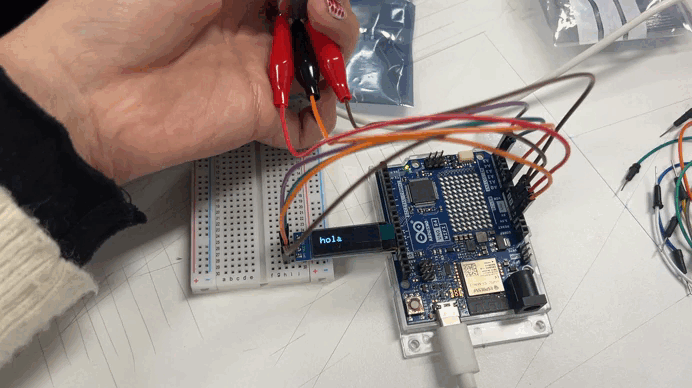
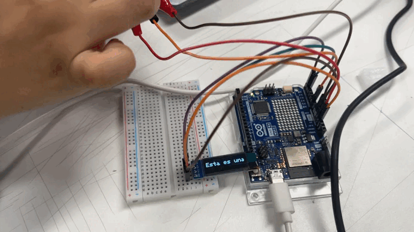

# sesion-03b

## apuntes sesión

### strings code

+ los strings tienden a ser un problema.
+ son como una seguidilla de mostacillas.
+ existe un fin de string que es invisible, o sea, tenemos un carácter más de lo que esperamos.

> 💡 **dato:** programar en c++ es agnóstico. sirve para arduino y para otros dispositivos o plataformas que utilicen c++.

### comillas en c++

+ en c++ se utilizan dos comillas para representar palabras.
+ las comillas dobles `"` indican que estamos trabajando con un string.
+ las comillas simples `'` indican que estamos trabajando con un solo carácter.

> ⭐ **importante:** no es lo mismo `string` con minúscula que `String` con mayúscula. ojo con eso.

### arreglo de tipo carácter

podemos utilizar un arreglo de tipo carácter para que el código corra en cualquiera que utilice c++ y ya no solamente en arduino, como en el ejemplo anterior.

char Str6[15] = "arduino";
+ corchetes `[]` significa arreglo.
+ Str6: pésimo ejemplo, no es necesaria la mayúscula y puede ser cualquier palabra.
+ las comillas indican el valor de la variable.

> 💡 **dato:** c++ no es tan fluido.

```cpp
ejemplo edades 
// declaracion de arreglo de enteros
// que se llama edades
int edades[3] = { 37, 22, 24 };

void setup() {
  Serial.begin(9600);
}

void loop() {
  Serial.print(edades[0]);
  Serial.print(", ");
  Serial.print(edades[1]);
  Serial.print(", ");
  Serial.println(edades[2]);
}
```
println: solo imprime el último y hace enter.

```cpp
// bah que raro
// con 5 no funciono
char nombre[6] = "aaron";

void setup() {
  Serial.begin(9600);
}

void loop() {
  Serial.print(nombre[0]);
  Serial.print(nombre[1]);
  Serial.print(nombre[2]);
  Serial.print(nombre[3]);
  Serial.println(nombre[4]);
}
```
hay que poner 1 carácter más, ya que tiene que estar el carácter que cierra el string.

> ⭐
```cpp
// un poemario
// es un arreglo de paginas
// una pagina es un arreglo de lineas
// una linea es un arreglo de caracteres
```
```cpp
char *misVersos[] = {
  "Mami, no te haga' de rogar",
  "No me gustaría perder el tiempo",
  "Que tenemo' pa' poderte tocar",
  "Y estás con otro, esa mierda no lo entiendo, yeah",
  "Que te lo juro, no eres nada pa' mí, te lo juro, ah",};


// bah que raro
// con 5 no funciono
char nombre[6] = "aaron";

void setup() {
  Serial.begin(9600);
}

void loop() {
  Serial.println(misVersos[0]);
}
```
> 💡 **dato:** el poder del `*` permite dejar de preocuparse por cuánto mide.

+ `char` viene con c++.

### avance proyecto en clase

probamos con el código utilizado en clases para poder proyectar un texto en la pantalla. consultamos con cloud para modificar el movimiento de la palabra, ya que en el código original se movía en todas direcciones y queremos que se desplace hacia un lado junto con el potenciómetro.

> ✅ **funciona:** pero la palabra llega hasta el límite de la pantalla y necesitamos que traspase el límite y desaparezca. después de varios intentos, ¡finalmente resultooooo! viva chile, traspasa la pantalla y aparece en una sola línea 🙂

> 🐛 **error:** nos faltó una resistencia de 1k para pull-up, buenos modales (lo olvidamos jiji), para que no se dañe el arduino.
> + esto era para que el botón cambie la frase que se muestra en pantalla.
> + conectar todo a positivo en la protoboard, ya que varias conexiones lo necesitan y el arduino no cuenta con tantos.
> + usar bien los colores de los cables. ahora estaban desordenados porque no teníamos tanta variedad de colores.

> ❌ **no funciona:** el botón. cambiamos la resistencia, cambiamos el botón, cambiamos sus conexiones y sigue sin funcionar. ¡revisar!




## encargos

encargo-03b:

1. apuntes personales de String, string, array, con bibliografia y con pantallazos de resultados, y dudas textuales.
2. subir código a su bitácora ordenado con el formato de backticks a continuación, del proyecto hasta ahora.
3. definir y escribir el corpus a usar: autora, poemas, licencias, poblarlo en la carpeta 00-proyecto-1


```cpp
// codigo aqui
// por ejemplo
```


