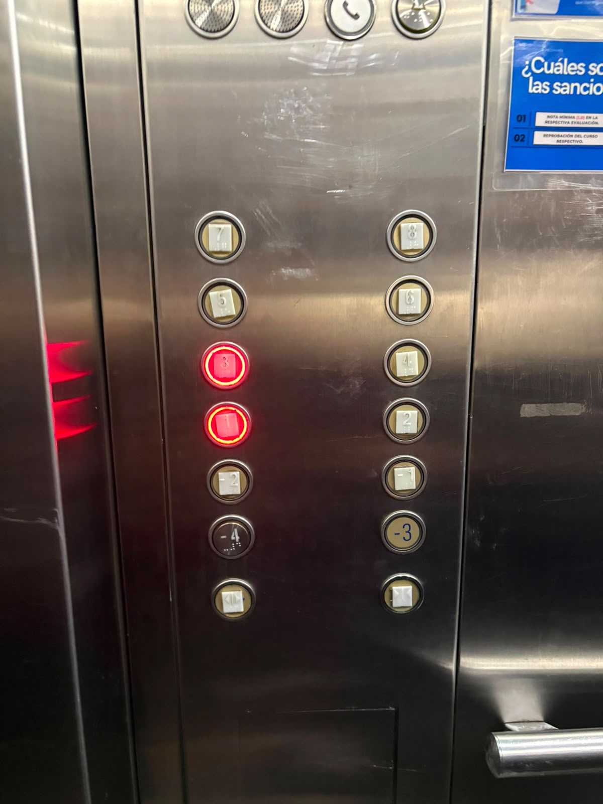
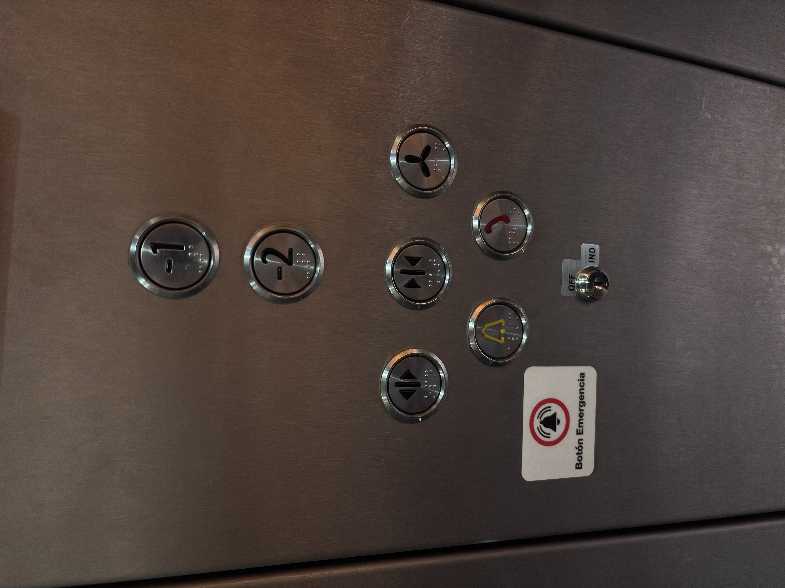
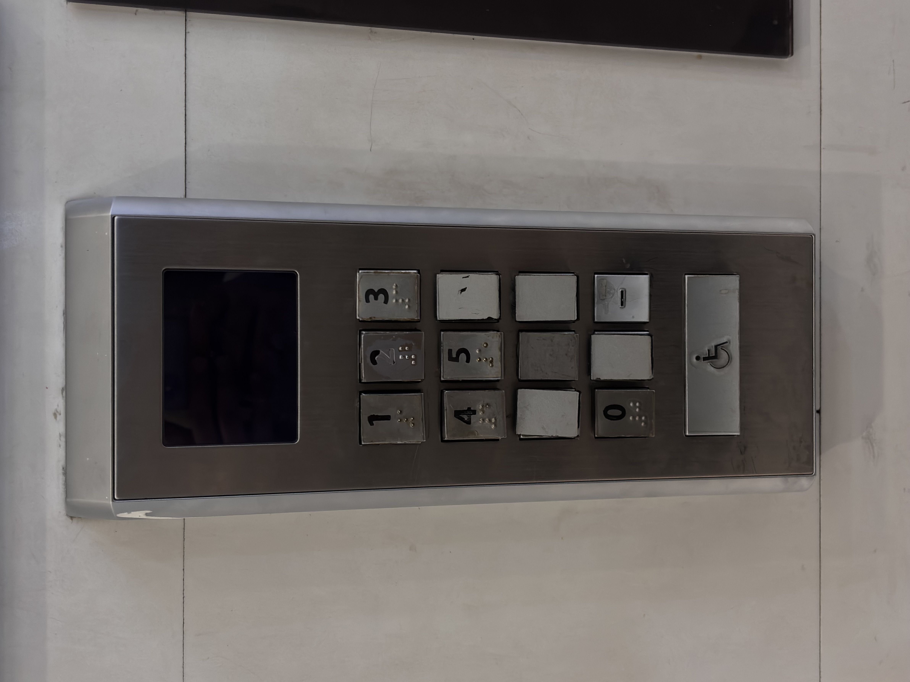

# sesion-00b

## apuntes sesión
ser especificos con las mayusculas y minusculas
se elimina la peor nota de los encargos
las instrucciones para un comptador siempre son desde cero y precisas, no entiende nada si no es ultra preciso

## encargos
ASCENSORESSS

1

Ascensor sede udp de Huechuraba
12 botones de pisos, organizados en dos columnas,. Los números impares están a la izquierda y los pares a la derecha, mientras que los subterráneos están al revés.
Los botones seleccionados se iluminan en rojo, mostrando de inmediato que la instrucción fue registrada. También se nota bastante desgaste en algunos números y símbolos, por el uso seguramente. Los botones de emergencia están separados de los pisos. Hay dos botones con diseño diferente, quizá fueron agregados después o los renovaron. todos tienen braile además de que todos los simbolos tienen relieve

2

Ascensor metro
2 botones de pisos, organizados de forma vertical, más simple porque solo conecta con dos niveles subterráneos. Debajo están agrupados los botones de funcionamiento. Todos los botones incluyen braille, incluso los que no corresponden a pisos. El botón de emergencia esté reforzado con un sticker externo, haciéndolo mucho más visible. Abajo aparece además una llave de control, separada de los botones normales y pensada seguramente el personal. 

3

Ascensor mall

Este panel funciona distinto porque está afuera del ascensor. Tiene un teclado numérico donde marcas el piso al que quieres ir y la pantalla te indica cuál de los ascensores debes tomar. Los ascensores no están asignados siempre a ciertos pisos, sino que el sistema va agrupando las solicitudes según los destinos que se van ingresando afuera. Así si alguien ya puso ese piso, te manda al que lo tiene como instrucción. Dentro de la cabina no hay botones de pisos, solo de emergencia y una pantalla que indica los pisos donde va a parar, las asignadas desde el panel de afuera. También tiene braile y ademas un boton de accesibilidas

## lectura
