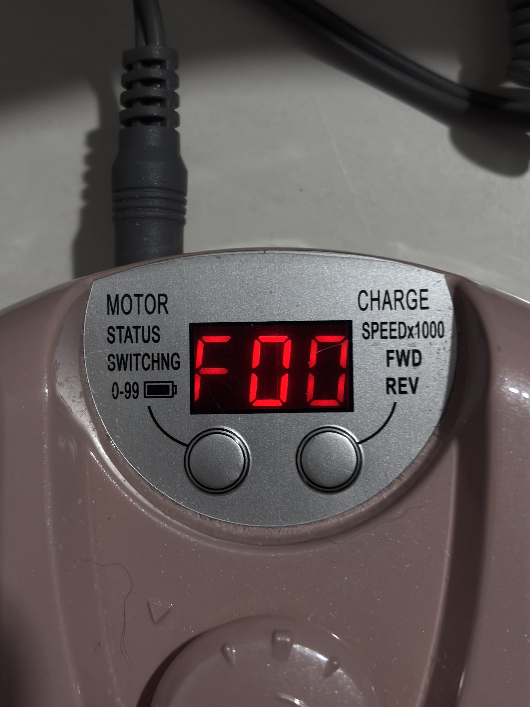
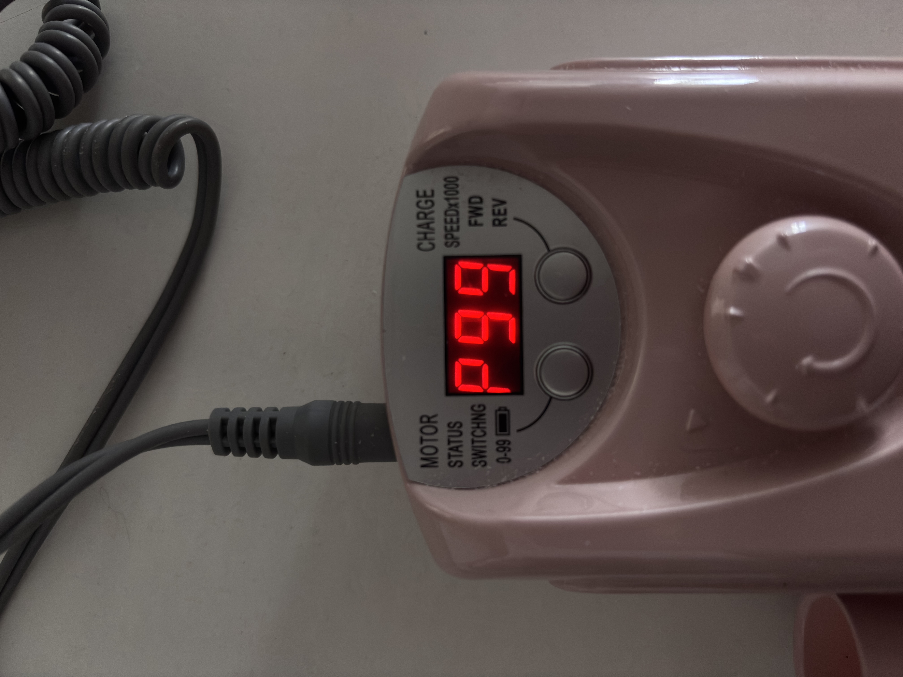

# sesion-01a

## apuntes sesión
GitHub / branch?

Update the branch when I’m behind (I will be behind most of the time, Aaron said he would put me behind when im ahead asap).

Use page that says “forked from:” and it should say my user.
The idea is to understand the logic of GitHub more than just memorize buttons: there is an original repository, I have my own fork and inside it I work on my branch. If the original repository advances and my version stays behind, I have to update it to work with the most recent changes.

```


```
Acá la lógica es poner una descripción de la imagen entre [que sería texto alterno] y después indicar dónde está el archivo entre (). ?

Vimos los datos y funciones que maneja un ascensor, incluyendo varias cosas que parecen demasiado obvias como para considerarlas data, pero en realidad son necesarias para que sea un ascensor.
Como las puertas, para nosotros simplemente están abiertas o cerradas, pero el ascensor tiene que manejar eso internamente. Necesita saber si están abiertas, cerradas, abriéndose o cerrándose, porque no puede comenzar a moverse si la puerta todavía está abierta. O si es que tienen sensores, que no se cierre si hay obstaculos

Después están cosas mucho más evidentes como los botones de los pisos. para eso hay que ser súper específicos, son: números enteros, incluyendo positivos, cero y negativos. Igual puede haber casos especiales donde en vez de un número se usa una letra, como P o PB, o nombres medios raros como manzana o frutas. Hay datos que van cambiando constantemente mientras el ascensor funciona, como le piso actual, si está subiendo, bajando o detenido, cuál es su próximo destino y qué pisos tiene pendientes. Si aprieta el piso 5, el sistema guarda esa solicitud y ve en qué momento detenerse de las demás órdenes que tenga. Y dónde se detiene exactamente, no solo: llegue al piso 3, tiene que saber la posición precisa en la que la cabina queda alineada con el suelo del piso. 

La máquina está todo el tiempo recibiendo datos. El botón es solamente la parte que nosotros vemos, detrás hay varios estados y condiciones que se tienen que cumplir oara que funcione como debe.

Group act. about elevators

DATOS

puertas (1 panel, 1 par de paneles o dos par de paneles)

botones:

números enteros positivos y negativos

abrir puertas

cerrar puertas

emergencia

eje (z) 

contrapeso

carril

espejos (opcional)

pantallas

cantidad de pisos

electricidad


DATOS INTERNOS

piso actual

dirección (subir/bajar)


DATOS CONSTANTES GENERALES

botón de emergencia llamativo

número de pisos positivos y negativos (subterráneos)

puertas


Datos variables:

botón de accesibilidad (permite que el ascensor baje inmediatamente al piso de destino.)

Panel exterior conectado a 2-4 ascensores, laa cabinas no tienen panel para seleccionar destino

Panel exterior con botones específicos para solo subir, o solo bajar.


## encargos

1. Autorretrato: describir variables y funciones de ustedes.


Variables

Nombre: Natalia. Apellido: Gutierrez. Edad: 22. 

Constantes

Fecha de nacicimiento: 2026-10-10


Funciones

Ver, Dormir, Leer


2. Investigar pantallas de segmentos, tomar fotos, documentar contexto, lugar, ubicación, alfabetos posibles, usos, comparar entre resultados encontrados, al menos 3 ejemplos distintos. https://en.wikipedia.org/wiki/Segment_display




1. Torno / drill

La primera pantalla es la de mi torno que uso para trabajar. Está ubicada en la parte superior de la máquina, justo donde quedan también los botones principales. Es una pantalla de tres dígitos formada por segmentos rojos, parecida a las típicas pantallas de siete segmentos, donde cada número o letra aparece prendiendo distintas partes del mismo carácter. 

Cuando estoy viendo las revoluciones aparece algo como F00 o A00, dependiendo de la dirección en que esté girando el torno, y puede llegar hasta F35 O A35. También está la información de la batería: ahí aparece una P acompañada de un número desde P00 hasta P99. Me llamó la atención que no llegue a P100, pero tiene sentido porque la pantalla tiene solo tres espacios y simplemente no cabe una letra más tres números.

Su alfabeto entonces no es solamente del 0 al 9. También aprovecha algunas letras que se pueden formar de manera reconocible con los mismos segmentos, como la F, la A o la P. Justamente esa es una de las limitaciones de estas pantallas: pueden formar números súper bien, pero solo algunas letras se entienden claramente porque hay muy pocos segmentos disponibles.


2. Pesa de feria

La segunda pantalla es de una pesa que mi hermana estaba usando en la feria. En la foto estaba pesando un pimentón. Tiene una pantalla de vista hacia los clientes y otra para quien la está usando, entonces se puede ir viendo el resultado mientras se atiende.

Esta es bastante más compleja que la del torno porque no muestra solo un valor. La pantalla está dividida en tres partes: el peso del producto, el precio por unidad y el precio total. En la foto aparece un peso de aproximadamente 0.300, después el precio ingresado y finalmente el cálculo que hace la misma pesa. O sea, en una sola pantalla conviven un dato que la máquina mide, uno que ingresa la persona y otro que el sistema calcula a partir de los dos anteriores.

En este caso el alfabeto es principalmente numérico, del 0 al 9, además del punto decimal, porque toda la información importante corresponde a peso y dinero. Las pantallas de siete segmentos se usan mucho justamente para mostrar valores numéricos simples, ya que son fáciles de reconocer y no necesitan una pantalla gráfica completa.

También cambia bastante el uso respecto al torno. En el torno yo miro la pantalla para controlar el funcionamiento de una herramienta, mientras que acá la información tiene que poder leerse rápidamente durante una venta y entenderse prácticamente de una sola mirada.


3. Horno de mi cocina

La tercera pantalla es la del horno de mi cocina. Está ubicada en el frente, sobre los controles, así que toda la información queda visible mientras se cocina. Acá la pantalla es mucho más grande y mezcla distintos tipos de información.

En el centro aparecen números segmentados para mostrar la hora o el tiempo, y al lado aparece la temperatura, por ejemplo 50 °C. Además, la pantalla muestra dibujos que indican diferentes funciones. El primero representa desde qué parte del horno viene el calor, porque existen varios modos de cocción. También aparecen símbolos para cosas como la ventilación o la luz interior.

Por eso este ejemplo es distinto a los anteriores: los números siguen utilizando la lógica de segmentos, pero el horno no representa toda la información de esa manera. Para funciones más complejas utiliza símbolos gráficos, mientras que deja los segmentos para datos exactos y cambiantes, como tiempo y temperatura.

En cuanto al alfabeto, los dígitos segmentados permiten representar principalmente números del 0 al 9. Algunas letras también son posibles en una pantalla de siete segmentos, pero son bastante limitadas comparadas con displays de 14 o 16 segmentos, que pueden representar muchas más letras del alfabeto.

## lectura
ME tocó leer Prehistoric digital poetry de C. T. Funkhouser

