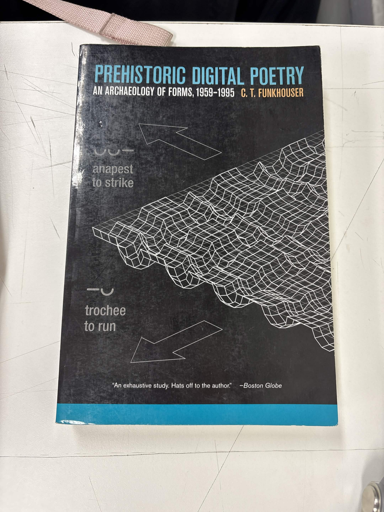

# sesion-01a

## apuntes sesión
GitHub / branch?

Update the branch when I’m behind (I will be behind most of the time, Aaron said he would put me behind when im ahead asap).

Use page that says “forked from:” and it should say my user.
The idea is to understand the logic of GitHub more than just memorize buttons: there is an original repository, I have my own fork and inside it I work on my branch. If the original repository advances and my version stays behind, I have to update it to work with the most recent changes.

 (formulas)
Acá la lógica es poner una descripción de la imagen entre [que sería texto alterno] y después indicar dónde está el archivo entre (). ?

Vimos los datos y funciones que maneja un ascensor, incluyendo varias cosas que parecen demasiado obvias como para considerarlas data, pero en realidad son necesarias para que sea un ascensor.
Como las puertas, para nosotros simplemente están abiertas o cerradas, pero el ascensor tiene que manejar eso internamente. Necesita saber si están abiertas, cerradas, abriéndose o cerrándose, porque no puede comenzar a moverse si la puerta todavía está abierta. O si es que tienen sensores, que no se cierre si hay obstaculos

Después están cosas mucho más evidentes como los botones de los pisos. para eso hay que ser súper específicos, son: números enteros, incluyendo positivos, cero y negativos. Igual puede haber casos especiales donde en vez de un número se usa una letra, como P o PB, o nombres medios raros como manzana o frutas. Hay datos que van cambiando constantemente mientras el ascensor funciona, como le piso actual, si está subiendo, bajando o detenido, cuál es su próximo destino y qué pisos tiene pendientes. Si aprieta el piso 5, el sistema guarda esa solicitud y ve en qué momento detenerse de las demás órdenes que tenga. Y dónde se detiene exactamente, no solo: llegue al piso 3, tiene que saber la posición precisa en la que la cabina queda alineada con el suelo del piso. 

La máquina está todo el tiempo recibiendo datos. El botón es solamente la parte que nosotros vemos, detrás hay varios estados y condiciones que se tienen que cumplir oara que funcione como debe.

Group act. about elevators

DATOS

puertas (1 panel, 1 par de paneles o dos par de paneles)

botones:

números enteros positivos y negativos

abrir puertas

cerrar puertas

emergencia

eje (z) 

contrapeso

carril

espejos (opcional)

pantallas

cantidad de pisos

electricidad

DATOS INTERNOS

piso actual

dirección (subir/bajar)

DATOS CONSTANTES GENERALES

botón de emergencia llamativo

número de pisos positivos y negativos (subterráneos)

puertas

Datos variables:

botón de accesibilidad (permite que el ascensor baje inmediatamente al piso de destino.)

Panel exterior conectado a 2-4 ascensores, laa cabinas no tienen panel para seleccionar destino

Panel exterior con botones específicos para solo subir, o solo bajar.

## encargos
to do: 

1. Autorretrato: describir variables y funciones de ustedes.

Variables

Nombre: Natalia. Apellido Gutierrez. Edad: 22. 

Constante fecha de nacicimiento: 2026-10-10

Funciones

Ver, Dormir, Leer

2. Investigar pantallas de segmentos, tomar fotos, documentar contexto, lugar, ubicación, alfabetos posibles, usos, comparar entre resultados encontrados, al menos 3 ejemplos distintos. https://en.wikipedia.org/wiki/Segment_display

## lectura
ME tocó leer Prehistoric digital poetry de C. T. Funkhouser

