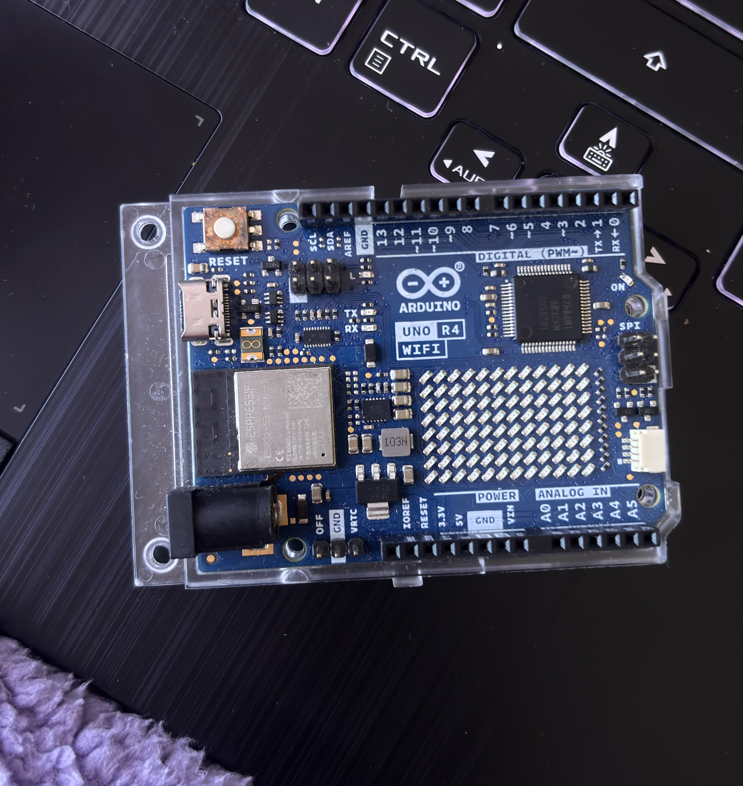
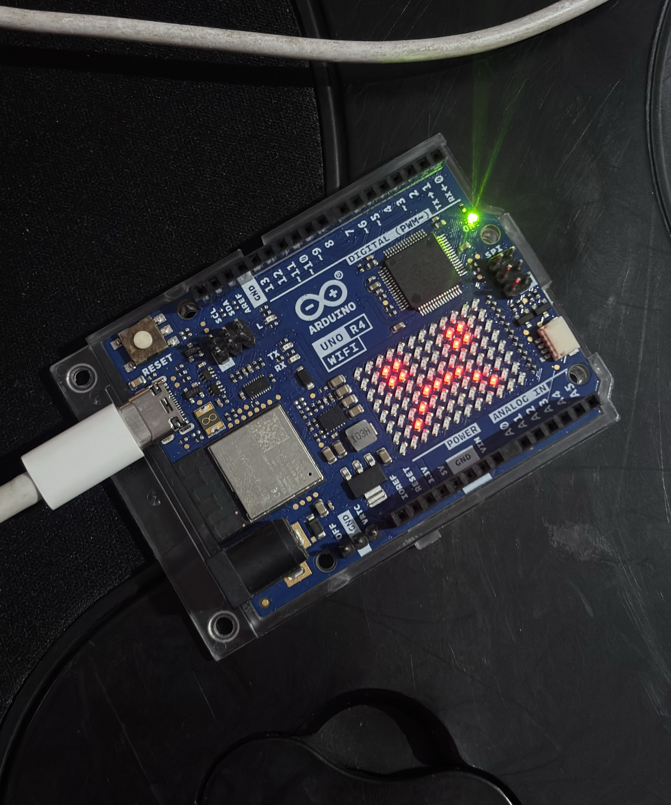

# sesion-01b

## apuntes sesión
Sesión 01b

aritmética booleana boolean - George Boole

or +

and *

interruptor de luz 0+1 (extremo sin punto intermedio)

fijo = constante

variables

nombres apellidos edad estatura vision

funciones

ver dormir 

1bit=0-7 (8 números por bit = 8bit = 256 resultados posibles 0-255)

int8_t 8, con signo

uint8_t 8, sin signo (sirve para mi edad porque seria positiva del 0 - 255)

setup (configurar) = una función, secuencia de instrucciones para que pasen cosas.

int setup(): el resultado es un numero entero

Void setup() {

} esto es declarar la funcion setup, existe la funcion, pero aún no hace nada)


está prohibido escribir una linea de codigo sin antes escribir lo que va hacer

```cpp

Void setup() {
//aqui va setup(), ocurre una vez, al principio
}

void loop() {
//aqui va loop()
//ocurre despues de setup
//se repite hasta que no se pueda
}
````
bool: variable extremista si o no 0/1 true/false

```
//
bool nataliaEstudianteUDP = true;
bool nataliaChilena = true;
//integers
int nataliaEdad = 22;
int nataliaNacimientoAnho = 2003;
// enero es 1, diciembre es 12
int nataliaNacimientoMes = 10;
// dias desde 1 hasta lo que dure el mes
int nataliaNacimientoDia = 10;

== comparar
if (mesActual == nataliaNacimientoMes) {
}
if (mesActual == nataliaNacimientoMes &&
diaActual == nataliaNacimientoDia

// millones de colores serian 24 bits 2^24, 2^3 es 8 bits

colores
0101 0100  24 bits
0010 0011
1101 1010

hex 0000ff (cada uno es 4, total 24)
string kristelColorFavorito = "0000ff";
```

## encargos

encargo01b:

Dupla: Isidora Díaz y Natalia Gutierrez


Nos toco la placa Arduino UNO R4 Wifi

 

Al buscar información sobre la placa encontramos que está pensada para hacer proyectos interactivos y que, a diferencia de otras Arduino más básicas, ya trae varias cosas integradas que se pueden ocupar sin conectar tantos componentes externos. Su microcontrolador principal es un Renesas RA4M1 de 32 bits y tiene un módulo ESP32-S3, que se encarga del Wi-Fi y Bluetooth.

Además tiene la 12x8 LED matrix que nos hizo pensar en cosas que podíamos hacer en nuestro código, como figuras o quizá animaciones, igual ideas un poco adelantadas a nuestros conocimientos siendo realistas, pero es lo que mas nos interesó para este primer ejercicio.

https://docs.arduino.cc/hardware/uno-r4-wifi/


Como las dos tenemos el mismo horario, pensamos usar eso para el ejecicio, la idea es calcular cuantos minutos de clase tenemos a la semana


Nuestro horario es 

Martes: 08:30 a 12:50

Miércoles: 08:30 a 11:30

Viernes: 08:30 a 12:50

la idea sería que el código reciba el inicio y término de cada día, tome esos periodos y los pase a minutos para saber cuánto dura el bloque de horario

para el martes por ejemplo, seria este el proceso:

08:30 = 8 x 60 + 30 = 510 minutos

12:50 = 12 x 60 + 50 = 770 minutos

770 - 510 = 260 minutos de clases

Después se haría lo mismo con miércoles y viernes, y al final se sumarían los minutos de los tres días.

Pensamos en una función llamada:

calcularMinutosClase()

La función sería de tipo int, porque al final nos debería entregar un número entero con la cantidad de minutos que dura una clase.


como argumentos usaríamos 

horaInicio
minutoInicio
horaFin
minutoFin

ejemplo:

calcularMinutosClase(8, 30, 12, 50);

La función no sabe realmente que esos números son horas o minutos, sino que somos nosotras las que definimos qué representa cada argumento y en qué orden se los entregamos.

Antes de correr el código pensamos en que pasos tendría que hacer la función 

recibir la hora de inicio

recibir los minutos de inicio

recibir la hora de término

recibir los minutos de término

convertir la hora de inicio a minutos

sumar los minutos de inicio

convertir la hora de término a minutos

sumar los minutos de término

restar el inicio al término

guardar el resultado

devolver la duración de la clase en minutos

como paso más ambicioso, usar el resultado para mostrar algo en la matriz LED de la placa

si la cantidad total de minutos de clases de la semana es mayor a 600 minutos

mostrar una carita triste en la matriz LED

si la cantidad total de minutos es igual o menor a 600 minutos

mostrar una carita feliz en la matriz LED


Al cargar el primer código, nos faltó cerrar el setup y nos tiraba error al subirlo a la Arduino UNO, pero lo logramos subir al corregir eso, el problema es que no interacciona 

primer código

```
// queremos calcular cuantos minutos de clases tenemos en una semana


void setup() {
  // aqui va setup()
  // ocurre una vez al principio


  // calcular cuantos minutos de clases tenemos el martes
  // 8 = hora de inicio
  // 30 = minuto de inicio
  // 12 = hora de termino
  // 50 = minuto de termino
  int minutosMartes = calcularMinutosClase(8, 30, 12, 50);


  // calcular cuantos minutos de clases tenemos el miercoles
  // 8 = hora de inicio
  // 30 = minuto de inicio
  // 11 = hora de termino
  // 30 = minuto de termino
  int minutosMiercoles = calcularMinutosClase(8, 30, 11, 30);


  // calcular cuantos minutos de clases tenemos el viernes
  // 8 = hora de inicio
  // 30 = minuto de inicio
  // 12 = hora de termino
  // 50 = minuto de termino
  int minutosViernes = calcularMinutosClase(8, 30, 12, 50);


  // declarar una variable para guardar
  // los minutos totales de clases de la semana
  int minutosSemana = 0;


  // sumar los minutos del martes,
  // miercoles y viernes
  minutosSemana = minutosMartes + minutosMiercoles + minutosViernes;
}

void loop() {
  // aqui va loop()
  // ocurre despues de setup()
  // se repite hasta que no se pueda

  //no necesitamos repetir ninguna accion, lo dejamos asi 
}


// calcular cuantos minutos dura un bloque de clases

// es tipo int porque nos va a entregar
// un numero entero como resultado

// la funcion recibe cuatro datos:
// horaInicio
// minutoInicio
// horaFin
// minutoFin
int calcularMinutosClase(
  int horaInicio,
  int minutoInicio,
  int horaFin,
  int minutoFin
) {

  // declarar una variable donde guardar
  // la hora de inicio convertida a minutos
  int inicioEnMinutos = 0;


  // convertir la hora de inicio a minutos
  // por ejemplo:
  // 8 * 60 = 480
  // 480 + 30 = 510
  inicioEnMinutos = horaInicio * 60 + minutoInicio;


  // declarar una variable donde guardar
  // la hora de termino convertida a minutos
  int finEnMinutos = 0;


  // convertir la hora de termino a minutos
  // por ejemplo:
  // 12 * 60 = 720
  // 720 + 50 = 770
  finEnMinutos = horaFin * 60 + minutoFin;


  // declarar una variable donde guardar
  // la duracion total de la clase
  int duracionClase = 0;


  // restar el inicio al termino
  // para saber cuantos minutos dura la clase
  // por ejemplo:
  // 770 - 510 = 260
  //sera esta la forma más dificil de hacer esto??
  duracionClase = finEnMinutos - inicioEnMinutos;


  // emitir el resultado
  // al exterior de la funcion
  return duracionClase;
}
```

se me hizo complicado entender el por qué de algunas cosas, como agregar los argumentos, o las variables. Para los argumentos, entendí que el la función no sabe de minutos u horas, que tenemos que declarar lo que significan los números en este contexto. Y en el caso de las variables, aun no me queda muy claro, pero si entendí bien, son necesarias para declarar un valor que va a ser reemplazado.


después, como vimos que este código no daría ningún resultado físico en la placa, quisimos usar el LED matrix, en la pagina https://docs.arduino.cc/tutorials/uno-r4-wifi/led-matrix/ esta explicado como usarlo. 

agregamos los códigos que nos indica la pagina al inicio del sketch

#include "Arduino_LED_Matrix.h"
//para crear la matrix

ArduinoLEDMatrix matrix;

y dentro de la función

matrix.begin();

aquí ya sabíamos que para que funcione la matrix, la memoria tenia que tener al menos 96 bits de espacio, y gracias a la clase pasaba sabíamos que int8\_t 8 serviría

el ejemplo en la pagina es 

```
byte frame[8][12] = {
  { 0, 0, 1, 1, 0, 0, 0, 1, 1, 0, 0, 0 },
  { 0, 1, 0, 0, 1, 0, 1, 0, 0, 1, 0, 0 },
  { 0, 1, 0, 0, 0, 1, 0, 0, 0, 1, 0, 0 },
  { 0, 0, 1, 0, 0, 0, 0, 0, 1, 0, 0, 0 },
  { 0, 0, 0, 1, 0, 0, 0, 1, 0, 0, 0, 0 },
  { 0, 0, 0, 0, 1, 0, 1, 0, 0, 0, 0, 0 },
  { 0, 0, 0, 0, 0, 1, 0, 0, 0, 0, 0, 0 },
  { 0, 0, 0, 0, 0, 0, 0, 0, 0, 0, 0, 0 }
};
```

y dibujamos nuestras caritas

```
uint8_t caritaFeliz[8][12] = {
  {0,0,0,0,0,0,0,0,0,0,0,0},
  {0,0,1,1,0,0,0,0,1,1,0,0},
  {0,0,1,1,0,0,0,0,1,1,0,0},
  {0,0,0,0,0,0,0,0,0,0,0,0},
  {0,0,1,0,0,0,0,0,0,1,0,0},
  {0,0,0,1,0,0,0,0,1,0,0,0},
  {0,0,0,0,1,1,1,1,0,0,0,0},
  {0,0,0,0,0,0,0,0,0,0,0,0}
};


// dibujar una carita triste en la matriz
 uint8_t caritaTriste[8][12] = {
  {0,0,0,0,0,0,0,0,0,0,0,0},
  {0,0,1,1,0,0,0,0,1,1,0,0},
  {0,0,1,1,0,0,0,0,1,1,0,0},
  {0,0,0,0,0,0,0,0,0,0,0,0},
  {0,0,0,0,1,1,1,1,0,0,0,0},
  {0,0,0,1,0,0,0,0,1,0,0,0},
  {0,0,1,0,0,0,0,0,0,1,0,0},
  {0,0,0,0,0,0,0,0,0,0,0,0}
};

```

dentro del set up dejamos las condiciones

```
matrix.begin();
// si tenemos mas de 600 minutos de clases
if (minutosSemana > 600) {

  // mostrar una carita triste
  matrix.renderBitmap(caritaTriste, 8, 12);

} else {

  // si tenemos 600 minutos o menos
  // mostrar una carita feliz
  matrix.renderBitmap(caritaFeliz, 8, 12);
}
```

sabíamos que el total de minutos daría 700, asi que esperábamos una carita triste y resultoo!!


 


CODIGO COMPLETO 

```
#include "Arduino_LED_Matrix.h"
//para crear la matrix

ArduinoLEDMatrix matrix;
// dibujar una carita feliz en la matriz
 uint8_t caritaFeliz[8][12] = {
  {0,0,0,0,0,0,0,0,0,0,0,0},
  {0,0,1,1,0,0,0,0,1,1,0,0},
  {0,0,1,1,0,0,0,0,1,1,0,0},
  {0,0,0,0,0,0,0,0,0,0,0,0},
  {0,0,1,0,0,0,0,0,0,1,0,0},
  {0,0,0,1,0,0,0,0,1,0,0,0},
  {0,0,0,0,1,1,1,1,0,0,0,0},
  {0,0,0,0,0,0,0,0,0,0,0,0}
};


// dibujar una carita triste en la matriz
 uint8_t caritaTriste[8][12] = {
  {0,0,0,0,0,0,0,0,0,0,0,0},
  {0,0,1,1,0,0,0,0,1,1,0,0},
  {0,0,1,1,0,0,0,0,1,1,0,0},
  {0,0,0,0,0,0,0,0,0,0,0,0},
  {0,0,0,0,1,1,1,1,0,0,0,0},
  {0,0,0,1,0,0,0,0,1,0,0,0},
  {0,0,1,0,0,0,0,0,0,1,0,0},
  {0,0,0,0,0,0,0,0,0,0,0,0}
};
// queremos calcular cuantos minutos de clases tenemos en una semana

void setup() {
  // aqui va setup()
  // ocurre una vez al principio


  // calcular cuantos minutos de clases tenemos el martes
  // 8 = hora de inicio
  // 30 = minuto de inicio
  // 12 = hora de termino
  // 50 = minuto de termino
  int minutosMartes = calcularMinutosClase(8, 30, 12, 50);


  // calcular cuantos minutos de clases tenemos el miercoles
  // 8 = hora de inicio
  // 30 = minuto de inicio
  // 11 = hora de termino
  // 30 = minuto de termino
  int minutosMiercoles = calcularMinutosClase(8, 30, 11, 30);


  // calcular cuantos minutos de clases tenemos el viernes
  // 8 = hora de inicio
  // 30 = minuto de inicio
  // 12 = hora de termino
  // 50 = minuto de termino
  int minutosViernes = calcularMinutosClase(8, 30, 12, 50);


  // declarar una variable para guardar
  // los minutos totales de clases de la semana
  int minutosSemana = 0;


  // sumar los minutos del martes,
  // miercoles y viernes
  minutosSemana = minutosMartes + minutosMiercoles + minutosViernes;
  
// iniciar la matriz LED de la placa
matrix.begin();
// si tenemos mas de 600 minutos de clases
if (minutosSemana > 600) {

  // mostrar una carita triste
  matrix.renderBitmap(caritaTriste, 8, 12);

} else {

  // si tenemos 600 minutos o menos
  // mostrar una carita feliz
  matrix.renderBitmap(caritaFeliz, 8, 12);
}

}

void loop() {
  // aqui va loop()
  // ocurre despues de setup()
  // se repite hasta que no se pueda

  //no necesitamos repetir ninguna accion, lo dejamos asi 
}


// calcular cuantos minutos dura un bloque de clases

// es tipo int porque nos va a entregar
// un numero entero como resultado

// la funcion recibe cuatro datos:
// horaInicio
// minutoInicio
// horaFin
// minutoFin
int calcularMinutosClase(
  int horaInicio,
  int minutoInicio,
  int horaFin,
  int minutoFin
) {

  // declarar una variable donde guardar
  // la hora de inicio convertida a minutos
  int inicioEnMinutos = 0;


  // convertir la hora de inicio a minutos
  // por ejemplo:
  // 8 * 60 = 480
  // 480 + 30 = 510
  inicioEnMinutos = horaInicio * 60 + minutoInicio;


  // declarar una variable donde guardar
  // la hora de termino convertida a minutos
  int finEnMinutos = 0;


  // convertir la hora de termino a minutos
  // por ejemplo:
  // 12 * 60 = 720
  // 720 + 50 = 770
  finEnMinutos = horaFin * 60 + minutoFin;


  // declarar una variable donde guardar
  // la duracion total de la clase
  int duracionClase = 0;


  // restar el inicio al termino
  // para saber cuantos minutos dura la clase
  // por ejemplo:
  // 770 - 510 = 260
  //sera esta la forma más dificil de hacer esto??
  duracionClase = finEnMinutos - inicioEnMinutos;


  // emitir el resultado
  // al exterior de la funcion
  return duracionClase;
}
```

## lectura
