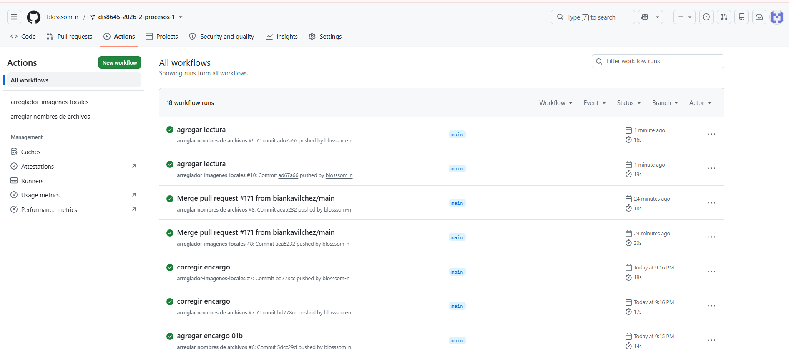

# sesion-02a

## apuntes sesión

## encargos
encargo02a:

en tu fork, ir a actions, y aceptar que corran github worfklows. subir pantallazo con demostración de que han corrido actions exitosas en tu repo. esto es crucial, si no lo haces, no agregaremos tus apuntes al repo, y las tareas se tomarán como no entregadas. si en tu fork las actions no son exitosas, no serán tampoco agregadas al repo común ni evaluadas.

conformar grupos de 3 a 4 personas para la realización del proyecto-1. compartir 2 placas de desarrollo por grupo, documentar estudio conjunto de C++, microcontroladores, botones, potenciómetros.
## lectura
Las primeras diez páginas que leí eran más que nada el foreword** del libro y después empieza una **cronología de obras de poesía digital entre 1959 y 1995**. Al principio habla harto de que ni siquiera es tan fácil definir qué es poesía digital, porque eso también lleva a preguntarse qué hace que un poema sea un poema.

Después la cronología muestra varios ejemplos súper antiguos de gente experimentando con computadores, textos automáticos, poemas visuales, videos y cosas así. Me llamó la atención porque yo asociaba la poesía digital a algo mucho más actual, pero acá ya aparecen experimentos desde 1959.

Busqué algunos títulos que aparecían, como *Stochastische Texte* de Theo Lutz y *Tape Mark I* de Nanni Balestrini, porque no cachaba para nada qué eran y me dio curiosidad ver cómo se veían o cómo funcionaban; según lo que encontré, *Stochastische Texte* usa un computador para generar frases a partir de un conjunto de palabras tomadas de textos de Kafka (especialmente *El castillo*), combinándolas de forma aleatoria mediante un sistema de números, y *Tape Mark I* es un poema generado por computador que trabaja con permutaciones y combinaciones de palabras para producir múltiples variaciones del texto.

Citas

“The definition of digital poetry remains up for grabs.” (p. xv)**
 “Funkhouser considers digital poetry as flexible, indeterminate, and perhaps infinite in scope.” (p. xvi)
 

Cosas que me quedaron

 ¿En qué momeno deja de ser un experimento con tecnología, pasando a ser poesía digital?
 ¿Si un computador está generando el texto, quién sería realmente el autor?
 Se me hace súper loco pensar que ya existían estas cosas en los 50 y 60, porque yo lo asociaba demasiado a Internet o a cosas mucho más nuevas.
