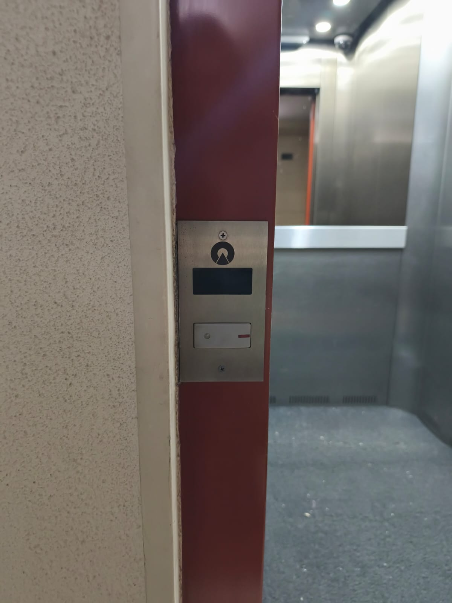
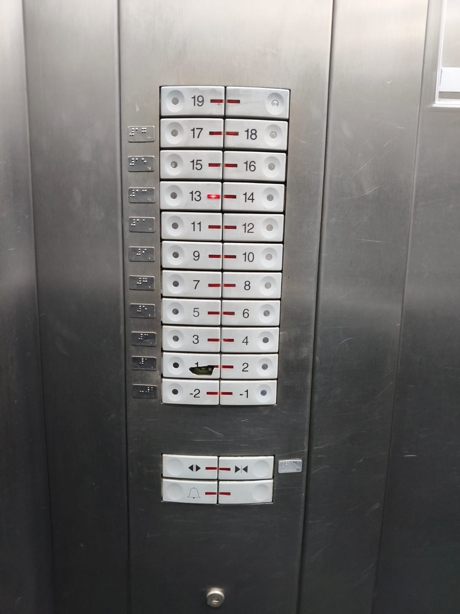
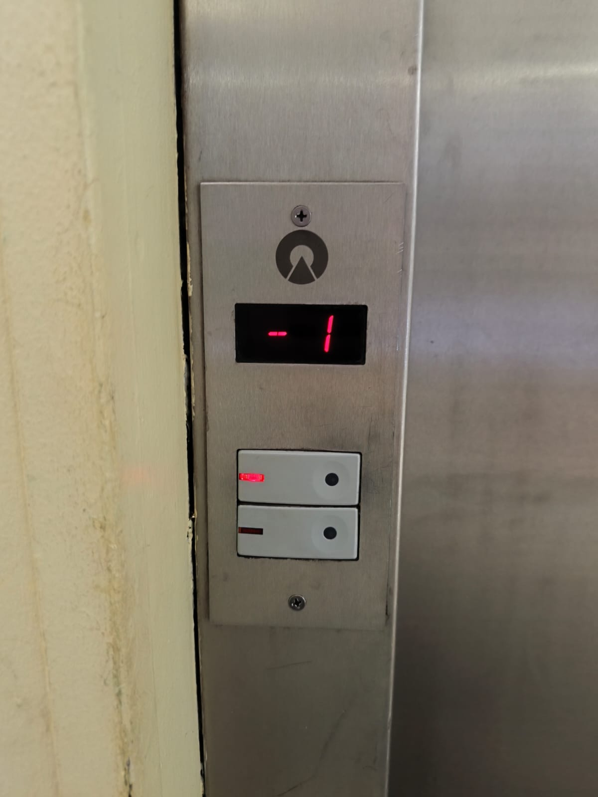
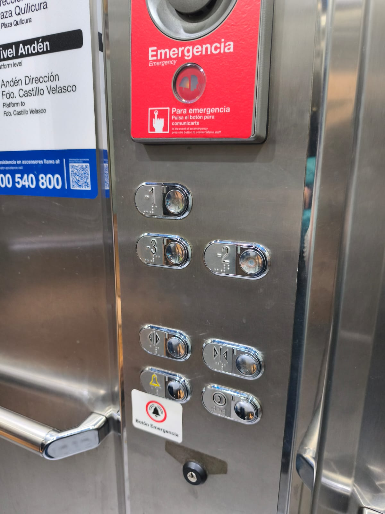
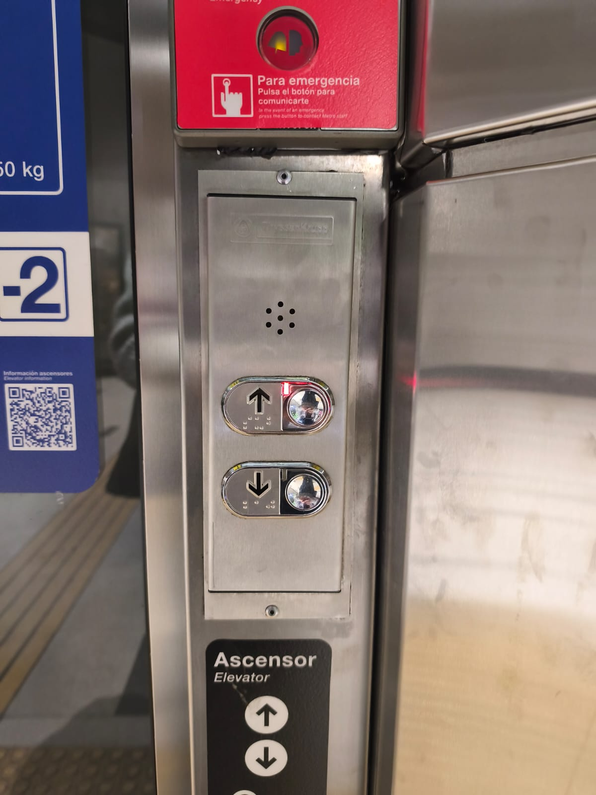

# sesion-00b

## apuntes sesión

## clase 070826

### pre-clase 

Hoy comenzó mi primera clase del semestre la cual no comenzamos en la sala directamente, si no que fuimos a la charla/iniciación de curso de

### clase

- Aaron y video de misaa

Comenzamos el nuevo taller (no es la continuación del anterior que se imparte el semestre pasado), nos presentamos cada uno y Aaron siempre complementa dando datos sobre el taller y de cada alumno, ayudando a nuestro relato. 

Como mencione, tome el taller nuevamente con las profesiones gracias a su nivel de reflexión y paciencia con las cosas. El semestre pasado, el día anterior de que fuera el examen estaba estresada, lo cual Aaron creo que noto y me dijo: si no funciona, no funciona y está bien (es un resumen de todo lo que pasó) además de ser un taller con una carga importante, te deja ir a tu ritmo y tiempo, no quiero siempre pensar en lo que estoy haciendo fuera de la universidad, pero ya estoy desarrollando una vida paralela a esta que debo también ser consciente y responder. 

Una cosa que deseo recalcar de todo lo que mencionaron algunos de nuestros compañeros fue el compañerismo que hay en esta mención. Jamás había visto que alguien te ayudará porque si ya que te ve afligido o simplemente quiere ayudarte y este acto no es mirado de mala manera, porque en las otras menciones puedo decir que sí sucede, es otra razón por la que me gusta estar y convivir con los docentes. 

En este primer mes Misaa (nos mando un videito muy tierno) no estará con nosotros en el aula ya que él está fuera del país, espero que esté cumpliendo un sueño, pero nos acompañarán seba y santi, otras dos personas que se nota que le gusta y apasiona este mundo. 

## encargos

### post-clase

Para esta ocasión se nos solicitó analizar cómo funcionan y manejan a través de los botones de ascensores. 

Primero esto me hizo pensar en cuántos ascensores ocupó al día y cuando reflexiono en eso o simplemente me subo y aprieto el primer botón que veo que me lleve a lo que deseo y si, esa es mi respuesta inmediata, además que les tengo un poco de pánico; mucho tiempo no me subía a ascensores por lo mismo. 

_Ascensor 1_

Este ascensor se encuentra en metro moneda, exactamente en la calle Lord Cochrane en un departamento de 19 pisos. 

Yo subí desde el piso que da a la calle y encontramos un sistema que nos indica en que piso va el ascensor, en este caso en el -1 además de dos botones que no indican nada, solo uno está arriba y el otro abajo, con el mismo color, pero como el ser humano es un experto en asumir cosas, el que está arriba lo asumimos que subiremos y el que está abajo de este es para bajar ¿pero como te explico que ambos botones hacen lo mismo? de hecho, es más, el que está en la parte inferior no sirve. 

Al entrar al ascensor encontramos todos los botones desde el piso -1 (que asumimos que es el último piso del edificio) y el 19 que asumimos es el último porque el que le sigue no dice nada; este tiene en el lado izquierdo escrito en braille. En la parte inferior encontramos abrir y cerrar puertas, además el de emergencias; otro sin que nosotros sepamos que es. 

Al llegar al piso que debía llegar, afuera solo tenía un solo botón que ayuda a abrir simplemente la puerta para uno después elegir qué piso deseas ir. 

_Ascensor 2_

El segundo ascensor que analice es el del metro de santiago, específicamente el de línea 3, estación terminal Fernando Castillo Velasco.

En este me subí de abajo para poder subir al piso -1 y el primer error que encuentro es que me indica que puedo bajar y no se encuentran más pisos con ese ascensor, es solo subir 1 piso o bajarlo. Cuando entro encuentro muchos pisos, -1,-2 y -3, además del de abrir y cerrar puertas, emergencia y llamar. 

Se subió una persona conmigo en esta instancia y ambas esperamos que subiera el ascensor por si solo, pero debimos apretar el botón -1 para que este recién subiera, eso quiere decir que ambas personas asumieron que como es un solo piso el que sube y baja, este subiría con solo la acción de sentir el peso de las personas que ya subieron. 

Pero aquí está lo más extraño, que en el piso superior, el botón que se encuentra es solo para bajar, cayendo en una inconsistencia de diseño. 

_Conclusión_

A partir de analizar esto, me sorprende que se repita dos veces la tónica de que en el piso de abajo exista el subir y bajar, pero cuando subes no, además de en la parte interna tener botones que no sirven. Supondré porque son diseñados de tal forma por “default” y el usuario que instala el producto decide que cosas funcionaran o no, a pesar de ello, como por ejemplo en el metro de santiago, deberían estar diseñados para, bueno, en cualquier parte. 

## lectura
