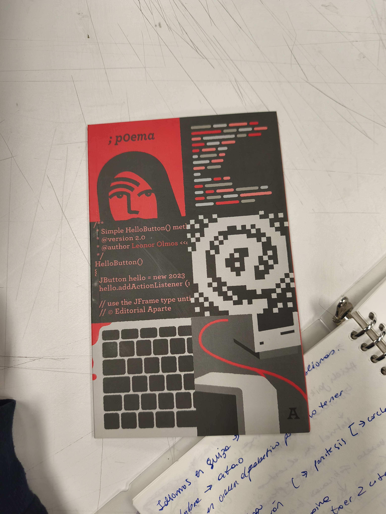
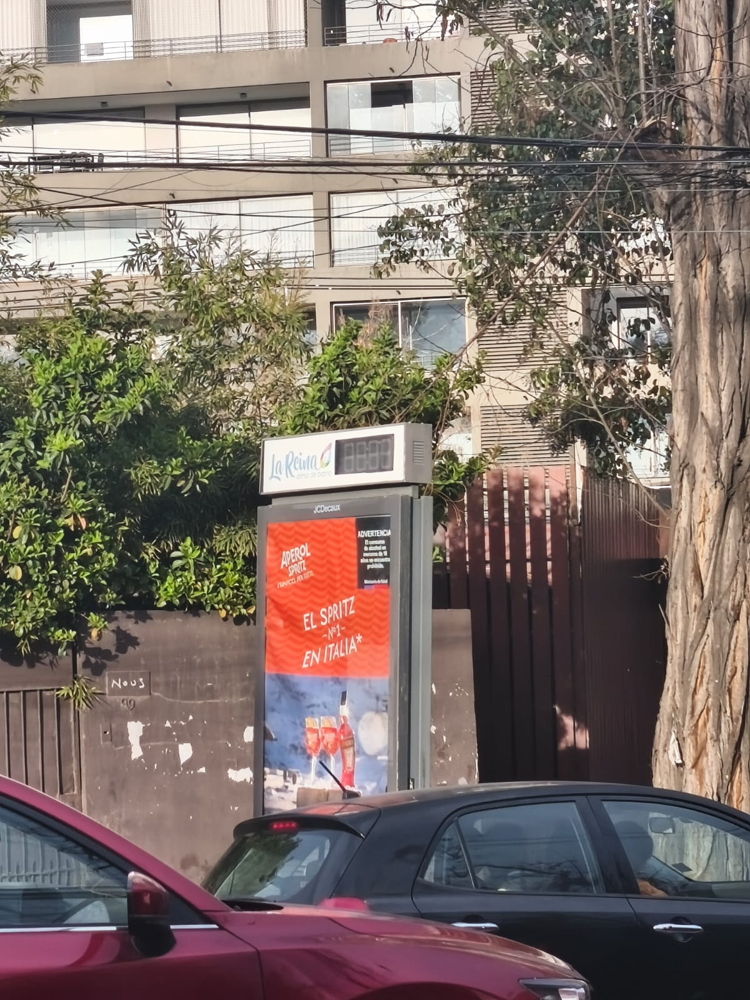
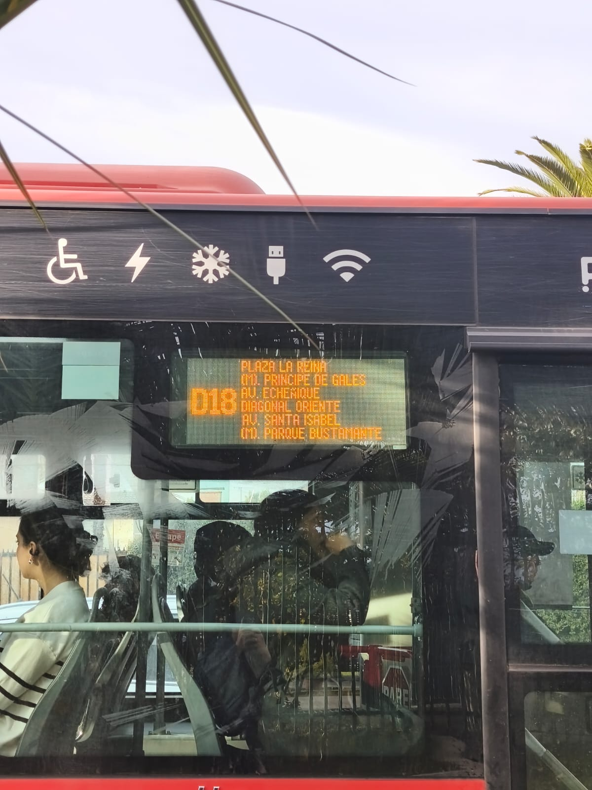
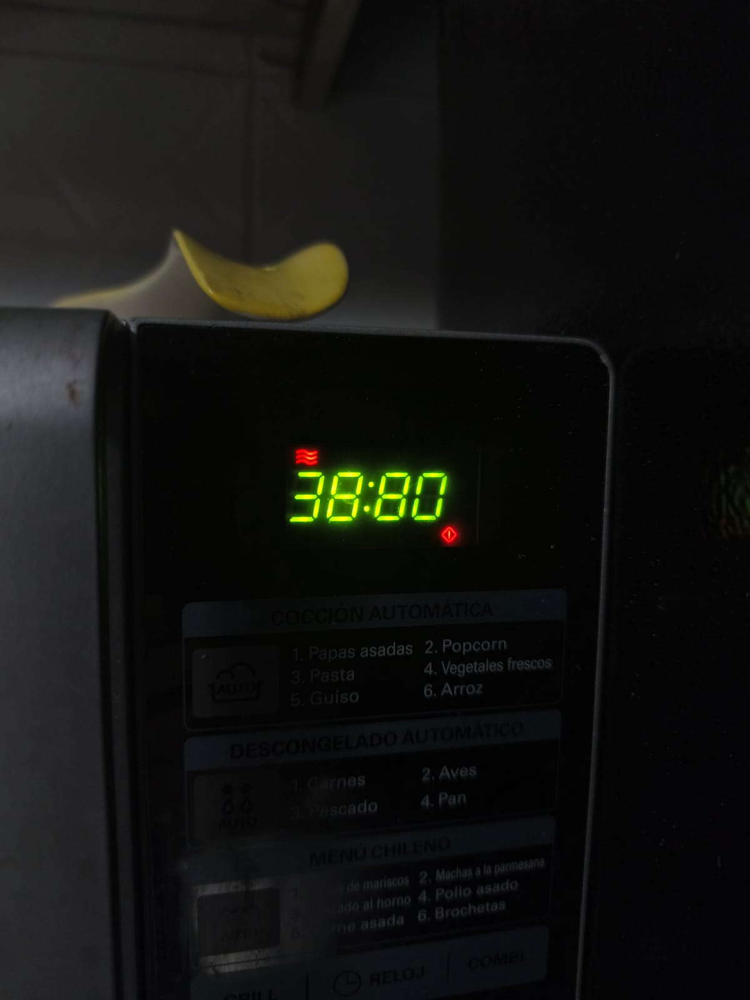

# sesion-01a

## apuntes sesión

# Clase 110826

### pre-clase (teloneo Aaron) y clase 

Idiomas en suiza: son varios, lo que están el alemán y el inglés.

La palabra atao será muy vista en el taller. 

- Escribir en orden alfabético para no tener preferencias. 

Leer 1 libro por semestre.

  

 libro Sociedad especulativa

Solo ocupar minúsculas

Mayúscula y minúscula es distinto

- Khipu

parestesis: función o acción

Sin paréntesis : dato

Variable,  funciones y punto de vista

sudo rm -rf 

## encargos

### post-clase

*Encargo 1:*

Esta es la estructura que hay que seguir para hacer las variables 

tipo-de-variable nombre-de-variable[=valor] (si queremos declarar más variables, podemos separarlas entre , ); Una variable puede tener cualquier nombre conformado por letras y/o números, que no incluya espacios, símbolos especiales.

Nota que después de declarar una serie de variables de un mismo tipo hay que poner un ;

- int: Para valores tipo números enteros
- float: números decimales y/o no enteros. 
- bool: Un booleano es un tipo de dato que solo puede tener dos valores opuestos: verdadero (true) o falso (false).
- string: cadena de texto para guardar palabras, nombres o frases las cuales deben escribirse entre comillas porque si no el lenguaje C++ piensa que puede ser el nombre de una variable.

string nombre="kristel";

string colorfavorito="azul";

int edad=21;

int fechadenacimiento=2003

float altura=1.65;

bool estudiodiseno=true;

bool trabajo=true;

https://www.include-poetry.com/Code/C++/Introduccion/Variables/

*Encargo 2*

- Ejemplo uno: reloj + cartel 

En mi camino al trabajo, las calles que debo concurrir se encuentran muchas oficinas y colegios, entonces puedo encontrar diversas instalaciones, sobre todo acercándome a la comuna de Vitacura. Este tipo de estructuras son comunes en estas comunas. La instalación se encuentra en mi comuna, pero es una calle muy concurrida llamada Príncipe de Gales, exactamente cerca de Av. Americo Vespucio. 

Sistema numérico posible: arábico  ya que nos entrega la hora en el occidente (en este caso no funciona el visualizador) 

  

- Ejemplo dos: pesa de alimentos

Este es el ejemplo que encuentro más interesante de los otros. Primero mencionar que esta pesa fue traída hace también aproximadamente 10 años de Estados Unidos, la cual viene completamente en inglés, pero eso no fue un impedimento de utilizarla. Retomando lo primero dicho, encuentro interesante este ejemplo porque sube de nivel el no tan solo presentarnos números, sino, gracias a su tipografía modular, nos entrega letras realizadas con los módulos, esto se deja ver cuando se le coloca un elemento muy pesado o hacemos una combinación a partir de los dos botones que padece que no reconoce. 

Alfabeto posible utilizado: arábico + alfabeto. 

  

- Ejemplo tres: Microondas

Este microondas tiene más de 10 años en mi casa, se encuentra en mi cocina. Además de calentar comida, puede descongelar diversos alimentos que consumimos como por ejemplo pollo, carnes, pan entre otros, el que más utilizamos es el de pollo. Al escoger esta opción, en la parte superior de la pantalla de segmentos cambia el decimal y se agrega un icono que simboliza el frío. 

Sistema numérico posible: arábico 

  

Comparación:

Entre los 3 objetos estudiados podemos observar que todos tienen formas, tamaños, ocupaciones distintas, pero que todos tienen el propósito de entregarnos una información numérica hasta alfabética visto en el caso número 2. 

## lectura

Este semestre en vez de leer un libro por mes, debemos leer uno por el semestre. Los que terminen antes, podrán leer otro después. 

Escogí el primero que llamó mi atención, que fue “;p0ema” de Leonor Olmos de la editorial Aparte que se encuentra en su colección “Postal Japonesa”. En ámbitos de diseño, la portada e interiores están realizados por Cristóbal Correa. Un personaje que ya conocía y me hace mucha ilusión poder leer algo que haya pasado por sus manos. Se nota el detalle.

Leonos Olmos es oriunda de Coquimbo, estudió una carrera convencional en la cual ejerce de vez en cuando. Intenté buscar información sobre ella, pero en todos lados me salía la misma biografía lo cual no me nutría. 

Leí la reseña del libro y no entendí nada, entonces comencé a leer la primera parte del poema y tampoco logré comprender, entonces comenzaré un paso atrás entendiendo párrafo por párrafo para poder así comprender a la autora. Por lo poco que lei de reseñas de sus otros libros, ella es una persona que piensa mucho en el ser humano y lo que le rodea, por ejemplo el habla ¿qué pasaría si nos quedáramos sin palabras? es una muy buena pregunta, algo que encontramos tan obvio y cotidiano, se nos desvanece a tal punto de no tenerlo más entre nosotros.

Primero, quiero hacer un glosario de palabras que no comprendí de lo que leí en la reseña antes de comenzar a analizar y adentrarme: 

1. Mesianidad: condición o cualidad de ser un Mesías o salvador. Tener una actitud, discurso o ideología basada en la figura de un mesías o salvador, alguien que se cree o se presenta como el único capaz de rescatar a un grupo de una crisis total y guiarlos hacia un futuro ideal.  
2. Blockchain (cadena de bloques): base de datos digital compartida y descentralizada. Almacena información en bloques enlazados mediante criptografía, lo que crea un registro cronológico e inalterable que no depende de un banco o autoridad central.  
3. Baumaniana: conjunto de ideas, conceptos y estilo de análisis del sociólogo y filósofo Zygmunt Bauman. Su pensamiento se centra en la modernidad líquida, una época donde las relaciones, la identidad y la sociedad cambian sin pausa y nada es fijo o duradero  
4. Opositivo: trastorno de oposición desafiante (un patrón de conducta hostil y desobediente hacia la autoridad)

