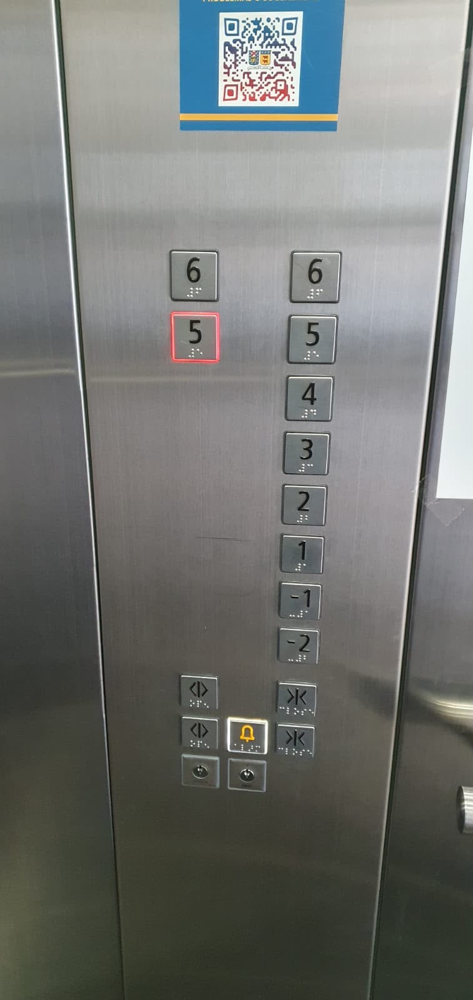

# sesion-00b

## apuntes sesión

Primer día de clases. 

Introducción del curso: nos presentamos, que nos relacionaba a tomar la decisión de tomar este curso.
Al tomar este curso, me llamo mucho la atención, de aprender cosas nuevas.

## encargo

## Ascensores!

 # Existencia de variables en un ascensor

Cuando observo los ascensores existen variables, funciones y punto de vista. Variables absolutas o relativas, cosas que son constantes y otras que van cambiando. Todo esto depende también de cómo yo decida observar y describir cómo yo veo el ascensor.

Yo puedo considerar que esto se define como un ascensor, pero ¿qué hace que algo sea realmente un ascensor?

## ¿Qué cosas son constantes y qué cosas cambian?

Primero puedo pensar en las cosas que son constantes y las cosas que cambian.

Por ejemplo, los números de los pisos los puedo considerar como una constante, porque dentro de un ascensor determinado están establecidos. Pero también aparecen preguntas, porque no todos los ascensores tienen necesariamente los mismos números.

Puede no existir el número 0, puede existir el número 13, y en Japón no está el número 4. Entonces también aparecen variables dependiendo de los países y de los paradigmas que existen en cada lugar.

Esto hace pensar que algo que yo considero una constante quizás no es una constante absoluta, sino que depende del punto de vista y del sistema que estoy observando.

La dirección, por otro lado, puede cambiar de valor entre ciertos valores. El ascensor puede ir hacia arriba o hacia abajo, por lo que la dirección es una variable.

## ¿Qué está pasando internamente?

Cuando veo un ascensor desde afuera parece algo bastante simple, pero internamente están pasando muchas cosas.

Existen poleas, motores, cables, carriles, electricidad y elementos relacionados con la gravedad. El ascensor tiene un eje, pero hay que especificar cuál. En este caso puedo decir que se desplaza principalmente por el eje Z, porque su movimiento es vertical.

Aunque yo vea solamente una caja que sube y baja, internamente existe todo un sistema que hace posible ese movimiento.

## ¿Qué hace que algo sea un ascensor?

También aparecen cosas más extrañas cuando intento definir qué es un ascensor.

Por ejemplo, están las puertas. Puede tener una puerta, dos puertas o diferentes configuraciones. Pero, ¿qué pasa si existe un ascensor sin puerta?

Por ejemplo, está el ascensor de mi amiga Emilia, que no tiene puerta. Entonces puedo preguntarme: ¿sigue siendo un ascensor?

Yo puedo considerar que algo es un ascensor porque cumple ciertas características, pero otra persona puede decir que si no tiene determinadas características entonces ya no es un ascensor.

También podría existir un cosplay de ascensor. Puede parecer un ascensor, pero eso no significa necesariamente que funcione como uno. Y ahí también aparece la idea de que algo puede demostrar peligro si intentamos utilizarlo como si realmente fuera un ascensor.

## Botones y acciones

Después están los botones.

Los botones son parte de la interfaz del ascensor y permiten realizar acciones. Existen botones auxiliares para abrir y cerrar las puertas, además de los botones para seleccionar los pisos.

Aquí aparece la relación entre variables y funciones.

Si no hay una acción, puedo estar simplemente frente a un dato o una variable. Pero cuando existe una acción, aparece una función.

### Ejemplo

Presiono un botón y luego pasa algo.

Si presiono el botón de abrir, se abren las puertas. Si presiono el botón de cerrar, se cierran. Si presiono un número, el ascensor recibe esa instrucción y realiza una acción.

Entonces las funciones dependen de cómo yo describa la acción y de las reglas que tenga el sistema.

Como dice Aaron: “un botón puede destruir tu vida”. Esto también se puede llevar a otros sistemas, porque un botón o comando no es solamente un objeto, sino que puede generar una acción.

## El ascensor

Entonces puedo decir que el ascensor es un sistema donde hay cosas que permanecen, cosas que cambian y cosas que hacen que otras cosas ocurran.

Tengo los números de pisos, la dirección, las puertas, los botones, el motor, las poleas, bla bla todo lo latero, la electricidad y el eje Z.

Pero también tengo las acciones que ocurren: subir, bajar, abrir, cerrar y seleccionar un piso.

Por eso, dependiendo de cómo lo observe, puedo encontrar diferentes variables, funciones y constantes.

## lectura
