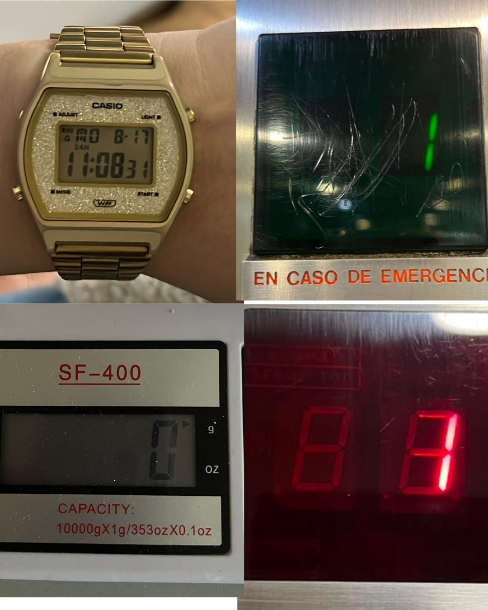
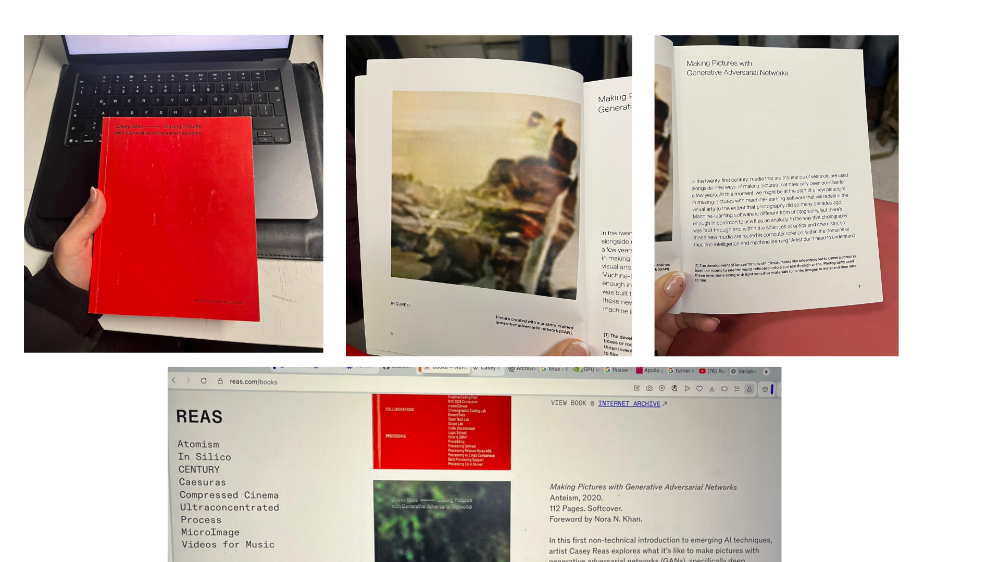

# sesion-01a

## apuntes sesión
La sesión empezó como funciona github.
Luego analizamos ascensores:

nuestro texto con vanessa garcía e isidora pérez:

el ascensor cuenta con una puerta, en donde se llama a este al presionar el botón del exterior. generalmente, cuentan con similitudes de materialidad (los más actuales), como acero inoxidable y hierro. los botones indican el número de pisos, y cuentan con una luz que se obtiene al presionar el botón e indica el piso al que se dirige. algunos de estos incluyen el uso del sistema braille en los botones para personas con discapacidad visual.

según nuestros ascensores analizados, encontramos ciertas similitudes, tales como: peso límite, es decir, que todos indican un peso máximo, pero varía según el tamaño del ascensor; mecanismo de cierre y apertura de puertas, el cual incluye un sensor que detecta movimiento. en su mayoría, cuentan con una pantalla digital en la cual se indica el número de piso actual.

datos que fuimos recolectando en conjunto en clase para completar:

+ el ascensor para en los pisos que está programado para parar.
+ eje de coordenadas: eje z.
+ sistema: poleas, motores, cables.
+ uso del contrapeso.
+ electricidad (actualidad).
+ bien público: acceso a la electricidad (hace 100 años).
+ precio del ascensor.
+ trabajar en datos duros.
+ uso de los números (japón: no hay 4 :0).
+ subsuelos, estacionamientos, nivel manzana.
+ botones auxiliares: emergencia, bomberos, prender/apagar luz-aire.
+ sticker de mantención.
+ tiempo de puerta abierta.
+ subir y bajar.
+ mantenerse en el piso.
+ si no hay paréntesis, es un dato.
+ if (estoy en un piso), abrir puerta(); sonar alarma();
+ variables/funciones: entender sus funciones y cómo se hacen (absolutos y relativos).
puntos de vista.

un dato importante: los nombres que le asignemos a las cosas nos deben hacer las cosas más fáciles.

## encargos
encargo 01-a:

autorretrato: describir variables y funciones de ustedes.

-Variables
Nombre: Antonia Loch 

Edad: 22

Estatura: 1.60

Color de ojos: cafes

Color de pelo: cafe

Lugar de residencia: santiago

Sociabilidad: media

Comida favorita: sushi

Estado de ánimo actual: ni bien ni mal

Animal favorito: Rana

-Mis funciones corresponden a las acciones que realizo día a día. Están: vestirme, comer, estudiar, prestar atención, aprender, trabajar, socializar con amigos, descansar y dormir.
Dentro de estas funciones existen otras más pequeñas, como lavarme los dientes, bañarme, peinarme, preparar comida y ordenar mis cosas.
También existen funciones sociales (conversar, salir, compartir), funciones de autocuidado (hacer ejercicio, dormir bien, relajarme), y funciones creativas (diseñar, dibujar, escribir, explorar hobbies).

2.investigar pantallas de segmentos, tomar fotos, documentar contexto, lugar, ubicación, alfabetos posibles, usos, comparar entre resultados encontrados, al menos 3 ejemplos distintos. https://en.wikipedia.org/wiki/Segment_display

#  Pantallas de segmentos

## 1. Reloj digital Casio
- **Lugar:** uso personal.  
- **Tipo:** LCD de **7 segmentos** con símbolos adicionales (modo, alarma, PM/AM).  
- **Alfabeto:** números del 0 al 9, letras simples como “A”, “P”, “M”.  
- **Uso:** mostrar hora y fecha.  
-  diseño retro y cotidiano.

## 2. Panel de emergencia
- **Lugar:** edificio, ascensor.  
- **Tipo:** LED verde con segmentos visibles tras acrílico oscuro.  
- **Alfabeto:** números o líneas simples.  
- **Uso:** señalización .  
- **Comentario:** uso frecuente.

## 3. Balanza digital SF-400
- **Lugar:** cocina  
- **Tipo:** LCD de **7 segmentos**.  
- **Alfabeto:** números del 0 al 9, unidades “g” y “oz”.  
- **Uso:** medir peso con precisión.  

##  Comparación general

| Tipo de pantalla | Tecnología | Color | Uso principal | Expresividad |
|------------------|-------------|--------|----------------|---------------|
| Reloj Casio | LCD | Gris | Tiempo | Media |
| Panel ascensor | LED | Verde | Señalización | Baja |
| Balanza        | LCD | Negro | Medición | Baja |

Cada pantalla tiene su propio lenguaje visual. Aunque todas usan segmentos, cambian mucho según el contexto.

## lectura

El libro Making Pictures with Generative Adversarial Networks de Casey Reas trata sobre cómo usar inteligencia artificial para crear imágenes. No es para nada untexto técnico, sino más bien una reflexión sobre cómo el arte cambia con las nuevas  tecnologías. 

En la parte del texto que se ve en la foto, hay una frase que me gustó:

“In the twenty-first century, media that are thousands of years old are used alongside new ways of making pictures that have only been possible for a few years.”

Habla de cómo lo antiguo y lo nuevo pueden convivir, y eso me parece bonito. También dice:

“Machine-learning software is different from photography, but there’s enough in common to use it as an analogy.”

Ahí muestra que aunque la inteligencia artificial y la fotografía son distintas, ambas sirven para crear imágenes y mirar el mundo de otra forma.
En general, el libro me parece una mezcla entre arte y tecnología, pero contada de manera curiosa.

Encontre una página del artista, esta página es reas.com/books muestra los distintos proyectos y libros de Casey Reas, que mezcla arte y programación. Este es   un archivo personal del artista, donde se mezclan sus ideas, colaboraciones y proyectos. Todo tiene una estética muy limpia
