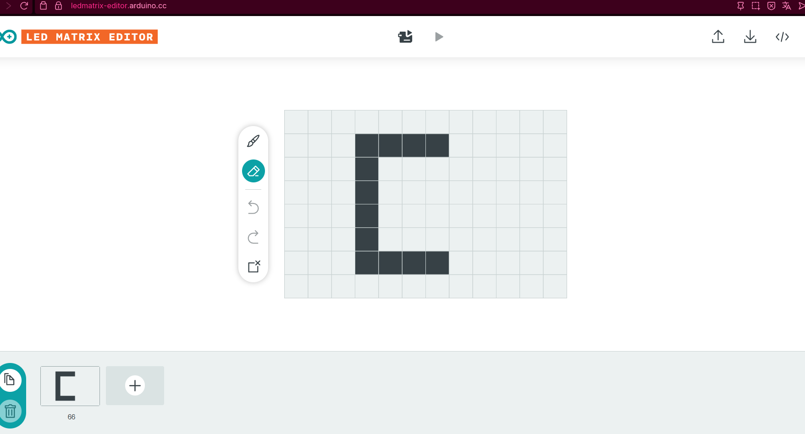

# sesion-01b

## apuntes sesión

## 1. algebra booleana

Trabaja con **estados lógicos**, no con cantidades:

```text
0 = falso
1 = verdadero
```

El computador constantemente evalúa si algo es verdadero o falso para decidir qué hacer.

**ejemplito:**

```cpp
int temperatura = 30;
temperatura > 25   // true → 1
```

---

## 2. operaciones principales

| Operación | Álgebra | C++ | Idea clave |
|---|---|---|---|
| AND | `A·B` | `A && B` | **Todas** las condiciones deben cumplirse |
| OR | `A+B` | `A \|\| B` | Con que **una** se cumpla, basta |
| NOT | `Ā` | `!A` | Invierte el valor (verdadero ↔ falso) |

### OR (`||`)

Con que una opción sea verdadera, ya se cumple.

```cpp
if (tieneDescuento || esClienteFrecuente) {
    // aplica precio especial
}
```

### AND (`&&`)

Necesito que se cumplan todas las condiciones a la vez.

```cpp
if (bateriaCargada && conexionActiva) {
    // el dron puede despegar
}
```

### NOT (`!`)

Sirve para comprobar lo contrario de una condición.

```cpp
bool puertaAbierta = false;

if (!puertaAbierta) {
    // activar alarma
}
```

---

## 3. `if` — estructura condicional

```cpp
if (condicion) {
    // instrucciones
}
```

- Evalúa una condición → resultado `true` o `false`.
- `true` = "permiso para entrar al bloque".
- `//` es un **comentario**: el computador no lo ejecuta, es solo una nota para quien lee el código.

### `if` / `else`

```cpp
int temperatura = 10;

if (temperatura >= 20) {
    Serial.println("Ambiente cálido");
} else {
    Serial.println("Ambiente frío");
}
```

```text
true  → entra al if
false → entra al else
```

---

## 4. Operadores de comparación

| Operador | Significado |
|---|---|
| `==` | igual a |
| `!=` | distinto de |
| `>` | mayor que |
| `<` | menor que |
| `>=` | mayor o igual que |
| `<=` | menor o igual que |

> `=` **asigna** un valor, `==` **compara** dos valores.

**Ejemplo:**

```cpp
int puntaje = 50;

puntaje == 50   // true
puntaje < 30    // false
```

---

## 5.  cómo cambia el valor de una variable

Una variable **no cambia sola**: necesita una instrucción asociada a una condición.

```cpp
int monedas = 5;

if (jugadorEncontroTesoro == true) {
    monedas += 3;
}
```

- `if` decide **cuándo** ocurre el cambio.
- La instrucción (`monedas += 3`) indica **qué** cambio hacer.

**forrmas comunes de modificar variables:**

```cpp
intentos--;     // resta 1
nivel++;        // suma 1
energia += 20;  // suma 20
salud -= 15;    // resta 15
```

---

## 6. bits y binario

- **1 bit** = una posición binaria (`1` o `0`).
- **8 bits = 1 byte**.

Cada posición vale el doble de la anterior (base 2), partiendo de 1 desde la derecha:

```text
2³   2²   2¹   2⁰
8    4    2    1
```

El `1` en una posición = "tomo ese valor"; el `0` = "no lo tomo".

**Ejemplo:**

```text
8   4   2   1
1   0   0   1
```

`1001` → `8 + 1 = 9`

---

## 7. Hexadecimal

Sistema en base 16, usa 16 símbolos: `0-9` y `A-F`.

```text
A = 10
B = 11
C = 12
D = 13
E = 14
F = 15
```

**4 bits = 1 símbolo hexadecimal** (porque 4 bits representan valores de 0 a 15).

### Regla práctica

1. Calcular el valor de los 4 bits usando `8-4-2-1`.
2. Si el resultado va de 0 a 9 → se mantiene el número.
3. Si va de 10 a 15 → se usa la letra correspondiente (A-F).

**Ejemplo:**

```text
8   4   2   1
1   1   1   0
```

`8 + 4 + 2 = 14` → en hexadecimal es `E`

### Tabla de conversión (4 bits)

| Binario | Decimal | Hex |
|---|---|---|
| `0000` | 0 | `0` |
| `0001` | 1 | `1` |
| `0010` | 2 | `2` |
| `0011` | 3 | `3` |
| `0100` | 4 | `4` |
| `0101` | 5 | `5` |
| `0110` | 6 | `6` |
| `0111` | 7 | `7` |
| `1000` | 8 | `8` |
| `1001` | 9 | `9` |
| `1010` | 10 | `A` |
| `1011` | 11 | `B` |
| `1100` | 12 | `C` |
| `1101` | 13 | `D` |
| `1110` | 14 | `E` |
| `1111` | 15 | `F` |
## ejemplos de Esqueleto 
void setup() {
  // aqui va setup(), ocurre una vez, al principio

}

void loop() {
  // aqui va loop()
  // ocurre despues de setup()
  // se repite hasta que no se pueda
}

## apuntes sobre colores y sistemas decimal, binario y hexadecimal
// 10 millones de colores
// 24 bits tengo mas de 10 millones de valores posibles
// 3 receptores rojizo, verdoso, azuloso
// demosle 8 bits a cada canal de color
// entonces R de rojo tiene 8 bits
// G de verde tb, B de azul tb
// entonces 0 es apagado, 255 es prendido
// 8 bits se llaman 1 byte
// disco duro 2 MB, pero de 2Mb y esos son 2 mega bit

// 1 byte tiene 2 nibbles, 2 pedacitos

// 0010 1100 0101 0101 1011 1010

// en 1 nibble, o 4  bits tengo 2^4 valores posibles
// del 0 al 15


// dec    hex
// 00     0
// 01     1
// 02     2
// 03     3
// 04     4
// 05     5
// 06     6
// 07     7
// 08     8
// 09     9
// 10     A
// 11     B
// 12     C
// 13     D
// 14     E
// 15     F


## ejemplo de declaración de funciones

int valorPancito = 2000;
int valorCafecito = 3000;

void setup() {
  // put your setup code here, to run once:

}

void loop() {
  // put your main code here, to run repeatedly:

  int valorDesayuno = sumarEnteros(valorPancito, valorCafecito);

  if (valorDesayuno < 5000) {
    // oh no 
  } else {

    // oh si
  }

}

// sumar numeros enteros
// es tipo int porque nos va a dar un resultado
// las void ocurren sin emitir un resultado
int sumarEnteros(int x, int y) {
  // declarar un resultado
  int resultado = 0;
  // es una abreviacion de dos pasos
  // declarar       int resultado;
  // asignar valor  resultado = 0;

  // hacer la suma de x e y
  // y reemplazar valor resultado
  // por ese valor
  resultado = x + y;

  // emitir resultado al exterior de la funcion
  return resultado;

  // declarar solo lo puedo hacer una vez
}

## encargos

encargo01b:

1. tratar de correr un código en el microcontrolador asignado a cada dupla, incluir referentes, citas, comentarios, imágenes, descripciones textuales, y en caso de éxito o fracaso incluir aciertos, preguntas, dramas, atados. recordatorio que estos apuntes son personales, cada persona sube su versión.

-En este trabajo con ompañera Anaís, pudimos correr un código en el que logramos que la frase "compilando... ideas" se mostrara letra por letra en una matriz LED conectada a un Arduino Uno R4 WiFi.



## 1. Diseño de los frames

Se usó la herramienta **LED Matrix Editor** para dibujar letra por letra la frase, generando un arreglo de frames en formato hexadecimal.

## 2. Primer código exportado 

Este fue el código tal cual lo entregó la herramienta, con **duración de 66 ms** por frame:

```cpp
const uint32_t compilando_ideas[][4] = {
	{0xf008, 0x800800, 0x800f0000, 66},
	{0xf009, 0x900900, 0x900f0000, 66},
	{0x880d, 0x80a80880, 0x88088000, 66},
	{0xf009, 0x900f00, 0x80080000, 66},
	{0x8008, 0x800800, 0x80080000, 66},
	{0x8008, 0x800800, 0x800f0000, 66},
	{0xf009, 0x900f00, 0x90090000, 66},
	{0xd00d, 0xd00b00, 0xb00b0000, 66},
	{0xe009, 0x900900, 0x900e0000, 66},
	{0xf009, 0x900900, 0x900f0000, 66},
	{0x0, 0x6, 0x600000, 66},
	{0x0, 0x0, 0xc00c0000, 66},
	{0x0, 0x0, 0xc00c000, 66},
	{0x8008, 0x800800, 0x80080000, 66},
	{0xe009, 0x900900, 0x900e0000, 66},
	{0xf008, 0x800e00, 0x800f0000, 66},
	{0xf009, 0x900f00, 0x90090000, 66},
	{0xf008, 0x800f00, 0x100f0000, 66}
};
```

**Problema:** Este arreglo no estaba integrado dentro de una estructura de programa completa para Arduino (faltaban `#include`, `setup()`, `loop()`, y la librería correcta), por lo que **no compilaba ni funcionaba** al subirlo directamente.

## 3. Diagnóstico

La IA (Claude) explicó que el código generado por LED Matrix Editor está pensado para exportarse como datos crudos, pero **necesita adaptarse a la estructura de un sketch de Arduino**, usando la librería oficial `Arduino_LED_Matrix.h` para el Uno R4 WiFi.

> Si tienes un código para una LED Matrix que originalmente está hecho para otro microcontrolador, normalmente hay que adaptarlo a Arduino, no simplemente copiarlo.

## 4. Código adaptado y funcional

Se reordenó el código, se integró la librería correcta, y se ajustó el tiempo de cada frame de **66 ms a 700 ms** (para que la letra fuera visible y no pasara demasiado rápido):

```cpp
#include <Arduino_LED_Matrix.h>

// Arreglo de frames
const uint32_t compilando_ideas[][4] = {
  {0xf008, 0x800800, 0x800f0000, 700},
  {0xf009, 0x900900, 0x900f0000, 700},
  {0x880d, 0x80a80880, 0x88088000, 700},
  {0xf009, 0x900f00, 0x80080000, 700},
  {0x8008, 0x800800, 0x80080000, 700},
  {0x8008, 0x800800, 0x800f0000, 700},
  {0xf009, 0x900f00, 0x90090000, 700},
  {0xd00d, 0xd00b00, 0xb00b0000, 700},
  {0xe009, 0x900900, 0x900e0000, 700},
  {0xf009, 0x900900, 0x900f0000, 700},
  {0x0,    0x6,      0x600000,   700},
  {0x0,    0x0,      0xc00c0000, 700},
  {0x0,    0x0,      0xc00c000,  700},
  {0x8008, 0x800800, 0x80080000, 700},
  {0xe009, 0x900900, 0x900e0000, 700},
  {0xf008, 0x800e00, 0x800f0000, 700},
  {0xf009, 0x900f00, 0x90090000, 700},
  {0xf008, 0x800f00, 0x100f0000, 700}
};

ArduinoLEDMatrix matrix;

void setup() {
  matrix.begin(); // inicializa la matriz LED
}

void loop() {
  for (int i = 0; i < sizeof(compilando_ideas)/sizeof(compilando_ideas[0]); i++) {
    matrix.loadFrame(compilando_ideas[i]);   // carga cada frame
    delay(compilando_ideas[i][3]);           // espera 700 ms entre frames
  }
}
```

## 5. resultado

 El código compiló y cargó correctamente en el Arduino Uno R4 WiFi. La frase "compilando ... ideas" se visualizó completa en la matriz LED, letra por letra, a una velocidad legible.
- El código exportado de un editor de matrices LED (para otro microcontrolador) **no es un sketch completo**: le faltan librería, `setup()` y `loop()`.
- Hay que **adaptar la estructura** al  Arduino, no solo copiar los datos.
- El **tiempo entre frames** (`delay`) es crítico para la legibilidad: 66 ms es demasiado rápido; 700 ms permite leer cada letra con claridad

RESULTADOOO FINAL https://youtube.com/shorts/YBul3QpaSB4?feature=share 

2. proponer una función con nombre, tipo, argumentos y uso, que modele algún área de su interés, por ejemplo subirCerro(enBicicleta), tomarMetro(conPaseEscolar), etc. escribir en pseudocódigo los pasos que necesita esa función internamente para que literalmente funcione.

   **Nombre:** `trotar5kmEn45min`
**Tipo:** `boolean`
**Argumentos:** `ritmoObjetivo`, `actividadStrava`
**Uso:** decidir en tiempo real si el trote va al ritmo necesario...

```cpp
bool trotar5KmEn45Minutos(double ritmoObjetivo, Actividad actividadStrava) {
    double distanciaMeta = 5;   // km
    double tiempoMeta = 45;     // minutos

    iniciarActividad(actividadStrava, "Trote");

    while (actividadStrava.distancia < distanciaMeta && actividadStrava.tiempo < tiempoMeta) {

        actividadStrava = obtenerDatosStrava(actividadStrava.id);
        double distanciaRecorrida = actividadStrava.distancia;
        double tiempoTranscurrido = actividadStrava.tiempo;

        double ritmoActual;
        if (distanciaRecorrida > 0) {
            ritmoActual = tiempoTranscurrido / distanciaRecorrida;
        } else {
            ritmoActual = 0;
        }

        if (ritmoActual > ritmoObjetivo) {
            reproducirAlertaVoz("Vas atrasado! Acelera el paso");
        } else {
            reproducirAlertaVoz("Vas bien, manten el ritmo");
        }

        esperar(10);
    }

    finalizarActividad(actividadStrava);
    guardarEnStrava(actividadStrava);

    if (actividadStrava.distancia >= distanciaMeta && actividadStrava.tiempo <= tiempoMeta) {
        reproducirAlertaVoz("Meta cumplida!");
        return true;
    } else {
        reproducirAlertaVoz("No se logro la meta");
        return false;
    }
}
```
## álgebra booleana 
0 = no cumplió la meta
1 = cumplió la meta

-El programa constantemente evalúa condiciones para decidir qué avisar al corredor:
actividadStrava.distancia >= 5   // true si ya recorrió 5 km


