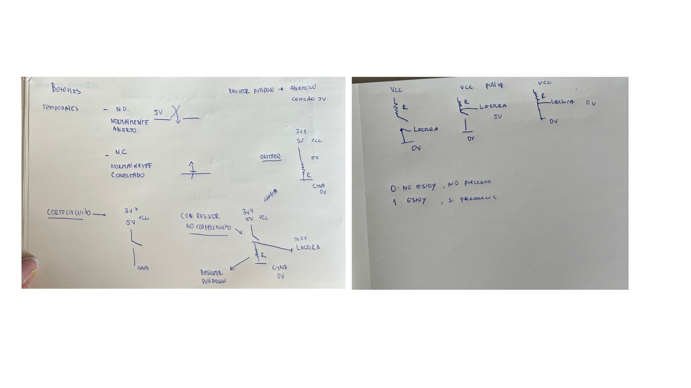
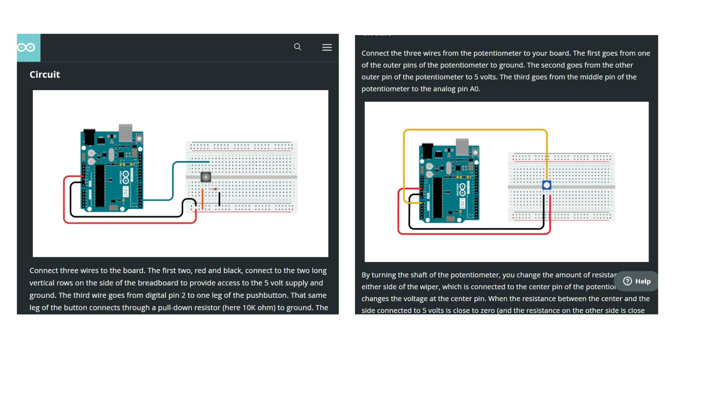
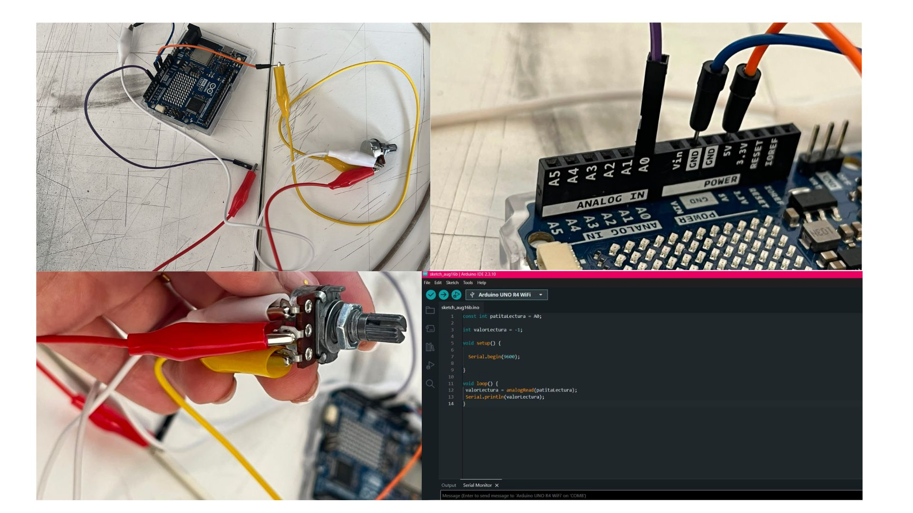
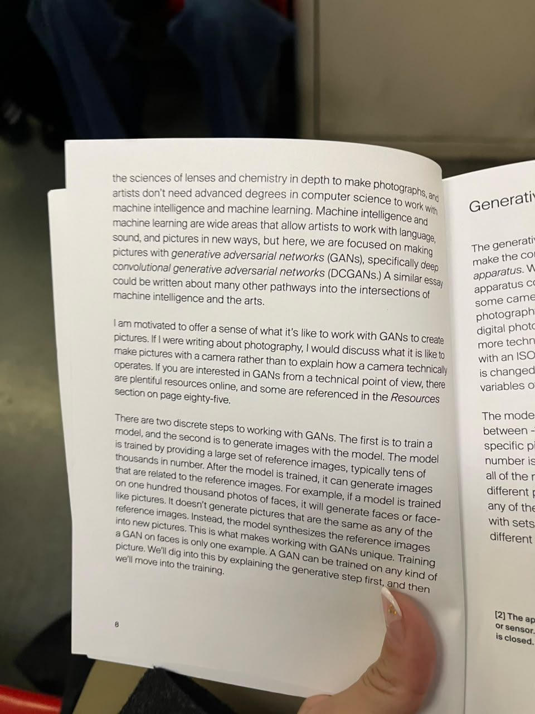
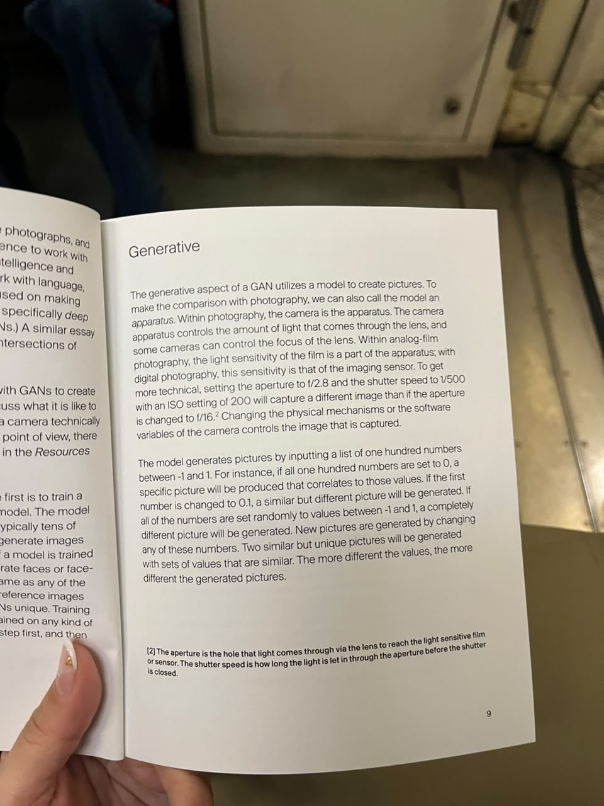
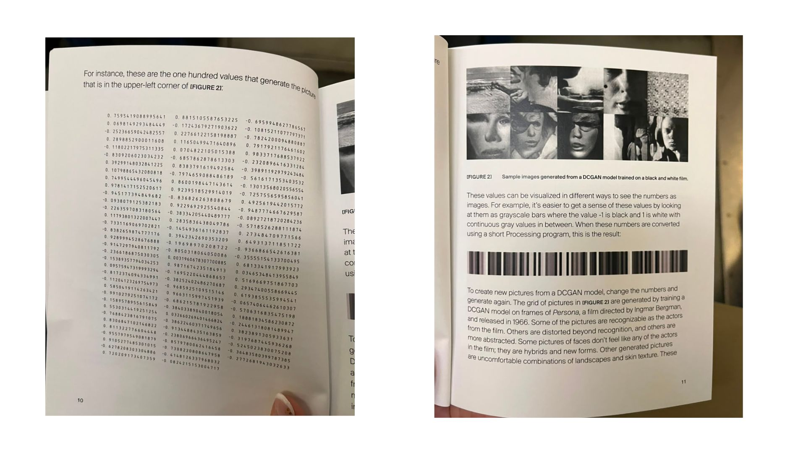

# sesion-02a

## apuntes sesión

# Apuntes de clase: Potenciómetros y Botones

---

## 1. Potenciómetros

### ¿¡¡¡Qué es un potenciómetro?????

Es una **interfaz** (control físico, tipo perilla) que en su interior encapsula **dos resistores** en serie, formando una pista resistiva continua entre dos extremos fijos.

- Potencia = energía / tiempo
- El voltaje se relaciona con la energía; la corriente con el tiempo.

### Sus tres patitas (terminales)

- **Dos patas fijas**: son los extremos de la pista resistiva (el rango total de resistencia, ej. 10kΩ).
- **Una pata variable (el "wiper" o cursor)**: se mueve físicamente sobre la pista y toma un valor de resistencia intermedio según su posición.

Como tiene extremos fijos, el cursor solo puede moverse **dentro de un rango** (de 0% a 100% del valor total), no infinitamente.

### Nomenclatura (letra + valor)

La letra indica el **tipo de curva de respuesta**, y suele ir antes del valor de resistencia (ej: A100K, B100K):

| Letra | Tipo | Curva |
|---|---|---|
| **A** | Logarítmico (audio taper) | No lineal |
| **B** | Lineal | Lineal |

- **Lineal (B)**: la resistencia varía proporcional al giro/desplazamiento. Al 50% del recorrido, tienes el 50% de la resistencia. Se usa en control de tono, balance, aplicaciones donde se necesita respuesta uniforme.
- **Logarítmico (A)**: la resistencia varía exponencialmente respecto al giro. Se usa casi siempre en **controles de volumen**, porque **nuestro oído percibe el sonido de forma logarítmica** (la escala de decibeles es logarítmica). Con un pote lineal para volumen, casi todo el cambio "perceptible" ocurriría en la primera mitad del giro. Con uno logarítmico, la percepción del cambio se siente pareja en todo el recorrido.

> ⚠️ No existe un potenciómetro perfecto!!!!!!!

---

## 2. Botones / Pushbuttons / Pulsadores

Los **botones toggle** (mantienen estado) son distintos de los **pushbuttons** (momentáneos).

### Pushbuttons (momentáneos)

Vuelven a su posición original al soltarlos. **No mantienen el estado.**

- **N.O. (Normalmente Abierto)**: el circuito está abierto en reposo; al presionar, se cierra (conduce). Es el más común — se usa para "encender" algo momentáneamente (ej. timbre, botón de arranque).
- **N.C. (Normalmente Cerrado)**: el circuito está cerrado en reposo; al presionar, se abre (interrumpe). Se usa para "detener" algo (ej. botón de paro).

### cortocircuito!

Si conectás el botón directamente entre VCC y GND, **sin resistencia**, al presionarlo se genera un **cortocircuito**:

```
   3V3 / 5V (VCC)
        |
       [•]  ← botón (sin resistencia)
        |
       GND
```
Esto puede dañar el circuito o la fuente — por eso siempre se usa una resistencia en serie.

### Con resistor (sin cortocircuito)

```
   3V3 / 5V (VCC)
        |
        +--------> LECTURA (≈0V)
        |
      [ R ]  ← resistor pulldown
        |
       GND (0V)
```
Aquí la resistencia protege el circuito: la lectura queda definida (≈0V) y ya no hay paso directo de VCC a GND.

---




### Pullup ("halar hacia arriba")

```
       VCC (5V)
        |
    [Resistencia]
        |
        +------> Salida a pin digital (LECTURA)
        |
    [Botón N.O.]
        |
       GND
```

- La resistencia va entre el **pin y VCC**.
- **Reposo** (sin presionar) → pin lee **HIGH (5V / 1)**
- **Presionado** → pin se conecta a GND → lee **LOW (0V / 0)**
- Lógica **invertida**: presionar = LOW

### Pulldown ("halar hacia abajo")

```
       VCC (5V)
        |
    [Botón N.O.]
        |
        +------> Salida a pin digital (LECTURA)
        |
    [Resistencia]
        |
       GND
```

- La resistencia va entre el **pin y GND**.
- **Reposo** (sin presionar) → pin lee **LOW (0V / 0)**
- **Presionado** → pin se conecta a VCC → lee **HIGH (5V / 1)**
- Lógica **directa**: presionar = HIGH

### Tabla comparativa

| Característica | Pullup | Pulldown |
|---|---|---|
| Resistencia conecta a | VCC | GND |
| Estado en reposo | HIGH (1) | LOW (0) |
| Estado al presionar | LOW (0) | HIGH (1) |
| Lógica | Invertida | Directa (más intuitiva) |

### Interpretación binaria de la lectura

- **0** → NO toi
- **1** → si toi

---

## 3. Código en Arduino

Arduino tiene dos tipos de pines: **analógicos** y **digitales**.

Referencias:
- https://docs.arduino.cc/built-in-examples/digital/Button/
- https://docs.arduino.cc/built-in-examples/basics/AnalogReadSerial/
- 

### Lectura de un potenciómetro (entrada analógica)

```cpp
const int patitaLectura = A0;

int valorLectura = -1;

void setup() {
  Serial.begin(9600);
}

void loop() {
  valorLectura = analogRead(patitaLectura);
  Serial.println(valorLectura);
}
```


- Valor mínimo: **0**
- Valor máximo: **1023**
- Resolución: **10 bits**

>  la lectura siempre tendrá algo de variación.

## encargos
encargo02a:

1. en tu fork, ir a actions, y aceptar que corran github worfklows. subir pantallazo con demostración de que han corrido actions exitosas en tu repo. esto es crucial, si no lo haces, no agregaremos tus apuntes al repo, y las tareas se tomarán como no entregadas. si en tu fork las actions no son exitosas, no serán tampoco agregadas al repo común ni evaluadas.
2. conformar grupos de 3 a 4 personas para la realización del proyecto-1. compartir 2 placas de desarrollo por grupo, documentar estudio conjunto de C++, microcontroladores, botones, potenciómetros.
## lectura




# Cómo funcionan las GANs (Generative Adversarial Networks)????????

## ¿Cómo pueden utilizarse para crear imágenes??????????

Se menciona la comparación del funcionamiento de una GAN con la fotografía tradicional. También cómo la cámara tiene distintos elementos que permiten controlar la imagen.

## Estructura del trabajo con GANs

El trabajo con GANs se divide en dos pasos:

1. Entrenar el modelo utilizando una gran cantidad de imágenes de referencia.
2. Generar nuevas imágenes utilizando aquello que el modelo aprendió durante el entrenamiento (miles de fotografías).

*There are two discrete steps to working with GANs. The first is to train a model, and the second is to generate images with the model.*

- Resume la estructura fundamental del proceso de la creación mediante GANs.
- Entrenar el modelo para que genere imágenes.

## Los valores numéricos

El texto menciona que las imágenes generadas dependen de una serie de números. Al cambiar estos valores, la imagen de resultado cambia.

Si los valores son similares, las imágenes producidas también tienden a ser similares. Si son muy diferentes, las imágenes serán más diferentes.

En las GANs no hay copias exactas de las imágenes existentes (las de referencia).

*The model generates pictures by inputting a list of one hundred numbers between -1 and 1.*

- Las imágenes generadas por una GAN están relacionadas con valores numéricos. Estos números funcionan como una especie de espacio de control, en donde se puede modificar, y al modificar las imagen producida también cambia.
- Pequeños cambios, cambian la imagen producida.
