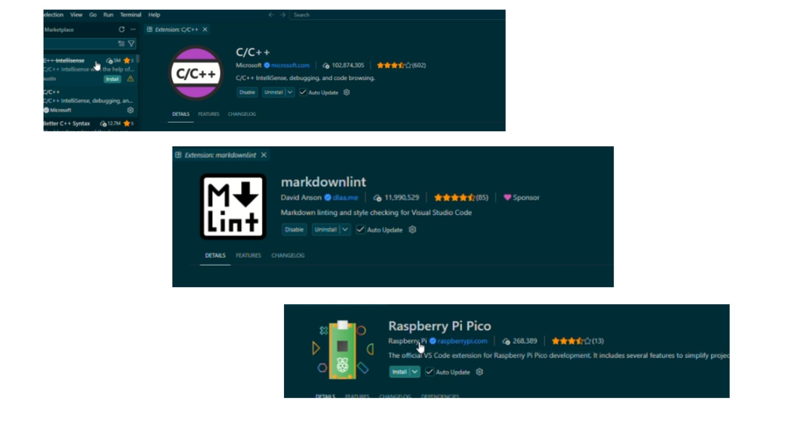

# sesion-02b

clase cancelada por cierre de udp

## apuntes sesión

## encargos

encargo02b:

subimos videos en canvas de hoy, son 3 videos.

1: instalar visual studio code, cami está regrabando el video parte 1 porque tuvimos un problema ténico, les avisará por discord cuando esté listo
2: ver los videos parte 2 y parte 3, aunque no tengan una placa raspberry pi, anotar dudas, tratar de subir código a sus placas si es que las piden.

Instalación de Visual Studio Code Y Raspberry Pi Pico
Instalación de Visual Studio Code

Además de instalar Visual Studio Code, es necesario instalar extensiones, que son herramientas que permiten trabajar con diferentes funciones y lenguajes dentro del programa.

Extensiones que se deben instalar
Raspberry Pi Pico Project
C++
Markdownlint

Crear un nuevo proyecto para Raspberry Pi Pico

Una vez instalado Visual Studio Code y las extensiones necesarias, se puede crear un nuevo proyecto.

Seleccionar:

New Pico Project

Configuración del proyecto

Name project → escribir el nombre del proyecto.
En este caso: prueba

Board type → seleccionar la placa que se va a utilizar. 

RISC-V → no modificar esta opción.

Ubicación → seleccionar un lugar ordenado donde se encuentre la carpeta que contendrá todo lo relacionado con el proyecto.

Select Pico SDK version → utilizar la versión más reciente del Pico SDK.

Features → por el momento no se utilizará.

Más adelante se utilizarán:

SPI
I2C interface

Stdio support → seleccionar Console over USB.
Esto permite mandar mensajes mediante USB.

Code generations → activar Generate C++ code.

Debugger → dejar la opción que aparece por defecto:
DebugProbe (CMSIS-DAP) [Default]

Carpetas y archivos del proyecto

Al crear el proyecto prueba, se genera una carpeta llamada .vscode.

.vscode → no tocar. Esta carpeta hace que el proyecto funcione correctamente.

Dentro del proyecto también encontraremos:

Build → contiene los resultados del código.
main.cpp → muestra el código principal del proyecto.
Ejemplo utilizado
ej_pico_pote
