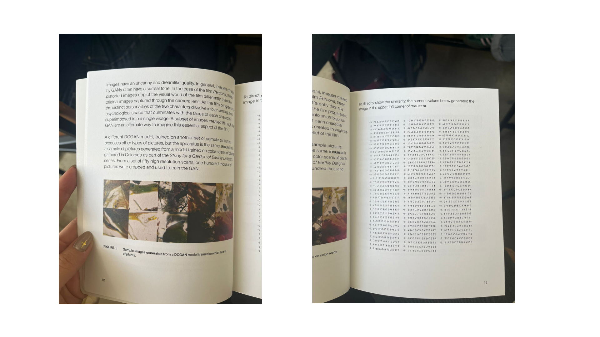

# sesion-03a

## apuntes sesión

# Pantalla LED + Pizarnik

## 0. Texto
La pantalla LED monocromática (alimentada con tierra y 5 V) funciona como temporizador e indicador.  
Los datos viajan por **SDA** (amarillo) y el reloj por **SCL** (azul).  
En ese espacio breve aparece la frase de Alejandra Pizarnik:  
> “irse, y no volver.” — *Poesía completa*  

---

## 1. Coreografía
- **Signos de interrogación**: emergen intermitentes.  
- **Páginas**: el texto se desplaza como hojas que se abren/cierra.  
- **Estilo DVD**: rebote en los bordes de la pantalla.  
- **Tiempo**: cada aparición dura 3 segundos, luego fade out.  
- **Color**: monocromo, intensidad modulada.  

---

## 2. Dibujo
- Versos entran desde izquierda o derecha.  
- Tipografía: **monoespaciada** (recuerda al código).  
- Ritmos:  
  - *Scroll*: lento, contemplativo.  
  - *Swipe*: rápido, disruptivo.  
  - *Fade*: transición suave.  
  - *Zoom*: acercamiento en la palabra **“irse”**.  
  - *Tabs/Reveals*: cada verso como pestaña nueva.  

---

## 3. Programación en C++
### Referentes
- Proyectos de **scroll text en matrices LED** (Arduino UNO R4 WiFi + MAX7219).  
- Bibliotecas: `Adafruit_GFX`, `Adafruit_LEDBackpack`.  

### Efectos
```cpp
scrollText("irse, y no volver.");
fadeInOut();
zoomWord("irse");
randomBounce(); // estilo DVD
```


1. Transformar lo real en algo extraño

Una idea súper fuerte es tomar imágenes reales y transformarlas hasta que sigan siendo reconocibles, pero se sientan raras o irreales.

-Una planta que parece otra cosa.
 -Un rostro que mezcla dos rostros.
- Un paisaje que parece conocido pero tiene elementos imposibles.
* Objetos que se deforman progresivamente.

Concepto: ¿En qué momento algo real deja de parecer real?

2. Mezclar diferentes imágenes para crear una nueva

Las imágenes generadas parecen surgir de una mezcla de muchas imágenes de referencia.


